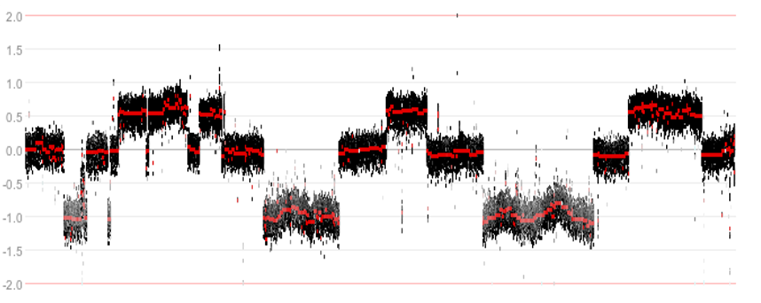

Investigating structural variants
 ===
 *Not every cancer has determining somatic mutations. Using the full power of WGS data, relevant structural variants can be traced and also linked to potential causes of disease*
 
 In this course we combine sequencing data with expression data and vice versa, such that new insights can be derived. Again, throughout this course we'll focus on data of the childhood tumor neuroblastoma. Choose the course of day 1 to read an introduction about this pediatric cancer. 
 
 We hope to show how R2 can be used to visualize and analyze your WGS data. Please note that this training session requires accounts with additional access. Therefore, make sure that you have obtained a proper account from the tutors. 
 
 This resource is located online at [http://r2-training-courses.readthedocs.io](http://r2-training-courses.readthedocs.io). Additional courses can be found at the same address.  
   
The **grey buttons** in this course will bring you to the R2 platform, often with pre-set settings such that you can pick up an analysis easily. The **green buttons** in this document will open up a Google form, one per section, with which you can submit your answers. 
   
 
 Exploring the dataset
 ---
 The oncogenomics department of the AMC has gathered a richly annotated set of neuroblastoma tumors. To easily explore this, the R2 development team has devised the concept of Datascopes; a convenient view on the data with some pre-built analyses readily available.  
   
 * Go to R2 <a href="http://r2.amc.nl" target="_blank">http://r2.amc.nl</a>
 
 * Log on to the R2 platform with your own credentials, credentials that were provided (or ask R2 Team members 
   for a login).  If you use your own credentials, make sure that your user account received the upgrade from r2 
   support.
 * In the left menu click on **Change Data Scope** > **Training** > **Graduate Training Course**
 * If correct, you see 4 colorful tiles in the middle of the screen, one of which reads *Cohort Overview*. If instead you see a box 0 with a button **Go to Graduate Training Course portal**, please click this button. 
 * For a quick impression of the data select the **Cohort Overview**. R2 shows the available samples in this tumor series with its annotation. In the table at the bottom, each row represents one sample with the respective annotation values. 
 
 The samples of a dataset can be annotated with extra information, for example, clinical data or molecular biology parameters. Each group of annotated data is called a “track” in R2. These tracks can be used to filter datasets, to compare groups of samples, to color scatter plots of samples with meta information, or to correlate genomics patterns with e.g. different phenotypes or demographic characteristics.  
 
 Pie Charts
 ---
 
 This green button will open up the Google form with which you can submit your answers for the first sections.
 
  <button class="course googleform" onclick="window.open('https://docs.google.com/forms/d/1TR2ifTrspxwtXQs5wFLfIsb-w8J8AIu5zPoZGGAmcCk/viewform?usp=sf_link','_blank');" type="button">Open the form 4 for day 2</button> 

 The pie charts in the cohort overview allow you to look at the distribution of the annotation values of each available track. If you click on one of the pie slices, this value is used as a filter: both the charts and the table at the bottom now only show the characteristics of the samples with the filtered value. Note that you can scroll down at the right hand side display of piecharts to see more track pie charts. You can also use the dropdown menus to adjust the display.   
  
 * Under the smaller pie diagrams, make sure **inss** is checked.
 * Hover your mouse over the different slices of the **inss** annotation pie chart (You may need to scroll down). Explore the percentages of the samples for each staging in the current dataset.  
 * With the dropdown menu below the main pie chart, select the 'cg_mycn' annotation. 
 * Filter the overview of the dataset for samples with a mycn amplification by a click on the 'amp' slice in the pie chart.
 
 --------
 
    
   **How did the inss pie chart adapt to the selection of mycn amplified samples and what do you know about these stages in neuroblastoma?** 
  
  
 
 ---------
 
    
 Until recently only several genomic aberrations were known:  
    
 <table>
 <tr><th>  Gene  </th><th>Type        </th><th>Reference</th></tr>
 <tr><td>MYCN</td><td>amplification 20%</td><td>(Schwab et al., 1983)</td></tr>
 <tr><td>ALK</td><td>7%</td><td>(George/Mosse/Janoueix-Lerosey/Chen 2008)</td></tr>
 <tr><td>CyclinD1</td><td>amplification 4%</td><td>(Molenaar et al., 2003)</td></tr>
 <tr><td>PHOX2B</td><td>4%</td><td>(van Limpt et al., 2004)</td></tr>
 <tr><td>PTPRD</td><td>4%</td><td>(Stallings et al. 2006)</td></tr>
 <tr><td>NF1</td><td>3%</td><td>(Hölzel et al., 2010)</td></tr>
 <tr><td>PTPN11</td><td>2%</td><td>(Merks et al., 2004, Bentires-Alj et al., 2004)</td></tr>
 <tr><td>FOXR1</td><td>1%</td><td>(Santo et al., 2011)</td></tr>
 <tr><td>LIN28B</td><td>1%</td><td>(Molenaar et al., 2012)</td></tr>
 </table>
  
 To gain further insight, the Oncogenomics department of the AMC set out to sequence 87 untreated primary neuroblastoma tumours of all stages from this set.  
   
 
 Somatic mutations in neuroblastoma
 ---
 The samples were sent to the Complete Genomics sequencing facility, now taken over by BGI, for whole-genome paired-end sequencing. They provide a sequence as a service model. Genomes were sequenced at an average coverage of 50. Compared to the HG18 reference genome, an average of 3,347,592 singlenucleotide variants (SNVs) per genome were obtained, which is in accordance with reported frequencies of interpersonal variants. 
 
 The R2 development team has processed these WGS data further using the CGAtools software to compare tumor with lymphocyte genomes. This provided a somatic score, estimating the likelihood of mutations to be somatic. Through several filtering steps the somatic mutations were determined with respect to the reference genome.
 
 
   
 	
   [**Figure 2: Comparing Tumor data with a reference genome from Lymphocytes.**](_static/images/structural_variants_reference_genome.png)
 
 
 A comprehensive list of the mutations can be accessed through R2. 
 
   * Go back to the Graduate Training Course datascope (still open in another tab).
   * Select the **somatic variants** tile.
   * A table with all mutations in the 86 tumors appears in a new tab. It is basically a view on a database table. Ordering on its columns is possible by clicking on the column header. Sort the column by gene name. 
 
 ---------
   **Can you spot recurring mutations?**
 
  
  
 
 ---------
 
   
 * Notice that no mutations recur more than a few times. 
 * Go to the *ALK* gene
 
 ---------
   **What type of aberrations does the ALK gene suffer?**
  
 
 ---------
 
 
 * Select the **view** link in front of of one of the ALK mutations (note: this is separate from the detail link). 
 
 In a new tab this mutation is shown in the R2 GenomeBrowser zoomed in on the genome to the base level. All samples are drawn beneath this stretch showing the specific mutations that were found. Annotation of the publicly available COSMIC database, the Catalogue Of Somatic Mutations In Cancer, is shown in the GenomeBrowser as well. COSMIC is the world's largest and most comprehensive resource for exploring the impact of somatic mutations in human cancer.
 
 The buttons on top of the page can be used to zoom in and out and to move your position. This way you can "walk" over the genome, for instance to have a closer look at the transcription start site of a gene.  
 * Try out a few of the buttons.  
 
 The GenomeBrowser has a tremendous number of parameters that can be set. 
 * Scroll down to the lower half of the page.  
 
 A grey Tracks settings form shows quite some parameter fields. These provide additional optional annotations and settings 
 for the GenomeBrowser. A useful annotation is provided by the NIH epigenome roadmap that annotates the genome with chromatin modification data, which is based on methylation and acetylation patterns of the genome. This annotation, however, is only provided on another Human Genome build. 
 * In the **Adjustable settings** form change the **GenomeBuild** to **HG19** (note that other builds as well as mouse data is available also). Click **redraw**
 * Several annotations that were available for HG18 are not available for HG19. Find the **Refseq(R2)** option and switch the setting on to obtain gene annotation for this genome build. Click **redraw**. 
 
 ---------
   **ALK is no longer in frame at the same position on the genome. Can you think of a reason why this is the case?**
 
  
  
 
 ---------
 
 * If the ALK gene is out of scope, you can jump back to the gene with the help of the text field in the left upper 
   corner **Find gene**: type in the gene name *ALK* and press GO (hitting enter won't work).
 
 The button below this text called 'Cleaned up View in R2' brings you to the transcription start site of the ALK gene. Several genome annotations will be switched on or off in that view. If you want, you can try them out yourself first:
 * Make sure our genome build is set to HG19.
 * Switch *off* the following annotation settings by scrolling all the way down to the Tracks settings box. Settings that are on are highlighted in green:
     * **cosmic** (in the Genome Variation box) to switch off the annotation from COSMIC, 
     * **Calldif Somatic Genome** (in the X:Complete Genomics => Variants box) to switch off the Somatic mutations annotation. 
     * **TestVar AMC v2e (Exome&1kup)** (also in the X:Complete Genomics => Variants box) to switch off the Cohort summary.
    Don't forget to click **redraw** whenever you want your changes to take effect.
 
 * Set the **NIH Epigenome Roadmap** annotation to *all* (in the TranscriptView annotation box). This annotation provides information on public datasets that have established whether chromatin regions are subject to active transcription (green), enhancer regions (yellow) or are part of a transcription start site (red). Click **redraw**.  
 
 In order to be at the correct position, simply click the button below:
 
 <form name="accessing_r2" action="https://hgserver2.amc.nl/cgi-bin/r2/main.cgi" enctype="multipart/form-data" target="R2" method="post">
   <input type='hidden' name='option' value='gbv2_base'>
   <input type='hidden' name='modus' value='geneview'>
   <input type='hidden' name='genome_build' value='hg19'>
   <input type='hidden' name='chrom' value='chr2'>
   <input type='hidden' name='start' value='29963600'>
   <input type='hidden' name='end' value='30163600'>
   <input type='hidden' name='a10refseq' value='on'>
   <input type='hidden' name='epi_roadmap' value='all'>
   <button type="submit" class="course r2submit" >Cleaned up View in R2</button>
 </form>  
 
 * Zoom in more on the transcription start site of the gene by selecting a region; see image (hint the color of the transcript denotes the reading direction; green means 5'-to-3' (sense), red reads from 3'-to-5' (antisense)) 
 * Click **redraw** (Note: the NIH annotation only appears for regions under 200.000 bp)
 
   
 	
   [**Figure 3: Selecting a region.**](_static/images/structural_variants_selecting_region.png)
 
 This NIH Epigenome Roadmap annotation is actually a sum of data from a lot of data sources. These sources can be further detailed by selecting the detail view in the toolbox that appears when you click the tools icon, see image below.
  * Select **mode:** *detail*, and click **redraw**. 
 
 
   
 	
   [**Figure 4: Opening the NIH parameter settings toolbox.**](_static/images/structural_variants_selecting_toolbox.png)

   
   
 	
   [**Figure 5: Annotation colors with the chromatin state description.**](_static/images/NIHepiRoadmap.png)
   
   
   
 
 ---------
   **What do the red colored chromatin annotations mean and what does that show you about the ALK TSS?**
 
  
  
 
 ---------

 
 Further use of WGS data; structural variants
 --------------------------------------------
 WGS data allows for further analysis; the paired end technique enables the discovery of structural variants.
 
   
 	
   [**Figure 6: Paired end sequencing makes discovery of structural variants possible.**](_static/images/structural_variants_paired_end.png)
 
 These structural variations are best visualized as so called _circosplots_. 
 * To access these circosplots in R2 within this datascope, go back to the **Graduate Training Course portal** 
   (left upper link) and click the **circos archive** tile.  
 
 An overview of all sequences appears displayed as circos plots. A circos plot gives an immediate comprehensive 
 view on the state of the genome of a sample. 
 * Click on one of the circos plots in which you can see many structural variants (many crossing arcs in the circle).  
 
 In a new tab a detailed view of this specific tumor genome is shown. When hovering over the plot the mouse opens a magnifier window.
 

 
 ---------
   **What do the green and red areas mean in the circosplots? And the arches crossing the circle?**
 
  
 
 ---------
 
 In the tabbed panel to the right of the circos plot all information is detailed. 
 * Open the _sample annotation_ tab if it is still closed.
     *  Scan the patient characteristics
 * Now open the _Somatic Structural Variants_ panel   
 
 ---------
   **Can you locate a structural variant that involves a gene and spans two chromosomes? (Note: clicking on the _view_ link shows the actual locations on the genome)**
 
  
 
 ---------
 
 
 Chromothripsis
 ---
 While investigating the WGS data, an interesting phenomenon was observed. In some tumor samples parts of the genome appeared to be riddled with structural variants, resulting in a shredded chromosomal structure.
 
 
 
 [**Figure 7: Example of a shredded chromosomal structure**](_static/images/structural_variants_shredded_chromosomal_structure.png)
 
 
 * Go to the overview page with circos plots.
 
 ---------
   **Can you spot an example of such shredding from the circos overview? (Hint: remember how an SV is depicted in a Circos plot)**
 
  
 
 ---------
 
 The shredding pattern is known by the term *chromothripsis* (‘shattered chromosome’). The complex recombination pattern of alternating discrete copy numbers that is associated with the phenomenon is hypothesized to occur from a single catastrophic event. In this process, copies of oncogenes can become amplified and tumor suppressor genes can be lost.  
 
 Patients containing such a phenomenon have also been annotated in the neuroblastoma cohort. Within the Circos archive we can also use filters to focus on intersections of the cohort. 
 * In the top of the screen select **chromothripsis** from the *Subset track* dropdown and subsequently click on 
 **yes** and then **ok** to apply a filter. Then press **Update** to depict only cases with marks of chromothripsis.
 
 
 
 [**Figure 8: Selection of a cohort intersection via a track.**](_static/images/select_track_cg_circos.png)
 
 ---------
   **Which chromosome is affected by chromothripsis in multiple samples?**
 
  
 
 ---------
 
 To see how chromothripsis relates to clinical data we can investigate survival data in R2. 
 
 * From the left menu in the main Graduate Training Course datascope panel select **Survival (Kaplan-Meier/Cox**.
 * Select **Tumor Neuroblastoma (combat) - Versteeg - 122 - MAS5.0(bc) - u133p2** as dataset. 
 * Make sure the option **a categorical track (Kaplan-Meier)** is already (pre)selected. Click **Next**.
 * Select for **Type of Survival** any of the options.
 * Separate by track is already selected. Select as *Track* the option: **cg_chromothripsis.** Click **Next.**
 
 ---------
   **How does chromothripsis affect survival?**
 
  
 
 ---------
 
 * Filtering for subsets allows you to further isolate specific survival characteristics. If you like you can toy around with different parameters.

 
 
 Locations of structural variants, hotspots?
 ---
 

 Chromothripsis can be seen as an extreme case of concentration of structural variants in one sample. The question arises whether there are other hotspots of structural variation on the genome that are found in multiple samples. These might point to functional interactions.
 
 * One of the genes that exhibited such a hotspot is the TERT gene. Go back to the startpage of the Graduate Training Course portal and select the GenomeBrowser tile. This brings you to the TERT gene on the genome with some preset annotations. 
 
 ---------
   **How does this region qualify as a hotspot?**
 
  
  
 
 ---------
  
  As can be seen by the high number of peaks around the TERT gene there is a hotspot of structural variants in that area. The types of variants are annotated below the stretch on the genome.   
 
 ---------
   **Check out what the arrows and colored tracks mean? (Hint: hovering with the mouse provides additional information)**
 
  
  
 
 ---------
 
The red arrows depict translocations to other locations in the genome. 
* Hover over the red triangle to see the information in the info boxes. You can also click on them to jump to the 
  linked translocation.
* Locate the translocation to chromosome 11 for sample N724TL (Hint: hovering over the arrows gives sample 
  information. Alternatively, you can select the sample annotation of *N724TL* in the dropdown of **Junction_diff** 
  in the Tracks setting form. Don't forget to **redraw** if you choose to display this sample annotation only.) 
* Click on **the red arrow**.  
 R2 brings you to the other side of the translocation. By switching on available annotation about superenhancer locations, we can learn more about this translocation. 
* In the Track setting form, in the TranscriptView Annotation panel switch on the **SuperEnhancers NB** annotation and 
  click **redraw**.
  
 In our department H3K27ac ChIP-seq data was produced for several neuroblastoma samples. 
 * Click on the button **Load/Store Profile** in the top right corner. In the dropdown select Profile **r2 - 
   170930_test'** 
   and, click **Execute** and click **Goto the GenomeBrowser** to view the ChIP-seq data generated by our department on chromosome 11 at the translocation site of the TERT gene.  
 * Now go back to TERT by typing the gene name into the textfield at **Find gene** in the top left corner and click on **Go** (don't press enter). You can zoom out a bit to have a better overview of ChIP-seq profiles at the TERT gene location. 
 
  ---------
   **How is the H3K27ac ChIP-seq data related to the information about superenhancers?**
  
   **What advantage would a tumor have from this translocation?**
   
  
  ---------   
  
 To further corroborate this junction in more detail we can go to the Circos plots panel again. 
 * Go back to the **Graduate Training Course portal** and click the **circos archive** tile again.
 * Locate the N724TL tumor sample and **click on the image**.
 * Open the **Gene Expression list** tab. By default a geneset is already selected.
 * Click **(Re)-Generate** to obtain a table overview of all genes of this geneset and the expression z-score value of 
   this sample (as compared to the rest of the 
   samples in the dataset) for each gene.
 * Click **the probeset link** of the first gene (left column in the list).
 * The TERT gene was not in the list since the list was a pre-selection without the TERT-gene, but we can easily 
   adjust this plot to show the expression of our sample as compared to the rest of the dataset in the Adjustable 
   Setting box below the graph. Type **TERT** and click the reporter you want to look at from the pop up and click 
   **Submit**. 
 * Select  **log2-zcore** in the transformation  panel and click **Submit**.
A graph with the log2-zscores of the TERT gene is depicted where the TERT activity is elevated in the inss stage 4 group. However, based on this graph the TERT-zscore  may be not very convincing so let's take a look at another Neuroblastoma dataset from another source .
 * In the main screen goto box 2 and select the following dataset, in the grid search for the dataset using **SEQC** 
   in the author field and/or **498** for the number of samples and select **Tumor Neuroblastoma - SEQC - 498 - RPM - seqcnb1**.
This set is a rnaseq based expression dataset in contrast to the previous one which was based on an old 
   affymetrix platform. 
 * Perform the **View a gene** analysis with the gene **TERT**.
 * In the Adjustable Settings box underneath teh graph, in the analysis type pulldown, select **gene vs track**, 
   as Track select **inss_stage**, for transformation 
   the **log2 zscore**, select **Box/dot plot (bands)** in the graph type section and select **Color by Track** at 
   Color mode
   (groups). Click **Submit**.
This plot is again supporting the finding that the TERT gene is involved in stage 4 neuroblastoma tumors. 

To read further on Tert rearrangements in neuroblastoma, you could read the article that was published by our 
group: [TERT rearrangements article](https://pubmed.ncbi.nlm.nih.gov/26523776/)

 ---------
   **How is the expression of the TERT gene of the affected sample?**
 
  
  
 
 ---------
  * Submit your Google form with the answers
  
 Remarks
 ---
 This ends this part of this course. You can continue now with playing around. E.g.: select a dataset fitting your 
 own area of interest in box 2 of the main page. Don't forget to exit the datascope if you are done with the course. 
 
 We hope that this course has been helpful. At the end of the workshop, please provide feedback on the course with <a href="https://docs.google.com/forms/d/e/1FAIpQLScy5xoA4btrYfuOOhc5qFKmYkV9_SBv1PQABPgV7eVJY8gk4A/viewform" target="_blank">this form</a>.  
  
 If you want to have your genomics data visualized and analyzed using the R2 platform you can always consult 
 r2-support@amsterdamumc.nl
  
 We hope to see you around on the platform! 
 The R2 support team.
 
