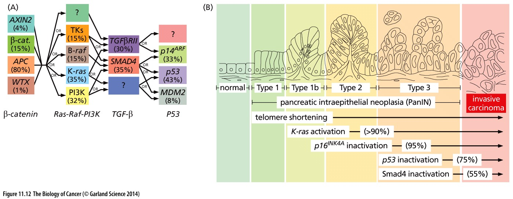
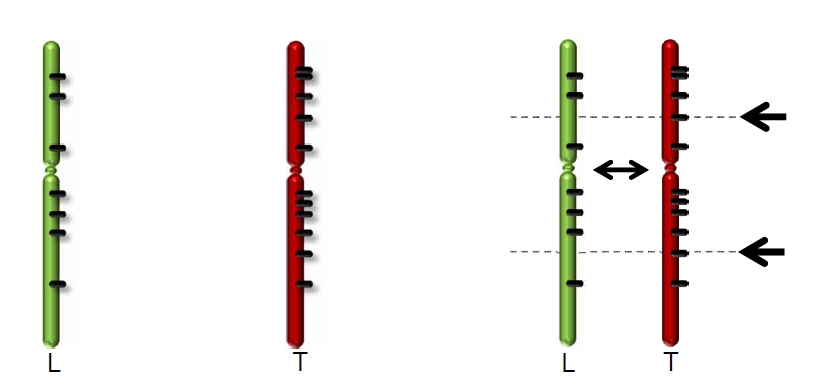
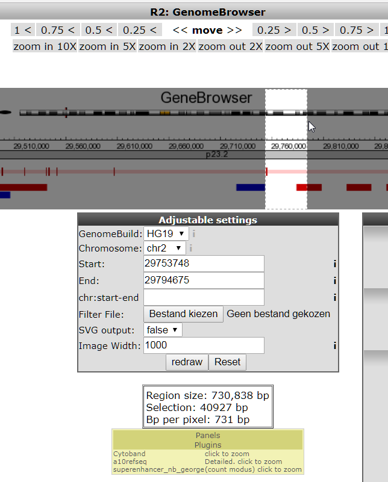
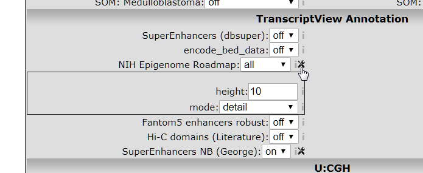
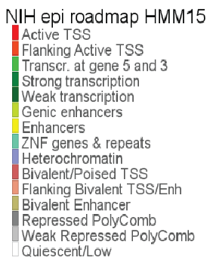
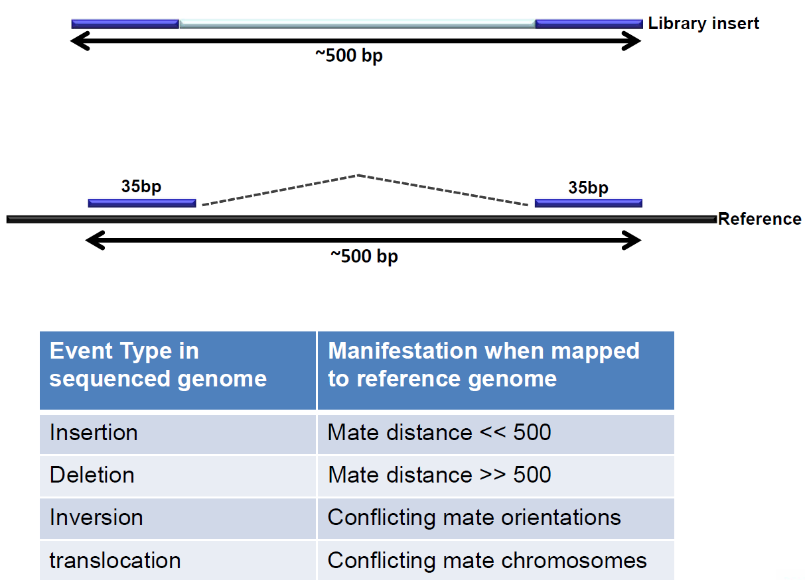
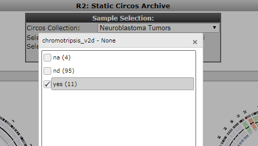

Investigating structural variants
===
*Not every cancer has determining somatic mutations. Using the full power of WGS data, relevant structural variants can be traced also and linked to potential causes of disease*

In this course we will introduce R2, the web based genomics analysis and visualization application. Throughout the course an integrative approach to genomics data will be used. By combining sequencing data with expression data and vice versa, new insights can be derived. Throughout this course we'll focus on data of the childhood tumor neuroblastoma.

We hope to show how R2 can be used to visualize and analyze your WGS data. Please note that this training session requires accounts with additional access. Therefore, make sure that you have obtained a proper account from the tutors. 

This resource is located online at [http://r2-training-courses.readthedocs.io](http://r2-training-courses.readthedocs.io). Additional courses can be found at the same address.  
  
  The grey buttons in this course will bring you to the R2 platform, often with pre-set settings such that you can pick up an analysis easily. The green buttons in this document will open up a Google form, one per section, with which you can submit your answers. 

Introduction 
---
Cancer is a very complex disease. Much more complicated than originally anticipated when the first mutations were found to be causal for specific cancers. At that time, for colorectal cancer, a well defined path of subsequently gained mutations was found to lead to more aggressive tumorigenic cell types (the Vogelstein model).

  
  
  [**Figure 1: Mutation paths during cancer progression.**](_static/images/TumorHeterogeneity_CancerProgression.jpg)

Although there has been extensive research into similar mutation mechanisms in neuroblastoma (also in the AMC Oncogenomics group), such a mechanism has not been found for this type of cancer. In this practical work session we will try to bring you cutting edge research in this often deadly childhood tumor.
  
  
Recent research suggests that neuroblastoma consists of different cell types. There is reason to believe that this heterogeneity causes the high percentage of relapses in the aggressive subtype of neuroblastoma. Children developing a relapse almost always die. 
Fortunately, new technologies have become available to molecular biology. These enable us to not only study mutations and RNA expression of genes, but to study the epigenetic modifications of the DNA-associated histones as well. In addition, genes can now be manipulated in cell lines and living tissues.  
Using advanced data analysis, statistics and clustering methods, the field of bioinformatics tries to derive new insights from these experimental data and help molecular biologists to generate hypotheses that can be tested experimentally. Today you will use the web-based genomics analysis and visualization platform R2. R2 provides you with a set of bioinformatics tools to investigate recent patient and experimental data from neuroblastoma tumors and cell lines. 

Despite decades of research high stage neuroblastoma still has a very poor prognosis. Since cancer is a disease of genomic aberrations we're first going to investigate what aberrations are present and how these might relate to the onset of neuroblastoma. 

Exploring the dataset
---
The oncogenomics department of the AMC has gathered a richly annotated set of neuroblastoma tumors. To easily explore this, the R2 development team has devised the concept of Datascopes; a convenient view on the data with some pre-built analyses readily available.  
  
* Go to R2 (http://r2.amc.nl) by clicking on the button below:  
 
<form name="accessing_r2" action="https://hgserver1.amc.nl/cgi-bin/r2/main.cgi" enctype="multipart/form-data" target="R2" method="post">
  <input type="hidden" name="table" value="ps_avgpres_nbadam88_u133p2">
  <button type="submit" >Go to R2</button>
</form>  
 

* Log on to the R2 platform with your credentials that were provided (or apply for a login using the link).  
* In the left menu click on **Change Data Scope** > **Training** > **Graduate Training Course**
* In the middle section of the page, an additional choice step appears; click **Go to the Graduate Training Course Portal**
* For a quick impression of the data select the **Cohort Overview**. R2 shows the available samples in this tumor series with its annotation. In the table at the bottom, each row represents one sample with the respective annotation values. 

The samples of a dataset can be annotated with extra information, for example, clinical data or molecular biology parameters. Each group of annotated data is called a “track” in R2. These tracks can be used to filter datasets, to compare groups of samples, to color scatter plots of samples with meta information, or to correlate genomics patterns with e.g. different phenotypes or demographic characteristics.  

Pie Charts
---
The pie charts in the cohort overview allow you to look at the distribution of the annotation values of each available track. If you click on one of the pie slices, this value is used as a filter: both the charts and the table at the bottom now only show the characteristics of the samples with the filtered value.  
 
* Hover your mouse over the different slices of the **stage(inss)** annotation pie chart. Explore with which percentage of samples each staging is present in the current dataset.  
* With the dropdown menu below the main pie chart, select the 'mycn_amp' annotation. 
* Filter the overview of the dataset for samples with a mycn amplification by a click on the 'yes' slice in the pie chart.

--------

   
  **How did the stage(inss) pie chart adapt to the selection of mycn amplified samples and what do you know about these stages in neuroblastoma?** 
 
 

---------

   
Until recently only several genomic aberrations were known:  
   
<table>
<tr><th>  Gene  </th><th>Type        </th><th>Reference</th></tr>
<tr><td>MYCN</td><td>amplification 20%</td><td>(Schwab et al., 1983)</td></tr>
<tr><td>ALK</td><td>7%</td><td>(George/Mosse/Janoueix-Lerosey/Chen 2008)</td></tr>
<tr><td>CyclinD1</td><td>amplification 4%</td><td>(Molenaar et al., 2003)</td></tr>
<tr><td>PHOX2B</td><td>4%</td><td>(van Limpt et al., 2004)</td></tr>
<tr><td>PTPRD</td><td>4%</td><td>(Stallings et al. 2006)</td></tr>
<tr><td>NF1</td><td>3%</td><td>(Hölzel et al., 2010)</td></tr>
<tr><td>PTPN11</td><td>2%</td><td>(Merks et al., 2004, Bentires-Alj et al., 2004)</td></tr>
<tr><td>FOXR1</td><td>1%</td><td>(Santo et al., 2011)</td></tr>
<tr><td>LIN28B</td><td>1%</td><td>(Molenaar et al., 2012)</td></tr>
</table>
 
To gain further insight, the Oncogenomics department of the AMC set out to sequence 87 untreated primary neuroblastoma tumours of all stages from this set.  
  

Somatic mutations in neuroblastoma
---
The samples were sent to the Complete Genomics sequencing facility, now taken over by BGI, for whole-genome paired-end sequencing. They provide a sequence as a service model. Genomes were sequenced at an average coverage of 50. Compared to the HG18 reference genome, an average of 3,347,592 singlenucleotide variants (SNVs) per genome were obtained, which is in accordance with reported frequencies of interpersonal variants. 

The R2 development team has processed these WGS data further using the CGAtools software to compare tumor with lymphocyte genomes. This provided a somatic score, estimating the likelihood of mutations to be somatic. Through several filtering steps the somatic mutations were determined with respect to the reference genome.

  
	
  [**Figure 2: Comparing Tumor data with a reference genome from Lymphocytes.**](_static/images/structural_variants_reference_genome.png)

A comprehensive list of the mutations can be accessed through R2. 

  * Go back to the Graduate Training Course datascope (still open in another tab)
  * Select the **somatic variants** tile
  * A table with all mutations in the 86 tumors appears in a new tab. It is basically a view on a database table. Ordering on its columns is possible by clicking on the column header. Sort the column by gene name. 

---------
  **Can you spot recurring mutations?**

 
 

---------

  
* Notice that no mutations recur more than a few times. 
* Go to the ALK gene and select the **view** link (note: this is separate from the detail link). 

In a new tab this mutation is shown in the R2 GenomeBrowser zoomed in on the genome to the base level. All samples are drawn beneath this stretch. Annotation of the publicly available COSMIC, the Catalogue Of Somatic Mutations In Cancer, is shown as well in the GenomeBrowser. COSMIC is the world's largest and most comprehensive resource for exploring the impact of somatic mutations in human cancer.

---------
  **What type of aberrations does the ALK gene suffer?**
 

---------

The buttons on top of the page can be used to zoom in and out and to move your position. This way you can "walk" over the genome, for instance to have a closer look at the transcription start site of a gene.  
* Try out a view of the buttons.  

The GenomeBrowser has a tremendous number of parameters that can be set. 
* Scroll down to the lower half of the page.  

A form shows quite some parameter fields. These provide additional annotations and settings for the algorithms used. A useful annotation is provided by the NIH epigenome roadmap that annotates the genome with chromatin modification data, which is based on methylation and acetylation patterns of the genome. This annotation however, is only provided on another Human Genome build. 
* In the **Adjustable settings** form change the **GenomeBuild** to **HG19** (note that other builds as well as mouse data is available also). Click **redraw**
* An unannotated version of the reference genome is shown. Find the **Refseq(R2)** and switch the annotation on. Click **redraw**

---------
  **What has happened to the ALK gene?**

 
 

---------

* If the ALK gene is out of scope, you can jump back to the gene with the help of the text field in the left upper corner **Find gene**: type in the gene name *ALK*. 

The button below brings you to the transcription start site of the ALK gene. Several genome annotations have been switched on or off. You can try them out yourself first:
* Switch *off* the **cosmic** annotation (in the Genome Variation box) and the **Calldif Somatic Genome** annotation (in the X:Complete Genomics => Variants box). 
* Set the **NIH Epigenome Roadmap** annotation to *all* (in the TranscriptView annotation box). This annotation provides information on public datasets that have established whether chromatin regions are subject to active transcription (green), enhancer regions (yellow) or are part of a transcription start site (red). Click **redraw**.  

In order to be at the correct position, simply click the button below:

<form name="accessing_r2" action="https://hgserver1.amc.nl/cgi-bin/r2/main.cgi" enctype="multipart/form-data" target="R2" method="post">
  <input type='hidden' name='option' value='gbv2_base'>
  <input type='hidden' name='modus' value='geneview'>
  <input type='hidden' name='genome_build' value='hg19'>
  <input type='hidden' name='chrom' value='chr2'>
  <input type='hidden' name='start' value='29963600'>
  <input type='hidden' name='end' value='30163600'>
  <input type='hidden' name='a10refseq' value='on'>
  <input type='hidden' name='epi_roadmap' value='all'>
  <button type="submit" >Cleaned up View in R2</button>
</form>  

* Zoom in more on the front end of the gene by selecting a region; see image (hint the color of the transcript denotes the reading direction; green means the regular direction, red the opposite direction) 
* Click **redraw** (Note: the NIH annotation only appears for regions under 200.000 bp)

  
	
  [**Figure 3: Selecting a region.**](_static/images/structural_variants_selecting_region.png)

This NIH Epigenome Roadmap annotation is actually a sum of data from a lot of data sources. These sources can be further detailed by selecting the detail view in the toolbox that appears when you click the tools icon, see image below.
 * Select **mode:** *detail*, and click **redraw**. 

  
	
  [**Figure 4: Opening the NIH parameter settings toolbox.**](_static/images/structural_variants_selecting_toolbox.png)
  
  
   
	
  [**Figure 5: Annotation colors with the chromatin state description.**](_static/images/NIHepiRoadmap.png)
  
  
  

---------
  **What chromatin annotation is available for the start of the ALK gene?**

 
 

---------

* Now go back to the Graduate Training Course datascope (click in th etop left corner on the link **Graduate Training Course portal**)
* Select the Somatic Variants Table tile and now click the  **detail** link of ALK. R2 shows additional information on the expression of the gene and its location on the genome. 

---------
  **What is remarkable about the expression of the ALK gene in neuroblastoma?**

 
 

---------
 
From this detail view other analysis tools within R2 can be approached by clicking on the links below the graphs.
* Feel free to explore these further.

Further use of WGS data; structural variants
--------------------------------------------
WGS data allows for further analysis; the paired end technique enables the discovery of structural variants.

  
	
  [**Figure 6: Paired end sequencing makes discovery of structural variants possible.**](_static/images/structural_variants_paired_end.png)

* These structural variations are best visualized as so called _circosplots_. To access these in R2 go to the Graduate Training Course datascope and click the **circos archive** tile.
* An overview of all sequences appears displayed as circos plots. These give an immediate comprensive view on the state of the genome. Click on one of the circos plots.
* In a new tab a detailed view of this specific tumor genome is shown. When hovering over the plot the mouse opens a magnifier window.

---------
  **What do the green and red areas mean? And the arches crossing the circle?**

 
 

---------

* In the tabbed panel to the right of the circos plot all information is detailed. Open the _sample annotation_ tab.

---------
  **What are the patient characteristics?**

 
 

---------

* Now open the _Somatic Structural Variants_ panel.  

---------
  **Can you locate a structural variant that involves a gene and spans two chromosomes? (Note: clicking on the _view_ link shows the actual locations on the genome)**

 
 

---------

Chromothripsis
---
While investigating the WGS data, an interesting phenomenon was observed. In some tumor samples parts of the genome appeared to be riddled with structural variants, resulting in a shredded chromosomal structure.

* Go to the overview page with circos plots.

---------
  **Can you spot an example of such shredding from the circos overview?**

 
 

---------

The Shredding pattern is known by the term chromothripsis. Patients containing such a phenomenon have also been annotated in the neuroblastoma cohort. Within the Circos archive we can also use filters to focus on intersections of the cohort. In the top of the screen select 'chromothripsis' from the 'select a track' dropdown and subsequently click on 'yes' and then 'ok' to apply a filter. Then press redraw to depict only cases with marks of chromothripsis.

[**Figure 7: Selection of a cohort intersection via a track.**](_static/images/select_track_cg_circos.png)

---------
  **Can you spot a chromosomal pattern in the chromothripsis cases?**

 
 

---------

To see how chromothripsis relates to clinical data we can investigate survival data in R2. 

* From the left menu in the main Graduate Training Course datascope panel select **Kaplan Meier > By track (category)**
* Make sure that the correct Data Type 'Expression data(H. sapiens)' and neuroblastoma set has been selected in the dataselection panel: 'Tumor Neuroblastoma (combat) - Versteeg - 122 - MAS5.0(bc) - u133p2'. Click **Next**.
* A selection menu appears, in the **Separate by** field select *track* and in **use track** select the track cg_chromothripsis. Then click **Next** 

---------
  **How does chromothripsis affect survival?**

 
 

---------

* Filtering for subsets allows you to further isolate specific survival characteristics. If you like you can toy around with different parameters.

Locations of structural variants, hotspots?
---
Chromothripsis can be seen as an extreme case of concentration of structural variants in one sample. The question arises whether there are other hotspots of structural variation on the genome that are found in multiple samples. These might point to functional interactions.

* One of the genes that exhibited such a hotspot is the TERT gene. Go back to the startpage of the Graduate Training Course portal and select the GenomeBrowser tile. This brings you to the TERT gene on the genome with some preset annotations. 

---------
  **How does this region qualify as a hotspot?**

 
 

---------
 
 * As is obvious from the high number of peaks around the TERT gene there is a hotspot of structural variants in that area. The types of variants are annotated below the stretch on the genome.   

---------
  **What do the arrows and colored tracks mean? (Hint: hovering with the mouse provides additional information)**

 
 

---------

* Red arrows depict translocations to other loactions in the genome. Locate the translocation to chromosome 11 for sample 724 (Hint: hovering over the arrows gives sample information) and click on the arrow.
* R2 brings you to the other side of the translocation. In the TranscriptView panel switch on the SuperEnhancers NB annotation and click redraw.
 
---------
  **What advantage would a tumor have from this translocation?**

 
 

---------

* To further corroborate this we can go to the Circos plots panel again. Go back to the Graduate Training Course datascope overview panel and click the **circos archive** tile again.
* Locate the N724 tumor sample and click on the image.
* Open the **Gene Expression list** tab
* This can be further explored by clicking on the probeset link (left column in the list) and on the Detailed link.

---------
  **How is the expression of the TERT gene affected?**

 
 

---------
 
Remarks
---
This ends the first part of this course. You can continue now with the analysis of intra-tumor heterogeneity.
We hope that this course has been helpful. At the end of the workshop, please provide feedback on the course with <a href="https://docs.google.com/forms/d/e/1FAIpQLScy5xoA4btrYfuOOhc5qFKmYkV9_SBv1PQABPgV7eVJY8gk4A/viewform" target="_blank">this form</a>.  

If you want to have your genomics data visualized and analyzed using the R2 platform you can always consult r2-support@amc.nl

The R2 support team.

