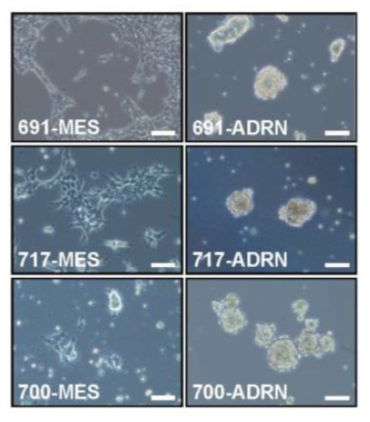
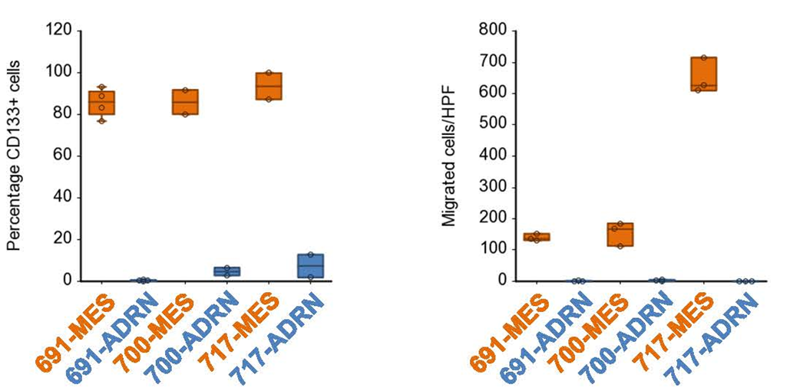
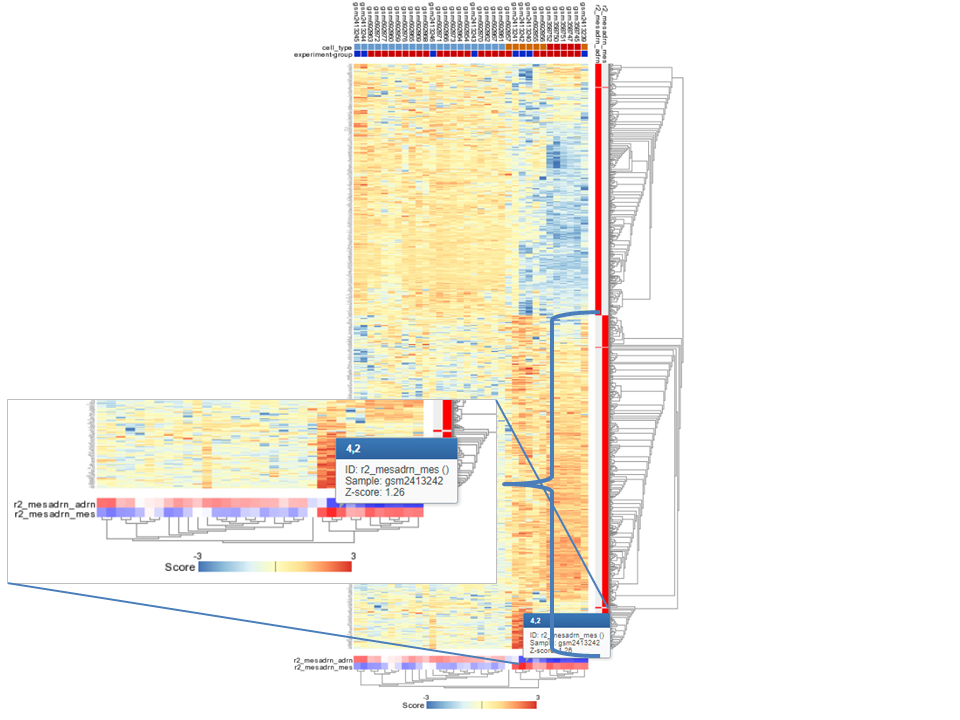

Investigating Intra-tumor Heterogeneity in Neuroblastoma
=================================

*Analyse tumor heterogeneity in neuroblastoma using the R2 data analysis platform*

This resource is located online at http://r2-training-courses.readthedocs.io  
  
 
Introduction
------------

Cancer is a very complex disease. Much more complicated than originally anticipated when the first mutations were found to be causal for specific cancers. For instance, in colorectal cancer a well defined path of subsequently gained mutations leads to more aggressive tumorigenic cell types (the Vogelstein model).

  	
  
  [**Figure 1: Mutation paths during cancer progression.**](_static/images/TumorHeterogeneity_CancerProgression.jpg)

Although there has been extensive research into similar mutation mechanisms in neuroblastoma (also in the AMC Oncogenomics group), such a mechanism has not been found for this often deadly childhood tumor. In this practical work session, we'll integrate RNA expression data with sequence data, specifically ChIP seq data, to further unravel neuroblastoma data.  

As you may have learned from your lectures by now, this tumor consists of different cancer cell types. There is reason to believe that this heterogeneity causes the high percentage of relapses in the aggressive subtype of neuroblastoma. Children developing a relapse almost always die. 
Fortunately, new technologies have become available to molecular biology. These enable us to study not only mutations and RNA expression of genes, but also study the epigenetic modifications of the DNA-associated histones. In addition, genes can now be manipulated in cell lines and in living tissues. 
Using advanced data analysis, statistics and clustering methods, the field of bioinformatics tries to derive new insights from these experimental data and to help molecular biologists to generate hypotheses that can be tested experimentally. Today you will use the web-based genomics analysis and visualization platform R2. R2 provides you with a set of bioinformatics tools to investigate recent patient and experimental data from neuroblastoma tumors and cell lines. 

Neuroblastoma is a pediatric tumor of the peripheral adrenergic lineage, which is neural crest derived. During embryogenesis, cells delaminate from the neural crest, migrate ventrally and differentiate into adrenaline- or noradrenaline-producing cells. Neuroblastomas typically express enzymes for the adrenaline-synthesis route. High-stage neuroblastomas usually go into complete remission upon therapy but often relapse as therapy-resistant disease.

Using recent molecular biology data gathering techniques and advanced bioinformatic data analysis algorithms we set out to investigate this aggressive characteristic of neuroblastoma tumors. We obtained tumor biopsies from four patients that were taken in culture. Each biopsy gave rise to two phenotypically divergent cell lines. In this course you will conduct the research yourself, following the lines of reasoning and the same data as was used in a paper by the AMC Oncogenomics group that was published in Nature Genetics in 2017.   

Tumors and origins: a first impression of your data
---------------------------------------
The grey buttons in this course will bring you to the R2 platform, often with pre-set settings such that you can pick up an analysis easily. The green buttons in this document will open up a Google form, one per section, with which you can submit your answers.  
  
For a start we'll investigate established childhood tumor cell lines, including neuroblastoma. Established cell lines can be grown and passaged in culture indefinetely. A typical example is the classic HeLa cell line, taken from a cervical adenocarcinoma of Henrieta Lacks in 1951 that has been in culture since. How do profiles of neuroblastoma cell lines relate to cell lines of other tumors? Additional data about classical cell lines from other childhood tumors is available in the resources of the scientific community. For each publication scientists are required to make their data available in public repositories. We can use these in a larger public dataset of 86 other cell lines derived from 6 different childhood tumors and see how they relate. 

*Data used:*  
* 86 cell lines derived from 6 different childhood tumors (Cell line Childhood Cancer (public) - Versteeg - 86 - MAS5.0 - u133p2)

*Techniques used:*   
* mRNA Microarray expression

*Analysis used* 
* individual gene selection
* t-SNE: t-distributed stochastic neighbor embedding statistics

 
 

##### Expression of key genes
* The button below brings you to the form in which you can submit your answers for section 1.2. 

<button class="course googleform" onclick="window.open('https://docs.google.com/forms/d/1ZGSmm3oMSJKHBHosCJsDUuGbQDhUX-_JSesBLizcDwQ/','_blank');" type="button">Open the form for section 1.2</button> 
 
 

* Open a Chrome browser and go to the R2 platform address: <a href="http://r2.amc.nl" target="_blank">http://r2.amc.nl</a> and choose the button **Use R2 without an account** under the sign in fields. 

You're now on the R2 main page. This web based molecular biology data analysis platform contains a wealth of data and methods to analyze the datasets. Step by step, researchers are guided through a web of options for data analysis. R2's main page shows this principle: step through each of the numbered boxes to develop your analysis of choice.  
In this case we're first going to see if and how the mRNA expression of several genes changes through a single dataset. We use the dataset that is described above. In this dataset, 86 cell lines derived from 6 different childhood tumor types can be found (ewing sarcoma, medulloblastoma, neuroblastoma, osteosarcoma, acute lymphocytic leukemia and rhabdomyosarcoma). 
* In order to find the dataset in R2, click on the text of the currently selected dataset in box 2. A grid pops up in which you can find all the datasets of R2 that are available to you. 
* Each row is a dataset and each column contains the different searchable characteristics of a dataset. Under the header **Tissue/Tumor** type the keyword *Childhood Cancer* in the white textfield and see if the dataset with 86 samples shows up. Then click the **Select** button in front of the row to select this dataset. 

---------

  **Based on knowledge that you acquired in previous lectures, or just from a quick Google search on the web... Can you think of a gene that might show different expression between some of these 6 tumor models?**
  

---------

  * In field 3, an analysis type can be chosen. We will start with the default analysis *View a Gene*, and thus you can simply click **Next** in field 4.
  * On the next page, the **Gene / Reporter** field is required. What gene came to mind that might show different expression between some of these 6 tumor models? Type the name of the gene in the **Search by Gene** field. A dropdown list appears, that shows all the reporters that are found for the gene characters that you typed. 
  * It can happen that multiple reporters are found for one gene. In that case, choose the top one of the list to select the reporter with the highest average expression. Select the reporter of your choice in the list with a mouse click. 
  * Click **Submit**.
    
  
A graph shows the expression of this gene's mRNA in the whole set of childhood tumor cell lines. Samples are along the x-axis, mRNA expression values of the gene in a sample are on the y-axis.  
In R2, samples can be annotated with e.g. clinical data or biological information. Each group of annotated data is called a *Track* in R2. These tracks can be used to filter, color or split data in all types of R2 analyses. 
Sometimes you can see such tracks displayed underneath a graph. In this case, below the graph colored blocks correspond to the values that each sample has for the categorical track *itcc_model*.  
Often more annotation is available for the samples. You can hover your mouse above sample dots in a graph or over the tracks underneath the graph to get more information per sample.  

  * Hover with your mouse over some colored blocks, and then over their data points in the graph to look at additional information of those samples. Pay attention to which sample belongs to which tumor model.  

When you analyze data, different visualizations might help to gain better insight into your dataset. Below the graph, you can find a table with adjustable settings.   

Try out a different view of the same data with the following changes to the settings: 
* Split the data in groups by switching the dropdown of **Analysis type** at the top of the box to *gene vs track*. In the box, set the dropdown of **Track** to *itcc_model (6 cat)*. This track contains the information which sample belongs to which tumor type and is the same track that you see displayed directly underneath the graph. Click **Submit** to see the result in the graph.
* The expression values on the y-axis are logarithmic by default, in the settings menu set the **Transformation** option to *None*. 
* Also, sort the samples again on level of expression with **Extra Graph Option** set to *Track and Gene sort*. 
* Click **Submit** again to obtain the graph with these adaptations.  
  
Let's change the gene of the graph: 
* Try the gene MYCN: yype *MYCN* in the left input field **Gene / Reporter** in the Adjustable settings box underneath the graph, and click on *MYCN/ 209757_s_at* in the list that pops up. Click **Submit** in order to change your gene. 
 

  **What might the expression level of this gene in neuroblastoma signify about the function of the gene in this cancer?**
 
 

---------

##### Clustering with t-SNE maps

We've seen that the expression of genes differs among the samples and some types of tumors seem to specifically express certain genes. To further explore the type of data we're dealing with, an unbiased unsupervised type of clustering analysis is a good idea. The t-SNE algorithm is an algorithm that was developed in recent years. It finds similarity in expression profiles of samples and will clump similar cells together on a map.   

* Click the button below to show the t-SNE map in R2: 

<button class="course" onclick="window.open('https://hgserver1.amc.nl/cgi-bin/r2/main.cgi?option=map_scatter_plot&map_id=3b64db2654de88efccac21ddeae73a8f','_blank');" type="button">Go to the t-SNE map</button> 
 
 

The t-SNE algorithm has a perplexity parameter which determines how much attraction points have on a map towards each other. In R2 a wide range of perplexity values were run for this dataset. Depending on your research question, you might be interested in a t-SNE map that shows the clusters very clearly as separate clumps, or you might want to view samples in a more unified visualisation.   

Under the graph, a menu allows the user to adapt settings.
*  The different maps can be found under de setting Versions. Set **Versions** to the value *5* and click **Submit** again. 
* Colors of the graph points are not set by default. To color the graph with a biologically meaningful annotation, find the **Color mode** dropdown and select *Color by Track*. Now set the **Color track** dropdown to use the *itcc_model* track again, and click **Submit** to show the changes. 

  
  
------

**What do you note about the clustering of the neuroblastoma samples?**

  **With which other tumor models do the neuroblastoma cell lines cluster?**

 
 

  **Based on the above, what would you do to further investigate your observations**
  
------

Urgency of research: patient material
----------------------------------------

In the former step we derived that neuroblastoma cell lines seem to group with cell lines of different developmental lineages. We have recently established new cell line pairs from neuroblastoma patients. In some cases multiple cell lines were obtained from the same biopsy. These cell lines share genetic defects and are therefore called *isogenic* cell line pairs. A microscopy image of each pair is provided below. 

  
	
  [**Figure 2: Bright field image of isogenic cell line pairs.**](_static/images/TumorHeterogeneity_IsoGenicPairsBF.png)

* The button below brings you to the form in which you can submit your answers for section 1.3

<button class="course googleform" onclick="window.open('https://docs.google.com/forms/d/e/1FAIpQLSd6f9ml9IEQmh_vgXEac_uDJ2ehBskh8U0yJmaNSYZ6QnWRUA/viewform?usp=sf_link','_blank');" type="button">Open the form for section 1.3</button> 
 
 

---------

  **What do you note about the morphology of the cell lines?**
  

---------

We profiled the mRNA expression of genes using Affymetrix mRNA chips in three of these pairs and of a previously established neuroblastoma cell line that after culturing gave rise to two very divergent phenotypes. The resulting gene expression patterns can be used to perform a hierarchical clustering. An example of such clustering resulting in an ordered heatmap is provided below 

  
	
  [**Figure 3: Heatmap: unsupervised clustering of samples using the distribution of the expression data combined with the clustering of genes based on their expression through the samples.**](_static/images/TumorHeterogeneity_HeatmapClustering.png)

*Data used:*  
  * Cell lines that were recently derived from three different patients. Two morphologically different looking cells were taken per patient. This dataset is combined with two classical Neuroblastoma cell lines that clustered differently in the tSNE: SHEP and SY5Y (Mixed Neuroblastoma (MES-ADRN) - Versteeg - 8 - MAS5.0 - u133p2) 
  
*Techniques used:*  
* mRNA Microarray expression

*Analysis used*  
* Toplister: unsupervised gene selection
* Unsupervised hierarchical clustering
* Heatmap visualization

 
 

For this analysis we will use one of the analysis tools of R2: Toplister. The Toplister can assess which genes show the most different expression values throughout a dataset. It does so by selecting the genes whose expression values have the largest standard deviation within a given set of samples. This gives an unbiased view of the differences in gene expression.

* Go to R2 by clicking the button below. The correct dataset containing 6 recently patient derived cell lines (2 per patient) plus the 2 classical Neuroblastoma cell lines is already selected. 
 

<form name="ps_avgpres_gse90803geo8_u133p2" action="https://hgserver1.amc.nl/cgi-bin/r2/main.cgi" enctype="multipart/form-data" target="R2" method="post">
  <input type="hidden" name="table" value="ps_avgpres_gse90803geo8_u133p2">
  <button type="submit" class="course r2submit" >Go to R2</button>
</form>  
 
 

* Select *Toplister (Gene filter stdev)* as the type of analysis in box **3** from the dropddown menu (- scroll almost all the way down. You will find it listed under the header *Meta analyses*). Toplister will find the 100 genes that have the largest variation in gene expression among these 8 cell lines. 
* Click **Next**; leave the settings as is, and click **Next** again. A list of genes appears.

---------

  **Do you recognize any genes that could explain the difference in phenotype?**
  

---------

* On the right side of the page you can find several buttons that allow you to perform further analyses with the list of genes that you just obtained with Toplister. The heatmap visualization produces a hierarchically clustered view of the expression values for the top 100 genes.  

---------

  **Based on your own rationale, how many groups of samples do you expect in this dataset?**
  

---------

* Click on **Heatmap (z-score)**
  
  
The cell line pairs from the patient were also investigated for the tumor stem cell marker gene CD133 and for their migration capability. See the results in the figure below:

  
	
  [**Figure 4: CD133 FACS analysis and transwell migration assay of isogenic pairs**](_static/images/TumorHeterogeneity_PairsCD133Migrate.png)

---------

  **Given these observations, what origin can you assign to each group of samples?**
  

---------
 

Which genes make a difference? Creating signatures
-----------------------------------------------------

We have identified two different types of cells that occur within the same patient. Neuroblastoma apparently has a heterogenous nature. What genes determine the difference between the two types? We’ll use RNA expression data again but now we will use a predefined, supervised classification in groups to search for genes that characterize this classification best, or in other words, that are differentially expressed between these two groups.

*Data used:*  
* Mixed Neuroblastoma (MES-ADRN) - Versteeg - 8 - MAS5.0 - u133p2 (same as above)
* Gene Ontology
* Broad curated hallmark datasets

*Techniques used:*   
* mRNA arrays

*Analysis used*  
* Differential Expression: supervised gene selection
* Gene Ontology Analysis: overrepresentation calculation
 
 
 

* The button below brings you to the form in which you can submit your answers for section 1.4

<button class="course googleform" onclick="window.open('https://docs.google.com/forms/d/e/1FAIpQLSee9vNt1hJuXrIAgO6feKHMCu-ASxDNiFeKqfJz5PrzuS6Zxg/viewform?usp=sf_link','_blank');" type="button">Open the form for section 1.4</button> 
 
 
  
* Go to the main page of R2 by clicking the button below

<form name="main_4_pairs" action="https://hgserver1.amc.nl/cgi-bin/r2/main.cgi" enctype="multipart/form-data" target="R2" method="post">
  <input type="hidden" name="table" value="ps_avgpres_gse90803geo8_u133p2">
  <button type="submit" class="course r2submit" >Go to R2 main portal</button>
</form>  
 
 

* In Field 3 choose *Differential expression between two groups* and click **Next**
 

This dataset has been annotated with 'cell type' information. Each sample was assigned to either the MESenchymal or the ADReNergic cell type. The information is stored in R2 in a track.
 
* Choose the proper track in the **Group by** dropdown and click **Submit**. An additional adjustable settings menu pops up.  
* Choose one of the types for **Group 1** and the other for **Group 2**.  
* Since we have only 8 samples make sure that the **Corr. voor multiple testing** is set to *No correction*. (More information on Correction for Multiple Testing can be found <a href="https://r2-tutorials.readthedocs.io/en/latest/Did_You_Know.html#multipletesting" target="_blank">here</a>) and click **Submit**.  
* A list of differentially expressed genes appears with correlation p-value < 0.01 in this dataset. Click on the magnifying glass icon in front of a gene of your choice to see its expression in the sample set. 
* The column **Difference** shows the correlation value between the track and the gene. Try an oppositely correlating gene as well.  
* Go back to the tab with the differentially expressed genes. This is still open in one of your browser tabs.  
* Click on the **Heatmap(zscore)** button in the right menu panel; a heatmap shows the expression of the differentially expressed genes for each sample.    

---------

  **How is this figure different from the former?**
  

---------
 
For future use, this list of genes has been stored in R2 as saved genesets. The list has been split into two categories: one set of genes that is highly expressed in the MES type of samples (r2_mesadrn_mes) and one set of genes highly expressed in the ADRN type of samples (r2_mesadrn_adrn).  
  
From the right panel of menu buttons, R2 provides several additional analyses for the list of genes that we just generated with the differential expression analysis. 
As a next analysis step, we can check a data resource called the Gene Ontology that provides a tree of systematically ordered biological terms that is used to formally describe the biological role of each gene. 
The Gene Ontology Analysis tool in R2 calculates for each of the thousands of groups of genes that are annotated with a specific biological term whether your set of choice is over-represented in them. 
   

* On the page with the differentially expressed genes, select the **Gene Ontology Analysis** button in the menu on the right 

---------

  **What can you say about the function of the differentially expressed genes?**
  

---------
 

* Now scroll down to the end of the page (or click the filter button in the left upper corner of the page) and adapt the settings such that only the genes that are higher expressed in the MES type of cells are selected (check the mes>= adrn). Click **Redo analysis**.

---------

  **What can you say about the function of the group of genes that are upregulated in the MES type of cells?**
  

---------
 

In R2 there are many more sets of genes that have been found to be implemented in specific processes. The Broad Institute has compiled quite some of these sets of genes that characterize hallmark biological processes.  

* Go back to the window with the differentially expressed genes. 
* Select the **Gene set analysis** option from the right menu
* Select the *Broad 2020 09 h hallmark* as Geneset and click **Next**

---------

  **Which hallmark category of genes pops up as most important? Can you explain this?**
  

---------
 

Identifying groups: using signatures to classify other datasets
------------------------------------------------------------------

We now have a signature that distinguishes between the two types of cells. We also obtained some hints about functional characteristics of these cells. How does this signature behave in other datasets? Does the same set of genes tell us something about other sets of tumors or cell lines? This is the next step in our analysis. Also we keep in mind that the neural crest undergoes a mesenchymal transition and gives rise to cell types from the adrenergic lineage.    

We've assembled a more complex dataset that consists of:  
* the 4 pairs of cell lines, 
* additional neuroblastoma cell lines from the first dataset and 
* publicly available data of non-malignant human neural crest tissue. 
  

*Data used:*
* A combination of the 8 cell lines above, additional neuroblastoma cell lines and cells from the neural crest lineage (Mixed Neuroblastoma (MES-ADRN-CREST) - Versteeg/Etchevers - 34 - MAS5.0 - u133p2)

*Techniques used:* 
* mRNA expression data

*Analysis used*
* Heatmap analysis

 
 
 

* The button below brings you to the form in which you can submit your answers for section 1.5

<button class="course googleform" onclick="window.open('https://docs.google.com/forms/d/e/1FAIpQLSeVhpdwUrMRo-TFI6MEL8yS12Z9MEXU_8zqRx2Tl6VbT8hyuQ/viewform?usp=sf_link','_blank');" type="button">Open the form for section 1.5</button> 
 
 

* Go to the main portal of R2 by clicking the button below; the dataset described above is automatically selected

<form name="main_34_pairs_and_crest" action="https://hgserver1.amc.nl/cgi-bin/r2/main.cgi" enctype="multipart/form-data" target="R2" method="post">
  <input type="hidden" name="table" value="ps_avgpres_gsenatgengeo34_u133p2">
  <button type="submit" class="course r2submit" >Go to R2</button>
</form>  
 
 

* In field 3 select *View Geneset (Heatmap)* that you can find under the header *Meta-analysis*.
* Click **Next** and select *r2 provided gene lists* for the **Gene set Collection**. 
* Click **Next**, leave selection as is and click **Next**
* Select both signatures that were derived before by holding CTRL and clicking on both the MES (*r2_mesadrn_mes*) and the ADRN (*r2_mesadrn_adrn*) signatures and click **Next**

---------

  **Which cell types group together?**
 
 
  **How does this relate to the earlier observations on cell lineage?**
 
 

---------

When observing such clear-cut patterns it is good scientific practice to test this in additional datasets. The database of R2 contains an additional dataset consisting of neuroblastoma cell lines that were profiled by a French research team. 

* Click on the button below to go there and perform the same analysis.

<form name="main_34_pairs_and_crest" action="https://hgserver1.amc.nl/cgi-bin/r2/main.cgi" enctype="multipart/form-data" target="R2" method="post">
  <input type="hidden" name="table" value="ps_avgpres_gse90683geo48_gse90683r1">
  <button type="submit" class="course r2submit" >Go to R2 additional NB dataset</button>
</form>  
 
 

---------

  **Do you observe similar patterns?**
 
 

---------

Using scores for further characterization
--------------------------------------------

The expression patterns of these specific signatures can be used to compare cell types. We can do this by summarizing the expression data of all genes in the signature in each cell type in one value; a signature score. The figure below shows the signature score of the MES part of the signature in a specific sample.  

  
	
  [**Figure 5: The signature score as calculated for a specific sample in the MES signature.**](_static/images/TumorHeterogeneity_SignatureScores.png)

 R2 has calculated these scores for all samples in both signatures. We're going to find out how they relate.

*Data used:*
* Mixed Neuroblastoma (MES-ADRN-CREST) - Versteeg/Etchevers - 34 - MAS5.0 - u133p2

*Techniques used:* 
* mRNA expression data

*Analysis used*
* Signature scores 

 
 
 

* The button below brings you to the form in which you can submit your answers for section 1.6

<button class="course googleform" onclick="window.open('https://docs.google.com/forms/d/e/1FAIpQLSdnr2SR3ER3naDLKJG00rogvCf5WEnqfqyDB1MyydT6zkpolg/viewform?usp=sf_link','_blank');" type="button">Open the form for section 1.6</button> 
 
 

* Go back to the main portal of R2 by clicking the button below.

<form name="main_34_pairs_and_crest" action="https://hgserver1.amc.nl/cgi-bin/r2/main.cgi" enctype="multipart/form-data" target="R2" method="post">
  <input type="hidden" name="table" value="ps_avgpres_gsenatgengeo34_u133p2">
  <button type="submit" class="course r2submit" >Go to R2</button>
</form>  
 
 

* In field 3 choose **Relate 2 tracks** and click **Next**
* First we'll explore the scores in each signature separately; on the X-axis (**Select X track**) we'll use the unique sample id (*lab\_id*) and on the Y-axis the signature score track that R2 has generated for the ADRN signature (s\_mesadrn\_adrn(#)). 
* Click **Submit**.  
A graph is generated. For each sample the signature score for the mesadrn\_adrn signature is shown. We can now perform some additional steps to make the graph more insightful: 
* In the Adjustable Settings underneath the plot, select for **Color mode**  *Color by Track* and try the track *cell_type*. Click **Submit** to view the result.
* Now select for the Y-axis the MES part of the signature, click **Submit** to view the result.
* To compare the signature scores, select the ADRN signature for the X track and submit your changes.
* If you have time you can also try the *Color by Gene* as **ColorMode**, choose a gene of interest (Note: the dropdown selection is linked to the database, wait for the proper selections to popup...)

---------

  **What conclusion would you draw from these figures?**
 
 

---------

Finding causes: homing in on transcription factors
-----------------------------------------------------

Apparently there are two types of cells in Neuroblastoma tumors. Neuroblastoma seems to be a heterogenous tumor. Transcription factors (TF's) are known to determine gene expression programs in cells. These gene expression programs determine the development of the cell. Can we find out which TF's might influence the difference between both of these cell lines?  

*Data used:*
* Mixed Neuroblastoma (MES-ADRN-CREST) - Versteeg/Etchevers - 34 - MAS5.0 - u133p2
* Transcription factor annotation from Gene Ontology
* NCBI (National Center for Biotechnology Information - USA) Gene information database 

*Techniques used:* 
* mRNA expression data

*Analysis used*
* Differential expression: supervised gene selection  

 
 
 

* The button below brings you to the form in which you can submit your answers for section 1.7

<button button class="course googleform" onclick="window.open('https://docs.google.com/forms/d/e/1FAIpQLSfvVCOe1_PbYaeCSNkCw2V3enSO0Re8iGoOAmkMKyiQMhVcUA/viewform?usp=sf_link','_blank');" type="button">Open the form for section 1.7</button> 
 
 

* Go back to the main portal of R2 by clicking the button below.

<form name="main_34_pairs_and_crest" action="https://hgserver1.amc.nl/cgi-bin/r2/main.cgi" enctype="multipart/form-data" target="R2" method="post">
  <input type="hidden" name="table" value="ps_avgpres_gsenatgengeo34_u133p2">
  <button type="submit" class="course r2submit" >Go to R2 main</button>
</form>  
 
 

Again we're going to find out which genes make a difference, but now in a specific subset of genes that has been annotated to have Transcription Factor activity. This is gathered from databases that collect that information from peer reviewed publications. 
* In field 3 select **Differential expression between two groups**. Click **Next**.
* Like before, select the track that contains information about the cell types and **Submit**.
* Choose *adrn* for **Group 1** and *mes* for **Group 2**.
* We're now also going to filter for specific genes, which can be done in the settings section **Gene Filters**. Next to **Gene set** click the button **Search GS**. 
* Since we are interested in transcription factors, type *transcription* in the textfield on top and click the **search icon**.
* Check the box of *Categories > base > transcription factor* with 945 genes and click on the green button **Use selected** on the left. Then click **Submit**. 
* A list of genes appears. Investigate the top 4 by clicking on the magnifying glasses in front of the gene names. This brings you to the expression view of the gene. 
* From the page with the expression view of the gene, you can also access the NCBI gene database containing additional information on the function of the gene and related scientific publications. Do this by clicking on the hyperlinked **GeneID** number in the second table underneath the plot. You'll arrive at a website that gathers all known information about genes. A useful section further down the page is the **Bibliography** containing short summaries of relevant scientific papers.

---------

  **Armed with this information, which gene would you choose for further research? Why?**
 
 

---------

Proving causes: manipulating cell lines
------------------------------------------

From lab experiments it is known that cells can change their nature, some cells exhibit a certain plasticity.  

* The button below brings you to the form in which you can submit your answers for section 1.8

<button class="course googleform" onclick="window.open('https://docs.google.com/forms/d/e/1FAIpQLSfrG8VSptASAsQlxod5Yt5RmthDtNr5BSUaww0HJ_ef8SXSTw/viewform?usp=sf_link','_blank');" type="button">Open the form for section 1.8</button> 
 
 

---------

  **From your own biomedical knowledge, can you explain why this is of relevance to cancer?**
 
 

---------

Experiments showed that the two cell types found in Neuroblastoma were able to switch. After a given period of time cells in dishes changed their nature as was proven by the expression of certain marker proteins on their surface.   
Now that we have a candidate Transcription Factor we can try to investigate its relevance for plasticity by manipulating the gene in cell lines that we grow in the lab. 

---------

  **Can you think of ways to manipulate genes in cell lines?**
 
 

---------

The TF was inducibly expressed in the SKNBE cell line and this was monitored through time for its gene expression using Affymetrix mRNA arrays. For comparison, the resulting data was added to the dataset that we used above. 

---------

  **To which of the cell types does SKNBE belong?**
 
 

---------

*Data used:*
* A combination of the 4 cell line pairs, additional classical Neuroblastoma cell lines, cells from the neural crest lineage and lines that had the TF inducible expressed for increasing periods (Mixed Neuroblastoma (MES-ADRN-Crest-Exp) - Versteeg - 52 - MAS5.0 - u133p2)

*Techniques used:* 
* Inducible gene expression
* mRNA expression data

*Analysis used*
* Signature score comparison

 
 
  
* Go to the R2 main page by clicking the button below, the correct dataset will be selected.  

<form name="52_pairs_crest_exp" action="https://hgserver1.amc.nl/cgi-bin/r2/main.cgi" enctype="multipart/form-data" target="R2" method="post">
  <input type="hidden" name="table" value="ps_avgpres_gsenatgen2017geo52_u133p2">
  <button type="submit" class="course r2submit" >Go to R2 main, inducible TF set</button>
</form>  
 
 

* In field 3, select the **Relate 2 tracks** option.  
R2 has calculated signature scores for all samples in both signatures; in this dataset these tracks are called *adrn_score* and *mes_score*. 
* Relate the two tracks and adapt the **ColorMode** to *Color by Track* and try the *mes_adrn_time* track. This track contains information about the time that the PRRX1 gene expression was induced in the SKNBE cell line. Click **Submit**.

---------

  **What is your conclusion from this experiment?**
 
 

---------

* This conclusion is even more obvious when the sequence of events is highlighted. The relations between the isogenic pairs are also illustrated. Click the button below to view the graph annotated with this extra information.  

<form name="timepath" action="https://hgserver1.amc.nl/cgi-bin/r2/main.cgi" enctype="multipart/form-data" target="R2" method="post">
  <input type="hidden" name="table" value="ps_avgpres_gsenatgen2017geo52_u133p2">
<input type="hidden" name="species" value="hs">
<input type="hidden" name="selectedtrack" value="adrn_score">
<input type="hidden" name="selectedtracky" value="mes_score">
<input type="hidden" name="subsettracksubset" value="experiment-group">
<input type="hidden" name="graphtype" value="XY">
<input type="hidden" name="colormode" value="colorbytrack">
<input type="hidden" name="trackforcolor" value="mes_adrn_time">
<input type="hidden" name="option" value="display2">
<input type="hidden" name="exageratemark" value="no">
<input type="hidden" name="chainedsams" value="gsm2413241,gsm2413246:#eeeeee;gsm2413239,gsm2413243:#eeeeee;gsm2413242,gsm2413245:#eeeeee;gsm2413240,gsm2413244:#eeeeee;gsm2413257,gsm2413247,gsm2413248,gsm2413249:#222222:2;gsm2413249,gsm2413250,gsm2413251,gsm2413252,gsm2413253,gsm2413254:#222222:3;gsm2413254,gsm2413255,gsm2413256:#222222:4">
<input type="hidden" name="fontsize_ruler" value="25">
<input type="hidden" name="fontsize_y" value="30">
<input type="hidden" name="dotsize" value="5">
<button type="submit" class="course r2submit" >Show time path annotation in R2</button>
</form>  
 
 

Creating hypotheses: relating to chromatin modification data
---------------------------------------------------------------

Apparently this TF is capable of shifting cells from one state to the other. How can we further determine causal relations and ideally targetable processes in these cancer cells? How is a switch dynamically possible?  
A growing body of evidence implicates enhancers as key elements defining cell identity. The relationship of these enhancers to intratumoral heterogeneity is unknown though. We performed ChIP-Seq analysis of the H3K27ac histone modifications for the isogenic cell line pairs. 

*Data used:*
* Four MES and five ADRN neuroblastoma cell lines, including three isogenic cell line pairs. 

*Techniques used:* 
* ChIP-Seq analysis

*Analysis*
* Genome Browser: analyzing histone modifications marking active enhancers
* Differential Expression
 
 
 

* The button below brings you to the form in which you can submit your answers for section 1.9

<button class="course googleform" onclick="window.open('https://docs.google.com/forms/d/e/1FAIpQLScwydRpxvzxEBI_FsXH56wc947Jdbhg1w0vpU4ZMIRaJFoP9g/viewform?usp=sf_link','_blank');" type="button">Open the form for section 1.9</button> 
 
 

---------

  **Can you explain what the goal of this experiment was?**
 
 

---------

First we'll check one of the HAND genes, known to play a role in the development of the sympatho-adrenal lineage from the neural crest.  

---------

  **What do you expect for the H3K27ac signals?**
 
 

---------

* Click on the button below to show the ChIP-Seq data for HAND1 in the four mesenchymal and five adrenergic neuroblastoma cell lines. For your convenience the signals are colored according to the type (MES or ADRN) of cell line.  

<form name='genomebrowser_tf' action="https://hgserver1.amc.nl/cgi-bin/r2/main.cgi" enctype="multipart/form-data" method='POST' target='_gv'>
<input type='hidden' name='option' value='gbv2_base'>
<input type='hidden' name='|a01giemsa' value='on'>
<input type='hidden' name='a02bsequence' value='off'>
<input type='hidden' name='a02csequence' value='off'>
<input type='hidden' name='a04cons' value='off'>
<input type='hidden' name='a10refseq' value='on'>
<input type='hidden' name='a10refseq_cds' value='off'>
<input type='hidden' name='a10refseq_features' value='off'>
<input type='hidden' name='a15ensgene' value='off'>
<input type='hidden' name='arrayreporters' value='off'>
<input type='hidden' name='breadcrumbs' value=''>
<input type='hidden' name='breast_basis_fisher_v1' value='off'>
<input type='hidden' name='cg_annotvars' value='off'>
<input type='hidden' name='cg_calldifso' value='off'>
<input type='hidden' name='cg_calldifso_v25_18' value='off'>
<input type='hidden' name='cg_cgh1k_seg' value='off'>
<input type='hidden' name='cg_cgh1k_segv2' value='off'>
<input type='hidden' name='cg_cgh1k_segv2_v2' value='off'>
<input type='hidden' name='cg_evidence_bc' value='off'>
<input type='hidden' name='cg_junction' value='off'>
<input type='hidden' name='cg_junctiondif' value='off'>
<input type='hidden' name='cg_mei_v1' value='off'>
<input type='hidden' name='cg_varfileb_25' value='off'>
<input type='hidden' name='cgh_acgh_kdp_v1' value='off'>
<input type='hidden' name='cgh_cgcgh_pmc_v1' value='off'>
<input type='hidden' name='cgh_mixed_seg' value='off'>
<input type='hidden' name='cgh_public_ccle' value='off'>
<input type='hidden' name='cgh_v4' value='off'>
<input type='hidden' name='chip_col_v2' value='20150468:#c1c1c1,20150469:#129944,20150470:#366092,20150471:#c1c1c1,20150472:#129944,20150473:#366092,20150755:#c1c1c1,20150756:#366092,20150757:#c1c1c1,20150758:#E46D0A,20150759:#c1c1c1,20150760:#aa0000,20150761:#c1c1c1,20150762:#aa0000,20150763:#c1c1c1,20150764:#129944,20150765:#c1c1c1,20150766:#E46D0A,20150767:#c1c1c1,20150768:#366092,20150769:#c1c1c1,20150770:#aa0000,20150771:#129944,20150772:#129944,20150773:#129944,20150774:#129944,20150775:#366092,20150776:#129944,20150777:#129944,20150778:#129944,20160425:#0000AA,20160427:#0000AA,20160428:#0000AA,20160520:#0000aa,20160521:#129944,20160522:#129944,20160523:#aa0000,20160524:#aa0000,20161175:#c1c1c1,20161176:#0000aa,20161177:#c1c1c1,20161178:#129944,20161179:#aa0000,20161183:#c1c1c1,20161184:#129944,20161185:#E46D0A,20161202:#c1c1c1,20161203:#129944,20161204:#aa0000,20161205:#c1c1c1,20161206:#129944,20161207:#0,29160113:#0000aa,29160114:#129944,29160115:#129944,29160116:#aa0000,29160117:#aa0000,20150473_e200:#aa0000,20161178-e200:#129944,20161179-e200:#aa0000,C0018:#aa0000,C0018-et200:#aa0000,C0019:#aa0000,C0019-et200:#aa0000,C0020:#c1c1c1,C0021:#aa0000,C0021-et200:#aa0000,C0022:#aa0000,C0022-et200:#aa0000,ENCFF000KID:#aa0000,ENCFF000KIE:#aa0000,ENCFF000KIG:#aa0000,ENCFF000KIH:#aa0000,ENCFF001GFL:#aa0000,ENCFF001GFN:#aa0000,GSE71072:#aa0000,GSM1532401:#aa0000,GSM1532402:#aa0000,GSM1532405:#aa0000,GSM1532408:#aa0000,GSM1532409:#aa0000,GSM1532411:#aa0000,GSM1532414:#aa0000,GSM1532415:#aa0000,GSM1532417:#aa0000,GSM1602665:#aa0000,GSM1602665OG:#aa0000,GSM1602666:#0000aa,GSM1602667:#0000aa,GSM1602668:#0000aa,GSM1680101:#aa0000,GSM1680102:#0000aa,GSM1680104:#aa0000,GSM1680105:#0000aa,GSM1680107:#aa0000,GSM1693097:#0000aa,GSM1693098:#0000aa,GSM1693101:#0000AA,GSM1693102:#0000AA,GSM1693105:#c1c1c1,GSM1693117:#222222,GSM1693118:#222222,GSM1867061:#0000AA,GSM2027301:#222222,GSM2066632:#0000AA,GSM2113517:#aa0000,GSM2113518:#aa0000,GSM2113519:#129944,GSM2113521:#0000aa,GSM2113522:#aa0000,GSM2113523:#0000aa,GSM2113524:#aa0000,GSM2113526:#0000aa,GSM2113527:#aa0000,GSM2113529:#0000aa,GSM2113530:#aa0000,GSM2113532:#0000aa,GSM2113533:#0000aa,GSM2120699:#129944,GSM2120700:#aa0000,GSM2120701:#aa0000,GSM2120702:#aa0000,GSM2120703:#c1c1c1,GSM2120704:#129944,GSM2120705:#aa0000,GSM2120706:#aa0000,GSM2120707:#aa0000,GSM2120708:#c1c1c1,GSM2120709:#aa0000,GSM2120710:#c1c1c1,GSM2120711:#129944,GSM2120712:#aa0000,GSM2120713:#aa0000,GSM2120714:#aa0000,GSM2120715:#c1c1c1,GSM2120716:#aa0000,GSM2120717:#c1c1c1,og00001:#0000aa,zr1010_2:#aa0000,zr96905:#c1c1c1,zr96906:#aa0000,zr969_12:#aa0000,zr969_2:#aa0000,zr969_4:#aa0000,zr969_7:#aa0000,20150470-et200:#366092,20150473-et200:#366092,20150756-et200:#366092,20150768-et200:#366092,20150775-et200:#366092,20161185-et200:#E46D0A,20161207-et200:#E46D0A,20150766-et200:#E46D0A,20150758-et200:#E46D0A,'>
<input type='hidden' name='chip_exp_v2' value='20150470-et200,20150473-et200,20150756-et200,20150758-et200,20150766-et200,20150768-et200,20150775-et200,20161185-et200,20161207-et200'>
<input type='hidden' name='chip_height' value='45'>
<input type='hidden' name='chip_label_size' value='12'>
<input type='hidden' name='chip_libscale' value='20000000'>
<input type='hidden' name='chip_max' value='a'>
<input type='hidden' name='chip_min' value='a'>
<input type='hidden' name='chip_ord_v2' value='undefined:,20161207-et200:a,20161185-et200:b,20150775-et200:e,20150766-et200:c,20150758-et200:d,20150756-et200:g,20150768-et200:f,20150473-et200:h,20150470-et200:i,'>
<input type='hidden' name='chip_signif' value='false'>
<input type='hidden' name='chip_slider' value='no'>
<input type='hidden' name='chip_slider_value' value='3'>
<input type='hidden' name='chip_table' value='chip_raw'>
<input type='hidden' name='chrom' value='chr5'>
<input type='hidden' name='clinvar' value='off'>
<input type='hidden' name='combiset' value='ps_amc_ticcellcheck43_u133p2'>
<input type='hidden' name='cosmic' value='off'>
<input type='hidden' name='cosmic_mutascape' value='off'>
<input type='hidden' name='cpct_bc' value='off'>
<input type='hidden' name='cpct_design' value='off'>
<input type='hidden' name='cpct_variants' value='off'>
<input type='hidden' name='cpgisland' value='off'>
<input type='hidden' name='custom_id' value='20150756,20150758,20150775,20161207,20161185,20150470,20150473,20150766,20150768'>
<input type='hidden' name='custom_id_not' value=''>
<input type='hidden' name='custom_jscan_dz' value='off'>
<input type='hidden' name='dbsuper' value='off'>
<input type='hidden' name='dbtss' value='off'>
<input type='hidden' name='dkfz_cg_calldifso_v20_16' value='off'>
<input type='hidden' name='dkfz_cg_cgh1k_seg' value='off'>
<input type='hidden' name='dkfz_cg_evidence_bc' value='off'>
<input type='hidden' name='dkfz_cg_testvar_v2e' value='off'>
<input type='hidden' name='dkfz_cg_varfileb_20' value='off'>
<input type='hidden' name='dkfz_junctiondif' value='off'>
<input type='hidden' name='dkfzpdx1_450k_cn' value='off'>
<input type='hidden' name='dkfzpdx2_450k_cn' value='off'>
<input type='hidden' name='elmer_nm_1kg_e5' value='off'>
<input type='hidden' name='elmer_nm_1kg_e5e5' value='off'>
<input type='hidden' name='elmer_nm_rs_mac1_2' value='off'>
<input type='hidden' name='elmer_nm_var_all' value='off'>
<input type='hidden' name='encode_bed_data_v1' value='off'>
<input type='hidden' name='encode_tf_v1' value='off'>
<input type='hidden' name='end' value='154120827'>
<input type='hidden' name='epi_roadmap' value='off'>
<input type='hidden' name='exomevarserver' value='off'>
<input type='hidden' name='express_background' value=''>
<input type='hidden' name='express_drawtype' value=''>
<input type='hidden' name='express_ext' value='yes'>
<input type='hidden' name='express_height' value='60'>
<input type='hidden' name='express_max' value='a'>
<input type='hidden' name='express_min' value='a'>
<input type='hidden' name='express_minpres' value='1'>
<input type='hidden' name='express_selectedtrack' value='u-mesne_2016_c'>
<input type='hidden' name='express_slider' value='no'>
<input type='hidden' name='express_slider_value' value='3'>
<input type='hidden' name='express_transform' value='transform_zscore'>
<input type='hidden' name='fantom5_cage_test' value='off'>
<input type='hidden' name='fantom5_enhancer_premissive' value='off'>
<input type='hidden' name='fantom5_enhancer_robust' value='off'>
<input type='hidden' name='fantom5_enhancer_tss_fdr' value='off'>
<input type='hidden' name='filterfilein' value=''>
<input type='hidden' name='fw_se_overlap_v1' value='off'>
<input type='hidden' name='fw_se_overlap_v2' value='off'>
<input type='hidden' name='g_position' value=''>
<input type='hidden' name='genesets_v1' value='off'>
<input type='hidden' name='genome_build' value='hg19'>
<input type='hidden' name='gwascatalog' value='off'>
<input type='hidden' name='hic_domains_lit' value='off'>
<input type='hidden' name='hugoonce' value='yes'>
<input type='hidden' name='icgc_snv_pbca' value='off'>
<input type='hidden' name='imagewidth' value='1000'>
<input type='hidden' name='inform_450k_baf' value='off'>
<input type='hidden' name='inform_450k_cn' value='off'>
<input type='hidden' name='inform_cg_cgh10k_segv2' value='off'>
<input type='hidden' name='inform_cg_somatic_coding_v1' value='off'>
<input type='hidden' name='ither_450k_cn' value='off'>
<input type='hidden' name='ither_cgh10k_segv2' value='off'>
<input type='hidden' name='ither_somatic_coding_v1' value='off'>
<input type='hidden' name='lincipedia' value='off'>
<input type='hidden' name='liver_enhancer_cell201501' value='off'>
<input type='hidden' name='macs14_amc_og_v1' value='off'>
<input type='hidden' name='macs14_geo_og_v1' value='off'>
<input type='hidden' name='macs2_amc_og_v1' value='off'>
<input type='hidden' name='macs2_broad_fw_v1' value='off'>
<input type='hidden' name='macs2_broad_og_v1' value='off'>
<input type='hidden' name='modus' value='complex:chip:ps'>
<input type='hidden' name='mook_cgcgh' value='off'>
<input type='hidden' name='nc_enhancer_prescott_2015' value='off'>
<input type='hidden' name='newgene' value=''>
<input type='hidden' name='ngs_cgcgh_mb_v1' value='off'>
<input type='hidden' name='ngs_cgcgh_pdx1_v1' value='off'>
<input type='hidden' name='ngs_cgcgh_ped_v1' value='off'>
<input type='hidden' name='og_motif_b_gata3peaks' value='off'>
<input type='hidden' name='og_motif_b_transfac' value='off'>
<input type='hidden' name='og_motif_c' value='off'>
<input type='hidden' name='og_se_overlap_v1' value='composition10'>
<input type='hidden' name='og_se_overlap_v2' value='off'>
<input type='hidden' name='pluginopt:a01giemsa:height' value='11'>
<input type='hidden' name='pluginopt:a01giemsa:style' value='standard'>
<input type='hidden' name='pluginopt:a10refseq:class' value='protein_coding'>
<input type='hidden' name='pluginopt:a10refseq:detail_modes_full' value='10000'>
<input type='hidden' name='pluginopt:a10refseq:height' value='18'>
<input type='hidden' name='pluginopt:a10refseq:hilite' value=''>
<input type='hidden' name='pluginopt:a10refseq:represent' value='merge_by_symbol'>
<input type='hidden' name='pluginopt:og_se_overlap_v1:height' value='10'>
<input type='hidden' name='pluginopt:og_se_overlap_v1:modus' value='default'>
<input type='hidden' name='pluginopt:og_se_overlap_v1:overlap' value='0'>
<input type='hidden' name='pluginopt:rose_se_r0_s0_t0_v1:height' value='9'>
<input type='hidden' name='pluginopt:rose_se_r0_s0_t0_v1:is_super' value='1'>
<input type='hidden' name='pluginopt:rose_se_r0_s0_t0_v1:modus' value='by_factor'>
<input type='hidden' name='pluginopt:rose_se_r0_s0_t0_v1:rose_bam' value='0'>
<input type='hidden' name='pluginopt:rose_se_r0_s0_t0_v1:rose_conf_size' value='0'>
<input type='hidden' name='profilename' value='171010_wwtr1_mes_se'>
<input type='hidden' name='rmsk' value='off'>
<input type='hidden' name='rose_se_pub_rseg_m2_s0_t0_v1' value='off'>
<input type='hidden' name='rose_se_r0_s0_t0_v1' value='off'>
<input type='hidden' name='rose_se_r0_s0_t2500_v1' value='off'>
<input type='hidden' name='rose_se_test' value='off'>
<input type='hidden' name='rose_se_v1' value='off'>
<input type='hidden' name='rseg_ac_me3_v1' value='off'>
<input type='hidden' name='rseg_pub_og_v1' value='off'>
<input type='hidden' name='rseg_v1' value='off'>
<input type='hidden' name='rsegdiff_test' value='off'>
<input type='hidden' name='rsegdiff_v1' value='off'>
<input type='hidden' name='sample' value='dataset_track'>
<input type='hidden' name='snp138' value='off'>
<input type='hidden' name='snp_array' value='off'>
<input type='hidden' name='start' value='153591527'>
<input type='hidden' name='superenhancer_nb_george' value='off'>
<input type='hidden' name='sv_delly_pedcan1' value='off'>
<input type='hidden' name='sv_ivo_mb500' value='off'>
<input type='hidden' name='svg' value='false'>
<input type='hidden' name='switch' value='add'>
<input type='hidden' name='target_ilmn_cgh_seg' value='off'>
<input type='hidden' name='target_wxs_cgh_seg' value='off'>
<input type='hidden' name='thiesen_cg_calldifso_v20_18' value='off'>
<input type='hidden' name='thiesen_cg_cgh1k_segv2' value='off'>
<input type='hidden' name='thiesen_cg_evidence_bc' value='off'>
<input type='hidden' name='thiesen_cg_varfileb_20' value='off'>
<input type='hidden' name='thiesen_junction' value='off'>
<input type='hidden' name='thiesen_junctiondif' value='off'>
<input type='hidden' name='tmp_bed' value='off'>
<input type='hidden' name='tmp_bed2' value='off'>
<input type='hidden' name='usergroup' value='personal'>
<input type='hidden' name='vcfe_dkfz_som_mb500_v1' value='off'>
<input type='hidden' name='vcfe_dkfz_som_pdx1_v1' value='off'>
<input type='hidden' name='vcfe_dkfz_som_suz_v1' value='off'>
<input type='hidden' name='vcfe_msk_impact_nat_med_17' value='off'>
<input type='hidden' name='vista_enhancers' value='off'>
<input type='hidden' name='vucghseq_mixed_seg' value='off'>
<input type='hidden' name='vumc_cg_calldifso_v20_18' value='off'>
<input type='hidden' name='vumc_cg_cgh1k_segv2' value='off'>
<input type='hidden' name='vumc_cg_evidence_bc' value='off'>
<input type='hidden' name='vumc_cg_mei_v1' value='off'>
<input type='hidden' name='vumc_cg_varfileb_20' value='off'>
<input type='hidden' name='vumc_junction' value='off'>
<input type='hidden' name='vumc_junctiondif' value='off'>
<input type='hidden' name='wgencoderegdnaseclusteredv2' value='off'>
<input type='hidden' name='wgs_cgh1k_curie_seg' value='off'>
<input type='hidden' name='wgs_cgh1k_nbrel_seg' value='off'>
<input type='hidden' name='wgs_cgh1k_nbrel_segsqza' value='off'>
<input type='hidden' name='wgs_cgh1k_nbrel_segsqza_pn' value='off'>
<input type='hidden' name='wgs_cgh1k_seg' value='off'>
<input type='hidden' name='wgs_curie_junction' value='off'>
<input type='hidden' name='wgs_dcgh10k_curie_seg' value='off'>
<input type='hidden' name='wgs_dcgh10k_nbrelsqza_seg' value='off'>
<input type='hidden' name='wgs_junction' value='off'>
<input type='hidden' name='wgs_maris_calldifso_v20_18' value='off'>
<input type='hidden' name='wgs_maris_cgh1k_seg' value='off'>
<input type='hidden' name='wgs_maris_junctiondif' value='off'>
<input type='hidden' name='wgs_ploidy1k_curie_seg' value='off'>
<input type='hidden' name='wgs_ploidy1k_seg' value='off'>
<input type='hidden' name='wgs_sequenza1k_nbrel_seg' value='off'>
<input type='hidden' name='wgs_somatic_snpsift' value='off'>
<input type='hidden' name='wgs_somatic_snpsift_missense' value='off'>
<input type='hidden' name='wgs_somatic_strelka' value='off'>
<input type='hidden' name='wgs_somatic_varscan2' value='off'>
<input type='hidden' name='wgs_varfileb_maris_20' value='off'>
<button type="submit" class="course r2submit" >Go to R2 GenomeBrowser for HAND1</button>
</form>
 
 

Regions encoding genes are drawn at the bottom of the graph. When in red they're encoded in the reverse direction, coding exons are darker.  

---------

  **Can you explain this graph? What do you expect for the expression of this gene?**
 
 

---------

* At the top of the page click on the **zoom out 10X** button. Look at the differences between the cell lines 

The chromatin state is especially important for transcription factors; we'll re-visit the list of transcription factors that are differentially expressed between the MES and ADRN cell lines.

---------

  **Why are Transcription Factors of interest in this setting?**
 
 

---------

* Perform the differential expression analysis again by clicking on the button below

<form name="main_34_pairs_and_crest" action="https://hgserver1.amc.nl/cgi-bin/r2/main.cgi" enctype="multipart/form-data" target="R2" method="post">
  <input type="hidden" name="table" value="ps_avgpres_gsenatgengeo34_u133p2">
  <button type="submit" class="course r2submit" >Go to R2 main</button>
</form>  
 
 

* In field 3 select **Differential expression between two groups**. Click **Next**.
* Like before, select the track that contains information about the cell types and **Submit**.
* Choose *adrn* for **Group 1** and *mes* for **Group 2**.
* We're now also going to filter for specific genes, which can be done in the settings section **Gene Filters**. Next to **Gene set** click the button **Search GS**. 
* Since we are interested in transcription factors, type *transcription* in the textfield on top and click the **search icon**.

* Use both expression analysis and the enhancer data in the genomebrowser to decide which transcription factors would be worthwhile to further investigate. In the genomebrowser that was still open from the previous question, type the name of the gene in the left upper corner textfield to look at the ChIP-Seq profiles of the samples at that location of the genome. To further explore the larger region around the gene you can use the zoom buttons at the top of the page.  

---------

  **Which Transcription Factor would you consider for further study?**
 
 

---------

Suggesting therapy
---------------------

* With the current new knowledge that you derived above, can you think of a strategy to use the fact that neuroblastoma is a heterogenous tumor consisting of a mesenchymal, motile cell type and a adrenergic, differentiated cell type for therapeutic options? This is an open question, so be creative, you might find something interesting! If you want, you can follow the suggestions below.  
  
* Use the button of 1.9 to perform a differential expression analysis. This time explore other gene categories that could be interesting for drug development. Look at the expression profiles of some genes of your choice. 
  * There is a category "drug targets" in R2 to select druggable proteins; **Search GS** > Categories > base > drug target.  
  * Another very interesting gene category is the "kinase" category, this contains known kinases that have active roles in pathways.
* The first button in 1.9 takes you to the Genome Browser at the position of the HAND1 gene. In the textfield in the upperleft corner of the Genome Browser you can chance th elocation to another gene again. Do this for the genes whose expression profiles you just have studied. Try to find genes that show consistent chromatin modification profiles for the one type of neuroblastoma cell lines and a different consistent profile for the other type. 
* Knowledge about pathways can be exploited as well.
* The NCBI database can provide additional information from literature about the genes of interest.
 
  
  
  
 
 * The button below brings you to the form in which you can submit your answers for section 1.10

 <button class="course googleform" onclick="window.open('https://docs.google.com/forms/d/e/1FAIpQLSdLpBdzI6chwWT4Nl4b_aGCVEBG8eMEIapi2T7VowBvD0V71g/viewform?usp=sf_link','_blank');" type="button">Open the form for section 1.10</button> 
  
  
  
---------

  **Which strategy do you suggest?**
 
 

---------

Final remarks / future directions
---------------------------------
In the March 1st 2018 issue of Nature a paper was published describing a landscape of genomic alterations across childhood cancers. The data is accessible in R2 also as a Datascope. This is another example of how R2 can visualize your genomics data. 
  
This ends the course. Feel free to further explore the course materials or our tutorials.
  
We hope that this course has been helpful. If you want to have your genomics data visualized and analyzed using the R2 platform you can always consult r2-support@amc.nl
  
The R2 support team.

