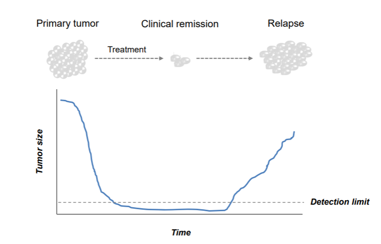
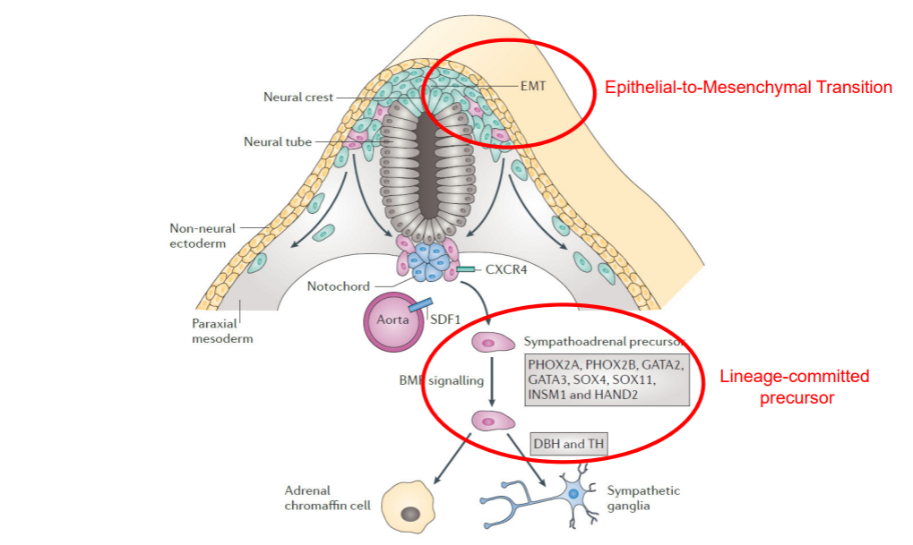

Finding causes in Neuroblastoma genomics data
=================================

*Introduction to bioinformatics tools using the web-based genomics analysis and visualization platform R2 and neuroblastoma data*

This resource is located online at http://r2-training-courses.readthedocs.io  

Introduction
------------

##### Neuroblastoma 

Neuroblastoma is a childhood tumor of the peripheral sympathetic system. Primary tumors typically occur in 
 the adrenal glands, which are located on top of the kidneys, but they can also manifest in other areas of the body. Most patients are diagnosed between the age of 0 to 4 years. 
Neuroblastoma patients are classified by The International Neuroblastoma Staging System, the INSS. The increment in stages does not reflect progression of disease, as is the case for colon cancer, but represents different characteristics of the disease. Stage 1, 2 and 3 neuroblastomas have a very good prognosis. Stage 4 neuroblastomas usually go into complete remission upon therapy but often relapse as therapy-resistant disease. About 40% of stage 4 neuroblastoma have an amplification of the MYCN oncogene. This implies that instead of two DNA copies, each neuroblastoma cell has 30 to 100 copies of the MYCN gene. In addition to stage 1, 2, 3, and 4 neuroblastomas, there is the unusual stage 4S neuroblastoma, which is metastasized but goes into spontaneous regression. Over the last twenty years, the outcome for stage 4 neuroblastoma patients has not substantially improved. 
 
  	

  [**Figure 1: Low stage versus high stage neuroblastoma**](_static/images/Vagabond/Vagabond_lowvshighstages_neuroblastoma.png)

Several cancer types, such as pancreatic cancer and colon cancer, follow a multi-step process involving a series of genetic alterations, similar to Vogelstein’s multi-step genetic mutation framework as shown below. 
These mutations accumulate over time and lead to the transformation of normal cells into cancerous cells. 

[**Figure 2: Mutation paths during cancer progression**](_static/images/TumorHeterogeneity_CancerProgression.jpg)

Extensive research into possible mutation mechanisms in neuroblastoma has been done (also in the AMC Oncogenomics group). 
Unfortunately, such a mechanism has not been found for this often deadly childhood tumor.

##### Finding differences and biological processes

One of the technologies that can be used to study a disease or biological process is gene expression profiling. With this high throughput technology, we determine the mRNA expression of nearly all genes known in a single experiment. 
We will look for different subgroups in our data, find genes that make a difference and find cellular pathways that are activated in neuroblastoma patients with an unfavorable prognosis. 
 

##### Research questions

During this practical course, we will use the R2 bioinformatics platform to study two research questions:
* Which genes make a difference between neuroblastoma subgroups? 
* Which molecular pathways are activated in neuroblastoma patients with an unfavorable prognosis?

##### Go to the R2 platform

* Go to our development environment <a href="https://hgserver2.amc.nl/" target="_blank">https://hgserver2.amc.nl/</a>, such that you get the newest functionalities.
  N.B. Our main and tested environment is <a href="http://r2.amc.nl" target="_blank">http://r2.amc.nl</a>.
* Login with your R2 credentials.   

You're now on the R2 main page. This web based molecular biology data analysis platform contains a wealth of data and methods to analyze the datasets. Step by step, researchers are guided through a web of options for data analysis. R2's main page shows this principle: step through each of the numbered boxes to develop your analysis of choice.  
  
The <button class="course googleform">green buttons</button> in this document will open up a Google form, one per section, with which you can submit your answers. 
  

## Finding prognostic factors in your data

*Data used:*  
* 88 Human Neuroblastoma samples (Tumor Neuroblastoma public - Versteeg - 88 - MAS5.0 - u133p2)

*Techniques used:*   
* mRNA Microarray expression

*Analysis used* 
* Find Correlating Genes with a single gene
* Finding Differentially expressed genes
* Kaplan Meier by annotated parameter

 
 

### Selecting datasets

Let's first make sure that the correct dataset is selected.  
- On the main page, you find a menu in the middle of the page that consists of several boxes.  
- Verify that in box 2 the following dataset is selected: *Tumor Neuroblastoma public - Versteeg - 88 - MAS5.0 - u133p2*. If not, follow the steps below. 

  

If you see a different dataset selected, you can change the dataset as follows:  

- Click on the selected dataset, which will make a grid popup, showing all the datasets that are available to you within the platform. Each row is one dataset and each column shows particular characteristics of that dataset. You can filter for specific datasets with the headers of the columns.  
- In the textfield of column **Author** type *Versteeg* and in the column of number of samples **N** type 88.
- Click on the row of the correct dataset and then on the blue button to **Confirm Selection**

---------

### Investigating single genes / Expression of key genes
* The button below brings you to the form in which you can submit your answers for section 1.2. 

<button class="course googleform" onclick="window.open('https://docs.google.com/forms/d/1AdLKLVAkgRFiQ_AEHwRyWu0gc3_UZ6XyT3G4KICGStQ/viewform?usp=sf_link','_blank');" type="button">Open the form for section 1</button> 
 
 
It is known that the amplification of the MYCN gene is associated with a poor prognosis. Now we will 
analyze the mRNA expression of MYCN in the selected dataset. We will use the R2 analysis module 'One Gene View'.
- On the main page in field 3 select **View a gene**, which is also the selected analysis by default. Then click **Next**.
- For this analysis, R2 needs to know which gene/ reporter to use. Fill in the text field *Search by Gene* the gene name of our interest: **mycn**. And select with a mouse click the mycn gene from the dropdown in order to select the correct reporter.
- The rest of the settings we leave as is. Click **Submit**  

 
The scatter plot in the central diagram shows the mRNA expression values of MYCN for all tumors of the 88 patients, next to each other. The samples are ordered according to increasing MYCN expression.  

- The expression is given on a log scale by default. To switch to a linear scale, scroll down to the Adjustable Settings box under the plot. In the field **Transformation**, select *None* and click **Submit**. 

In R2 the samples of a dataset can be annotated with meta-information, e.g. clinical data or molecular biology
  parameters. Each group of annotated data is called a “Track” in R2. These tracks can be informative / useful for a large variety of additional analysis and visualization functions. To name a few, tracks can be used to filter datasets, to compare groups of samples, to color scatter plots of samples with meta information, or to correlate genomics patterns in your data to e.g. different phenotypes or demographic characteristics.
  
- Directly underneath the plot the tracks of this dataset are shown with their color coded values. You can see the tracks for e.g. agegroup, INSS stage and MYCN amp(lification). Hover with your mouse over the different blocks.

The track mycn_amp shows which samples have MYCN amplification.

---------

  **What is the relation between the track MYCN amplification and MYCN expression?**
  

**What do you notice about inss staging versus mycn amplification when you look at
the annotation underneath the graph?**
  

---------

We can show such relationships more clearly by grouping the tumors in the graph according to a property in a track. Go to the Adjustable Settings box underneath the plot. At the top of that box, you can adjust the **Analysis type** with a dropdown. 
- Change this setting from single gene to *gene vs track*.
- In the Adjustable Settings box you now have to choose a **Track** by which you want to separate the samples. In 
  the drop down menu, select *mycn_amp (2cat)*. And click **Submit**. Check the plot.
- In this view, the samples are not ordered by their MYCN expression value by default. If you would want to adjust this, you could use the **Extra Graph Option** and choose the value *Track and Gene sort*. Always click **Submit** to see the results of adaptations in the settings.
  
Additional options to get familiar with settings in R2:
- Try it out with a different track: select **Track** *inss*(2 cat) and click **Submit**. 
- Also try out the *Graphics* options. For instance, try **Graph type** *Box* and **Add Scatter** *True* to see the data points in the box plots. 
You can use **Color mode (groups)** *Color by Track* to add the color of the track categories to your boxes. Don't forget to **Submit**.
- Lastly, when you click on the gear icon in the left top corner of the graph, you can either save your plot, copy it to clipboard. You can also  
use the **General** tab to find options to adapt the graphic parameters such as font size, axis-with etc. Most of these options are directly responsive, so you don't have to hit a Submit button. If you don't see changes, or 
the plot needs a bit of space reorganisation, you can hit the **redraw plot** button. Feel free to try them.  
 

 
Now we will use links on this page that lead to additional analyses. 
- To learn basic properties of the gene, look at the one line table above the Adjustable Settings box. You can click on the link in the ‘Gene ID’ column. This brings us to the National Center for Bioinformatics database in Bethesda, USA.
  

---------

**What is MYCN?**
  

---------

In the top right corner of the R2 mycn expression plot page, links bring you to other recourses. 
- Click on the hyperlinked *MYCN* below **Pubsniffer**. In a new tab, Pubsniffer shows how many papers in PubMed mention MYCN in their abstracts or the words ‘MYCN’ and ‘neuroblastoma’. Click on the number to see these papers.
- Go back to the open tab with the grouped plot for MYCN expression of our dataset.  

 
All the tumor samples in our dataset were analyzed by making sections of frozen tumor tissue and selecting sections with more than 80% tumor cells under the microscope. The sections, from which the RNA used for this microarray analysis was isolated, can be seen in the Sample overview.  

- Under the header *Data set* in the top right corner, click on **Sample overview**. All samples of the dataset are available via the dropdown. 
- Select **ITCC0001** and click on **View Sample**. Play with the magnifications in the top left corner of the sample image (2x, 10x, 40x)
- Go back to the tab with the grouped plot of the MYCN expression (N.B. you may close the other tabs) 
- Below the graph you can click on an arrow to **View additional details**. For the MYCN gene, the table 
  ‘Alternative Reporters’ shows that this gene is represented by 5 sets of reporters (probe sets) on the Affymetrix 
  U133 Plus 2.0 microarray. Take a look at the signal intensities for the different reporters (the red numbers in 
  brackets). It's good to realize that genes could have more than one reporter for a given platform in this case the 
  Affymetrix platform. Also in RNAseq datasets, if transcripts (isoforms) are annotated, this can be very relevant. 
  By default, R2 chooses the reporter with the highest signal which is in ~99.9% of the cases the most representive 
  for a gene. 
-  For many platforms which use reporters the genome location is also added. Click on the **MYCN** link in the 
   *ProbesetVerification* box leads you to the genome browser where the exact location of the reporters can be investigated. 
 

---------

 **Do you think it is a wise idea to average the signal for MYCN over all the reporters and why?**
  

---------

### Finding Correlating genes

Many approaches have been conducted to target the MYCN gene. Historically as a transcription factor MYCN has been 
regarded as "undrugable". A way to identify downstream targets of MYCN which may be potentially drugable, is to identify genes which show a similar expression pattern. In R2 these can be identified by using the 'correlating genes with a single gene' analysis module.

- Go back to the main page using the link **Main** in the upper left corner of the page.
- In the main menu select in box 3 **Find Correlated Genes with a single Gene** and click next.  
- Provide the **MYCN** gene in the *Search by Gene* field and make sure to click on the reporter in the dropdown. 
- In the 'Corr. p <= cut-off' field , change **0.05 to 0.01** (0,01 if your 
  Windows system is set the Dutch) and click Submit.
In the next screen a set of tables is generated; one table for negative and one for positive correlating genes. 

---------

 **Approximately, how many genes were found by the test?**
  

---------

- All identified genes in the table are linked to a detailed view. Choose a gene and first hover your mouse over the 
  **magnify glass symbols** in the View column and then click on the icon. Do this with one gene for both tables to get an impression of the graphs for (inverse) correlated with the MYCN gene. While leaving the tab open with the tables of (inverse)correlating genes. 
You can close the detailed plot tab(s) again after you have looked at the graph(s).
  
Inspecting genes one by one quickly becomes a dull task. We can also analyze the complete results with several of the 
provided analysis options on the right. Let's have a look at the chromosomal locations of our identified genes for this 
section. For this type of question, R2 has the 'Chromosome Map'. 

- Click on the **Chromosome map** in the right menu and investigate the result table. If you realize that MYCN is 
  located on chromosome 2, did you expect to see the result you obtained (which chromosome has the most significant p-value)?

- One of the nice features in R2, is that you can easily explore results further. Go back to the correlation analysis page and scroll to the bottom. Here you can make adaptations to the analysis. 
- To gain more insight in what might be going on, in the adjustable settings menu of the correlation analysis result page, change the correlation direction to only **negative** and click submit. Perform the chromosome map analysis again. 
---------

 **Where are overrepresented genes primarily located with respect to their chromosome location?**
 

---------

In neuroblastoma, at the DNA level, MYCN amplification and loss of 1 copy of the chromosome 1p arm is a well established connection.  It is described in literature that a number of tumor suppressor genes are located on chromosome 1p. 1p loss of heterozygosity (LOH) is frequently observed in MYCN amplified tumors. Interestingly, we can even 'see' this loss in the mRNA profiles, since at least a proportion of the genes show reduced expression in patients with elevated MYCN expression. 

### Finding differentially expressed genes

We have seen that MYCN expression has a clear preference for some chromosomal regions in the previous analysis. Next to looking for patterns that resemble the expression of a gene, you can also investigate the expression patterns between groups of patients in a differential expression analysis.  

Can we find biological processes by looking at differentially expressed genes between groups? For example, which genes are differentially expressed between the 'alive' or 'dead' group? Let's have a look:

- In the main page menu, select in box 3 section *Differential expression*, **Differential Expression between two 
  groups** and click next. In the next screen, use the **T-test** which is selected by default and click **alive (2 
  cat)** in the pulldown menu at *Group by* and click submit. 
- In the next adjustable settings panel all kinds of settings can be adjusted  but for now select **no** and **yes** 
  for 
  subsequently *group 1* and *2* and click **Submit**. 

<button class="course googleform" onclick="window.open('https://docs.google.com/forms/d/1Iit16sf4mQxuUyZ9iyjHnJeeHrP-VAsCw5D-GdT83iI/viewform?usp=sf_link','_blank');" type="button">Open the form for section 2</button>

---------

 **How many genes are differentially expressed between the alive "no" and "yes" group?**
  

---------

In the generated gene list you can find  marker genes or genes playing a key role in neuroblastoma. However, it would be of interest to find out if certain genes are overrepresented in e.g. biological processes.  
- In the right menu next to the genelist, click on the button **Geneset analysis**. 
- In the next screen select **KEGG pathways** in the *Gene set collection* pull down and click next.
- In the next screen you find a collection of annotated KEGG genesets in which the genes from the analysis are overrepresented.

---------

 **Which KEGG pathway is the most significant?**
  

---------

Click on the **blue A** which leads the user to an annotated KEGG map where 
upregulated genes are colored green and downregulated genes are colored red.  
Unlimited DNA replication is one of the characteristics of malignant cells. Therefore, some DNA replication proteins 
are considered as promising cancer biomarkers.

---------

 **Can you find the function of the MCM2-7 complex in the picture? For which group of our analysis are these genes upregulated? (Look at the color coding on top of the table)**
  

---------

- Also try the other **blue H**. The genes of the KEGG pathway that you clicked on
are shown in a heatmap on the vertical axis. The samples of the dataset or on the horizontal axis and their expression values are shown in  colors in the cells. 
The genes as well as the samples are ordered by an unsupervised, hierarchical clustering algorithm based on their expression values for this gene set. For additional information, R2 shows the available annotation 
above the heatmap. Look at the high vs low expression groups, and their values of the inss and mycn_amp annotation above the graph.

### Using annotation and the Kaplan Meier curve
We have seen that annoation tracks in R2 can be used to group the samples in a dataset for comparative analysis of 
gene expression. Another valuable use of tracks is to evaluate their prognostic value with a Kaplan Meier curve.
We will now take a look at the above mentioned dataset that consists of 88 human neuroblastoma samples.  
This dataset is annotated for a number of clinical and molecular parameters. We will analyze the prognostic value of 
stage, age at diagnosis and amplification of the MYCN oncogene.

- On the main page, use the dropdown in box 3 to select the correct Kaplan Meier analysis: *Kaplan Meier by annotated 
  parameter*. Click **Next**.
- We are going to separate the patients based on the INSS staging system, that was explained in the introduction of neuroblastoma in the beginning. Choose for **Type of Survival** the value *overall-c1103*. For the **Track** setting, select the value *inss (cat 5)*. Click **Next**.
- The Kaplan Meier curves appear.    

---------

**What does a drop in the curves mean? And the little verticle tick-mark on the horizontal parts of the curves?** 
**Scroll over the drops and the tick-marks of the curves to see clinical details of patients.**
  

 

---------

Below the graph, you can change several settings in the Adjustable Settings box. If you change settings, don't forget to click the button **Redraw Graph**.

* Now select *agegroup* as prognostic value under de setting **Track**, click **Redraw Graph**.
* Do the same for MYCN amplification with the track *mycn_amp (cat2)*.

---------

**Do you observe a significant difference between the groups?**
  

---------

 

### Kaplan Meier: Validating prognostic factors such as gene expression

Go back to the main page. We will now investigate if MYCN expression can be used to segregate our patient cohort in 2 groups that coincide with a difference in survival percentage.  

- In box 3, select **Kaplan Meier by Gene Expression** and click next. 
- Enter **mycn** and select the mycn gene in the *Search by Gene* field.
- Choose for **Type of Survival** the value *overall-c1103* and click **Next**
- Read above the graph which cut-off value is used to obtain two groups of high and low MYCN expression.

The Kaplan Meier Scanner is a powerful tool in R2. This tool analyzes the prognostic value of the expression level of an individual gene. In contrast to e.g. staging or MYCN amplification, expression data are not discrete (yes / no amplification), but a continuum of values.  

The question then is, which expression value to take as a cut-off point to separate groups with ‘high’ and ‘low’ expression.  In many publications, the median value is taken as a separation between high and low expression. This however does not take into account that potentially a sub-group of the patients drives the separation. Within R2, we can make use of the to called KaplanScanner. Within this analysis, every expression value in a series is used as cut-off point (scanned) after which the value that gives the most significant discrimination in a good and bad prognosis group is chosen.
 

---------

 **What is the survival chance for high and low MYCN expression, as assessed by the kaplan scan (use the extreme right values)?**
  

---------

Now let's compare this survival analysis to the survival analysis with a median or average expression value cut-off point. Underneath the graph you will find the Adjustable Settings box, where you can adjust your analysis.  

- Switch to **median** in the *Cutoff mode* dropdown menu. Click **Redraw Graph**
- Now analyze survival when we use *average* MYCN expression as **Cutoff mode**. Don't forget to redraw the graph. 

---------

 **Which method gives the clearest prognostic groups? Is there a consequence for the statistics and P-value of the scanning method?** 
  

---------
 

### Using tracks as result of an analysis

If you are 'logged in' with an account in R2, then you can also create personal grouping variables, that can be used later on. In this way you can extend R2 with information that is useful for yourself.

- Switch back to the **scan** mode and **Redraw**, for the analysis below.
- Another approach to find possible regulating genes is to use the groups based on the mycn expression cut-off value 
  for further analysis. Below the Kaplan Meier graph, click on the "store as track"  button. 

In the next screen all the individual samples are listed each assiged to the "low" or "high" group. At the bottom you can store the two groups based on the Kaplan Meier. In this example we will store this track as Temporary (24hrs) but you can also store this track permanent. 

- Click on the **Build set** button. Now the track is stored for further usage.

  
- Go back to the main page. Select the **Differential Expression between two groups** 
- On the next page select the grouping variable that you just stored from the Kaplan Meier Scanner. If you can't 
  remember the name but didn't change the naming you will find the track underneath the header *temp_24hrs* and it 
  will be called **kaplanscan-mycn (2cat)** and click submit.  
- In next the screen select the low and high grouping variables for Group 1 and Group 2 and click submit
Now a list of differentially expressed genes have been found based on the Kaplan Meier most prognostic MYCN values cut-off.  
  
Tracks that are generated as a result of an analysis can be stored and used throughout the many R2-analysis modules in R2.

Different expression patterns between subgroups and the underlying biology
-------------------------------------------------

We have seen several characteristics of neuroblastoma patients that act as prognostic factors of survival chances, such as MYCN amplification, age and INSS staging. The patient group with the aggressive subtype of neuroblastoma, INSS stage 4, shows a high percentage of relapses after treatment. Initially responsive to therapy, there is a seemingly complete remission of the tumor. Unfortunately this is often followed by a relapse that is resistant to therapy. Children developing a relapse almost always die. 

 	
[**Figure 3: Bright field image of isogenic cell line pairs.**](_static/images/Vagabond/Vagabond_Neuroblastoma_Relapse.png)

The big question now is: if and why a few neuroblastoma cells are able to escape the treatment.  
  
New neuroblastoma patient material showed interesting morphological features in the tumor tissue. From several neuroblastoma patients multiple cell lines were obtained from the same biopsy. These cell lines share genetic defects and are therefore called *isogenic* cell line pairs.  
  
Remarkably, in each patient two *morphologically differing cell types* were observed. For three patients (identified by the numbers 619, 717 and 700) a microscopy image of each pair is provided below. 

   
 	
   [**Figure 4: Bright field image of isogenic cell line pairs.**](_static/images/TumorHeterogeneity_IsoGenicPairsBF.png)

 * The button below brings you to the form in which you can submit your answers for section 1.3

<button class="course googleform" onclick="window.open('https://docs.google.com/forms/d/1C-jNtu4IlsyR5_hS8Q1y-mdUUpgj1kLo-RmoMRUVHfY/viewform?usp=sf_link','_blank');" type="button">Open the form for section 1.3</button>
 

Two images on a row belong to one patient (e.g. 619-MES and 619-ADRN). As you can see, the first image of the first patient  shows a strong resemblance to the first image of the other two patients. Same for the second image.   

---------

   **What do you note about the morphology of the cell lines?**
   

---------

 Most neuroblastomas are located in the abdomen and are associated with adrenal glands or sympathetic ganglia. Cells of the sympatho-adrenal lineage develops from the neural crest, undergoing an Epithelial-to-Mesenchymal Transition as shown below.

 
  	
 [**Figure 5: Development of the sympatho-adrenal lineage from the neural crest**](_static/images/Vagabond/Vagabond_Development_of_the_sympatho-adrenal_lineage_from_neural_crest.png)

 We profiled the mRNA expression of genes using Affymetrix mRNA chips of these pairs and of a previously established neuroblastoma cell line that after culturing gave rise to two very divergent phenotypes. We are now going to take a look at the differentially expressed genes between the morphologically differing cell types. 

 *Data used:*  
   * Cell lines recently derived from three different patients. Two morphologically different looking cells were taken per patient. This dataset is combined with two classical Neuroblastoma cell lines that showed this different morphology as well. 

 *Techniques used:*  
 * mRNA Microarray expression

 *Analysis used*  
 * Toplister: unsupervised gene selection
 * Unsupervised hierarchical clustering
 * Heatmap visualization

  

For this analysis we will use one of the analysis tools of R2: Toplister. The toplister is a handy tool for a first start to analyze a given dataset. Particularly, if you have  poor dataset clinical annotation. The Toplister can assess which genes show the most different expression values throughout a dataset. It does so by selecting the genes whose expression values have the largest standard deviation within a given set of samples. This provides an unbiased view of the differences in gene expression.

* On the main page, click in box 2 on the selected dataset. The dataset grid pops up, showing all the datasets that are available to you within the platform. Let's use the headers of the columns to filter for the dataset that we need in the next section.  
* In the textfield of column **Author** type *Versteeg* and in the column of number of samples **N** type 8.
* Click on the correct dataset. Optionally read the dataset details in teh information box underneath the grid
* Select the dataset for further analysis by a click on the blue button **Confirm selection** 
* Confirm that in box 2 the dataset '_Mixed Neuroblastoma (MES-ADRN) - Versteeg - 8 - MAS5.0 - u133p2_' is selected, containing 6 recently patient derived cell lines (2 per patient) plus the 2 classical Neuroblastoma cell lines.
  
  

 #### Finding and visualizing genes that behave differently within a dataset

 Genes that have a large variation in gene expression within one dataset are possibly interesting to look into. They might be able to explain different phenotypes within the dataset.

 * Select **Toplister (Gene filter stdev)** as the type of analysis in box *3* from the dropdown menu (- scroll 
   almost all the way down. You will find it listed under the header *Meta analyses*). Click **Next**
* With the default 
   settings, Toplister will find the 100 genes that have the largest variation in gene expression among these 8 cell 
   lines. Leave the settings as is, and click **Next** again. A list of genes appears.  

---------

   **Do you recognize any genes from figure 5 when you scroll down through the list? I.e. genes that come into play in the development of the sympatho-adrenal lineage from the neural crest?**
   

---------

On the right side of the page you can find several buttons that allow you to perform further analyses with the list of genes that you just obtained with Toplister. 
 - Click on **Heatmap(zscore)**

Here you can choose to perform an additional analysis. The heatmap visualization produces a grid in which the samples are placed horizontally, and the genes from the Toplister list are placed vertically. One little colored square represents the expression value (transformed into a z-score) of the respective sample for the respective gene. A high z-score is here colored in red, a low z-score in blue, as you can see from the color bar underneath the heatmap. 
This way we can see which samples show relative low expression of the gene and which ones a relative high expression of the gene.  

You can also see that samples group together that show similar expression for certain genes. A hierarchical clustering algorithm looks at the z-score profiles of the samples and calculates which samples show similar profiles. The heatmap is reordered, such that the samples that show similar expression profiles cluster together and the ones that show different expression are positioned further away from each other. The same holds true for the genes. The clustering algorithm shows the genes together that show similar behavior in the cells.  

---------

   **Roughly how many groups of samples do you see in the heatmap, showing similar expression profiles within that group? Is this what you expected?**
   

---------

Above the heatmap you can see two tracks of this dataset: cell_type and pairs. The cell_type track shows for each sample to which of the two morphological subtypes the sample belongs. The pairs track shows to which patient the sample belongs. 

---------

   **When you hover your mouse over the squares of the tracks, you can see the detailed information of the sample. What feature determines the clustering of the samples?**  

 (N.b. the color choices of the tracks are independent of the color scheme that is used for the heatmap grid. Check what the blue color and the orange color signifies in the cell_type track)
   

---------

#### Which genes make a difference? Creating signatures

We have identified two different types of cells that occur within the same patient. Neuroblastoma apparently has a heterogenous nature. What genes determine the difference between the two types? We’ll use RNA expression data again but now we will use a predefined, supervised classification in groups to search for genes that characterize this classification best, or in other words, that are differentially expressed between these two groups.

*Data used:*  
* Mixed Neuroblastoma (MES-ADRN) - Versteeg - 8 - MAS5.0 - u133p2 (same as above)
* Gene Ontology
* Broad curated hallmark datasets

*Techniques used:*   
* mRNA arrays

*Analysis used*  
* Differential Expression: supervised gene selection
* Gene Ontology Analysis: overrepresentation calculation

 
 

* Go to the main page of R2 and confirm that in box 2 still the dataset '_Mixed Neuroblastoma (MES-ADRN) - Versteeg - 8 - MAS5.0 - u133p2_' is selected.
 
 

* In Field 3 choose *Differential expression between two groups* and click **Next**
 

This dataset has been annotated with 'cell type' information. Each sample was assigned to either the MESenchymal or the ADReNergic cell type. The information is stored in R2 in a track.
 
* Choose the proper track in the **Group by** dropdown and click **Submit**. An additional adjustable settings menu pops up.  
* Choose one of the types for **Group 1** and the other for **Group 2**.  
* Since we have only 8 samples make sure that the **Corr. voor multiple testing** is set to *No correction*. (More information on Correction for Multiple Testing can be found <a href="https://r2-tutorials.readthedocs.io/en/latest/Did_You_Know.html#multipletesting" target="_blank">here</a>) and click **Submit**.  
* A list of differentially expressed genes appears with correlation p-value < 0.01 in this dataset. Click on the magnifying glass icon in front of a gene of your choice to see its expression in the sample set.  
* Go back to the tab with result page of the differentially expressed genes. This is still open in one of your browser tabs. Try an oppositely correlating gene as well.  
* Again go back to the result page.
* Click on the **Heatmap(zscore)** button in the right menu panel; a heatmap shows the expression of the differentially expressed genes for each sample.    
 

---------

  **How is this figure different from the former?**
  

---------
 
For future use, this list of genes has been stored for you in R2 as saved genesets. The list has been split into two genesets: one set of genes that is highly expressed in the MES type of samples (r2_mesadrn_mes) and one set of genes highly expressed in the ADRN type of samples (r2_mesadrn_adrn).  
  
On the result page of the differential expression analysis, from the right panel of menu buttons, R2 provides several additional analyses for the list of genes that we just generated. 
As a next analysis step, we can check a data resource called the Gene Ontology that provides a tree of systematically ordered biological terms that is used to formally describe the biological role of each gene. 
The Gene Ontology Analysis tool in R2 calculates for each of the thousands of groups of genes that are annotated with a specific biological term whether your set of choice is over-represented in them. 
   

* On the page with the differentially expressed genes, select the **Gene Ontology Analysis** button in the menu on the right  

  

---------

  **What can you say about the function of the differentially expressed genes?**
  

---------
 

* Now scroll down to the end of the page (or click the filter button in the left upper corner of the page) and adapt the settings such that only the genes that are higher expressed in the MES type of cells are selected (check the adrn < mes). Click **Redo analysis**.
  

---------

  **What can you say about the function of the group of genes that are upregulated in the MES type of cells?**
  

---------
 

In R2 there are many more sets of genes that have been found to be implemented in specific processes. The Broad Institute has compiled quite some of these sets of genes that characterize hallmark biological processes.  

* Go back to the result page with the differentially expressed genes. 
* Select the **Gene set analysis** option from the right menu
* Select the *Broad 2020 09 h hallmark* as Geneset and click **Next**
  

---------

  **Which hallmark category of genes pops up as most important? Can you explain this?**
  

---------
 

As mentioned above, the lists of differentially expressed genes between the MES and ARDN groups are also stored in the gene sets databases of R2. We can use these genes as a proxy for mesenchymal- or adrenergic-ness. Let's first look at these 2 groups of genes in a heatmap, when these are applied to a dataset where a number of neuroblastoma cell lines are represented next to the 8 samples that we have looked at above.

- Go to the main page and click on the dataset that is currently selected. 
- A dataset selection grid pops up in which you can use the filters on top of the columns to find datasets of 
  interest. Select '**Mixed Neuroblastoma (MES-ADRN-CREST) - Versteeg/Etchevers - 34 - MAS5.0 - u133p2**' as a 
  dataset to explore (e.g. fill in the grid **crest** in the textfield of the *Tissue/Tumor* column and click on the 
  correct row and apply your selection with the **Confirm selection** button) 
- Now select **View Geneset (Heatmap)** from option box 3 and press next.
- We click on the field behind *Gene set*, such that a grid opens where we can select a gene set.
- Click on the arrow in front of **r2 provided gene lists** then the arrow of 
  **oncogenomics_groningen_NatGen_2017**, next of **functional_genesignature** and then check **r2_mesadrn_adrn** as 
  well as **r2_mesadrn_mes**. Press **Comfirm selection** and **Submit**.

A heatmap is now shown on your screen. You should see a clear separation in the genes, that correspond to the 2 
different gene sets. 
The vertically aligned grey/red stripes on the side correspond to the gene set a gene was coming from. In addition, you see a clear separation in the samples too.

---------

  **What cell_type of the samples are assocciated with the 2 groups?**
  

---------

The current dataset also contains neural crest cells, which are naive (and still undifferentiated) cells from which neuroblasts develop. 

---------

  **In which cluster are the neural crest cells positioned, and does that make sense?**
  

---------

Using a heatmap as we have just generated can be very helpful in determining how a list of genes is behaving within a dataset. However, it is not very scalable and requires detailed manual inspection to interpret. Condensing the information from all genes in a single value, opens some new possibilities. Within R2, we define a gene signature as the average value of what you see in the columns for every sample (effectively the average of all zscores, within every single gene set). These are automatically calculated during heatmap analyses, and are represented in the bottom of the pictures. We can store these signature scores as tracks in R2, and subsequently use them in R2 as if they are a gene (a meta-gene). Within the current dataset, the scores for MES and ADRN are already provided as separate tracks. Under normal conditions, you would store the signatures as tracks in your personal account.

-  Go back to the main page. We will now look at the samples in this dataset as signature scores. To do this, we 
   select **relate 2 tracks** and press next.
- As track for X, we select **s_mesadr_adrn**, and as track for Y, **s_mesardn_mes**. Click Submit.

You should now see an XY plot where the signature values are used to position the samples. 

---------

  **What is the relationship between MES and ADRN scores?**
  

---------

- The samples can also be colored by a track or the expression of a gene. Set the *Color mode* dropdown to 'Color by 
 a Track' and then select **cell type (4 cat)** as track. Click the **Submit** button.

The resulting graph is a very insightful representation that summarizes the 800 genes that we were looking at in the previous heatmap.

Within this dataset, also the 4 pairs are represented from the earlier analyses. We can make these stand out a bit by drawing lines between the samples from every pair. For this, R2 has sample_paths, which are comma separated samples that will be connected by a line. These can have a thickness, and a color associated : separated. A new line can be started by using a ; .

- within the sample paths paste **gsm2413241,gsm2413246:#eeeeee;gsm2413239,gsm2413243:#eeeeee;gsm2413242,
  gsm2413245:#eeeeee;gsm2413240,gsm2413244:#eeeeee;** and press Submit. 
- We can also make the samples stand out a bit better by marking them using the 'samples to mark'. Paste the 
  following into this field **gsm2413241,gsm2413246,gsm2413239,gsm2413243,gsm2413242,gsm2413245,gsm2413240,
  gsm2413244:#222222;** and press Submit.

We have now seen the very basic usage of signature scores. R2 has many more options, that you can explore by yourself if you want.

In the signature plot we can again see that the MES cell lines are mingled with the neural crest cells, which are the cells from which neuroblasts can develop.

In the next analysis we are going to make use of a single cell dataset that describes the human adrenal medulla, a 
tissue that can generate neuroblasts. Single cell data is frequently depicted in 2 dimensional representations 
called UMAP , or tSNE. Both are dimensionality reduction algorithms that try to group cells together based on 
resemblance of their expression profiles. Within R2, such representations are available in the 'sample maps', that 
can be accessed from the main page in the left set of menu items. 

- On th emain page, click on the **Sample maps (UMAP/tSNE) and subsequently select the following resource: '**Normal 
  Adrenal 
  Medulla - 
  Westermann - 
  10739 - cp10k - 10x300hg19**' and make sure to select the 'manuscript' version.
- The cells are not yet colored. So let's stain them with the setting *Color by a Track* and *Color track* 
  **cell_type (11 cat)**.

---------

  **Can you see the route(s) of development in the representation?**
  

---------

- There are also tracks defined for the MES and ADRN signatures in this dataset. Try both.

---------

  **Do the signatures 'light up' the expected regions in the UMAP ?**
  

---------

Resources: 
- Presentation R2 Introduction Workshop Day 1, 25-02-2024 morning session:
  <a href="https://hgserver1.amc.nl/r2/help/workshop/Butterfly_R2IntroductionWorkshop_Basics1_25Mar2024.pdf" target="_blank">Butterfly_R2IntroductionWorkshop_Basics1_25Mar2024.pdf</a>
- Presentation R2 Introduction Workshop Day 1, 25-02-2024 morning session:
  <a href="https://hgserver1.amc.nl/r2/help/workshop/Butterfly_R2IntroductionWorkshop_Basics2_25Mar2024.pdf" target="_blank">Butterfly_R2IntroductionWorkshop_Basics2_25Mar2024.pdf</a>

 

-----
 This concludes our series of tasks for today. If you would like to use R2 for your research in the future, then just visit http://r2.amc.nl and get started. Upon free registration, additional features become available. Thank you for your attention and we hope that you have enjoyed this microarray practical.

