

Manual  for Methylation Analysis
=================================

**14th to 18th September 2026.**  

**Gender-Sensitive Epigenomic Research in Nephrology** 

*at University Giessen, Germany, Institute f. Genetics*  

*An Introduction on R2 Genomics Analysis and Visualization Platform Usage*

By Ji Sun (Klara) Kwon, Richard Volckmann, Lieke Hoyng.  

Supervision: Dr. Antje Richter.  

Justus-Liebig University Giessen (JLU).  

Institute for Genetics and Institute for Bioinformatics.  

Heinrich-Buff Ring 58, 35392 Giessen, Germany.  

Introduction
---

This manual is intended for scientists and students who wish to study DNA methylation, and its purpose is to provide instructions on how to analyze methylation data using the R2 Genomics Analysis and Visualization Platform, also known as the R2 Platform. Additionally, an online tutorial on the R2 Platform is available on the official website to learn about other features. The following mind map aids in understanding the structure of the manual and the relationships between its sections.

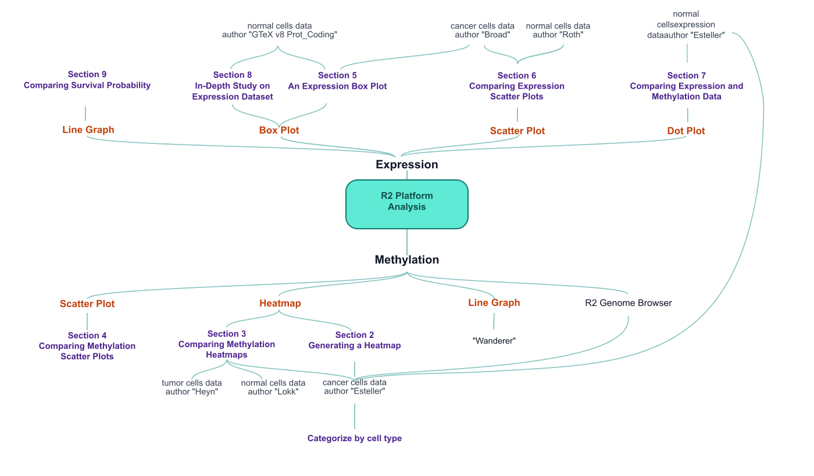

[**Figure 1-1: Structure of the R2 Platform manual and the relationships between its section**](_static/images/Methylation/fig1-1.png)

## Generating a Heatmap

For analysis of the human methylome in order to study the potential tumor suppressors, we are using the R2 platform and the methylation datasets available in R2. R2 hosts many methylome datasets generated on Illumina platforms, including the 450K, EPIC, and EPIC v2 arrays, which are bisulfite treatment based. It determines methylated versus unmethylated DNA target regions using probes (oligonucleotides). For each region, a Heatmap is a useful tool for observing the methylation status of individual probes and how isoforms cluster according to their degree of methylation.

As an example for this manual, the first exercise will show how to generate a Heatmap with an Illumina methylation array dataset on R2. This dataset belongs to a study that is called "A Landscape of Pharmacogenomic Interactions in Cancer" and can be found in R2 as a "cell line" dataset by the author name **Esteller**. 
Also, this dataset shows what the Heatmap looks like for highly proliferating cancer samples. Later, in *Section 3 Comparing Methylation Heatmaps*, the Heatmap from this example will be compared with two other examples from different datasets. The tutorial's scope will then be expanded to more complex use cases, such as a tutorial on the "Expression" dataset.

With the above dataset information, the platform user takes the following steps to create the Heatmap:

**1)** After login to the R2 Platform [1], click the text box under Field 2 "Select a dataset for analysis" (in Figure 2-1).

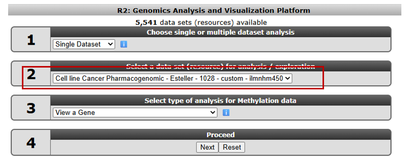

[**Figure 2-1: Click in box 2 to change the dataset**](_static/images/Methylation/fig2-1a.png)

**2)** On the pop-up grid box (in Figure 2-2), click in Column {Category} on "Select Filter" to uncheck "Select all" and only select "cell line". In the text field of Column {Tissue/Tumor}, type "cancer pharmacogenomic"  or type "Esteller" in Column {Author}. One can confirm the right dataset by referring the description table below as shown in Figure 2-2. When the dataset is found, click anywhere on the row of the dataset and click "Confirm selection". (in Figure 2-3) Leave all other settings at their default and click "Next" on the main page to proceed. (in Figure 2-4)

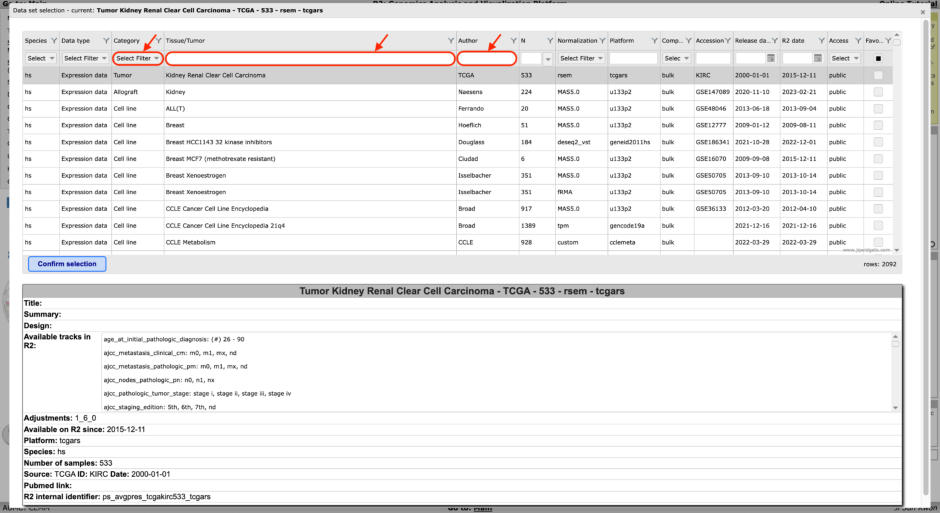

[**Figure 2-2: Search and select a dataset in the grid**](_static/images/Methylation/fig2-2.jpg)

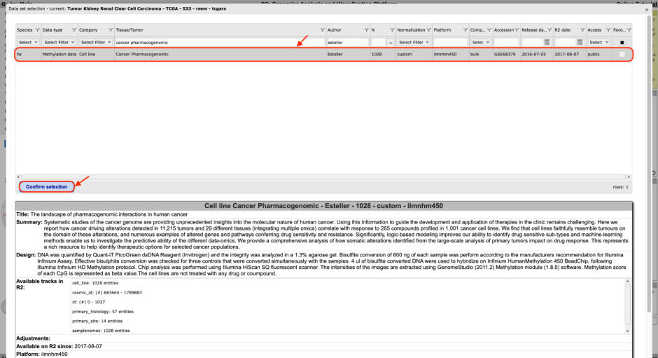

[**Figure 2-3: Select and confirm**](_static/images/Methylation/fig2-3.jpg)

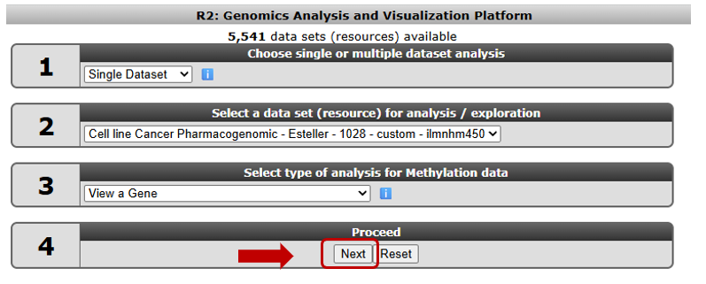

[**Figure 2-4: Main menu (with selected dataset)**](_static/images/Methylation/fig2-4a.png)

**3)** In the adjustable settings menu you enter the gene of interest gene / methylation reporter to further investigate. (in Figure 2-5). As an example, "CLDN10" (Claudin 10) is entered in Field {Gene / Met_id }, and the suggested Met_id that pops up is selected by a mouse click. CLDN10 is a candidate tumor suppressor currently being studied in our lab [4] and strongly hypermethylated across cancer types. For your purposes please use the name/abbreviation of your candidate gene of choice and select a Met_id by mouse that pops up. Click "Submit" to generate a YY-plot. 

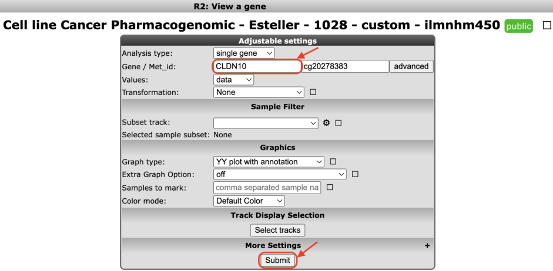

[**Figure 2-5: Adjustable settings menu on the dataset**](_static/images/Methylation/fig2-5.png)

In case that a gene name of interest is uncertain, one can find the exact gene name of interest by a methylation ID obtained from UCSC Genome Browser. This search process is described in *Appendix 12.1 Finding a Gene of Interest* of this manual.

A YY-plot is generated with the samples (cell lines) on the X-axis ordered by β-value from low to high, and the CLDN10 methylation β-value on the Y-axis (Figure 2-6). The probe with the highest mean is selected by default.

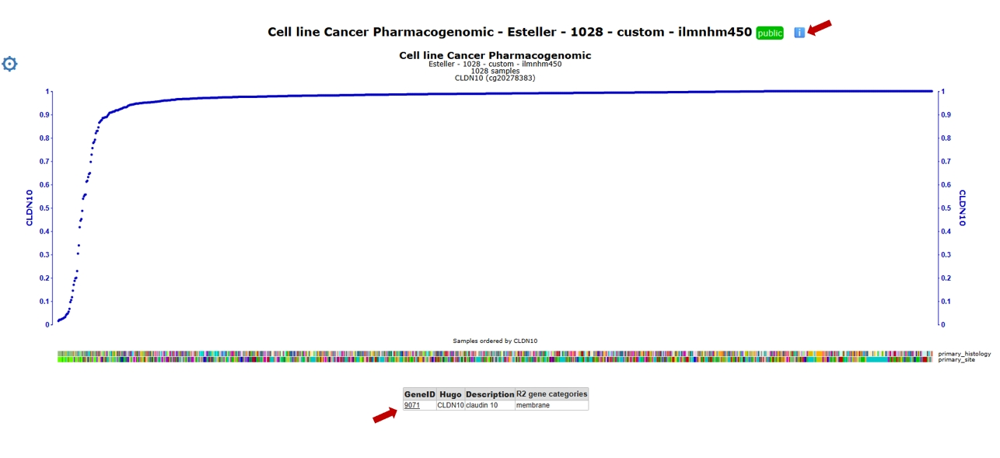

[**Figure 2-6: CLDN10 methylation across 1028 cancer cell lines, ordered by methylation level**](_static/images/Methylation/fig2-6.jpg)

<!-- This text is commented out and won't be visible

The vast majority of the 1028 cancer cell lines thus have a CLDN10 beta value close to 1, meaning the CLDN10 gene is heavily methylated in most of these cell lines (which typically correlates with gene silencing).
--> 

Two additional features on this webpage come in handy: By clicking on the exclamation mark right in the graph title (indicated with the red arrow Figure 2-6), the user could see the description of the dataset as in Figure 2-7. Next, if the user wants to grasp the basic knowledge on biological or medical terminologies, one could click on the GeneID table link depicted below the YY-plot and read the definition of the terminologies on the National Library of Medicine (NLM) website. (in Figure 2-8)

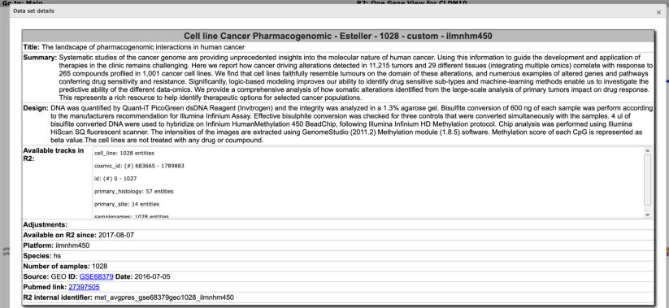

[**Figure 2-7: Description of the chosen dataset**](_static/images/Methylation/fig2-7.jpg)

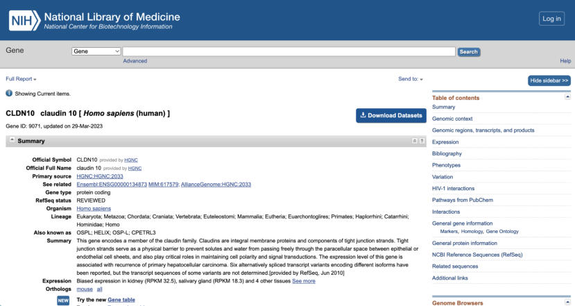

[**Figure 2-8: CLDN10 gene entry in the NCBI Gene database**](_static/images/Methylation/fig2-8.jpg)

If the user is interested in looking into a table of each sample and their methylation values, go to the page where the YY-plot is generated and click "View datatable" (in Figure 2-9).

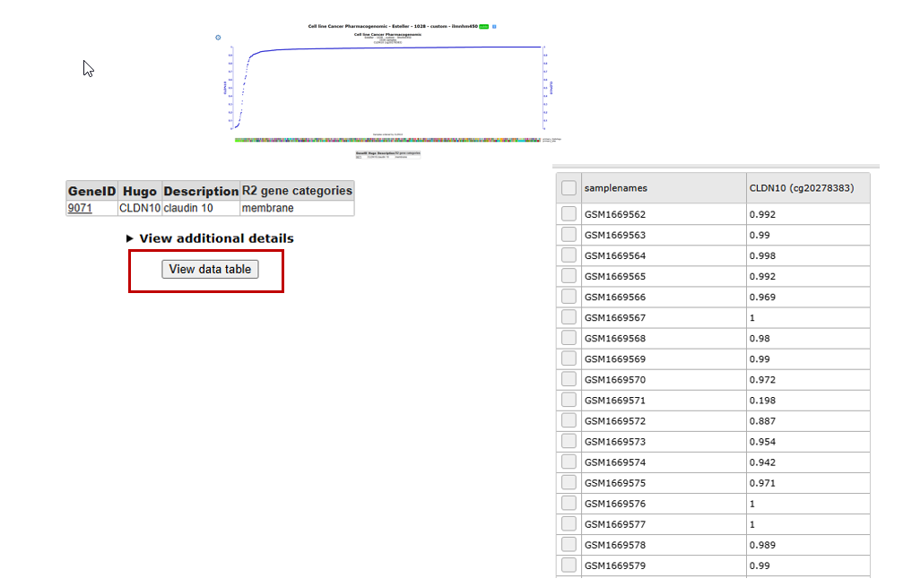

[**Figure 2-9: The table of sample methylation values**](_static/images/Methylation/fig2-12a.png)

**4)** As a next step, click on "View additional details" small triangle on the same page below the previous YY-plot (in Figure 2-10). Then by clicking the "view all" link as shown in Figure 2-11, the embedded Heatmap and R2 Genome Browser of the chosen dataset will open in a new screen.

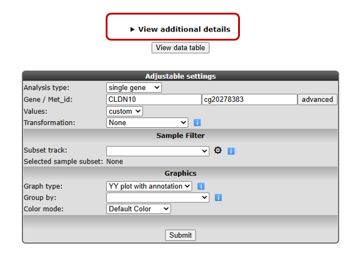

[**Figure 2-9: View additional details (clickable)**](_static/images/Methylation/fig2-9a.png)

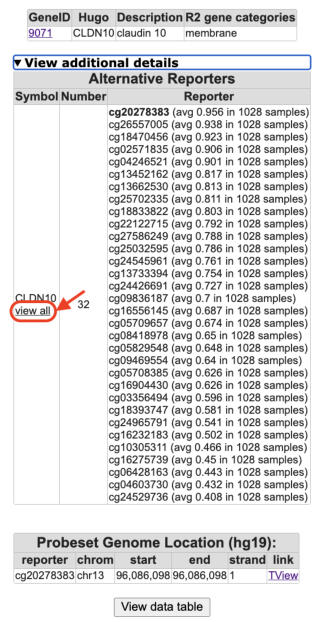

[**Figure 2-11: View all reporters details**](_static/images/Methylation/fig2-10.jpg)

**5)** Figure 2-12 shows the generated Heatmap. The Heatmap displays, for each reporter hybridizing to a specific CpG site within the CLDN10 gene locus, the methylation level (β-value): reporters on the rows (their names on the right side) and samples on the columns, with color representing the β-value.  
The methylation score is colored by yellow (near to score 0, unmethylated), black in the middle (partially methylated, 50%), and blue (near to score 1, fully methylated).  

Above the heatmap, two annotation tracks are visible: primary_histology and primary_site. As shown in Figure 2-12, certain methylation patterns can be detected across different tissue types. For example, kidney cell lines are marked in green in the primary_site track above the Heatmap. Several kidney cell lines are clustered together, and reading down their columns reveals a shared methylation pattern across probes: probe cg13733394 appears yellow, indicating low methylation, while probe cg18470456 appears blue, indicating high methylation.

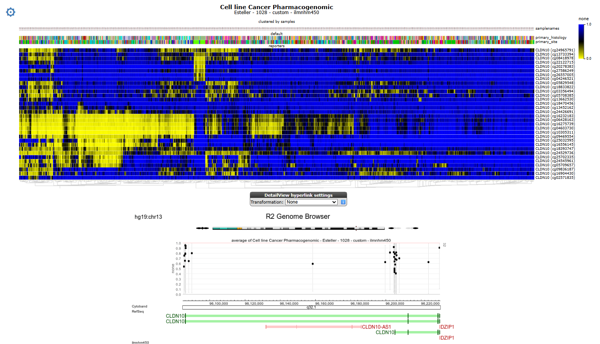

[**Figure 2-11: The Heatmap of the chosen dataset**](_static/images/Methylation/fig2-11a.png)

If the user is interested in looking into a table of each sample and gene name of the dataset. Go to the page where the YY-plot is generated and click view datatable (in Figure 2-12)

[**Figure 2-12: The table of sample and reporter names of the chosen dataset**](_static/images/Methylation/fig2-12a.png)

**6)** Below the heatmap, the average β-value (Y-axis) for each probe (the dots) is depicted against their position on the chromosome (X-axis). Clicking on the blue "View chr[...] Genomebrowser" link will open an interactive view of the same location on the genome, as shown in Figure 2-13.

The colored horizontal ideogram just below the Genome Browser title shows the full chromosome (chr13), with a small vertical line (marked with the red circle in Figure 2-13) indicating where the current zoomed-in region falls within.

In the scatter plot underneath the ideogram, the Y-axis shows that same scatterplot with averaged methylation β-value per CpG probe (averaged across all samples in the dataset), and the X-axis shows the genomic position in base pairs. Hovering over the dots displays detailed information, such as the probe name. These probes are the same probes as where visible on the Y-axis of the Heatmap in teh previous tab. The range of the minimum and maximum methylation β-values per probe is shown with the vertical gray lines in the diagram.

Underneath the averaged β-value scatterplot of the Esteller dataset, the Cytoband annotation shows the location on the chromosome. The letter "q" in the Cytoband label "q32.1" reveals that the gene is located on the chromosome's long arm. If it is located on the small arm of the chromosome it is labeled with "p" (petit).

The RefSeq track shows CLDN10 annotated as three separate isoforms, green colored: two almost identical isoforms spanning nearly the entire locus from the left and a second, and a shorter one positioned toward the right side. With this genomic context, we clearly see that the probes of the dataset are mainly clustered in two locations: one around the promotor area of the first two, long spanning isoforms, and one around the third, smaller isoform on the right.
The CLDN10-AS1 antisense transcript and the neighboring DZIP1 gene on the right are shown in red, indicating that both are encoded in the reverse direction. Depending on the array platform, not every isoform of a gene is necessarily covered by probes.

In the current dataset name, *Cell line Cancer Pharmacogenomic - Esteller - 1028 - custom - ilmnhm450*, the final segment, *ilmnhm450*, identifies it as generated on the Illumina HumanMethylation450 (450k) BeadChip microarray. The ilmnhm450 track beneath the RefSeq track maps this platform's CpG probe positions onto the reference genome.   
  
More details regarding R2 Genome Browser could be found on R2 Platform online tutorial under Section 17: Using the R2-Genome browser. [2]

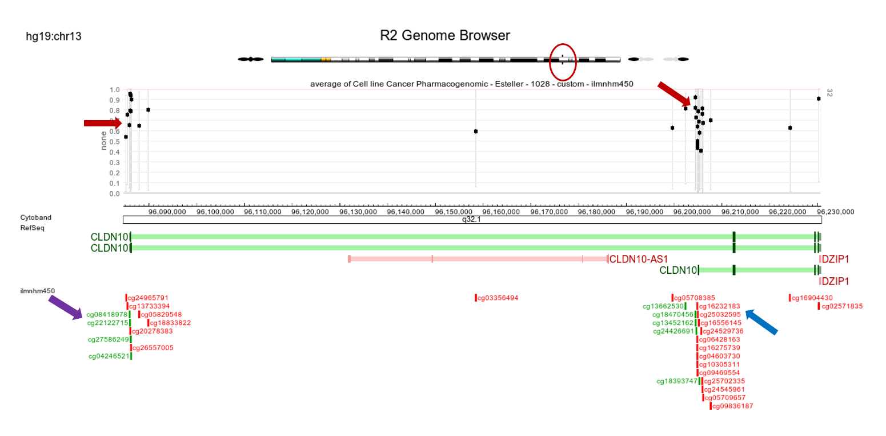

[**Figure 2-13: R2 Genome Browser of the CLDN10 locus**](_static/images/Methylation/fig2-13b.png)

Now, if the user is interested in investigating certain probes from the dataset, the next steps could be done additionally (marked in red in Figure 2-13).

**6-1** Hovering over a probe in the ilmnhm450 track opens a message box with details about that probe, including its genomic position, strand, and a gene-region annotation — for example, "1stExon;5UTR" for cg08418978. The latter annotation indicates that the probe lies just downstream of the transcription start site, and is associated with transcriptional regulation (as are other promoter-associated CpG gene-region annotations, such as TSS1500, TSS200).

Using this message box annotation, three promoter-associated CpGs of the different isoforms are selected as interesting: cg08418978 and cg22122715 (left, purple arrow) and cg25032595 (blue arrow). In the previous tab with the Heatmap, you can focus on them only, by checking their boxes in the "Select reporters" table and then hitting the Next button.

**6-2** Figure 2-14 shows the updated Heatmap and R2 Genome Browser after the previous step (Step 6-1). The user could investigate the methylation profile of the three probes. Back to the example of "kidney" cell type (indicated in green by the "primary_histology" annotation above the Heatmap), the user sees two probes ("cg08418978", "cg22122715"; yellow in Heatmap) are unmethylated but Probe "cg25032595" (blue in Heatmap) is methylated.

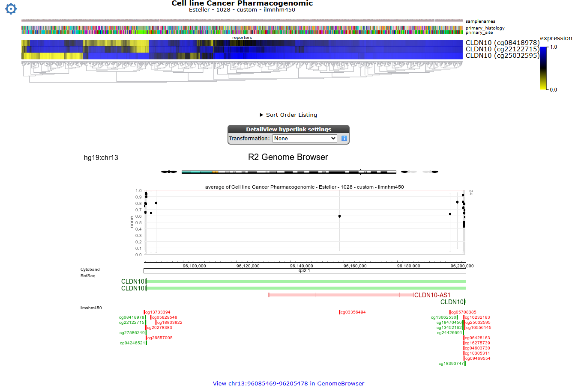

[**Figure 2-14: The updated Heatmap and R2 Genome Browser of the chosen dataset for a subset of CpG probes chosen**](_static/images/Methylation/fig2-14a.png)

---

## Comparing Methylation Heatmaps

To gain a clearer understanding of how to interpret this Heatmap, two further methylation datasets will be compared with the "Esteller" dataset. As mentioned earlier in *Section 2 Generating a Heatmap* of this manual, this "Esteller" dataset is based on highly proliferating cancer cell lines. The second dataset is based on primary tumors snd the third dataset is based on normal control tissue samples.  
In this section, three Heatmaps generated from these three datasets are to be compared to show the difference in methylation tendency for a chosen gene of interest. Below e use again CLDN10 for these comparative methylome heatmaps, but you could also look into another gene, such as the tumor suppressor ZAR1 [5].

To create the second (author "Heyn", category "tumor") and the third (author "Lokk", category "normal") heatmaps, repeat the steps from 1) to 5) in *Section 2 Generating Heatmap* of this manual. The following Figure 3-1 is a collection of generated heatmaps of the three datasets ("Esteller" on the bottom, "Heyn" in the middle, "Lokk" on the top). As shown with colors in Figure 3-1, the "Lokk" Heatmap of CLDN10 is rather uniform with a CLDN10 CGI (or CpG-Island) that is unmethylated, whereas the CGI surrounding regions are methylated (for all samples).

When looking at the Heatmap from primary tumors "Heyn", some degree of methylation appears across the CLDN10 CGI, as we can see from the black colored cells in that area of the heatmap. This methylation suggests that the tumor samples started to inactivate the tumor suppressor.

Next, the "Esteller" Heatmap includes even more methylation for the CLDN10 CGI than the "Heyn" Heatmap. Much more blue colors are observed throughout the heatmap rows, which makes sense that highly proliferative cancer cells have more CLDN10 inactivated than the less proliferative tumor cells. By comparing the later "Esteller" Heatmap with "Lokk" and "Heyn" Heatmaps, one could see the gradual changes in the methylation tendency for the gene of interest during carcinogenesis.

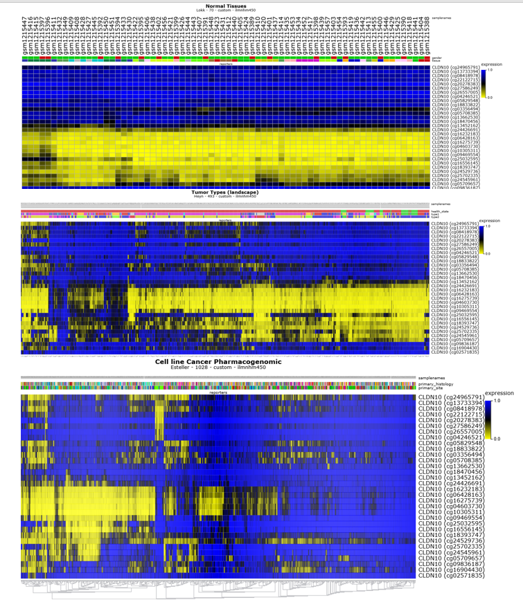

[**Figure 3-1: The methylation Heatmaps from datasets "Lokk" (on the top), "Heyn" (in the middle) and "Esteller" (on the bottom)**](_static/images/Methylation/fig3-1a.png)

A single Heatmap can be further categorized and compared by each cell type (by different tissues). With the example of "Lokk" Heatmap (normal cell), the following additional steps could be done after Step 5) to categorize per cell type:

Scroll down to the "Gene" menu on the bottom of the Heatmap webpage. Select "a track" in Field "Order samples by" and "tissue (17 cat)" in Field "Ordering track" (in Figure 3-2) and click "Next". This allows the Heatmap to be organized by cell type.

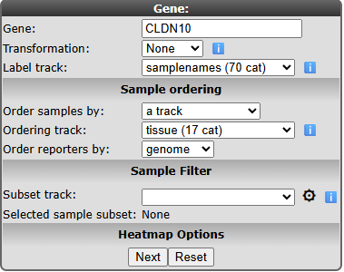

[**Figure 3-2: The table option on the Heatmap webpage**](_static/images/Methylation/fig3-2a.png)

Figure 3-3a1 is a categorized Heatmap by cell type. If you hover over the small annotation boxes on the tissue annotation track the information box shows the specifications regarding the annotations/tracks such as tissue type and gender of each sample. For example, Sample "gsm1215435" came from gallbladder tissue of a male as shown in Figure 3-3a1.

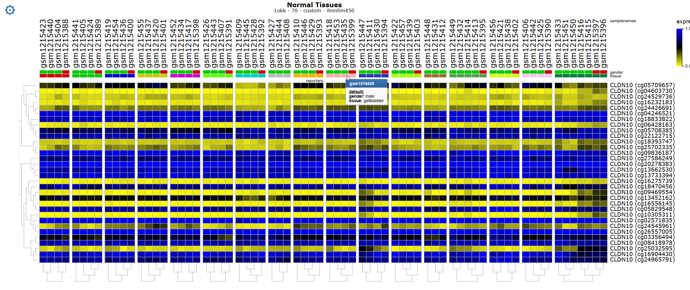

[**Figure 3-3a1: Categorized heatmap - Lokk normal tissues by tissue type**](_static/images/Methylation/fig3-3a1.png)

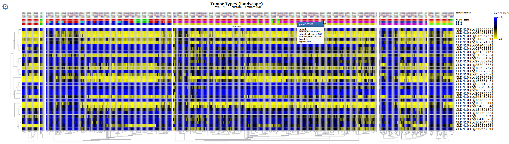

[**Figure 3-3a2: Categorized heatmap - Heyn Tumor types**](_static/images/Methylation/fig3-3b1.png)

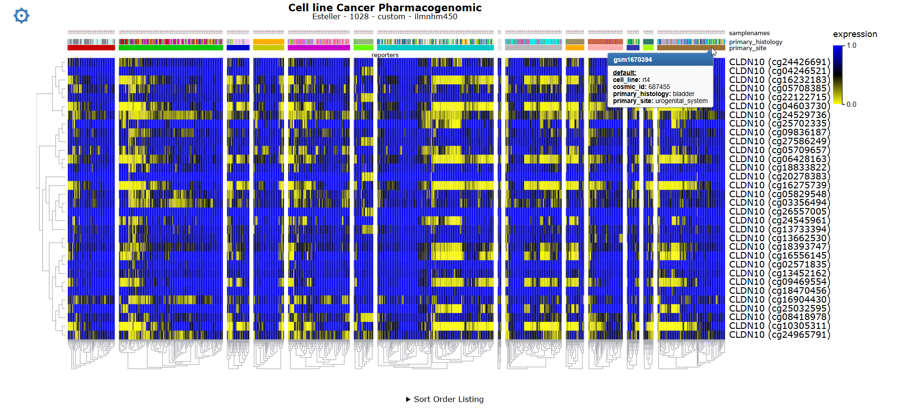

[**Figure 3-3c: Esteller cell line cancer**](_static/images/Methylation/fig3-3c1.png)

---

## Shortcut of Generating a Heatmap

The user could take the following steps as a shortcut to generate a heatmap:

**1)** On the main page, select the "Esteller" dataset again in Field 2, and this time choose "View all Met_ids for a Gene (Heatmap)" in the Field 3 dropdown menu. Leave all other settings at their default and click "Next" on the main page to proceed (in Figure 4-1).

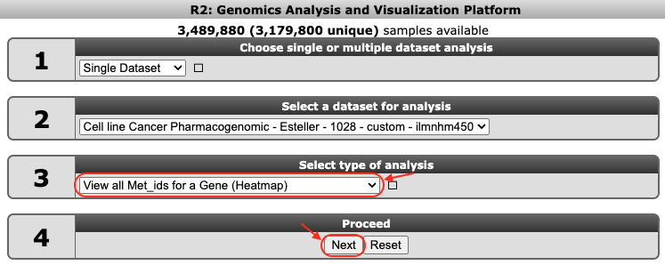

[**Figure 4-1: Main menu**](_static/images/Methylation/fig4-1.png)

**2)** On the next webpage "View all reporters for a gene", the user could type a gene of interest to generate a Heatmap. As an example, "CLDN10" (Claudin 10) is written in Field {Gene} as shown in Figure 4-2. Click "Next" to execute a Heatmap.

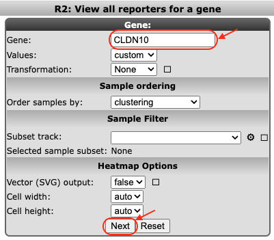

[**Figure 4-2: "View all reporters for a gene A" menu**](_static/images/Methylation/fig4-2.jpg)

**3)** Figure 4-3 shows the generated Heatmap. One could notice that the Heatmap in Figure 4-3 looks the same as the Heatmap in *Section 2 Generating Heatmap*.

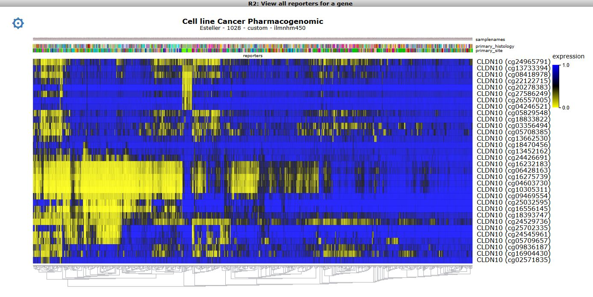

[**Figure 4-3: The Heatmap of the chosen dataset**](_static/images/Methylation/fig4-3.jpg)

The user could also generate a Heatmap by cell type from dataset "Esteller" like the Heatmap in *Section 3 Comparing Methylation Heatmaps*, with the following steps:

**4)** Repeat Step 1) as in Figure 4-1. On the website "View all reporters for a gene", type "CLDN10" (Claudin 10) in Field {Gene}. To create a Heatmap by cell type, select "a track" in the Field {Order samples by} and "primary_site (14 cat)" in the Field {Ordering track}. Click "Next" to execute a Heatmap by cell type (in Figure 4-4).

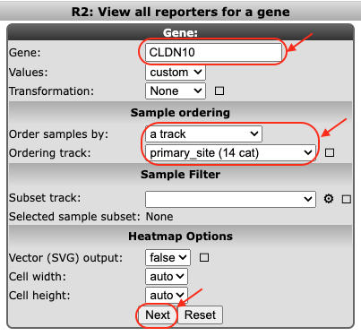

[**Figure 4-4: "View all reporters for a gene" menu**](_static/images/Methylation/fig4-4.jpg)

Figure 4-5 is a categorized Heatmap by cell type. This Figure is the same as the Heatmap from the dataset "Esteller" in Figure 3-1 in *Section 3 Comparing Methylation Heatmaps*.

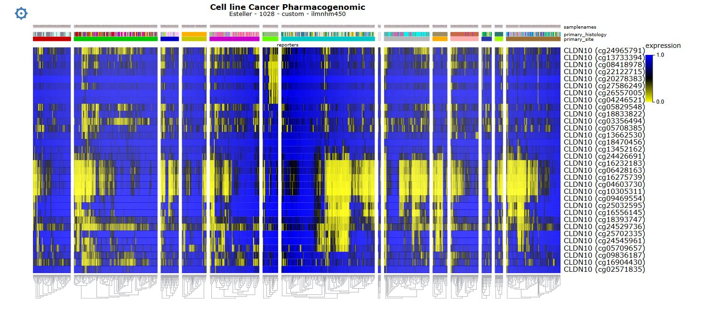

[**Figure 4-5: Categorized Heatmaps by cell type from dataset "Esteller"**](_static/images/Methylation/fig4-5.jpg)

---

## Multiple datasets overview with methylation data: 

With the megasampler module you can investigate the expression levels of a gene in the large collection of datasets R2 is hosting. For this course  we look at the β-value (ratios) of the methylation sets R2 is hosting. One restriction should be noticed, only datasets with the same platform can be inspected together. In case you select the 450k type (Illumina) platform you can only select datasets of the same platform. 

The user could also compare the methylation level of the same reporter (probe) from multiple datasets. In this section, the same three datasets as *Section 3 Comparing Methylation Heatmaps* are used ("Lokk": normal cells, "Heyn": tumor cells, "Esteller": cancer cells). The user takes the following steps to create the scatter plots of the same probe methylation dataset:

**1)** Choose "Across Datasets" under Field 1 checkbox. Leave all other settings at their default and click "Next" on the main page to proceed (in Figure 5-1).

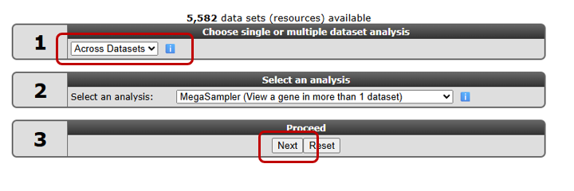

[**Figure 5-1: Main menu**](_static/images/Methylation/fig5-1a.png)

**2)** On the next webpage "MegaSampler", the user could change the settings in relation to the data type or preset/default (either in a global or in a group level) as shown in Figure 5-2. Select "hs, ilmnhm450, custom" on Field "Type of data" to see methylation datasets on the list of the next page. Leave other settings at their default and click "Next" to proceed.

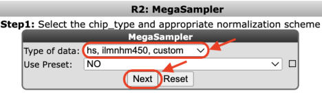

[**Figure 5-2: "MegaSampler" menu**](_static/images/Methylation/fig5-2.jpg)

**3)** On the next webpage, type "CLDN10" in the Field "Gene / Reporter" and click "Select Datasets" button. (in Figure 5-3)

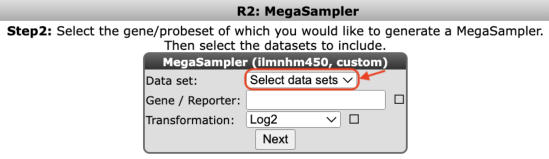

[**Figure 5-3:  "MegaSampler" menu**](_static/images/Methylation/fig5-3a.jpg)

**4)** In the grid box, type the author name "Lokk" (normal cells) on Column {Author} and select the datasets by checking the checkbox in front. Repeat the same steps for the datasets with the author names "Heyn" (tumor cells) and "Esteller" (cancer cells) respectively. Only now that you have checked the boxes of all three datasets, click the "Confirm selection" button to proceed (as shown in Figure 5-4).

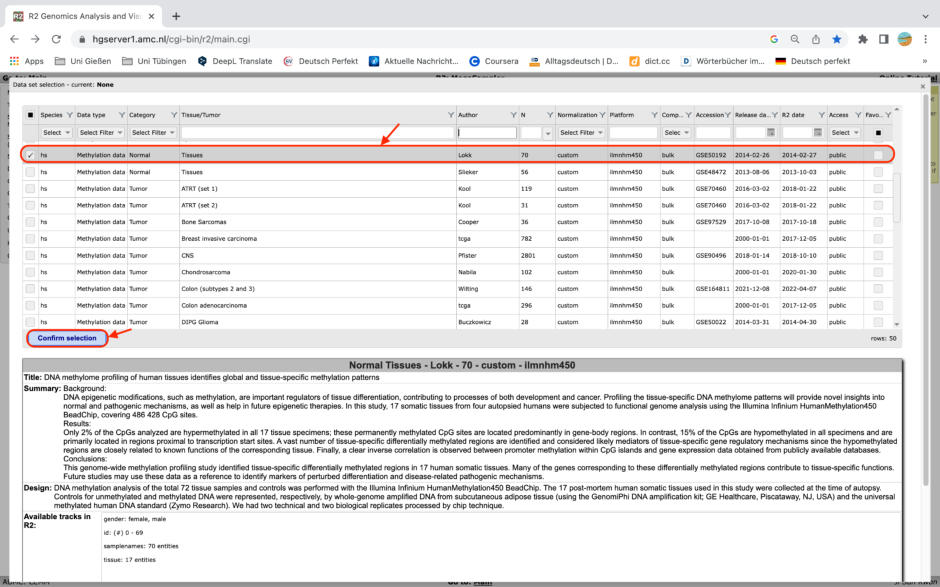
[**Figure 5-4: Data selection menu**](_static/images/Methylation/fig5-4.jpg)

**5)** By the previous Step 4), the user could see the data has reflected in the setting as shown in yellow in Figure 5-5. Type "CLDN10" in Field "Gene/Reporter" and choose "None" in Field "Transformation". Click "Next" button to proceed.

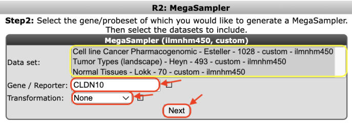

[**Figure 5-5: MegaSampler menu reflected the selected datasets**](_static/images/Methylation/fig5-5.jpg)

**6)** Look at the three Heatmaps produced from *Section 3 Comparing Methylation Heatmaps* to find a probe name from the CGI (CpG Island) observed in yellow, e.g."cg16556145" or "cg25032595". In Figure 5-6, the two probes "cg25032595" and "cg16556145" are marked in red in the "Esteller" dataset.

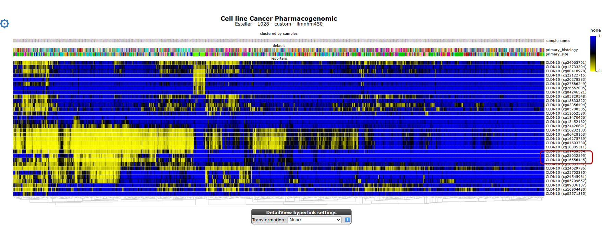
[**Figure 5-6: Probe location in the "Esteller" Heatmap**](_static/images/Methylation/fig5-61.png)

In the probe table of the Megasampler select the probe, e.g. "cg16556145" or "cg25032595" as shown on the left and right side in Figure 5-7 respectively. In "Adjustable settings" in Figure 5-8, the user could change the order of the selected datasets. Change the order as follows, if they aren't in the right order yet: "Lokk" as "1", "Heyn" as "2" and "Esteller" as "3" (in Figure 5-8). This setting lets datasets be compared: "Lokk" as the first dataset, "Heyn" as the second dataset and "Esteller" as the third order. Click "Submit" button to proceed. Repeat the same process for the second probe "cg16556145" as shown on the right in Table 5-7.

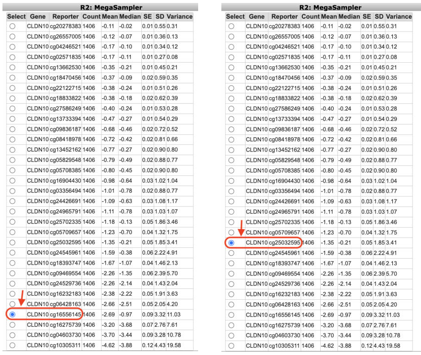

[**Figure 5-7: Selected probe (“cg16556145” on the left, ”cg25032595” on the right)**](_static/images/Methylation/fig5-7c.png)

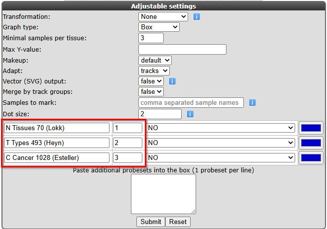

[**Figure 5-8: Adjustable settings menu**](_static/images/Methylation/fig5-8.jpg)

As a result, the first methylation scatter plot from Dataset "Lokk", "Heyn" and "Esteller" of Probe "cg25032595" are generated. When you place your mouse over one of the dataset boxes in the graph, summary statistics of the respective dataset pop up as shown in Figure 5-9. As expected, the methylation level of "Lokk" for normal tissues is lower than the methylation level of "Heyn" tumor cell lines. The methylation level of "Heyn" for tumor tissues is also lower than the methylation level of "Esteller" tumor cell lines. 

In the "One-Way Analysis of Variance (ANOVA)" table, it can be observed that the p-value is significant, as shown in red in animated figure 5-9. 

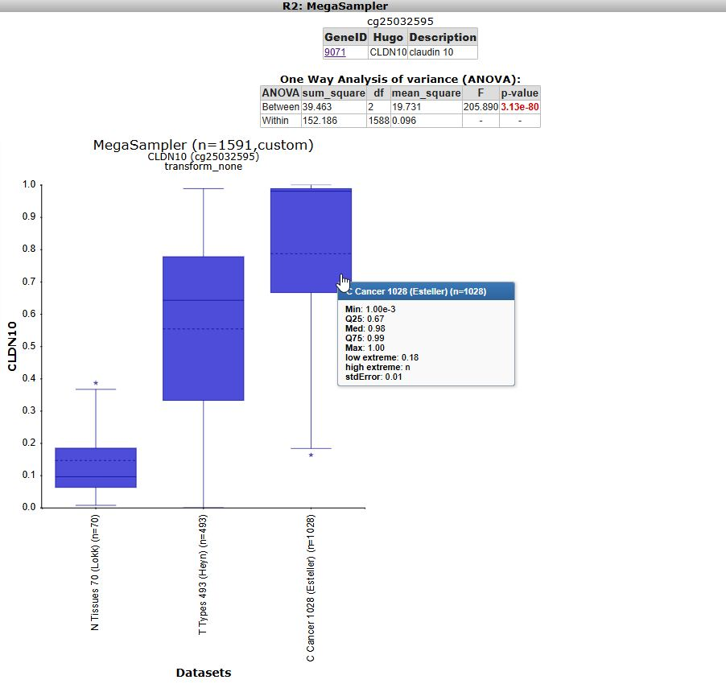

[**Figure 5-9a: Megasampler result for probe cg25032595 and the three datasets**](_static/images/Methylation/fig5-9a.jpg)

This page has two menus to adapt your graph as is shown in Figure 5-9b. First, next to the plot in the upper left corner, a clickable gear icon opens up a menu to adapt the looks of the graph interactively. You can play around with the settings to get a feel of how such changes can assist in obtaining new insights about your data. At the bottom of the page analysis settings can be changed.  

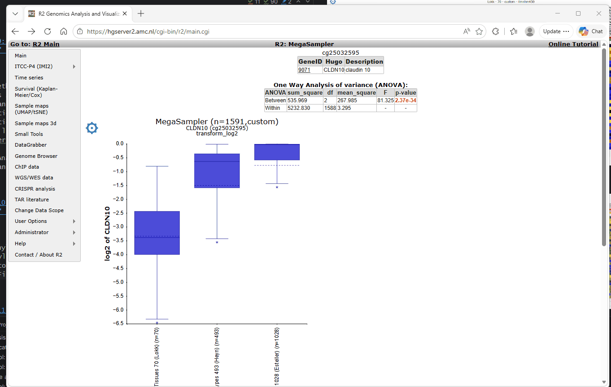

[**Figure 5-9b: ANOVA table and methylation graphs of the three datasets of Probe "cg25032595" (could be compared to expression plot Figure 7-5)**](_static/images/Methylation/megasampler3s.gif)

A second methylation scatter plot, this time with Probe "cg16556145" and with the same three datasets, can be generated as shown in Figure 5-10. As expected, the methylation tendency from the normal to cancer cells is increasing, as was observed in the scatter plot in Figure 5-9 as well. The methylation level "Lokk" for normal tissues is lower than the methylation level of "Heyn"  tumor cell lines (compare the summary statistics by hovering over the boxes). The methylation level of the primary tumor tissues in the "Heyn" dataset is also lower than the methylation level of the "Esteller" proliferative tumor cell lines.

In the "One Way Analysis of variance (ANOVA)" table, it is again observed that the p-value is quite significant as shown in red (in Figure 5-10).

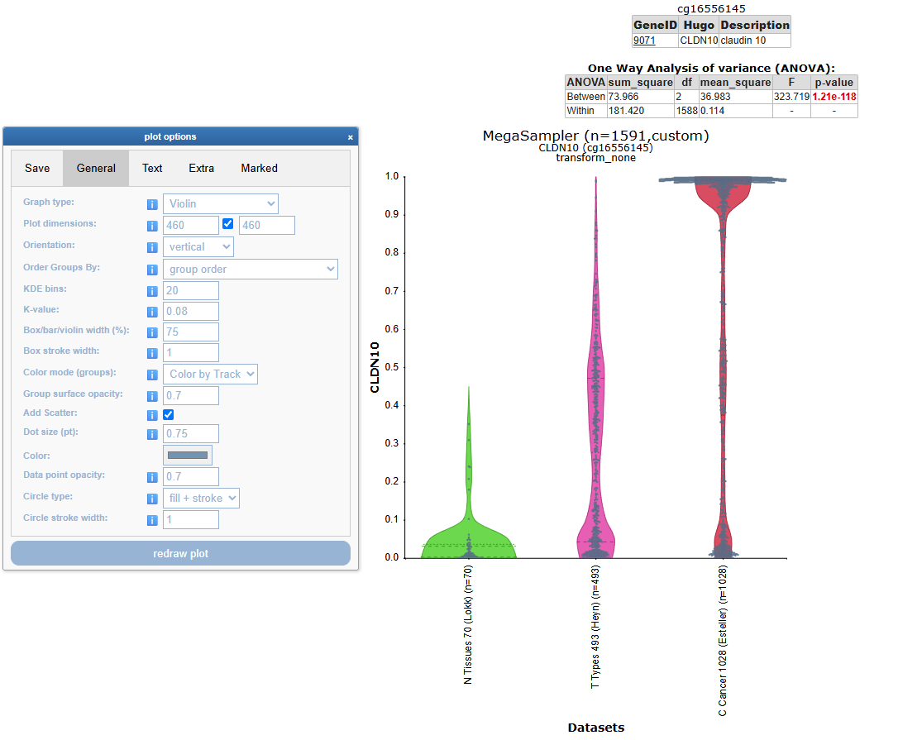

[**Figure 5-10: ANOVA table and methylation graphs of the three datasets of Probe "cg16556145" (could be compared to expression plot Figure 7-5**](_static/images/Methylation/fig5-10b.png)

The mean methylation difference between the two probes is shown more clearly in another online methylation analysis tool named "Wanderer" [6]. There is a greater methylation difference between normal and tumor cells at probe cg25032595 (marked in blue in Figure 5-11) than at probe cg16556145 (marked in red in Figure 5-11).

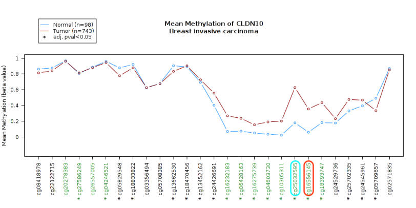

[**Figure 5-11: Wanderer mean methylation graph**](_static/images/Methylation/fig5-11.jpg)

More or less the same visualisation plot can also be generated in R2 with a little tweaking and playing using the numerous settings of the gear box for the graphical settings. Let's start with generating a heatmap for our gene CLDN10 as show here in fig 5-12 and scroll down to find the button "plot as view multiple reporter" and click. A box plot will be generated like the graph in 5-12.

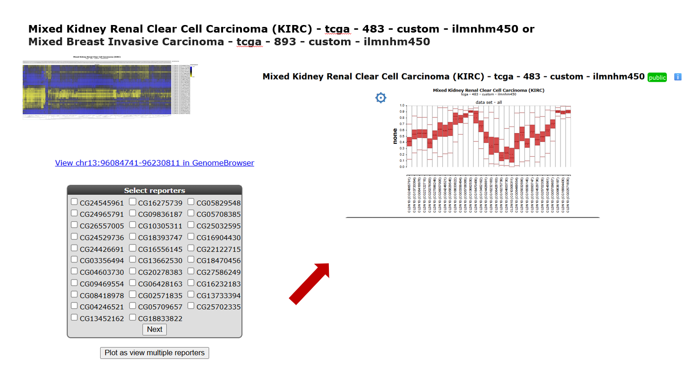

[**Figure 5-12: R2-"wanderer" for the individual reporters I**](_static/images/Methylation/fig5-12a.png).

In the General tab of the settings menu, to separate normal from tumor, we need to use the "tissue type" in the "Separation track" dropdown. It is also important to change "Handle groups by" to "Separated by track grouped by gene" and widen the plot in "Plot dimensions". Try to generate a plot similar to the one shown in the animated GIF below. This type of visualization can be generated for many datasets, allowing you to explore individual reporters for a given gene across grouped parameters.

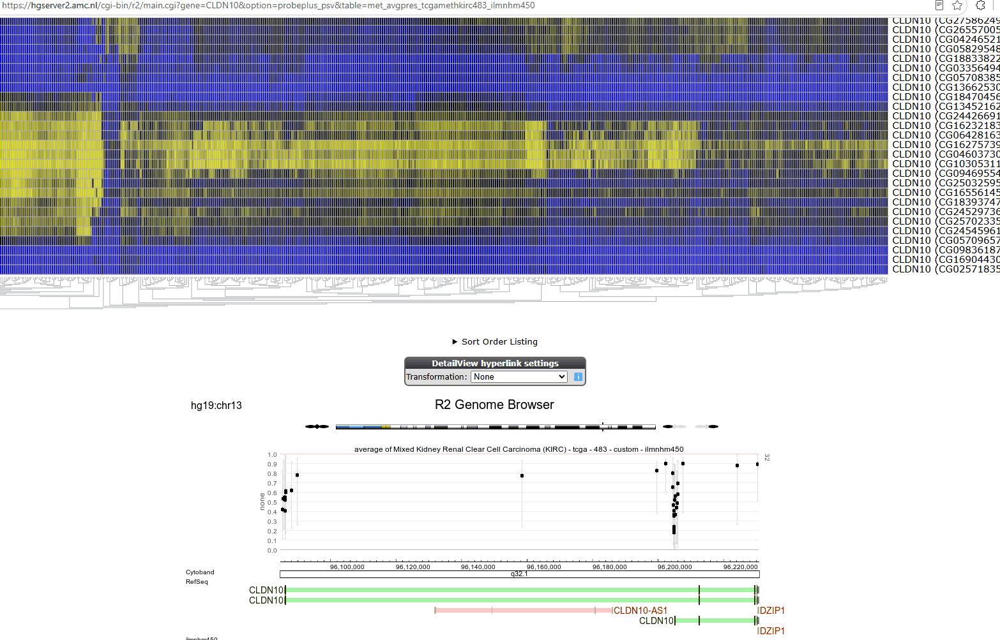

[**Figure 5-12: R2-"wanderer" for the individual reporters II**](_static/images/Methylation/wanderer.gif).

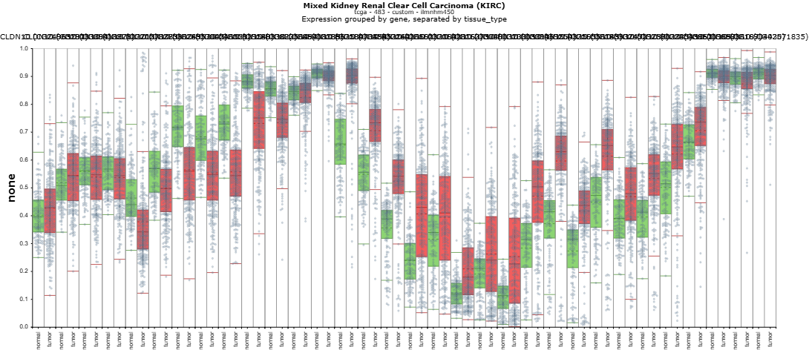

[**Figure 5-12: R2-"wanderer" result**](_static/images/Methylation/fig5-12b.png).

---

## An Expression Box Plot

A box plot of a single expression dataset could be drawn to see the expression level by a cell type and for your gene of interest. The user first takes the following steps to create the ordered sample plot of a single gene within an expression dataset:

**1)** Repeat the steps from 1) to 3) in *Section 2 Generating Heatmap* of this manual. But instead, choose the expression dataset by typing "Tissues GTeX v8 Prot_Coding" on Column {Tissue/Tumor} as shown in Figure 6-1.

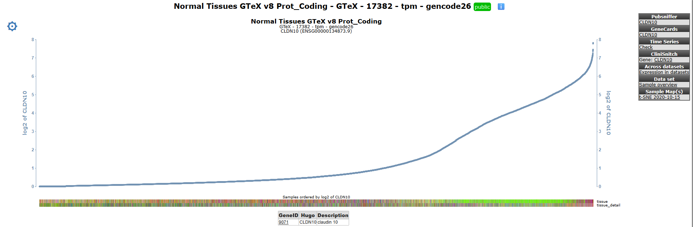

[**Figure 6-1: Change Dataset menu (after filter)**](_static/images/Methylation/fig6-1a.png)

**2)** Click on Link "CLDN10" under Field "CliniSnitch" which is located on the right  of the webpage (in Figure 6-2).

*R2 also offers a tool: CliniSnitch. CliniSnitch performs a context-dependent statistical test on each track to identify significant associations with the gene’s expression (i.e. different types of tests based on whether a track is numerical or categorical).*

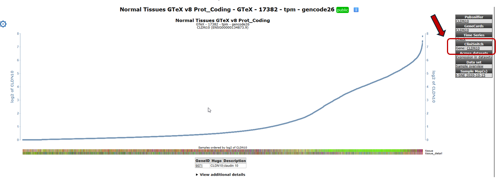
[**Figure 6-2: "CliniSnitch" link**](_static/images/Methylation/fig6-2a.png)

**3)** A next webpage will be opened in a new browser tab. The user could see that several tracks show a significant p-value. Click on the magnifying glass in front of "tissue" in the table

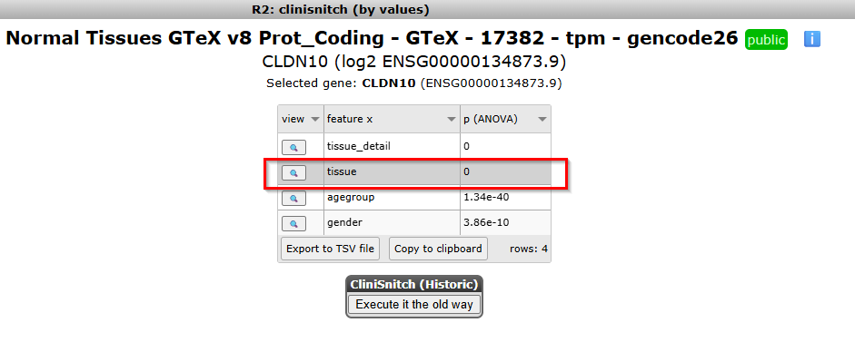

[**Figure 6-3: "View" a track with the magnifying icon in the table**](_static/images/Methylation/fig6-3a.png)

**4)** In a new browser tab, a box plot with scatter is shown. To visualize and sort better,  click on the gear icon on the left side of the plot. Change setting "Order Groups By" to "median (numeric Y)" and change "Color mode" to "Color by a Track", untick the checkbox at "add scatter" (Figure 6-4).

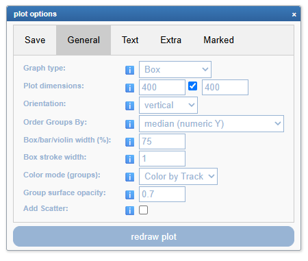

[**Figure 6-4: Table "Adjustable settings"**](_static/images/Methylation/fig6-4b.png)

As a result, a box plot of the expression dataset "Tissues GTeX v8 Prot_Coding" shows the expression distribution of CLDN10 across primary tissues. The user can see tissue types like "salivary_gland", "pancreas" and "kidney" on the right side of the graph, which exhibit higher expression levels of Claudin10 (Figure 6-5). 

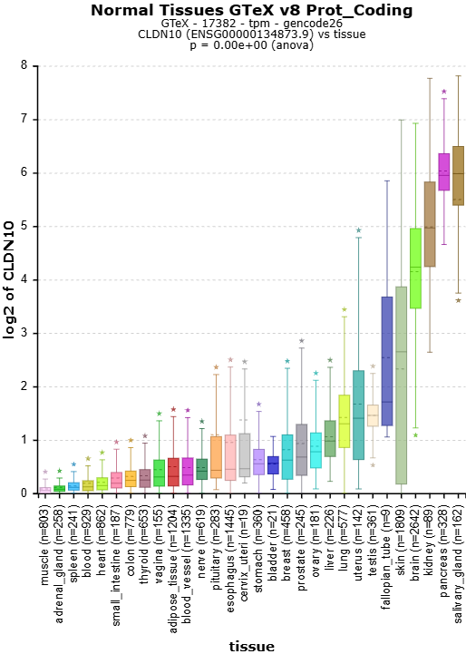

[**Figure 6-5: Expression log2 box plot plot of CLDN10 in normal tissues dataset "Tissues GTeX v8 Prot_Coding**](_static/images/Methylation/fig6-5a.png)

---

## Analysing plots

Now that we have studied methylation graphs, our scope has extended to the next topic, which is "**expression**" of our gene of interest across tissues/cancer types. Methylation and expression have a reciprocal relationship. From the previous *Section 3 Comparing Methylation Heatmaps*, it was observed that the methylation levels increase for certain genes during carcinogenesis. In contrast, expression levels are reduced. The "across dataset" module is a good tool to observe the difference in expression from different datasets. Please note as mentioned before only datasets of the same chiptype (*platform*) and normalization can be analyzed together. In this section, datasets with author name "Roth" and "Broad" are used to plot expression graphs. The platform user takes the following steps to create the expression graph:

**1)** Repeat the steps from 1) to 5) in *Section 5 Multiple datasets overview.* of this manual with a couple of changes: make sure that this time "Type of data" is set to "hs, u133p2, mas5.0" as indicated in figure 7-1; in the dataset selection, select two datasets, one with author names "Roth, n=504" (normal cells, in Figure 7-2) and the second with author "Broad" (cancer cells, in Figure 7-3). 

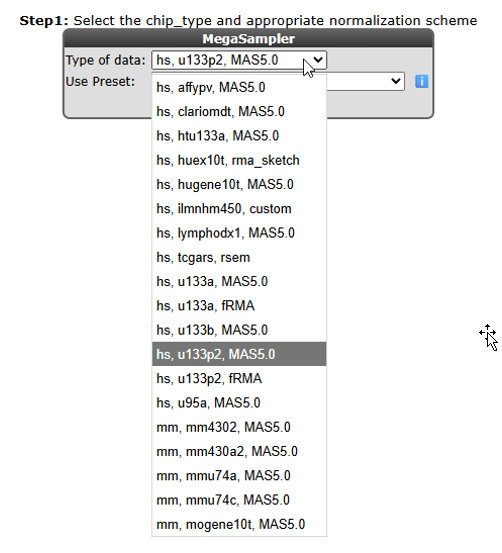

[**Figure 7-1: MegaSampler menu**](_static/images/Methylation/fig7-1a.png)

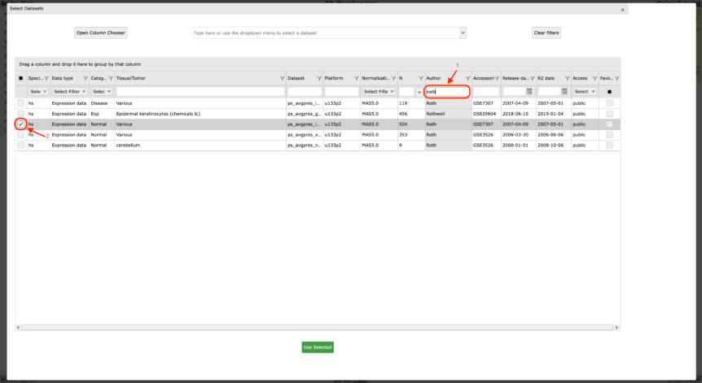

[**Figure 7-2: Data selection menu with the author name "Roth"**](_static/images/Methylation/fig7-2.jpg)

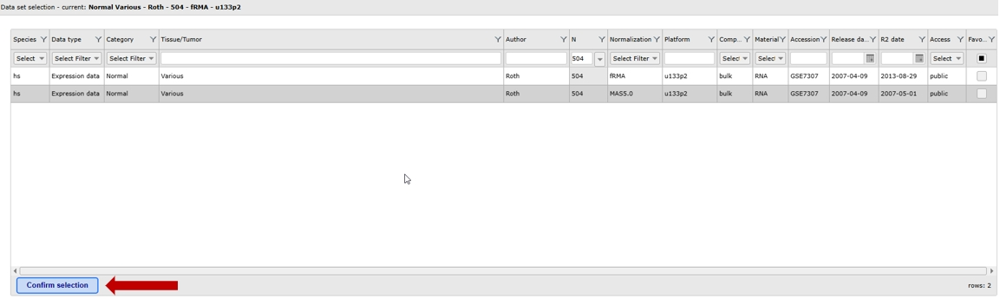

[**Figure 7-3: Data selection menu with the author name "Broad"**](_static/images/Methylation/fig7-3a.jpg)

**2)** In the "Adjustable settings" menu (Figure 7-4), the user could change the dataset order out of two datasets. Change the order of the datasets: "Roth" as "1" and "Broad" as "2". This setting lets "Roth" as the first dataset compared to "Broad" as the second dataset. Click "Submit" button to proceed.

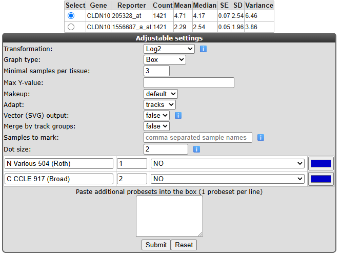

[**Figure 7-4: Adjustable settings menu**](_static/images/Methylation/fig7-4a.png)

As a result, a box plot with two groups is generated: one shows CLDN10 expression for the samples in the "Roth" dataset, and the other shows CLDN10 expression for the samples in the "Broad" dataset, as shown in Figure 7-5 (add scatter in the gear menu). As expected, the expression level of "Roth" for normal tissues is higher than the expression level of "Broad" cancer cell lines (again, you can view the summary statistics for each box by hovering over it). This matches the methylation pattern we saw earlier for promoter-associated CLDN10 probes: lower methylation in normal cells (thus higher expression) and higher methylation in cancer cells (thus lower expression).

In the "One Way Analysis of Variance (ANOVA)" table, the p-value (3.53e-172, highlighted in red), shows a highly statistically significant difference between the groups (Figure 7-5).

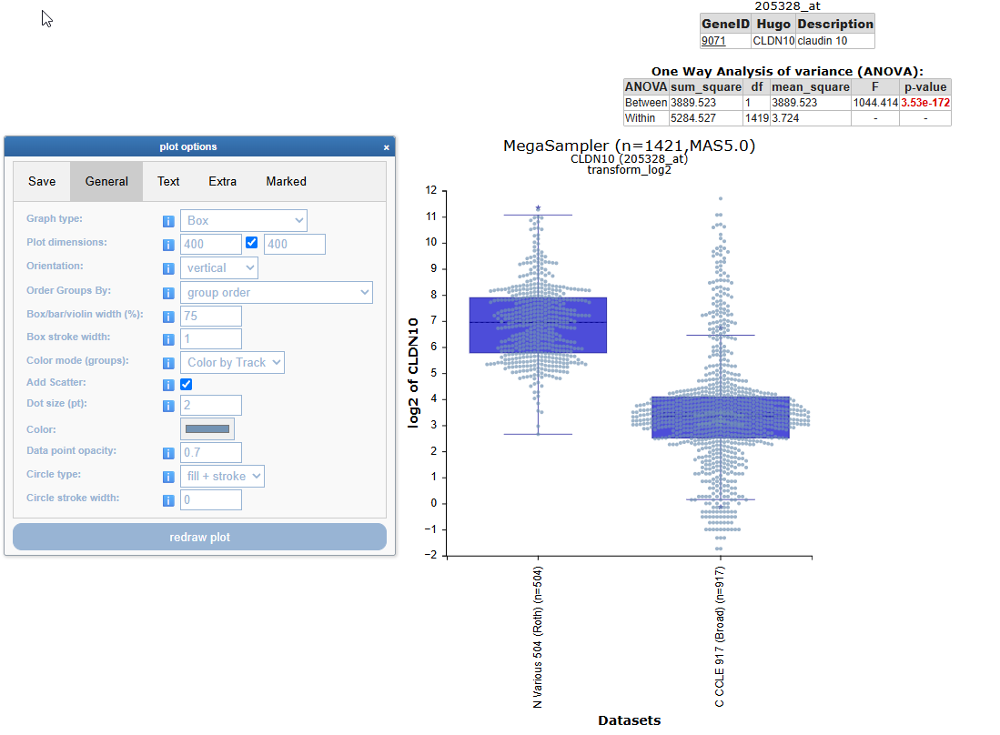

[**Figure 7-5: Box plot and ANOVA comparison of CLDN10 expression between normal tissue and cancer cell line datasets**](_static/images/Methylation/fig7-5a.png)

---

## Comparing Expression and Methylation Data

In the case where R2 hosts multi-omics data of the same samples, the user can also compare and correlate methylation and expression datasets by displaying both in one plot. In this section, the datasets "Garnett" (normal cells) and "Esteller" (cancer cells) are used. The user takes the following steps to create a correlation scatter plot of the methylation and expression datasets:

**1)** On the main page, choose "Across Datasets" in field 1 and "View a gene in two datatypes" in field 2. Click "Next" to proceed (Figure 8-1).

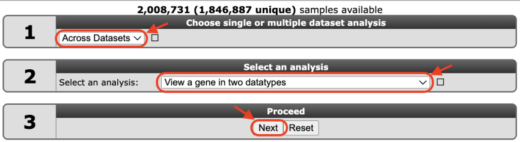
[**Figure 8-1: Main menu**](_static/images/Methylation/fig8-1.png)

**2)** In the menu "Select data sets to merge" of the next page, the user can choose the datasets and the X- and Y-axis of the scatter plot. As shown in Figure 8-2, select "cellline_cancer_pharmaco" in the field "Data set collection", "Methylation data - Cell line Cancer Pharmacogenomic - Esteller - 1028 - custom - ilmnhm450" in the field "Source data" and "Expression data - Cell line Cancer Drug (Sanger) - Garnett - 1017 - RMA - u219" in the field "Target data". Click "Select data sets" to proceed.

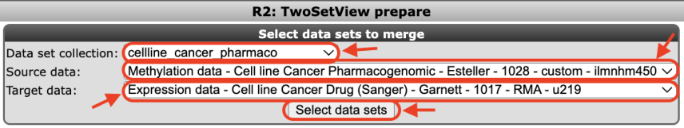

[**Figure 8-2:** Select data sets to merge menu](_static/images/Methylation/fig8-2.png)

**3)** The two probes from Step 6) in *Section 4 Multiple datasets overview with methylation data* ("cg25032595", "cg16556145") are to be observed. First we will generate the correlation scatter plot of the probe "cg25032595". In the table "Adjustable settings" menu, copy-paste "cg25032595" in the right box of the field "Gene / Met_id". Select the suggested "CLDN10 / cg25032595" with a mouse click. Now, in the field "Gene / Reporter", fill in "CLDN10" in the left field and click with the mouse on the suggested CLDN10/Reporter (Figure 8-3). The setting "Graph type" is set to "XY" Hit Submit.

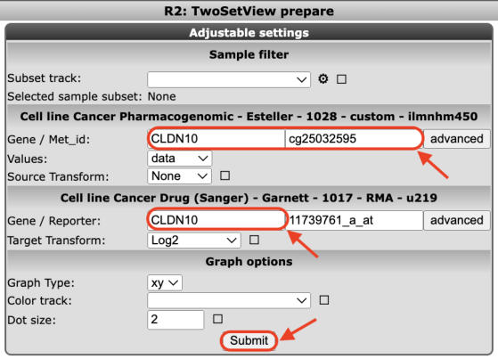

[**Figure 8-3: Adjustable settings menu (for Probe "cg25032595)**](_static/images/Methylation/fig8-3.jpg)

As shown in Figure 8-4, the user obtained a scatter plot, where each dot represents a sample with its methylation value of probe "cg25032595" of the methylation dataset "Esteller" on the X-axis and its expression value of the dataset "Garnett" on the Y-axis. There is a significant correlation between the two axes (shown by the p-value marked in red, Figure 8-4) supporting the idea of DNA hypermethylation decreasing gene expression.

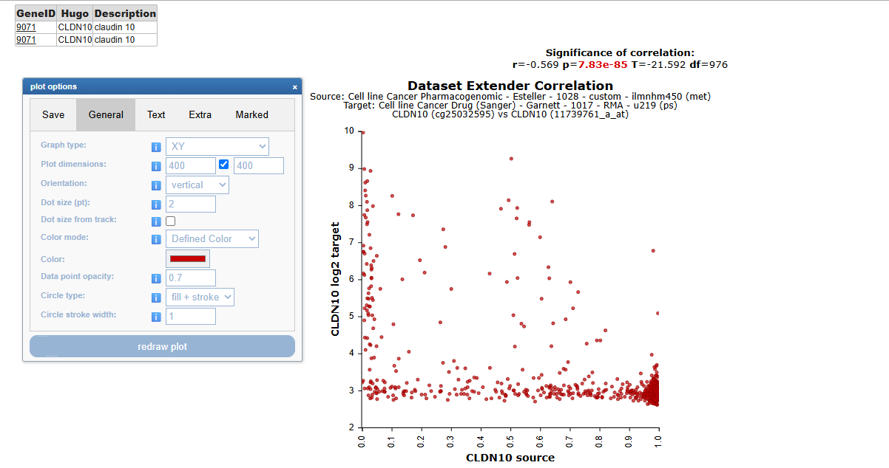

[**Figure 8-4: The dot plot of Probe "cg25032595" (could be compared to Figure 8-6)**](_static/images/Methylation/fig8-4a.png)

**4)** Repeat the steps from 1) to 3) of this section for the second Probe by typing "cg16556145" in the right box of Field "Gene / Met_id" (in Figure 8-5).

As shown in Figure 8-5, the scatter plot for the Probe "cg16556145" is generated. The significant correlation shows the same dot concentration pattern observed in Figure 8-4, indicating a negative correlation between the methylation and expression datasets.

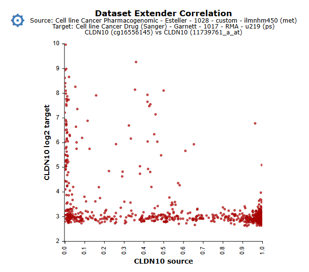

[**Figure 8-5: Comparative log2 dot plot cg16556145**](_static/images/Methylation/fig8-6a.png)

With a simple check in the gear menu, R2 allows box plots to be added along side the axis of the scatterplot, and histograms can be added as well (Figure 8-6). In some correlation scatter plot linear fit lines can highlight the relation between the axis very well. In this case, while a negative association is real and statistically significant, the shape of the scatter suggests the relationship is better described as "low methylation permits variable expression, while high methylation consistently suppresses it" rather than a simple linear decrease.

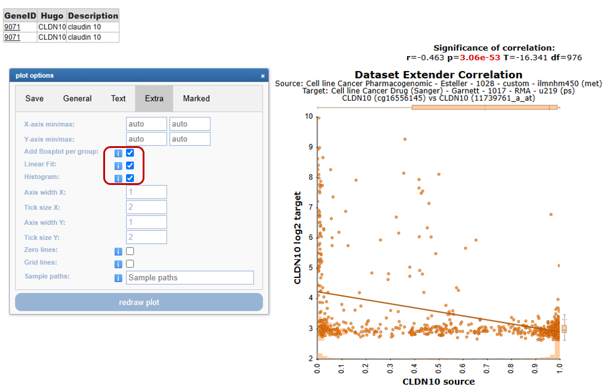

[**Figure 8-6: "Adjustable settings" menu (for Probe "cg16556145")**](_static/images/Methylation/fig8-5a.png)

---

## In-Depth Study on Expression Dataset

Let's go back to the dataset "Normal Tissues GTeX v8 Prot_Coding - GTeX - 17382 - tpm - gencode26". This dataset allows us to take a closer look at the expression of a gene of interest in selected tissues.  In this section, the tissue type "skin" is further investigated. The steps in *Section 6 An Expression Box Plot* are taken as a starting point, from which we continue with the following steps [8].

**1)** Scroll down to "Adjustable settings" after the expression box plot is executed. Set the field "Subset track" to "tissue (30 cat)". On the pop-up window, click the tissue type "skin (1809)" checkbox and "OK". Click "Submit" to proceed. (In Figure 9-1)

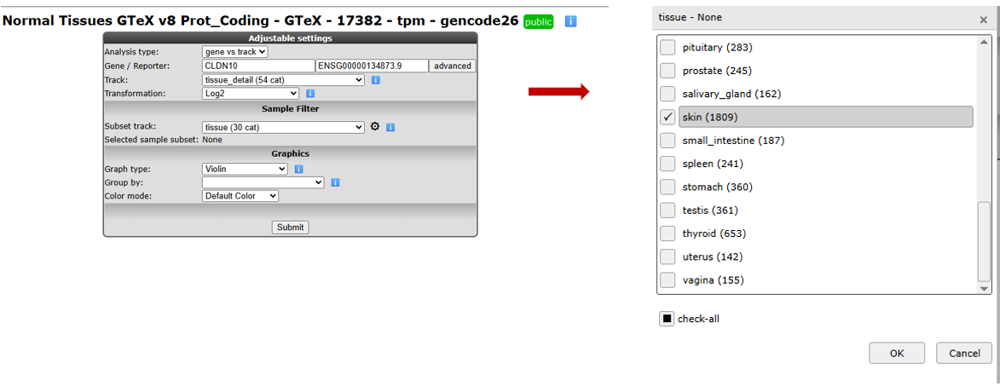

[**Figure 9-1: Adjustable settings menu**](_static/images/Methylation/fig9-1a.png)

**2)** After the box plot for "skin" is generated, the user can further investigate expression levels across skin types, such as differences between fibroblasts and normal skin. The "tissue_detail (54 cat)" track annotates such subtypes of the "tissue (30 cat)" category. In the "Adjustable settings" table, set both the "Track" field and the "Subset track" field to "tissue_detail (54 cat)". The user sees a pop-up window. Click on the checkboxes of these two skin types "cells_-\_cultured_fibroblasts (504)" and "skin_-\_not_sun_exposed_(suprapublic) (604)" and hit the "OK" Button. Not-sun-exposed skin cells are chosen to reduce the impacting factor.  
Set the "Graph type" field to "Box", "Add Scatter" to "true" and the "Color mode (groups)" field to "Color by Track", as shown in Figure 9-2. 

 Click "Submit" to proceed. 

<!---
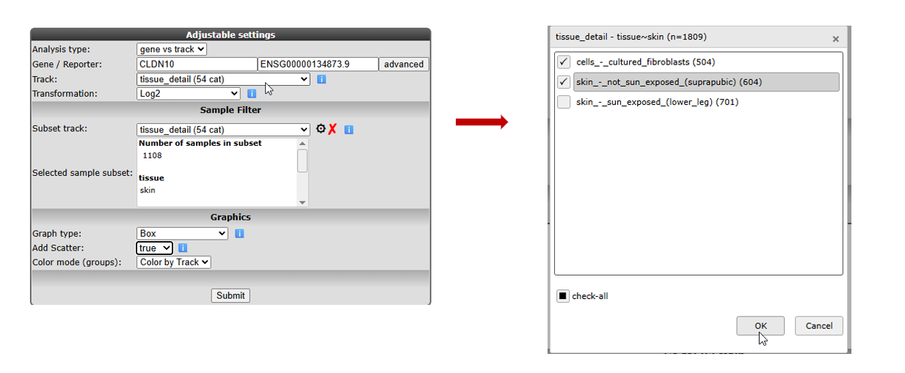

[**Figure 9-2: Adjustable settings menu**](_static/images/Methylation/fig9-3a.png)

-->

[**Figure 9-2: Pop-up window on "tissue_detail (54 cat)" subset track**](_static/images/Methylation/fig9-3a.png)

The box plot with dots shown in Figure 9-3 shows the difference of CLDN10 expression levels between fibroblasts and normal skin. Normal skin not exposed to the sun has a higher expression level, compared to the expression level of fibroblasts. (Be reminded that the Y-Axis name is log2 CLDN10 expression)

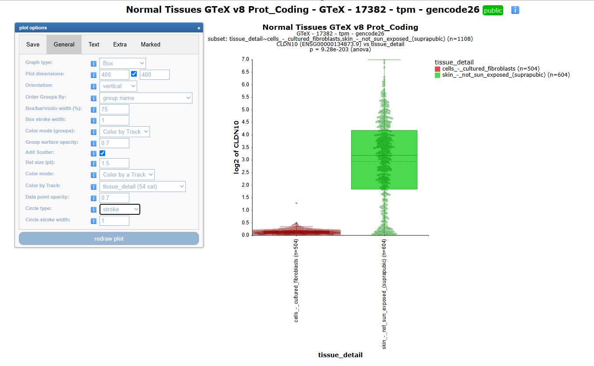

[**Figure 9-3:Expression log2 Box/dot plot (dots) on fibroblasts and not-sun-exposed skin cells for CLDN10k**](_static/images/Methylation/fig9-4a.png)

---

## Comparing Survival Probability

One could also investigate patient survival probability of a certain tumor type/entity in comparison to the expression for your gene of interest using the R2 Platform. In this section, the "TCGA" dataset is used as an example because it contains several general cancer types (including normal control tissues) and is relatively big.

**1)** Click "Survival (Kaplan-Meier/Cox)" in the left menu of the main page. In the center menu "Kaplan-Meier analysis using a single data set", select Field "Data set" as shown in Figure 10-1.

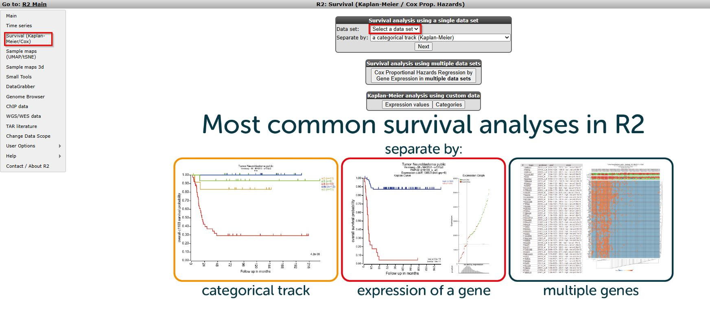

[**Figure 10-1: Survival (Kaplan-Meier/Cox)main page**](_static/images/Methylation/fig10-1.jpg)

**2)** In the pop-up dataset selection grid (in Figure 10-2), type "Kidney" in Column {Tissue/Tumor} and select "Kidney Renal Clear Cell Carcinoma" with "tcgars" in Column {Platform}. Click "Confirm selection" button as shown in Figure 10-2.

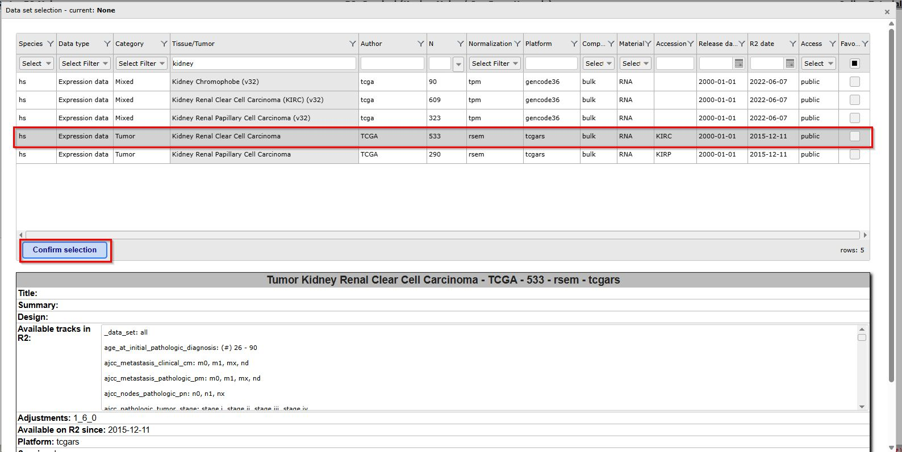

[**Figure 10-2: Change Dataset menu (after filter)**](_static/images/Methylation/fig10-2.jpg)

**3)** Select "a single gene" iin the field "Separated by" and click "Next" on the main page to proceed (Figure 10-3a).

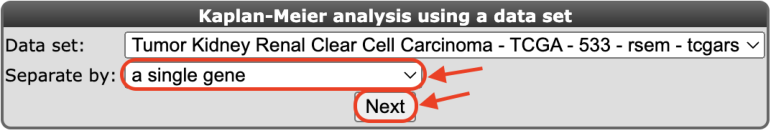

[**Figure 10-3a: "Kaplan-Meier analysis using a data set" Table on main page)**](_static/images/Methylation/fig10-3.png)

Set "Type of Survival" to "overall" and fill in Gene "CLDN10" (Figure 10-3b).

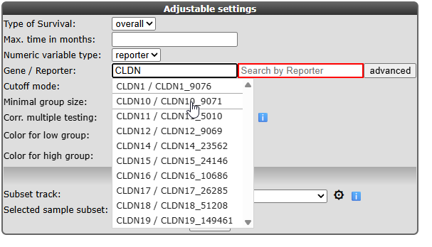

[**Figure 10-3b: "Kaplan-Meier analysis settings)**](_static/images/Methylation/fig10-3b.png)

The result on the next page shows the overall survival probability of patients with high expression of the gene of interest compared to those with low expression (left plot in Figure 10-4). The right graph in Figure 10-4 shows each sample's expression level (Y-axis), with samples ranked along the X-axis. The bars indicate the p-value that would result from splitting the cohort into high and low expression groups at each possible cutoff value. This is the "scan" mode used to identify the optimal cutoff (244.9162 in this example, the cutoff that gives the most significant split).  
  
When the automated cutoff produces one large and one small cohort, keep in mind that a statistically significant result isn't necessarily biologically meaningful. Further studies are needed to understand a gene's actual contribution to patient survival — a significant p-value doesn't guarantee biological relevance.

The left graph in Figure 10-4 shows the overall survival probability (Y-axis) of two cohorts split by expression of the gene of interest: high expression (red line, n=430) and low expression (blue line, n=103). High thus means, the samples that showed higher CLDN10 expression than the "scan" mode identified as the optimal cutoff expression. The X-axis shows follow-up time in months. Hovering over a small vertical tick on either line reveals individual sample information (Figure 10-5).

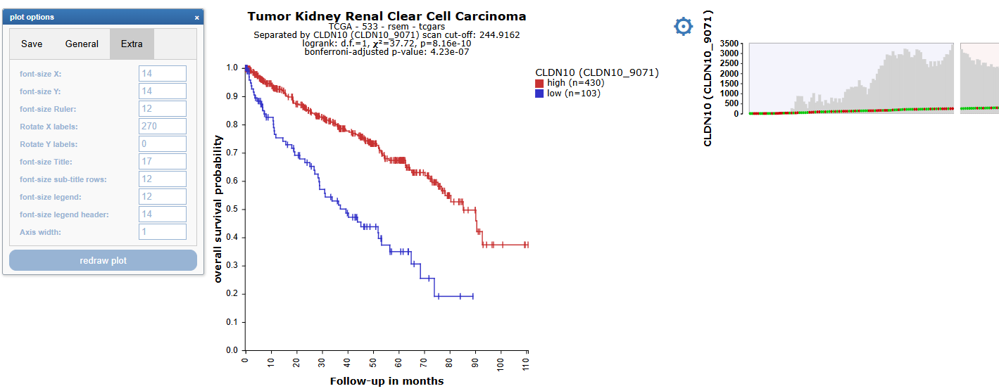

[**Figure 10-4:  "Overall survival probability graph" and "Expression graph"**](_static/images/Methylation/fig10-4a.png)

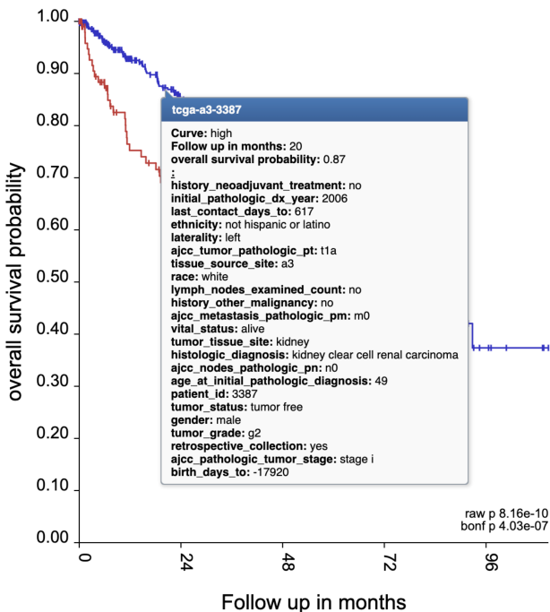

[**Figure 10-5: Individual information pop-up in "Overall survival probability graph"**](_static/images/Methylation/fig10-5.png)

In the right graph in Figure 10-4 the green dots mark samples with an "Event"; red dots mark samples without one. What counts as an "Event" varies by dataset. In another dataset this could be for example marking relapse (recurrence of the cancer after a symptom-free period following treatment) versus no relapse. More detail on "Event" annotations for a given dataset can be found in the R2 Platform's online tutorial, under "Special sample annotation" in Section 24, R2 Dataset Addition. [2]

Some adjustments are to be made as the survival probability until 60 follow-up months (or 5 years) is more common (on the left graph in Figure 10-4). The expression graph (on the right graph in Figure 10-4) could be also shifted (or cut) by filtering the range with the significant p-values. This could be done by the following steps.

**4)** Scroll down to the "Adjustable settings" menu. In the "Max. time in months" field, type 60, then click "Redraw Graph" to apply the change (Figure 10-6).

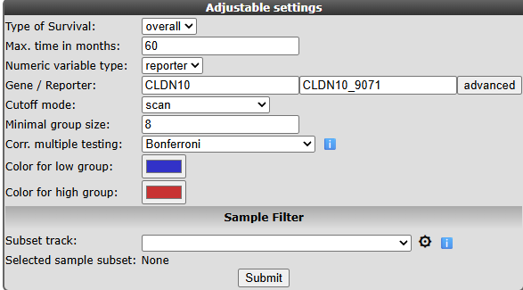

[**Figure 10-6:"Adjustable settings" Table**](_static/images/Methylation/fig10-6a.png)

Figure 10-7 shows the redrawn overall survival probability graph, now limited to 60 months of follow-up (highlighted in yellow). This makes it easier to compare survival between the high- and low-expression groups, since the long, sparse tails of both curves in the graph on the left — where only a handful of patients remain at risk — are cut off.

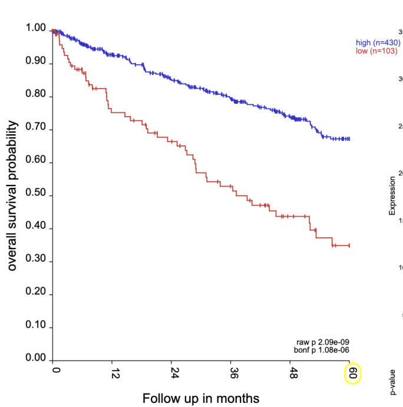

[**Figure 10-7:** "Overall survival probability graph" (after adjustment)**](_static/images/Methylation/fig10-7.jpg)

Next, a cutoff point on the "Expression graph" (the right graph in Figure 10-4) could be adjusted with the "Cutoff" field in the "Select a different cut-off" menu underneath the ranked expression plot. The cutoff point is set with the highest p-value by default. To change the cutoff point, the following step is to be done.

**5)** In the "Cutoff" field, select any data sample which has the high local p-value (e.g. "387 - 819.7227: raw p: 0.015 (bonf: 1.000)") as shown in Figure 10-8. Click "Redraw" to proceed 

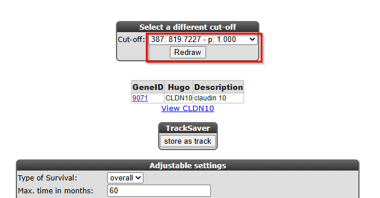

[**Figure 10-8: Select a different cut-off**](_static/images/Methylation/fig10-8a.png)

The result of Step 5 is described in Figure 10-9. The overall survival probability (on the left) has a smaller difference between the two lines compared to the previous graph that was drawn with the highest p-value.

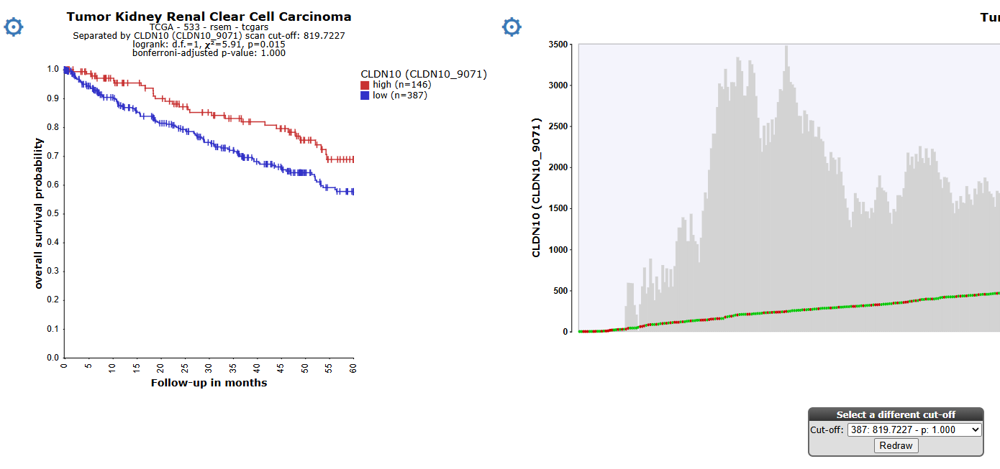

[**Figure 10-9:"Overall survival probability graph" and "Expression graph" (after adjustment)**](_static/images/Methylation/fig10-9a.png)

---

## Hypermethylation Between Datasets (private data, not yet published)

As Hypermethylation is an indicator of tumor development, hypermethylated regions on Heatmaps could be compared between two datasets of normal and tumor patients. The dataset with the tumor type "renal cell carcinoma (PTM)" and the author name "Richter" is used for this analysis.

**1)** Click "Main" on the left menu of the main page. Click in a dataset name in box 2 (Figure 11-1).

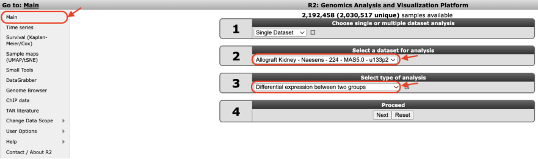

[**Figure 11-1: Main page**](_static/images/Methylation/fig11-1.png)

**2)** On the pop-up box, type the author name "Richter" on Column {Author} and select the dataset with "Renal cell carcinoma (PTM)" on Column {Tissue/Tumor} by clicking the row. Click "Confirm selection" button to proceed (In Figure 11-2). 

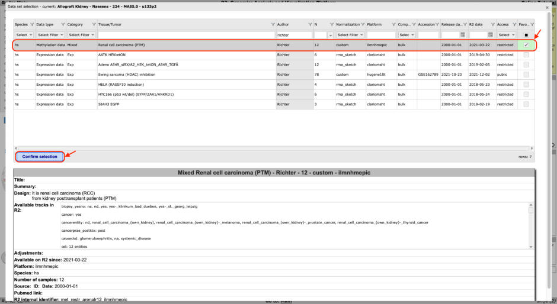

[**Figure 11-2: Data selection menu with the author name "Richter" and the tumor type "Renal cell carcinoma (PTM)"**](_static/images/Methylation/fig11-2.jpg)

Select "Differential expression between two groups" in Field 3. Click "Next" on main menu to proceed. (In Figure 11-3).

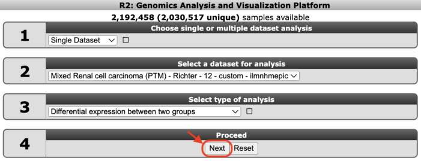

[**Figure 11-3: Main menu**](_static/images/Methylation/fig11-3.png)

**3)** In the menu in field "Group by", select "type_upd (3) cat" at the bottom of the pulldown menu, click next. At the settings Group 1 and 2, select "normal (5)" and "tumor (5)". 2 outliers ("skip (2)") were omitted, so we will proceed with a total of 10 samples instead of 12. Click the "Submit" button  to proceed.

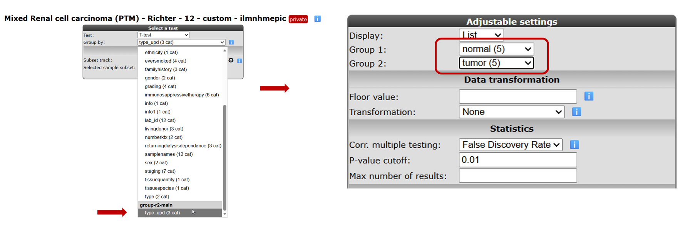

[**Figure 11-4: Select the groups**](_static/images/Methylation/fig11-4a.png)

**4)** At the right menu click "Heatmap(zscore)" to proceed, as marked in Figure 11-5.

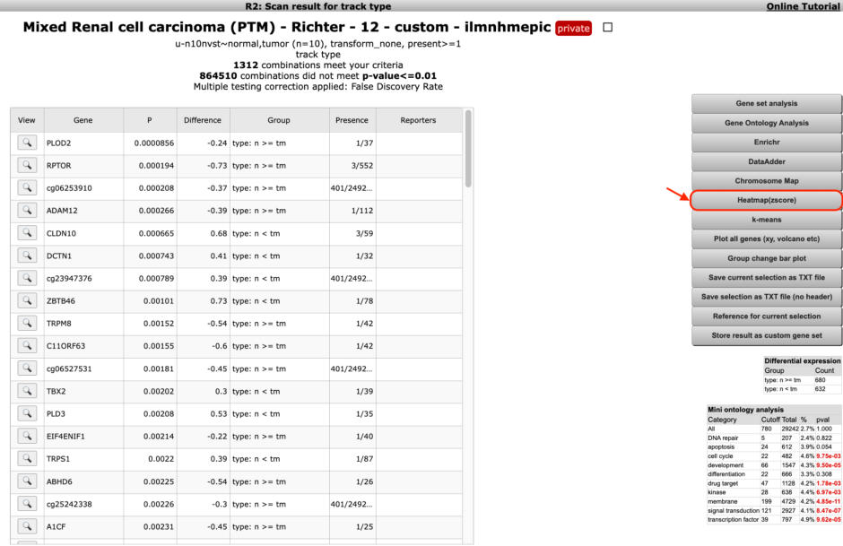

[**Figure 11-5: "Heatmap(zscore)" Button on the right menu**](_static/images/Methylation/fig11-6.jpg)

The next page shows a heatmap of methylation z-scores for the samples in the dataset, with samples grouped by tissue type (normal vs. tumor).

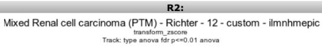

[**Figure 11-6: "Heatmap(zscore)" Title**](_static/images/Methylation/fig11-7.jpg)

"Zscore," or the standard score, is "a statistical measure that represents the number of standard deviations an individual data point is from the mean of a dataset. It indicates how far a particular data point deviates from the average in terms of standard deviation units." [7] "FDR" stands for False Discovery Rate, "a statistical concept used in multiple hypothesis testing to control for the proportion of false discoveries or false positives." [7]  

At the top of the heatmap, a colored annotation for track "type_upd" shows the type of each sample; an enlarged view is shown in Figure 11-7. In the "type_upd" track, red blocks mark tumor samples and green blocks mark normal samples. You can view the details of a specific sample by hovering over its block in the "type_upd" track; the pop-up shows that sample's annotation (circled in red here for illustration), as in Figure 11-7.

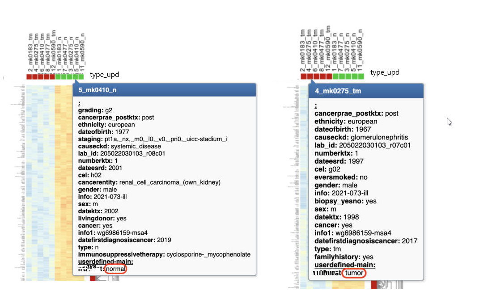

[**Figure 11-7: "Enlarged heatmap - normal in green vs. tumor in red**](_static/images/Methylation/fig11-8c.png)

The color gradient beside the heatmap shows that positive z-scores are colored yellow-red, while negative z-scores are colored blue. A positive z-score means a sample's methylation value is above the mean for that probe across all samples; a negative z-score means it is below that mean. In this heatmap, the tumor samples largely show the opposite pattern from the normal samples: probes that appear yellow-red (above the mean) in the tumor samples tend to appear blue (below the mean) in the normal samples, and vice versa.

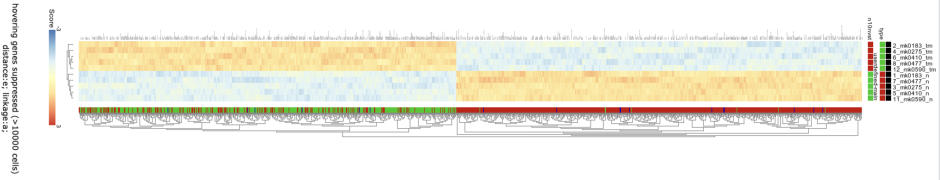

[**Figure 11-8: "Heatmap(zscore)" - rotated to horizontal for convenience**](_static/images/Methylation/fig11-9.jpg)

When the cursor is placed on a row iin the heatmap, a pop-up message containing the gene name, the probe name and the order number (gene name="CLDN10", probe name="cg16275739" on the pop-up message in Figure 11-9). The samples, and the genes are listed in order of appearance in the table that opens when you click on "Sort Order Listing", as shown in Figure 11-9. 

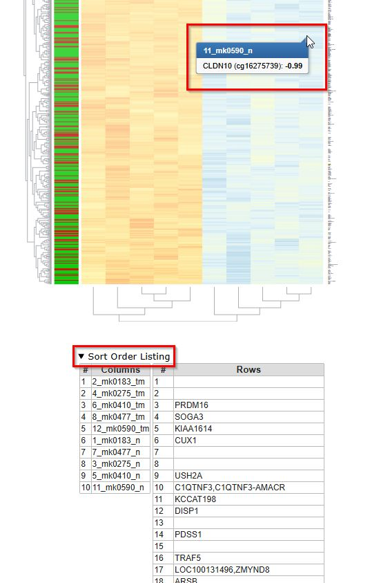

[**Figure 11-9: "Heatmap(zscore)" and "Sort Order Listing" Table**](_static/images/Methylation/fig11-10.jpg)

---

## Appendix

### 12.1 Finding a Gene Name of Interest

If a gene name of Interest is uncertain, this could be found by using the methylation ID obtained via UCSC Genome Browser. A methylation ID represents a probe name.

For example, assume that a gene of interest is "Insulin". By following Step 3) under *Section 2. Generating a Heatmap* with a gene name as "INS", there are several choices listed below {Gene} Field on the Adjustable settings menu (in Figure 12.1-1). One could address the exact gene name of interest using a methylation ID (i.e. "Met-ID"; for example, "cg20278383" for a gene name "CLDN10") obtained from UCSC Genome Browser and select the right gene name of interest from the choices listed in Figure 12.1-1. The following describes the steps of search on UCSC Genome Browser for each solution, respectively.

Firstly, enter UCSC Genome Browser (https://genome.ucsc.edu/). Click "Human GRCh37/hg19" on the "Genomes" menu of the main page as shown in Figure 12.1-2.

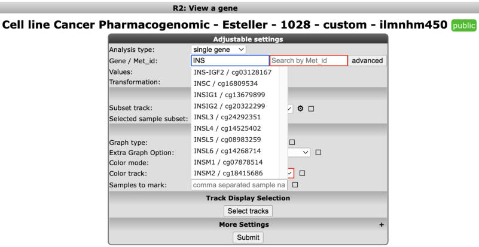

[**Figure 12.1-1: Choices for a gene of interest "Insulin"**](_static/images/Methylation/fig12.1-1.jpg)

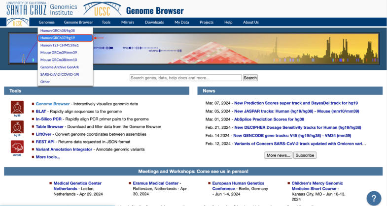

[**Figure 12.1-2: UCSC Genome Browser main page**](_static/images/Methylation/fig12.1-2.jpg)

#### (a) Search a Methylation ID using a sequence

If a sequence for a gene of interest is known, one may still use the sequence to begin the search as a guide. As an example, assume that "Insulin" is a gene of interest and a sequence for the certain region of this gene of interest is known as "TTAAGACTCTAATGACCCGCTGGTCCTGAGGAAGAG".

**1)** Click "Blat" on the "Tools" menu on the UCSC Genome Browser main page (in Figure 12.1-3).

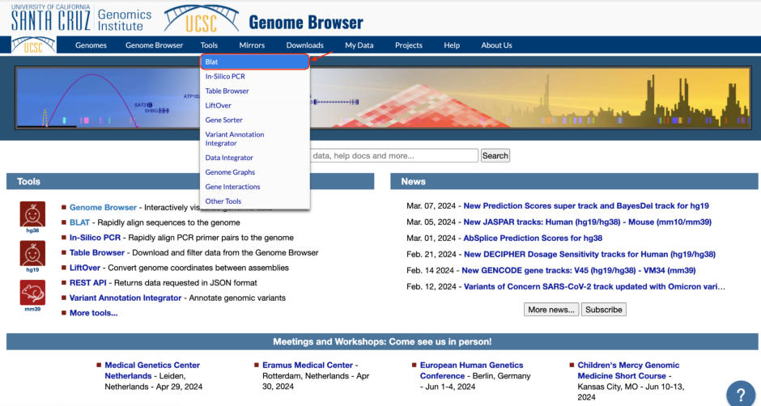

[**Figure 12.1-3: UCSC Genome Browser main page**](_static/images/Methylation/fig12.1-3.jpg)

**2)** Write the sequence "TTAAGACTCTAATGACCCGCTGGTCCTGAGGAAGAG" in the input box and click "submit" to proceed (in Figure 12.1-4).

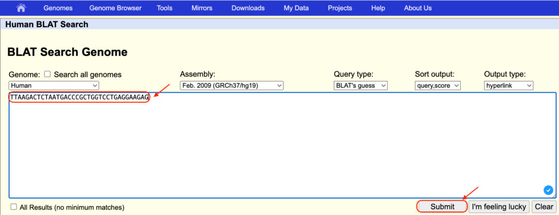

[**Figure 12.1-4: Human Blat Search page**](_static/images/Methylation/fig12.1-4.png)

**3)** On the next page, the sequence candidates are listed as the search results. Click one of the most relevant "browser" links to one's interest from the listed results (in Figure 12.1-5).

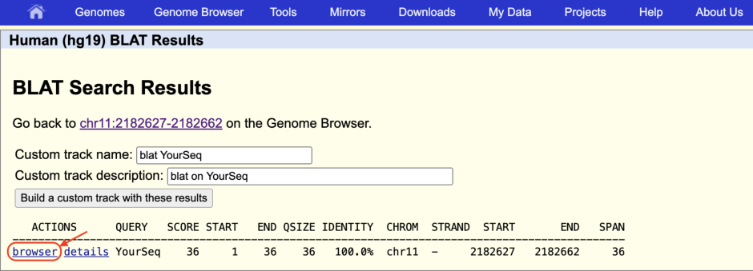

[**Figure 12.1-5: Blat Search Results page**](_static/images/Methylation/fig12.1-5.png)

**4)** The next page is Genome Browser page that one could observe the genome region. Scroll down and select "show" for "CpG Islands" and for "ENC DNA Methyl" Options in "Regulation" Field. Click "refresh" to apply the modifications on the Genome Browser (in Figure 12.1-6).

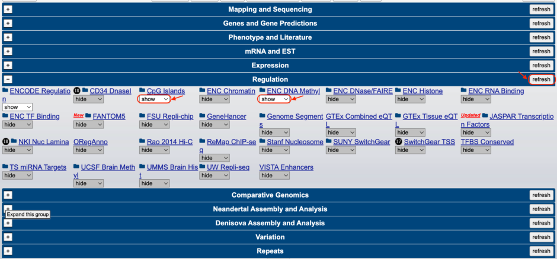

[
**Figure 12.1-6: "Regulation" Field**](_static/images/Methylation/fig12.1-6.png)

**5)** One could now see the corresponding methylation IDs on the Genome Browser page. If the methylation IDs are not observed on the page, adjust the genome region using "zoom in" or "zoom out" buttons on the top of the page (in Figure 12.1-7).

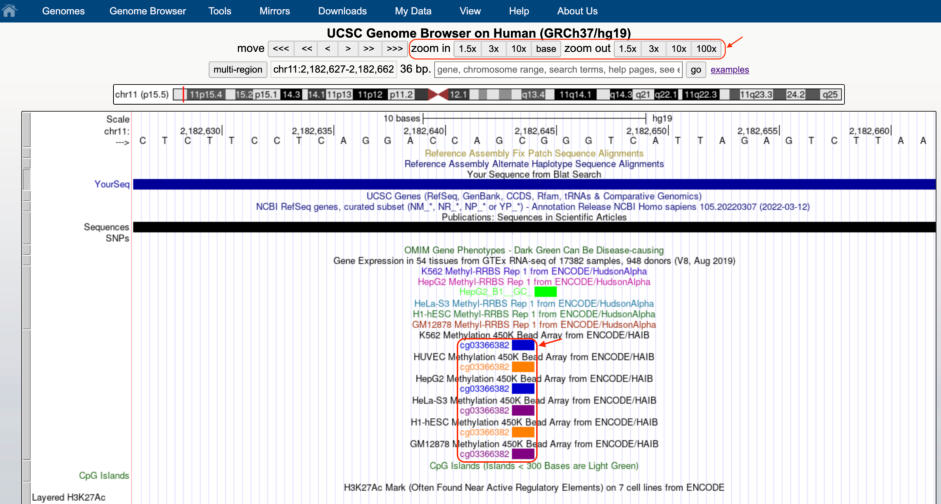

[**Figure 12.1-7: Methylation IDs on UCSC Genome Browser page**](_static/images/Methylation/fig12.1-7.jpg)

**6)** Now, return to the Adjustable settings menu on R2 Genomics Analysis and Visualization Platform (https://r2.amc.nl/) (in Figure 12.1-1). Write the observed methylation ID "cg03366382" observed from the previous Step 5) in {Met_id} Field on Adjustable settings menu. Click the listed option below {Met_id} Field (in Figure 12.1-8). The exact gene name of interest is automatically written in {Gene} Field (in Figure 12.1-9).

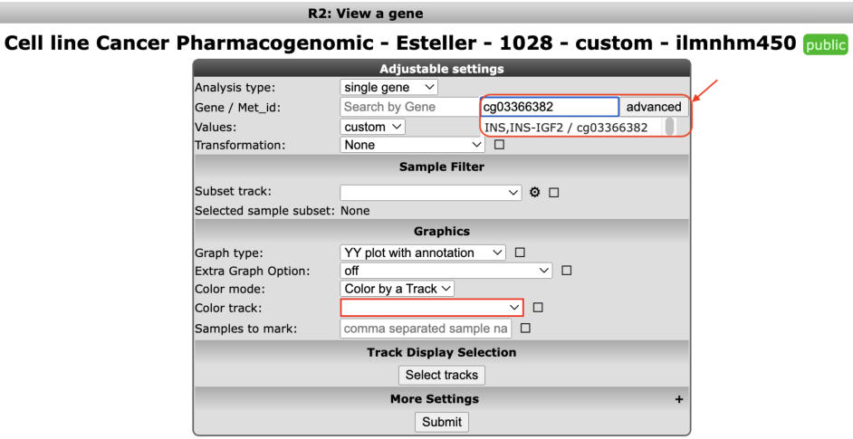

[**Figure 12.1-8: Adjustable settings menu on R2 Platform**](_static/images/Methylation/fig12.1-8.jpg)

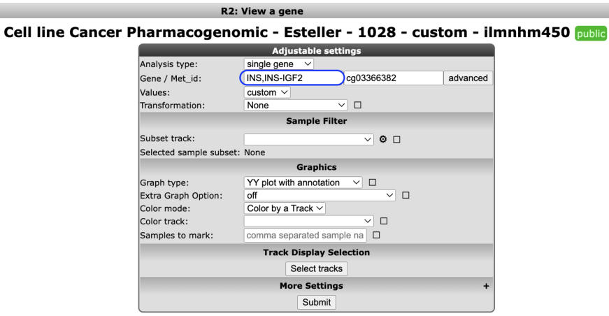

#### (b) Search a Methylation ID using an uncertain gene name of interest

Now that a search for a methylation ID using a sequence is possible from the Steps in *(a) Search a Methylation ID using a sequence*. On the other hand, if a sequence is also unknown for a gene of interest, one could begin the search using an uncertain gene name of interest on UCSC Genome Browser.

**1)** Write "INS" as a guess for this gene name of interest in {Gene} Field on UCSC Human GRCh37/hg19 Genome Browser. Click the relevant one from the listed choices below {Gene} Field to proceed (in Figure 12.1-10). If one is uncertain what is relevant, press "Enter".

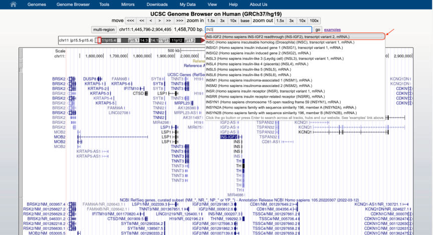

**2)** If you just pressed "Enter" on the previous Step 1), all search results of a gene "Insulin" are listed with more information. Click the relevant gene option (or just the first option "INS-IGF2 (uc001lvm.3)" as a tryout) to proceed (in Figure 12.1-11).

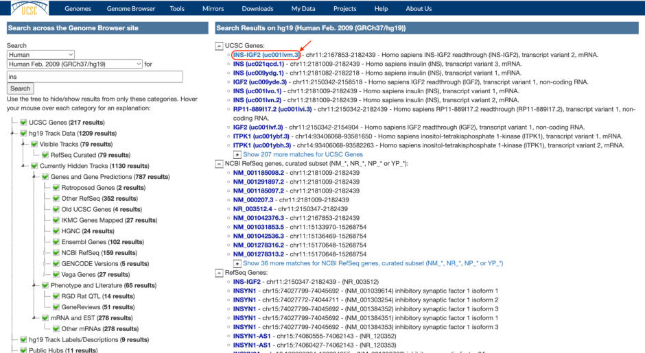

**3)** On the next page, all methylation IDs for "INS-IGF2 (uc001lvm.3)" are listed on the Genome Browser page. If the methylation IDs are not shown at first glance, scroll down or adjust the options below the page as described in Figure 12.1-6. Click the relevant methylation ID (or just the spotted methylation ID "cg02343602" as a tryout) (in Figure 12.1-12).

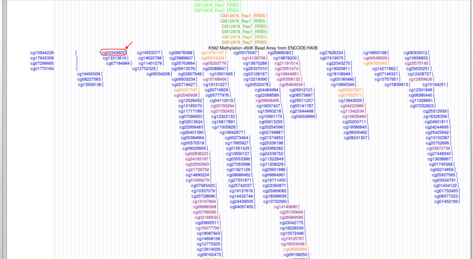

If one wishes to double-check its choice by looking at the DNA sequence for this methylation ID, the following steps could be done.

**4)** On the next page, the information on the spotted methylation ID "cg02343602" is provided. Click "View DNA for this feature" link (in Figure 12.1-13).

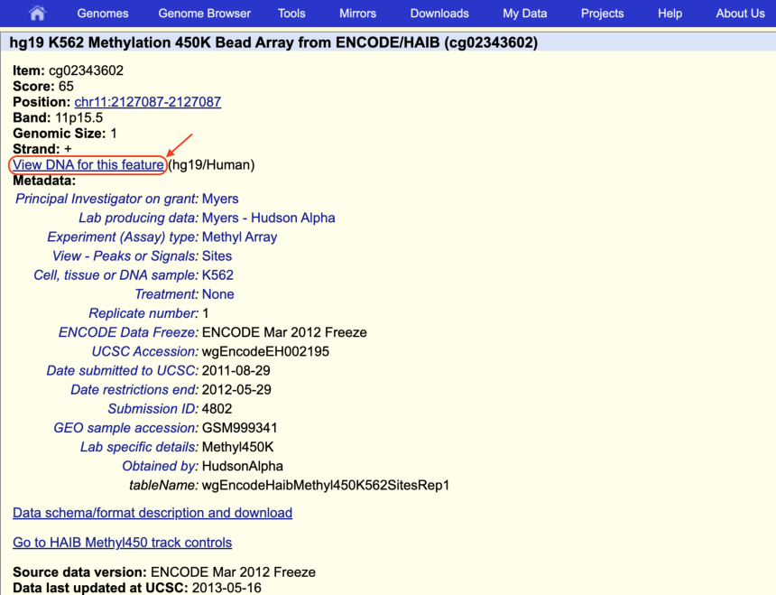

**5)** As an example, click "One FASTA record per region" Option under "Sequence Retrieval Region Options". Define a range as "20" for an up- and a downstream (in Figure 12.1-14).

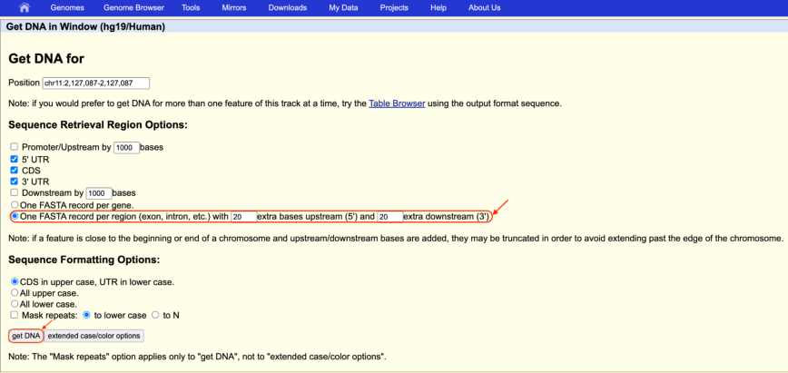

**6)** The corresponding DNA sequences on the defined region are shown as Figure 12.1-15. One could check if the sequence is aligned with known information.

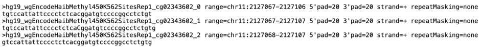

---

## References

[1] J. Koster, Amsterdam University Medical Centers (AUMC), Center for Experimental and Molecular Medicine (CEMM) - R2 Genomics Analysis and Visualization Platform, https://r2.amc.nl. retrieved on 24.04.2023

[2] R2 support team - R2 Tutorials, https://r2-tutorials.readthedocs.io/en/latest/. updated on 2026-06-24

[3] Mind map on the "Manual on R2 Platform for Methylation Analysis (by Ji Sun Kwon)" - Miro, https://miro.com/app/board/uXjVMMBYyDQ=/. updated on 04.05.2023

[4] Arroyo et al., 2025 Clinical Epigenetics .Epigenetic silencing and CRISPR-mediated
reactivation of tight junction protein claudin10b
(CLDN10B) in renal cancer. 
https://pubmed.ncbi.nlm.nih.gov/40524239/

[5] J. Breuer et al., - Epigenetic therapy of novel tumour suppressor ZAR1 and its cancer biomarker function, https://www.ncbi.nlm.nih.gov/pmc/articles/PMC6894338/. published on 04.12.2019

[6] I. Mallona., - Wanderer, an interactive viewer to explore DNA methylation and gene expression data in human cancer, http://maplab.imppc.org/wanderer/. published on 2015

[7] Chat GPT, keywords as "what is zscore?" and "what is fdr in statistics?", https://chat.openai.com/. retrieved on 27.06.2023

[8] Arroyo et al., 2026 - A Bioinformatics and Wet-Lab-Based Pipeline Identifies CLDN10 and GJB2 as Epigenetically Silenced Tumor Suppressor Genes in Cutaneous Melanoma https://pmc.ncbi.nlm.nih.gov/articles/PMC12986398/
