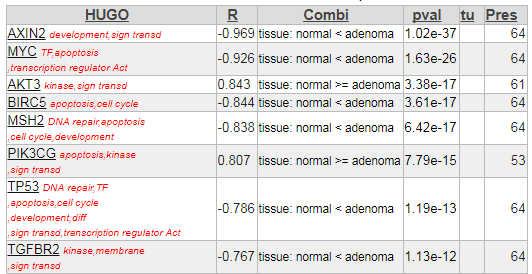
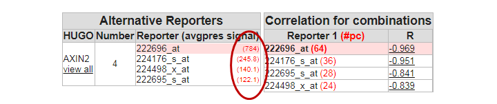
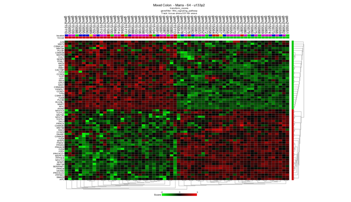
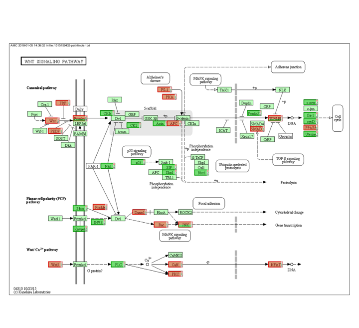
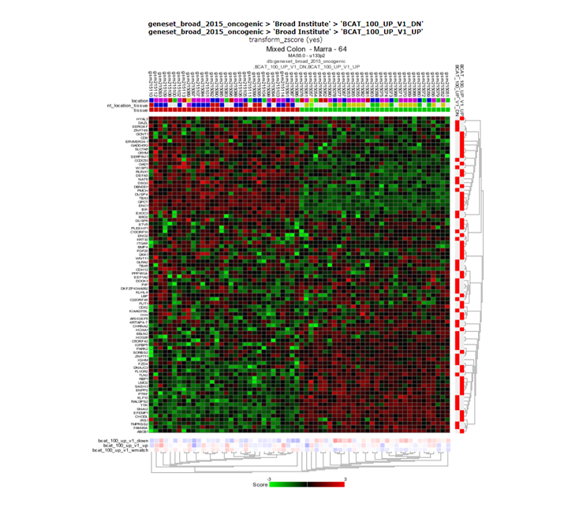
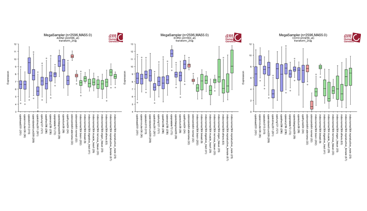
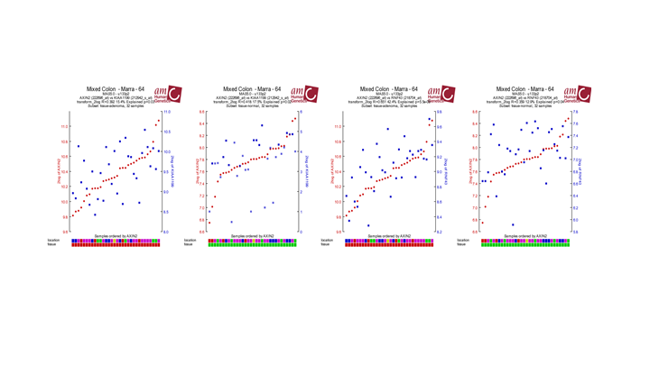
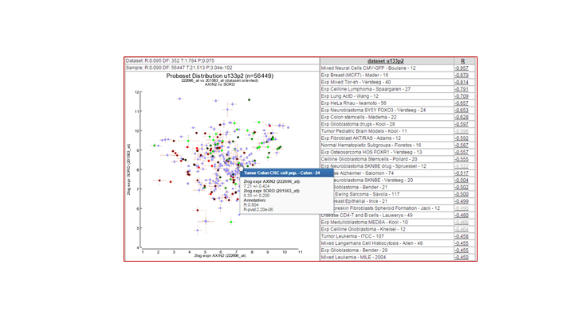

Finding and analyzing differential expressed genes using two Colon datasets
=================================

*Finding and analyzing differential expressed genes using two Colon datasets*

The purpose of this practical session is to get a grip on microarray data analysis.
We will try to answer some questions using two colorectal cancer datasets by applying
the web based analysis platform R2 (http://r2.amc.nl ir http://r2platform.com) which has been developed within
the Department of Oncogenomics at the Academic Medical Center (AMC) in Amsterdam,
the Netherlands. The principles and features you will encounter during this workshop
are well established in the community that analyze and visualize microarray data.
An online step by step tutorial book is available in the help section of R2.
We will often refer to these tutorials.

This resource is located online at http://r2-training-courses.readthedocs.io

Introduction
------------

**First Part: Colon versus Normal tissue**

In the first part we start by analyzing a dataset that has been used to identify the differences between normal tissue and colon adenomas. This dataset can be found in R2 as "Mixed Colon - Marra - 64 - MAS5.0 - u133p2".
For more information on the background of this dataset click on the infobox icon ‘i’ next to the current selected dataset.
The name of a dataset is composed of a number of elements, separated with a ‘-’. The Marra set consists of 64 samples and is of a mixed type (32 normal and 32 adenomas).
The normalization was performed according to the MAS5.0 algorithm and we are dealing with an Affymetrix U133 plus 2.0 microarray consisting of ~54,000 so called probe-sets (reporters).

We will use R2 to generate a list of genes which are differentially expressed between the Normal subgroup and Adenoma subgroup in the Marra dataset. Chapter 6 of the R2 tutorial book (“Differential expression of Genes ..”) describes how you can use the “Find differential expression between groups” module in more detail. 
Multiple testing corrections adjust p-values derived from multiple statistical tests to correct for false positives. In microarray data analysis, false positives are genes that are found to be statistically different between conditions, but are not in reality. (For more on multiple testing correction: see chapter 6 step 7 in the tutorial book)

Questions
------------

Select the **Mixed Colon - Marra - 64 - MAS5.0 - u133p2** or click the button 

<form name="Mara 64 set " action="https://hgserver1.amc.nl/cgi-bin/r2/main.cgi" enctype="multipart/form-data" target="R2" method="post">
  <input type="hidden" name="table" value="ps_avgpres_coloncombi64_u133p2">
  <button type="submit" >Go to Mixed Colon Marra</button>
</form>  

In the Main menu, 3 ‘Select type of analysis’ select the “Find differential expression between groups” module. And click next or click the button 

<form name='Find Diff' action="https://hgserver1.amc.nl/cgi-bin/r2/main.cgi" enctype="multipart/form-data" method='POST' target='FindDiff'>
<input type='hidden' name='option' value='findgene1'>
<input type='hidden' name='table' value='ps_avgpres_coloncombi64_u133p2'>
<button type="submit" >Go to Find differential </button>
</form>

In the next panel you have to select a so called ‘track’.
Tracks contain the annotation parameters of series of arrays of tumors or experiments. Choose the ‘tissue’ track, this contains assignment of each sample to the tumor or normal tissue group. Several other selection criteria can be adapted. Most settings are suited for regular analyses

**Question 1a:**

You can also choose between several multiple testing correction methods. Which one is the most stringent?
*Answer: At the end of this training course*

Before we start the calculations, make sure you selected ‘log2’ as transformation and use p<0.01 as a p-value cutoff. Then click ‘next’, and leave the group selection as is, click next to start the analysis.

**Question 1b:**

R2 has generated a large list of genes which are differentially expressed between the selected subgroups. Can you say something about the distribution between up- or down-regulated genes? Are the groups equal in size?.
*Answer: At the end of this training course*

**Question 1c:**

Next to many publicly available datasets, R2 is also hosting a lot of curated lists of genes which we call **gene categories** (gene sets). These gene categories can be used to restrict an analysis as well. We can adapt our current search by scrolling down to the end of our gene list. In the ‘Adjustable Settings’ Panel in the Gene Filters box you can now use a Gene Category to filter your list. Re-generate a list that is specifically associated with (colorectal) cancer (hint: look in the gene category or KEGG pathway list to identify an interesting gene set).
*Answer: At the end of this training course*

**Question 2a:**

The most significant gene in the list is the AXIN2 gene. Click on this entry from your result set to open the Gene View. The graph shows a neat separation in groups. Scroll down to investigate the probesets that were used. AXIN2 is represented by no fewer than four reporters (probe sets) on the Affymetrix U133 Plus 2.0 chip. 

Examine the expression signals of the 4 probe sets, what do you notice
*Answer: At the end of this training course*

**Question 2b:**

Can you think of an explanation for this observation? (Tip: Use the R2 genome browser by clicking the 'R2 Tview'link in the probeset verification table.

**Question 2c:**

Do you think it is wise to represent AXIN2 by the average of the four probe sets. Why / why not? (Tip: Use the R2 genome browser by clicking the 'R2 Tview'link in the probeset verification table. 

**Question 3a: Pathway heatmap**

The WNT pathway is an important signal transduction cascade in the development of colon cancer.
Generate a list of genes which are differentially expressed comparing normal and adenoma within the WNT pathway KEGG, use the False Discovery Rate for multiple testing correction, log 2 values and P <0.01. You can use the KEGG Pathway from the Gene Categories selection menu.

**Question 3b:**

Generate a heatmap (Menu to the right) from the differentially expressed genes and take a look at the resulting image. Are all tumors neatly separated from the normal samples? Is this a special finding?

**Question 4a: Pathway Analysis**

Often, you do not immediately have an idea which pathways you could look for in your comparisons between groups (normal versus adenoma in our case). A module within R2 providing you with some suggestions is the so called KEGG Pathway Finder by Groups. It assesses whether the number of genes that show significant differential expression between normal and adenoma is significantly higher than you would expect compared to all genes that are mentioned in KEGG. 

Perform a KEGG pathway analysis from the ‘main’ page. Make sure that under Representation: all is selected (both under and overrepresentation) Are there KEGG pathways overrepresented in the differentially expressed genes between adenoma and normal tissue?

If this is true which pathway (Set the p-value 0.01 for the analysis and select striking pathways).

**Question 4b**

In the current pathway analysis, the WNT pathway is not very pronounced. Click on the WNT pathway AMCmap (the blue A link) of the pathway in detail. 
It appears that there are not many changes found? Can you explain the results of the analysis?

**Question 5a Pathway heatmap specified**

The previous task has shown that a number of WNT pathway genes were represented in the result list. We can also view all genes in the pathway via a heatmap. You can do this using the "View a geneset (Heatmap)" option from the main menu. 

Take a look at the WNT pathway with 3: "View GeneSet (Heatmap)". You can find the WNT path way in in the KEGG>all section. Are all tumors neatly separated from the normals? Is this special? Why / why not? 

**Question 5b:**

In what way does this result differ from task 3b?

Classical pathway analyses, with sets of genes as members of a pathway, have been used extensively and yielded some valuable insights when applied on mRNA data. However, they are not necessarily informative, since many pathways have been characterized at the protein (modification) level. As such, activation of a pathway does not need to have an effect on the mRNA levels of the members of the pathway themselves. This realization has led to the development of ‘functional pathway signatures’, where pathway activity is induced/repressed in an experimental setup, and the impact thereof measured on all mRNAs. mRNA levels that are differentially expressed between active vs inactive pathway status, can then be used as an mRNA proxy for pathway activity. Published functional pathway signatures are collected by the MSigDB of the Broad Institute in a special section of their gene set database (oncogenic_signatures). Within R2, we can also use these sets via the “View a geneset (Heatmap)” option.

**Question 5c:**

Return to the main page and select “View a geneset (Heatmap)” again. Press ‘next’. Now from the gene selection dropdown list, select ‘geneset_broad_2012_oncogenic’ and press ‘next’. Again press next. Now, from the gene set(s), area select a complete beta catenin (BCAT) signature (Hold CTRL key to select a UP and a DN gene set combination). Press ‘next’ again to create a heatmap representation. Are the 2 groups also separated on the basis of the BCAT signature?

**Question 6a: Clinical relevance**

Genes that show a big difference in their expression between normal and adenoma tissue can be of clinical relevance. To see whether this is the case we can investigate their expression in multiple datasets

Try to find out whether the three most differentially expressed genes identified in Question 1b (AXIN2, SORD and CDH3) show a similar expression pattern in other tumors. Do this by using Mega Sampler. (Chapter 10 of the tutorial book). In the main menu select in section I , Across datasets Use the preset: Practicum001.

**Question 6b:**

Are there drug targets listed in the list of differentially expressed genes? If so, in which of the 2 possible groups are they listed?

**Question 7a:Investigate specific genes**

In the previous exercises we have focused on the differences between two groups within the colon dataset. Another starting point of your analyses could be a gene of interest. We already encountered AXIN2 in our analysis.

Try to analyze which genes show a correlated expression pattern with AXIN2 in our dataset. Which genes are in the top3? (See chapter 7 of the tutorial, “Find genes correlating with your genes of interest”)

**Question 7b:**

In the differential expression analysis between normal and adenoma samples, we also found AXIN2 to be differentially expressed. Therefore it is possible that the correlation analysis is biased (in other words, the correlation is solely caused by the 2 groups of samples).

To investigate whether there is a bias, we can inspect the correlations for the top 3 genes of the correlation analysis in 2GeneView by clicking on the gene name. Tip: You can use 2GeneView to select for a subset of samples (so you can assess the significance of correlation in only the adenoma’s or only the normal samples).

**Question 7c:**

You can strengthen the argument of a correlation between 2 genes if such a relation can be identified in other cohorts as well. In R2, we can easily check this relation in all datasets that are available by using the ‘2D-distribution’ from the 2GeneView page.

Examine the 2D distribution of the gene which is most promising. Is this correlation only found in our dataset or does this correlation also apply to other datasets?

Answers
--------

Question 1a:

*With high throughput experiments like micro-arrays it is important to correct for the random effects that good be falsely significant.  Therefore it is common practice to correct for those effects. The Bonferroni Method is the most stringed method R2 is offering. . A more detailed explanation you can find in the chapter of the the R2 tutorial. You can find the R2 tutorial in the left menu of R2 on the main screen.*

Question 1b:
*A small table below the grey buttons on the right provides the separate numbers of the up and down regulated genes. ~8000 genes in total. ~4000 genes are higher in adenomas of expressive and 3903 lower than in normal tissue.*

Question 1c:

*Also using Oncogenesis Category or KEGG colorectal cancer , AXIN2 is number one. Table below is the toplist of the analysis in 1b*

	
[**Finding differential expression progression.**](_static/images/practical_geneexpression_list.png)

Question 2a:

*In the perfect world each probeset should provide a more or less equal absolute value which is not the case.  The 222696_at signal is much higher compared to the other N-MYC probeset.*

	
[**Finding differential expression :probeset table **](_static/images/practical_geneexpression_probesettable.png)

Question 2b:

[**Finding differential expression: probeset verification **](_static/images/practical_geneexpression_probesetverification.png)

Question 2c:

*Due to the large difference in the signals wit will not be smart in this case to take the average. The successors of this platform are designed differently as well as the isolation methods. For the newer platforms there is no degradation and the probesets designed for the same gene give more or less the same signal.*

Question 3a:

64 genes
tissue: normal < adenoma 31
tissue: normal >= adenoma 33 

Question 3b:

*Neatly separated, but not very special. Only the genes that make a difference between the two groups viewed here. The Heatmap is based on a pre-selection which is already found*

[**Finding differential expression: heatmap **](_static/practical_geneexpression_heatmap1.png )

Question 4a:

*DNA replication and RNA transport are in the top off the list* 

Question 4b:

[**Finding differential expression: Pathway **](_static/practical_geneexpression_pathway.png )

Question 5a:

*Samples are well separated. This is special, we have all the genes in the wnt pathway used without preselection.*

[**Finding differential expression: heatmap **](_static/practical_geneexpression_heatmap2.png)

*
This time not only the genes are used that make a difference in the group shown.  The clustering in task3b was based on differentially expressed genes already found so it’s not surprising you find a heatmap with nice clusters.*

Question 5c:

[**Finding differential expression: heatmap **](_static/practical_geneexpression_heatmap3.png)

*Yes, the groups are clearly also separated based on the BCAT signature.*

Question 6a Clinical relevance

[**Finding differential expression: megasampler **](_static/practical_geneexpression_megasampler.png)

Question 6b 

*In case there are drug targets listed in the the list generated with the differentially expressed genes these are indicated in the description after the gene names in red. The up regulated genes are possible candidates for drugs. You can also use a genecategory of drugtargets in the Adjustable Settings panel as filter to select drugtargets exclusively.
Find diff expression (genecategory drugtargets) > 608 genes*

*tissue: normal < adenoma 283* 
*tissue: normal >= adenoma 325*

Question 7a

[**Finding differential expression: List **](_static/practical_geneexpression_singlegenecorrelation.png)

Question 7b

[**Finding differential expression: 2 gene view **](_static/practical_geneexpression_2geneview.png)

*Investigate the correlation for two genes for each subgroup with the two gene view if there is still a significant correlation you can conclude that there is no bias.*

Question 7c

*2d shows the distribution of multiple colonic rnf43 sets a significant correlation, the Kia shows this to  a lesser extend*

*Tumor Colon MS - Jorissen - 155 0.734*

*Ref Common Reference - na - 50 0.758*

*Tumor Colon - Watanabe - 84 0.764*

*Tumor Colon - Sieber - 290 0.779*

*Tumor Colon - Smith - 232 0.797*

*Mixed Colon - Skrzypczak - 145 0.820*

*Mixed Colon - Uddin - 59 0.831*

*Mixed Colon - Matsuyama - 111 0.842*

*Tumor Colon - EXPO - 315 0.842*

*Tumor Colon Rectum - EXPO - 38 0.878*

*Mixed Colon - Balazs - 53 0.928*

*Mixed Colon - Marra - 64 0.949*

[**Finding differential expression: 2 gene view **](_static/practical_geneexpression_2dview.png)

**Second Part: Colon versus Normal tissue**

Second series of tasks: MSI in Colon tumors
The next section we will use another dataset. Select **"Colon Tumor - Watanabe - 84 - MAS5.0 - u133p2"** 
This data set consists entirely of colon tumors (84 samples), 33 tumors are characterized by microsatellite instability (MSI). The remaining 51 tumors were microsatellite stable (MSS) and are characterized by chromosomal instability. 
In MSI colon cancer, genes of the DNA mismatch repair system play an important role. Germline mutations in these genes are a major cause of the inherited form of colon cancer, namely HNPCC (hereditary nonpolyposis colon cancer). 
In sporadic forms of colon cancer however, these genes are frequently inactivated. Inactivation is often achieved via hypermethylation, switching the gene off. Hypermethylation of genes in colon cancer is most common in colon tumors with a proximal location in the colon and much less in colon tumors with a distal location. 
Sporadic MSI colon tumors usually have a proximal location. MSI tumors are also found distally, however it is not clear which genes are exactly involved 
In this data set of 84 tumors, we will also look at differences in expression between proximal and distal colon tumors. We can analyze the complete set or look at sub selection (only MSI, MSS, etc).

**Question 8a: Overrepresentation on chromosome regions**

This dataset consists of Microsatellite stable (MSS) tumors and microsatellite instable (MSI) tumors.

Use the “Find Differential expressed genes between groups” module to generate a list of genes that is differentially expressed between MSI and MSS characterized tumors.

**Question 8b:**

Can you identify chromosomes where genes of this set are overrepresented? If so, is there a possible explanation? To see whether differentially expressed genes are more frequently expressed than expected on certain chromosomes, click on the 'Chromosome map', which can be found on the right hand side of the page with all the differentially expressed genes.

**Question 8c:**

If you want to examine genes differentially expressed on a particular chromosome more closely, we can re-analyze the dataset with gene category as a filter. Instead of all differentially expressed genes, now select the desired chromosome. Do this once (for example for chromosome 18).

**Question 8d:**

Are genes equally distributed for the up regulated and down regulated genes? Can you think of an explanation for this result?

**Question 9a: Finding genetic causes**

Because we know that DNA repair genes play an important role in microsatellite (in) stability, we can use a set of DNA repair genes to examine whether these genes are differentially expressed between MSI and MSS tumors. Go back to the previous settings for "Finding differentially expressed genes" and then select from 'GeneCategory' the ‘DNA repair’ genes. There are 247 genes annotated as DNA repair genes. 

How many of the DNA repair genes have a higher expression in MSI tumors, and how many have a higher expression in MSS tumors?

answers

A list of ~3320 is generated

