

Molecular Genetics Course - Colorectal Cancer
=================================

*Analyse Colorectal Cancer using the R2 data analysis platform*

This resource is located online at http://r2platform.com/mgcourse  
  
 
Introduction
------------

ToDo: Here we give in introduction into CRC CMS etc

  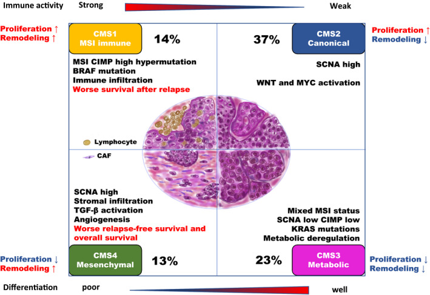	
  
  [**Figure 1: CMS classification**](_static/images/MolGenCRC/CMS_classification_characterization_pmc7511559.jpg)

The <button class="course_permalink">grey buttons</button> in this course will bring you to the R2 platform, often with pre-set settings such that you can pick up an analysis easily. The <button class="course googleform">green buttons</button> in this document will open up a Google form, one per section, with which you can submit your answers.

We would like to ask you to fill in the evaluation form about this R2 course during or at the end of the course. To open the form, click the button below:

The R2 platform:
---------------------------------------
 *Maybe a small introduction*

## Normal vs Colon: 

**Datasets used:**
* Mixed Colon - Marra - 64 - MAS5.0 - u133p2
* Tumor Colon Adenocarcinoma (students) - tcga - 204 - tpm - gencode3

R2 is hosting a large collection of all types omic datasets.  Use the grid box to search and get some grips on the datasets R2 is hosting, just  to get some feeling with the large collections of the dateset in R2.

* In the main page in R2, click on dataset  name  in box 2. Using the grid box 'Tissue/Tumor/Disease/Misc' and find out how many colon related sets R2 is hosting.

**A:213**

* How many sets has R2 when you only look for methylation sets.

**A:6**

Cancer is very complex disease to investigated. With a hugh variety of cancers types. This course is focussing mainly on CRCs. So start with lets see if we can see we start to look  for genes which make the difference in normal anc cancer tissue.

Of course it is nice to have a lot of RNA expression datasets tot analyse and explore but without proper sample annotation your have very limited analysis options. Let's explore the annotation for the Marra dataset.

* Go to the cohort overview in box 2 and check  the samples annotation by using the pulldown menu, how many normal en tissue samples does the Marra set contain this set also contains the location such as tissue location etc etc.

The R2 platform support a large  set of analysis types to explore datasets. One of these modules is the "Find differential expression between groups.

* Check if you have selected the Marra set and select in the main menu box, "Find Differential expression between two groups. In the next screen, use the default select T-test and select "Tissue" in tjhe group by option, and click submit. Select Normal and Adenoma, make sure that log2 and p < 0.01 is selected  and click submit.

* R2 has generated a large list of differentially expressed genes, can you say something about the distribution of the genes how many are up and down regulated.

Next to many publicly available datasets, R2 is also hosting a lot of curated lists of genes which we call `gene categories` (gene sets). These gene categories can be used to restrict an analysis as well.  We can adapt our current search by scrolling down to the end of our gene list. In the Adjustable Settings Panel by hitting the "Search Select button" in the Gene Filters box you can now use a Gene Category to filter your list. Re-generate a list that is specifically associated with (colorectal) cancer (hint: look in the gene category or KEGG pathway list to identify an interesting gene set). You can look with keywords of inspect the KEGG pathway specific.

* check some genes with single gene view (AXIN2) by clicking the magnifying glass, in the green bar in the top you can easily go to list. Also note te coloured bars beneath plot, containing the sample annotation, these groupin variables are called tracks. Also note you hoover over the dots in the graph to get more information of the individual samples.

Pathway heatmap
---------------------------------------

The WNT pathway is an important signal transduction cascade in the development of colon cancer.

Generate a list of genes which are differentially expressed comparing normal and adenoma within the WNT pathway KEGG, use the False Discovery Rate for multiple testing correction, log 2 values and P <0.01. You can use the KEGG Pathway from the Gene Categories selection menu.

* How many genes are up / down regulated. 

* In the left menu generate a heatmap. Inspect the heatmap did you expect this pronounced clustering?.

A:
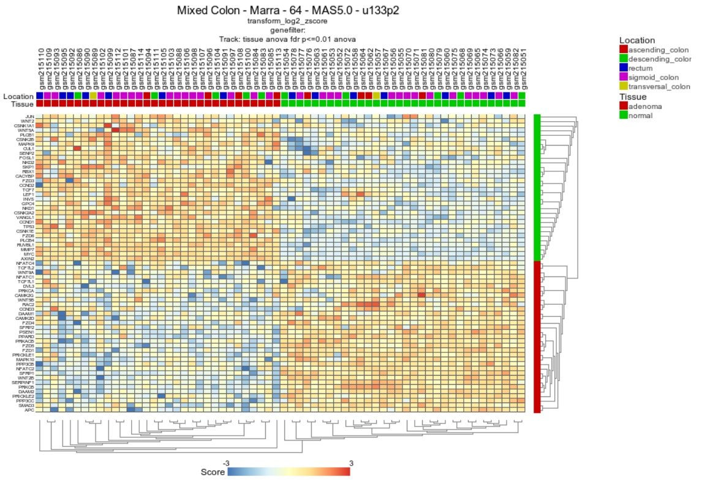

Pathway Analysis:
---------------------------------------

Often, you do not immediately have an idea which pathways you could look for in your comparisons between groups (normal versus adenoma in our case). A module within R2 providing you with some suggestions is the so called KEGG Pathway Finder by Groups. It assesses whether the number of genes that show significant differential expression between normal and adenoma is significantly higher than you would expect compared to all genes that are mentioned in KEGG.

* Perform a KEGG pathway analysis from the ‘main’ page. Make sure that under Representation: all is selected (both under and overrepresentation) Are there KEGG pathways overrepresented in the differentially expressed genes between adenoma and normal tissue? If this is true which pathway (Set the p-value 0.01 for the analysis and select striking pathways).

*A: DNA replication and cell cycle are in the top off the list*

The previous task has shown that a number of WNT pathway genes were represented in the result list. Since we have generated a heatmap in the previous question  with the wnt pathway gene from the latst results. We can also  make a heatmap directly without any test.

* Go to the main screen select generate a heatmap and select the wnt path way from the text database.

A:
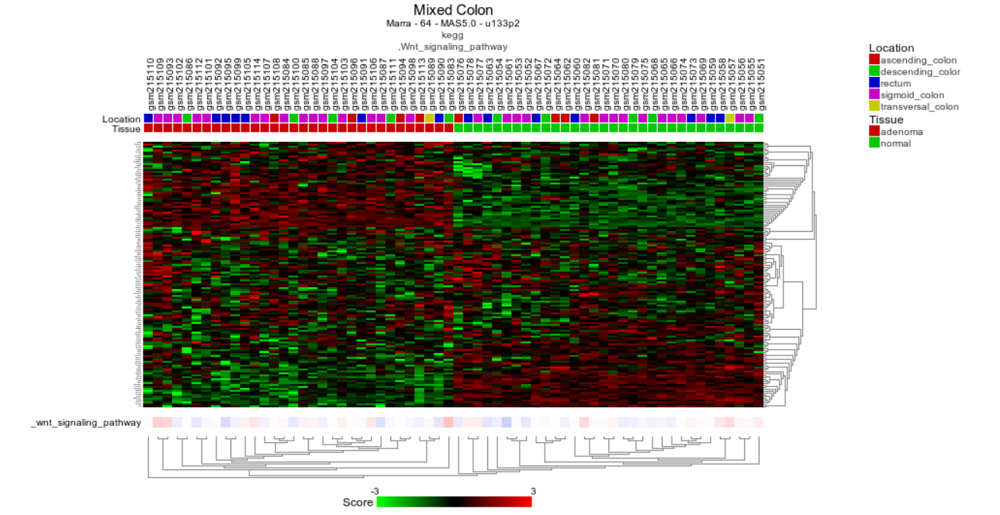.

* The samples are clearly seperated in normal vs adenoma. It's different and less pronounced compared to the previous heatmap. Do you think this is special? , Why or Why not.

* In what way is the heatmap your generated different compared to the previous one.

### MSI / MSS in CRC

In the previous tasks we have introduced the R2 platform and looked at differences between Normal and Colon tissue by looking at differentially expressed genes. For many cancers types it is important to focus on subtyping meaning identifying subgroups within CRC datasets R2 is hosting. As already discussed, CRC has 4 CMS subtypes, one of the characterics of CMS I, is MSI instability. 

The genomic instability in colon cancer can be divided into at least two major types, microsatellite instability (MSI) or chromosomal instability (CIN). Microsatellite instability (MSI) is caused by mutations in DNA mismatch repair genes such as MLH1, MSH2, MSH6, and PMS2, and it is found in 10% to 15% of sporadic colorectal cancers (CRCs). The presence of MSI predicts a good outcome in colorectal cancer.

In MSI colon cancer, genes of the DNA mismatch repair system play an important role. Germline mutations in these genes are a major cause of the inherited form of colon cancer, namely HNPCC (hereditary nonpolyposis colon cancer).  In sporadic forms of colon cancer however, these genes are frequently inactivated. Inactivation is often achieved via hypermethylation, switching the gene off. Hypermethylation of genes in colon cancer is most common in colon tumors with a proximal location in the colon and much less in colon tumors with a distal location.

[comment]: <> (opzetje van de text)

This dataset consists of Microsatellite stable (MSS) tumors and microsatellite instable (MSI) tumors.

The next section we will use another dataset. Select "Colon Tumor - Watanabe - 84 - MAS5.0 - u133p2"

Use the “Find Differential expressed genes between groups” module to generate a list of genes that i differentially expressed between MSI and MSS characterized tumors.

* Which one is in top list 

* Inspect MH1 expression. 

A:
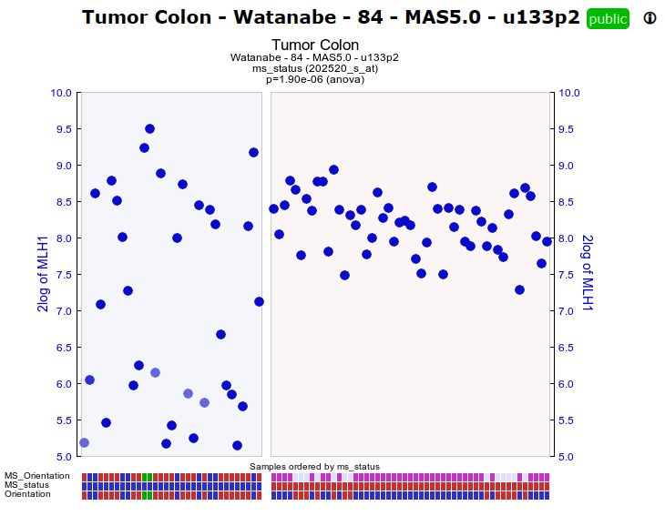

So we have identified an important player as discussed in college. You have just selected the Wanatabe set. Inspect the background information and look at the data this dataset has been generated. This is very old set, of course this set still of biological relevance we will also try to find we can find out we can validate this other sets. Not only because this is an old set but it is always common research practice to validate your results with other sources

[comment]: <> (small info  about tcga ?)

select Tumor Colon Adenocarcinoma (students) - tcga - 204 - tpm - gencode3

* Do the same test Find Diff test, again the MHL1 gene

A:
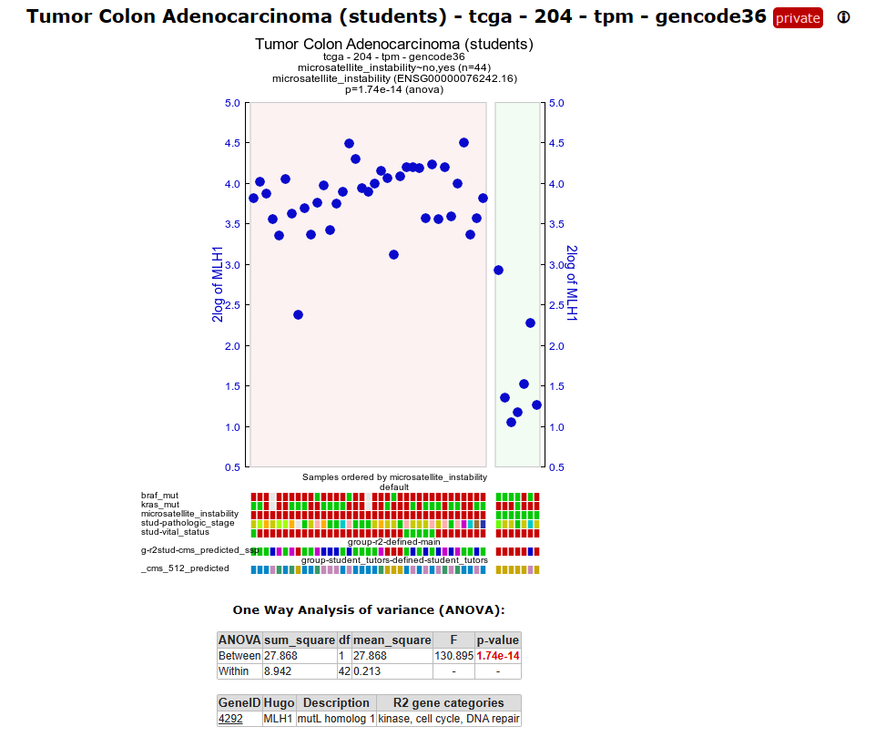
[**Figure x: 204 set**](_static/images/MolGenCRC/chrommap.png)

A:
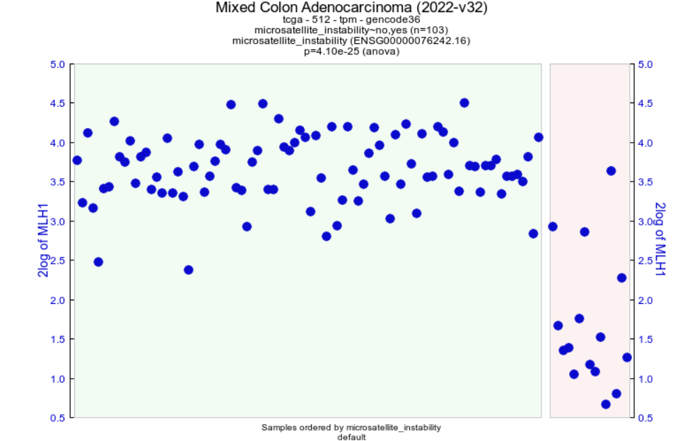
[**Figure x: 512 set**](_static/images/MolGenCRC/chrommap.png)

So clearly it seems that MHl plays is a key role and is possible affecting other genes

* One way to find out which genes are possibly regulated by the MLH1 gene is to find genes which are (inverse) correlated with this gene.  

* Run the Find correlated genes with a single gene module for the MLH1 gene.

A:
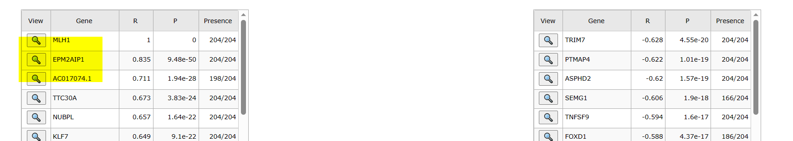

* Then click on the best correlating gene to plot both genes together, in a two gene view

A:
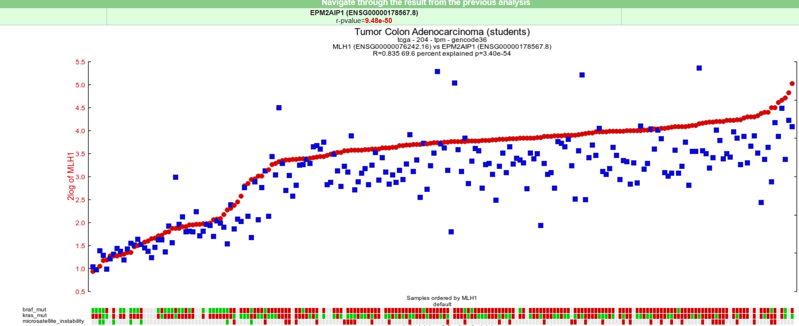

* Click on view additional details, on which chromosome are both genes located

A:

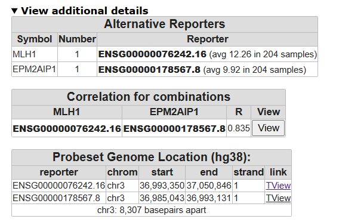

* Click T-view and zoom out 2 or 5 times, what can you say about their location 

[comment]: <> (hier een klein text bruggetje waarom we de volgende stap doen?)

* Go back to your genelist of correlating genes and select only **neg corr** genes and click chrom map,

A:

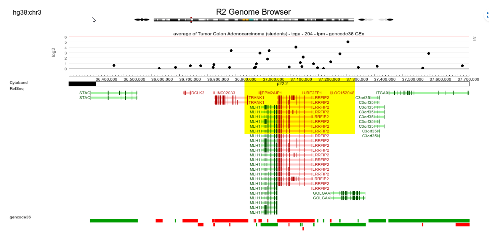

* A lot of genes are clearly over-represented on a number of chromosome, especially chrom 18 with a high p-value.

A:
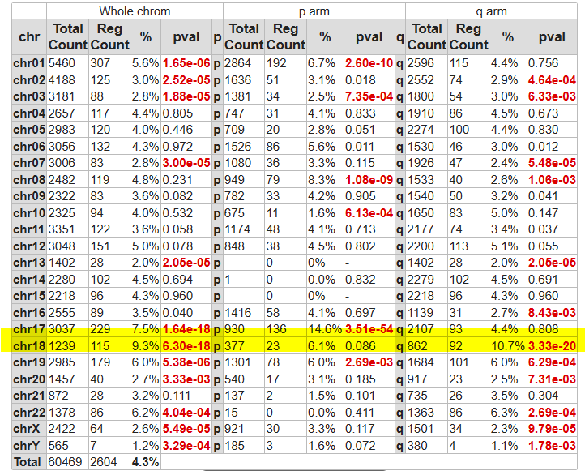

[**Figure x:**](_static/images/MolGenCRC/chrommap.png)

chrom 18 loss is linked to msi/mss instability

Because we know that DNA repair genes play an important role in microsatellite (in) stability, we can use a set of DNA repair genes to examine whether these genes are differentially expressed between MSI and MSS tumors. Go back to the previous settings for "Finding differentially expressed genes" and then select from 'GeneCategory' the ‘DNA repair’ genes. There are 247 genes annotated as DNA repair genes.

* Go back to the MLH1 correlating genelist make sure you have preselected the DNA-repair genes. CLick submit. Click on generated a heatmap. And do you see a clear associated with a CMS subgroup ?, and which one.

A:
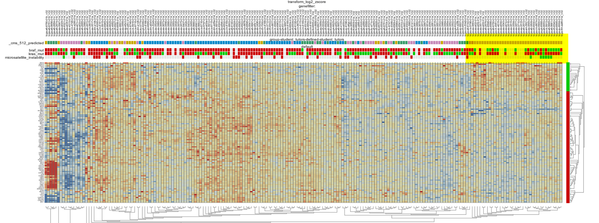

* and take look at the CMS classification !!! what do you see ?? are you surprised

CMS4, MSI had been associated with CM1 and CMS4

In one of the first questions in this course we have seen there is an association with the genomic location. We have seen that a low MLH1 expression is associated with CRC subtypes. As briefly touched, the R2 platform has many types not only gene expression but also methylation arrays. Go to the main menu and select 

*Tumor Colon adenocarcinoma - tcga - 296 - custom - ilmnhm450*

* Plot the one gene view for MLH1, do you see something special ?

* In the Alternative box, unfold additional details,  click on the view all link below MLH, here a nice heatmap is plotted of the methylation ratios's what do you see. 

* A lot of samples are unfortunately not all the samples are annotated for Microsatelite instability, filter for those samples only and click submit. The MLH1 reporters for this gene (only 4), seem all methylated however, most likely these are not well designed and can maybe not distinguishe for the proper MLH1 reporters. However look at the other reporters on the same location, we also see a gene name we encountered before. Do you see an association with MSI/MSS.

A:
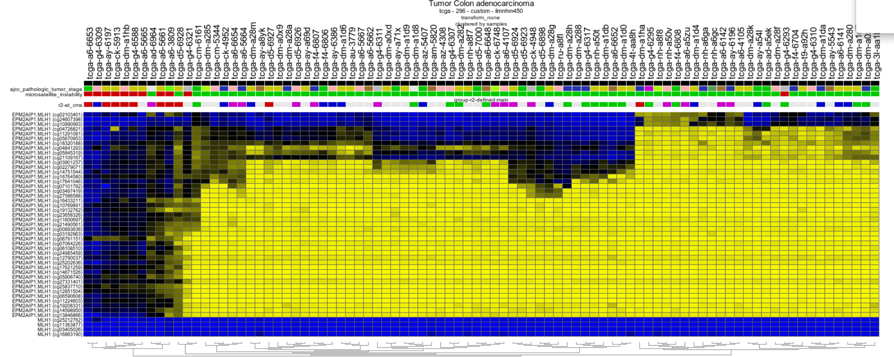
May be a little , maybe you expected CMS1 classification but also CMS4 has been associated with MSI. 

[comment]: <> (deze set wil ik mogelijk nog aanpassen met wat meer MSS / MSI)

### Genes Affected by Mutations: 

BRAF
KRAS mutation

## CMS
ToDo: Intro to CMS now in the words of the Guinney paper:

"Thanks to collaborative bioinformatics work on the largest collection of CRC cohorts with molecular annotation to date, 
and building upon previous efforts by the independent researchers, the consortium resulted in a consensus molecular 
classification system that allows the categorization of most tumors into one of four robust subtypes. Marked differences 
in the intrinsic biological underpinnings of each subtype support the new taxonomy of this disease (Fig. 5) that will 
facilitate future research in this field and should be adopted by the community for CRC stratification: CMS1 (MSI Immune), 
CMS2 (Canonical), CMS3 (Metabolic), and CMS4 (Mesenchymal)." (Guinney 2015et al., Nat Med. 2015 Nov; 21(11): 1350–1356. )

##### Clustering with t-SNE maps

We've seen that the expression of genes differs among the samples and the CRC subtypes seem to specifically express certain genes. 
To further explore the type of data we're dealing with, an unbiased unsupervised type of clustering analysis is a good idea. 
The t-SNE algorithm is an algorithm that was developed in recent years. It finds similarity in expression profiles of samples 
and will clump similar cells together on a map.   

* Click the button below to show the t-SNE map in R2: 

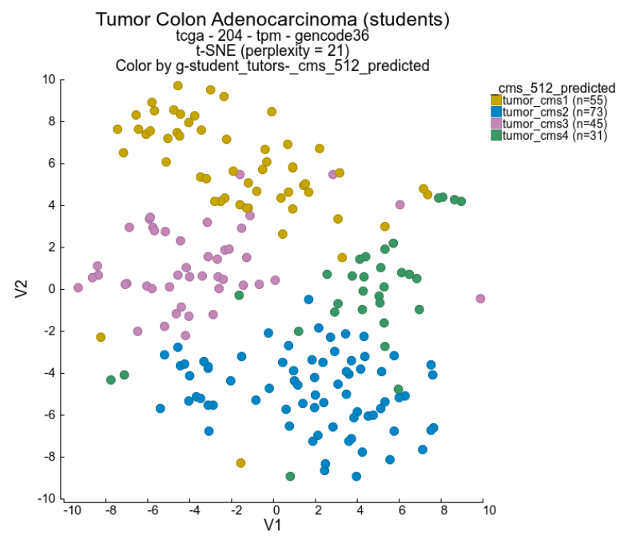

[**Figure 2: temp image, todo make permalink tSNE with CMS coloring**](_static/images/MolGenCRC/temp/tSNE204_create_permalink_later.png)

ToDo make permalink to tSNE instead of image above  
<a class="course_permalink" href="https://hgserver2.amc.nl/cgi-bin/r2/main.cgi?permalink=course_molgen_tsne_86_6tumortypes" target="_blank">Go to the t-SNE map</a>
 
 

Under the graph, a menu allows the user to adapt settings.
Colors of the graph points are not set by default.  
* Find the **Color mode** dropdown and select *Color by Track*. Now set the **Color track** dropdown to use the *cms_predicted* track 
again, and click **Submit** to show the changes.
* The different maps can be found under de setting Versions. Set **Versions** to the value *all* and click **Submit** again. 

  
  
------

  **What insight did you obtain when you colored the plot with annotation?**

  **Why do you think it is good practice to check different values for a parameter?**

 
 

------

### Differences between the various CMS types

Previously we looked into CMS subtype 1. We would like to understand what sets CMS 4 apart from the subtypes 2 and 3. 

* From the main page choose the analysis Differential Expression Between Two Groups. 
* ToDo: how to Choose the track cms4vs3
* Look in the list of genes if you see anything familiar and hover over the magnifying glass icon of a few genes

Gene set analysis helps researchers interpret the biological relevance of a group of genes. Instead of looking at individual 
genes, it allows you to understand the collective functions or pathway involvements genes in your list. This can provide more 
meaningful insights into the underlying biology of a particular condition or experiment.

* Click on the top most button on the right that is labeled Gene set analysis.
* Select the Gene set Collection Broad 2020 09 h hallmark
* Switch the Representation setting to all 
* Click Next

ToDo: Remove picture
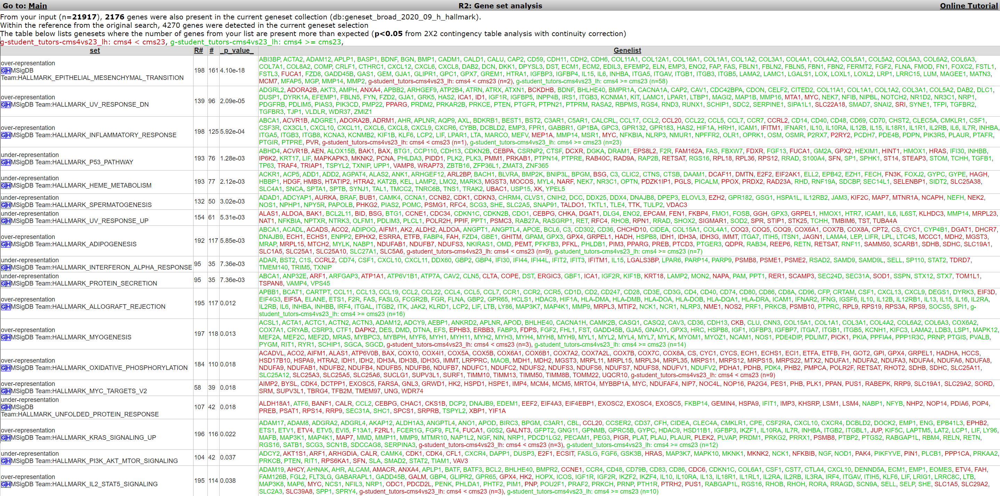

[**Figure 3: temp image of result Gene set analysis, todo remove**](_static/images/MolGenCRC/temp/GeneSetAnalysis_create_permalink_later.png)

------

**Which gene sets do you see pop up and are they over or under expressed in CMS 4?**

**Explain the biological relevance for the CMS4 subtype for these over- or/and underexpression of these gene sets for CMS4 subtype CRC tumors**

 
 

------

## Experiment in cell lines
ToDo: Now that we have discovered interesting mecanisms that influence teh development of CRC, can we influence the mechanisms by targeting a gene? 

## Trial in patiënts
Is a drug or treatment effective?

### Single cell? 

## Evaluation
Please don't forget to fill in the evaluation form about this R2 course, if you haven't done so yet:

<button class="course googleform" onclick="window.open('https://docs.google.com/forms/d/e/1FAIpQLSflNJpsTcLIhwEC0ZlHksfnE0VwBay1I2KOGPArYu4Q_QhtrA/viewform?usp=sf_link','_blank');" type="button">Open the Evaluation form</button>

---------

Final remarks / future directions
---------------------------------
In the March 1st 2018 issue of Nature a paper was published describing a landscape of genomic alterations across childhood cancers. The data is accessible in R2 also as a Datascope. This is another example of how R2 can visualize your genomics data. 
  
This ends the course. Feel free to further explore the course materials or our tutorials.
  
We hope that this course has been helpful. If you want to have your genomics data visualized and analyzed using the R2 platform you can always consult r2-support@amc.nl
  
The R2 support team.

