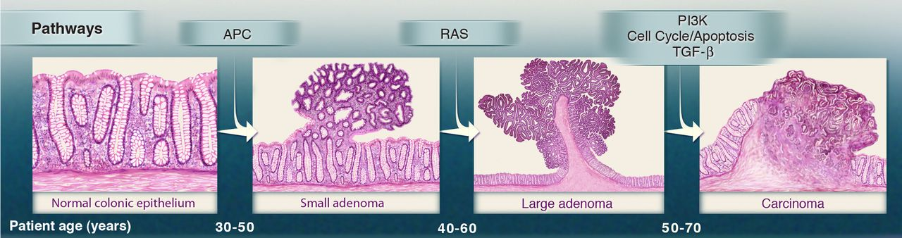
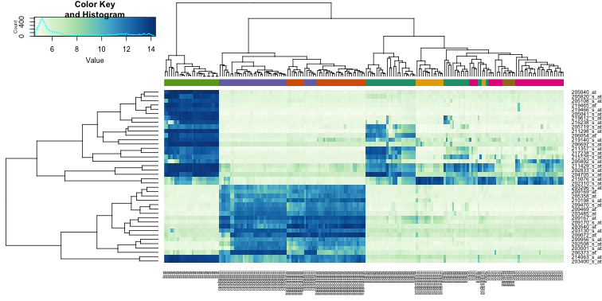
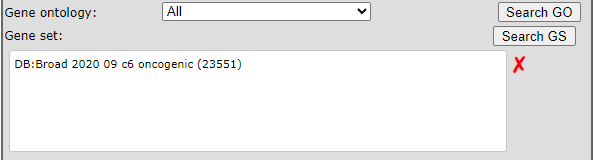
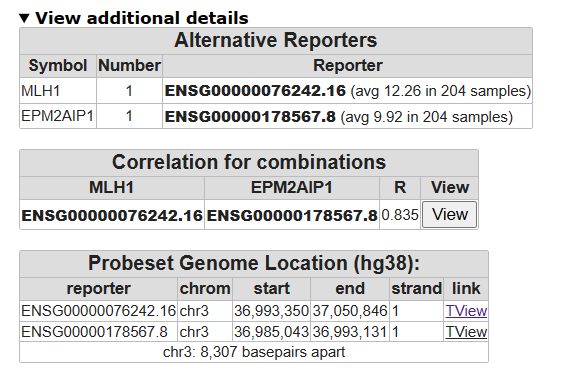
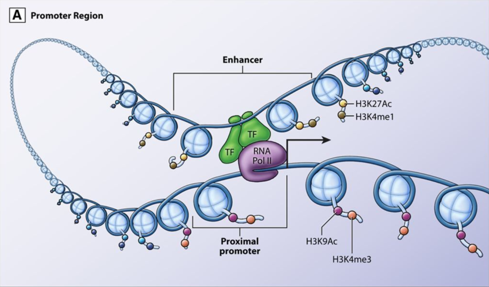

Molecular Oncology Course - Colorectal Cancer
=================================

*Analyse Colorectal Cancer using the R2 data analysis platform*

ToDo: change mgcourse link to this document 
This resource is located online at http://r2platform.com/mgcourse  
 
  
Introduction
------------

In the late 1980s the Vogelstein model was proposed. It introduced the concept of a stepwise accumulation of genetic
mutations leading to the development of colorectal cancer (CRC).  

[**Accumulation of mutations advancing colorectal cancer development**](_static/images/MolOncCRC/CRCprogression_combined.jpg)

(Figure sources: https://doi.org/10.3390/ijms241311023, https://doi.org/10.1016/j.
tranon.2021.101131)

Similar to the picture above, the model highlights the importance of key genetic mutations during CRC progression, 
including mutations in APC, KRAS, and TP53. While the Vogelstein model has provided a valuable foundation for 
understanding colorectal cancer, subsequent research has revealed that the disease is more complex and heterogeneous 
than initially described. Colorectal cancer can involve various genetic and epigenetic changes. Additional 
factors, such as the tumor microenvironment, inflammation, and the immune system, also play significant roles in the 
progression of the disease.  
Colorectal cancer is the third most common cancer worldwide, according to the World Health Organization, accounting 
for approximately 10% of all cancer cases, and it is the second leading cause of cancer-related deaths worldwide. 

Research is needed to understand the mechanisms underlying treatment resistance and to develop strategies to
overcome it. Better identification and characterization of multiple CRC subtypes could guide treatment decisions and
improve the outcomes for individuals with colorectal cancer. Furthermore, markers for early detection and prevention
might allow for interventions before advanced mutations occur. Clearly it is crucial to understand the diversity and
complexity of colorectal cancer in order to develop new and effective targeted treatment strategies.   
Bioinformatics tools enable the analysis of vast amounts of omic and clinical data, helping researchers identify 
genetic mutations, epigenetic aberrations, biomarkers, and potential therapeutic targets in order to better understand 
and combat cancer. 

[**Web-based genomics analysis and
visualization platform R2**](_static/images/MolOncCRC/R2webplatform.png)

(Figure source: https://r2.amc.nl)

Today you will use advanced bioinformatics tools to explore, analyze and visualize colorectal cancer data in
search for a deeper understanding. You will use the freely available and web-based genomics analysis and 
visualization platform R2, a Core Facility of the Amsterdam UMC. R2 provides the user with many experimental and 
clinical data sets coupled to a wide variety of clickable bioinformatics tools. Without any coding you will gain
hands-on research experience with colorectal cancer omics data and bioinformatics tools.

The <button class="course_permalink">grey buttons</button> in this course will bring you to the R2 platform, often with
pre-set settings such that you can pick up an analysis easily. The <button class="course googleform">green
buttons</button> in this document will open up a Google form, one per section, with which you can submit your answers.

We would like to ask you to fill in the evaluation form about this R2 course during or at the end of the course. To open
the form, click the button below:

<button class="course googleform" onclick="window.open('https://forms.gle/kfiE5vQiDmhJVS1f8','_blank');" type="button">Open the Evaluation form</button>
 
 

## Normal colonic epithelium vs adenomatous tissue: a first impression of genomic data

Colorectal cancers are believed to arise predominantly from adenomas. A fundamental query in cancer research 
consistently revolves around understanding the distinctions between the transcriptomic profiles of normal tissue and 
tumor tissues. Let's get acquainted with R2 and its large collection of omic datasets while immediately exploring 
differences in gene expressions between normal colonic mucosa and colorectal adenomatous tissue.  

  [**Normal tissue, precancerous adenomas and cancer growth**](_static/images/MolOncCRC/genetic_alterations_and_the_progression_of_colorectal_cancer_fig2_e_cook.jpeg) 

(Figure source: https://doi.org/10.1126/science.1235122)

*Datasets used:*
* Mixed Colon - Marra - 64 - MAS5.0 - u133p2

### Filtering and exploring

* Open a Chrome browser and go to the R2 platform
  address: <a href="http://r2.amc.nl" target="_blank">http://r2.amc.nl</a> and choose the button **Use R2 without an
  account** under the sign in fields.

You're now on the R2 main page. This genomics analysis and visualization platform contains a wealth of data and
bioinformatics tools to analyze the datasets. Step by step, researchers are guided through a web of options 
for data analysis with mostly clickable items. R2's main page shows this principle: follow the numbered 
boxes to develop your analysis of 
choice.  

We're first going to see if and how the mRNA expression of several genes changes through the single dataset with the 
name "Mixed Colon - Marra - 64 - MAS5.0 - u133p2". 
Datasets have a structured naming in R2, using the following rules: Category + Tissue/ Tumor -  author - 
number_of_samples_N - normalization - chiptype. In our case the dataset name tells us that the dataset contains 
normal and tumor samples (*mixed*) of *colon* tissue, that *Marra* is the author and that there are *64* samples.

* In order to find the dataset in R2, click on the text of the currently selected dataset in box 2. 
* A grid pops up that contains all the datasets that are currently available to you. Each row is a dataset and
  each column contains a different searchable characteristic of datasets. In the bottom right corner of the grid, 
  find the number of rows, i.e. available datasets.
*  Under the header *Tissue/Tumor* type the keyword **colon** in the white text-field filter, and check the adapted 
   number of rows in the bottom right corner to find out how many colon related sets R2 is hosting.
* Find the RNA expression dataset from *Author* **Marra** and click on the row of the dataset that 
  contains **64** samples (*N*). In the information panel below the grid, you find more information about this 
  dataset. Quickly glance over the summary of the study. 
* Select the dataset with a click on the blue box Confirm selection. Check on th emain page in box 2 that the 
  correct set has been selected.

Of course, it is nice to have a lot of RNA expression datasets to analyse and explore, but without proper sample 
annotation your have very limited analysis options. Let's explore the annotation for the Marra dataset.

* In box 3, select the analysis type **Cohort Overview** and click **Next**.
* In the grid, you can see all the samples in rows, with the available annotation in the columns. Hover your mouse 
  over the pie chart of the **tissue** annotation and optionally click on a slice to see the Cohort overview adapt 
  to that sample subgroup. 

In R2, samples of a dataset can be annotated with e.g. clinical data or biological information. Each group of annotated 
data is called a **Track** in R2. These tracks can be used to filter, color or split data in all types of R2 
analyses. The tissue annotation of the Marra set can thus be used to find, for instance, the differences between gene 
expression profiles of the adenoma and normal samples.
 

### Find different expression profiles between normal and adenoma tissue

The button below brings you to the form in which you can submit your answers for the first section.

<button class="course googleform" onclick="window.open('https://forms.gle/bezyoxAawZ6WU8cT9','_blank');"
type="button">Open the answering form for this section</button>
 
 

The R2 platform supports a large set of analysis types to explore datasets. One of these modules is the "Find 
differential expression between groups". The differential expression analysis aims to identify genes which are 
significantly different between two groups. 

* Click on **Main** in th eupper left corner.
* Check if you have selected the **Marra** dataset and in box 3 *select type of analysis* _Find Differential expression 
  between two groups_. CLick **Next**.
* R2 offers a couple of statistical *test*, in this case we use the **T-test** which is selected by default.
* Now we have to select which grouping variable to use. Select *Group by* **Tissue (2cat)** to use the previously 
  seen tissue annotation. And click **Submit**.
* An extra field of settings is shown. Select *Group 1* **normal** and *Group 2* **adenoma**. Check that the default 
  _Transformation_ **Log2**  is selected, and _P-value cutoff_ **0.01**. Click **Submit**.

R2 has generated a large list of differentially expressed genes. On the right hand side of the page you find buttons to follow-up analyses,
and underneath the buttons are informative tables about the genes list. One table shows how many genes have higher 
expression in adenomas compared to healthy tissue and the othter way around. 

------

**How many genes have been found in total? How many were upregulated in adenomas 
and how many were downregulated?**

______

Next to many the publicly available datasets, R2 is also hosting a lot of curated lists of genes which we call 
**gene sets**. These gene sets can be used to restrict or filter an analysis as well. We can adapt our current 
search by scrolling down to the end of our gene list. In the Adjustable Settings menu, you can now use a Gene Set to 
restrict your list.  

* Re-generate a list that is specifically associated with colorectal cancer. To do so, hit the **Search GS** button in 
  the Gene Filters section of the menu. 
* Use search field on the top of the table and fill in **colorectal**, hit **enter**.
* [The KEGG (Kyoto Encyclopedia of Genes and Genomes) database]( https://www.genome.jp/kegg/pathway.html) is a comprehensive bioinformatics resource that 
  integrates information about genes, proteins, pathways, and diseases. Click on the tringles in fornt off KEGG 
  pathways and its subcollections till you find the **Colorectal_cancer (62)** geneset. Check the set and hit **Use 
  selected** button.
* Check out the list and see if you recognize multiple genes. You can hover over the magnifying glasses in front of each row to learn more about the genes.
* Now click on the magnifying glass in front of **AXIN2** to obtain a scatter plot of the expression of this gene 
  for each sample in the dataset. 
* You can see that the plot is split in two. Underneath the plot you can find two annotation tracks, one of which is the
  **tissue** track. The colors show the different groups to which each sample belongs. If you hover your mouse over 
  any of the blocks, you can see which side is adenoma and which side is normal tissue. Also note you hoover over the dots in the graph and the tracks to get more information of the individual samples.
* The green bar in the top allows you to easily go to next or previous gene of your list. Click on the **arrow with 
  MYC** on the right side of the green bar to view its gene expression in the samples. 

------

**What did you observe about the gene expression of AXIN2 and MYC?**

______

The WNT pathway is an important signal transduction cascade which plays an important role in diverse biological 
processes. The dysregulation of the Wnt pathway has been observed in several cancers including colon cancer. 

### The WNT pathway

In the next sections we will regularly be using heatmaps to find subgroups of samples or genes that show 
similar expression profiles. Heatmaps perform unsupervised hierarchical clustering of samples. The algorithm uses the 
distribution of the (expression) data to find clusters that have similar (expression) profiles and shows the 
clusters of samples in the plot based on their (dis)similarity.
This is combined with the clustering of the genes based on their expression throughout the samples. The heatmap is 
colored by the z-scores of the samples' gene expression values. Often annotation tracks are shown above a heatmap. 
Remember that _we can_ see this annotation but that the _heatmap algorithm did not use_ this information to look for 
subgroups in the data. 

[**Example heatmap: finding subgroups in your data**](_static/images/TumorHeterogeneity_HeatmapClustering.png)

* Go back to gene list result page of the previous Differential Expression between two groups analysis, th etab 
  should still be open. 
* Generate a list of genes which are differentially expressed comparing normal and adenoma tissue within the KEGG WNT 
  pathway by adjusting the settings if needed:
  - Use the False Discovery Rate for multiple testing correction, 
  - log 2 values 
  - and P <0.01. 
  - First clear the gene set filter with the red cross and use the Search GS button again. Find the KEGG **Wnt** 
    pathway geneset (hint: use keyword **Wnt**). 
  Don't forget to hit **Submit** in order to redo the analysis with the new settings.

* Use the **Heatmap(zscore)** button on the right.   

------

**Inspect the heatmap did you expect this pronounced clustering?**

______

Now let's generate a Wnt pathway heatmap from a different route:
* Go to the main page
* Select the analysis **View Geneset (Heatmap)**
* On the next page, select **KEGG** *Gene set Collection*. Click **Next** and then **Next** again.
* Now scroll all th eway down at the *Gene set* list and click on **Wnt_signaling_pathway**. Click **Next**.

------

**What does the annotation above the heatmap tell you?**

**How and why does this heatmap differ from the previous Wnt pathway heatmap?**

______

## Identifying groups and their characteristics: CMS

Let us now move past the precancerous stage of adenomas and look at colorectal cancer. Colorectal cancer is a complex 
and heterogeneous disease, characterized by a multitude of variations in its genetic, molecular, and clinical 
attributes. This heterogeneity manifests in diverse ways, influencing the tumor's behavior, response to treatments, and patient outcomes. Understanding this heterogeneity is critical for tailoring effective therapies and improving patient care. In this context, we will explore the various dimensions of heterogeneity in colorectal cancer and its implications for diagnosis, treatment, and research.  
  
In 2015, Guinney et al. (Nat Med. 2015 Nov; 21(11):1350–1356) published a bioinformatics study on a vast collection 
of colorectal cancer cohorts with detailed molecular annotation. The consortium developed a now widely accepted 
molecular classification system that allows researchers to categorize most colorectal tumors into one of four 
distinct and robust subtypes, each characterized by its unique biological features. These subtypes are: CMS1 (MSI 
Immune), CMS2 (Canonical), CMS3 (Metabolic), and CMS4 (Mesenchymal), see the figure below. 

[**Subtypes in colorectal cancer: CMS classification**](_static/images/MolOncCRC/CMS_classification_characterization_pmc7511559.png)

(source: http://dx.doi.org/10.1002/ags3.12362)

The button below brings you to the form in which you can submit your answers for the first section.

<button class="course googleform" onclick="window.open('https://forms.gle/SnVY3NPnjEeHCFhM9','_blank');"
type="button">Open the answering form for this section</button>
 
 

### Clustering with t-SNE maps

An unbiased unsupervised type of clustering analysis is a good starting point to familiarize yourself with a new
dataset. The t-SNE algorithm is an algorithm that was developed in recent years. It finds similarity in expression profiles of
samples and will clump cells with similar expression profiles together on a map. In R2, these mps can be generated 
by users with an account. Ones a dataset t-SNE has run, it is available to other users as well. This saves 
processing time and costs.  
We will use a dataset that was adapted from one of the resources of
 [The Cancer Genome Atlas (TCGA)](https://www.cancer.gov/ccg/research/genome-sequencing/tcga). They provide a wealth 
of omics data: "TCGA generated over 2.5 
petabytes of genomic, epigenomic, transcriptomic, and proteomic data. The data, which has already led to improvements in our ability to diagnose, treat, and prevent cancer, will remain publicly available for anyone in the research community to use." 

*Dataset used:*
* Tumor Colon Adenocarcinoma (students) - tcga - 204 - tpm - gencode36

* In the left side menu on the main page, click on **Sample maps (UMAP/tSNE)**
* In the grid, filter for the dataset **Tumor Colon Adenocarcinoma (students) - tcga - 204 - tpm - gencode36** and 
  click its **Select** button

Under the graph, a menu allows the user to adapt settings.
Colors of the graph points are not set by default.

* Find the **Color mode** dropdown and select *Color by Track*. Now set the _Color track_ dropdown to use the
  **cms_predicted** track, and click **Set colors** to show the changes.

The most important parameter for the t-SNE algorithm is the perplexity value. The perplexity parameter controls 
the balance between a focus on preserving local details or global structures of the data. When R2 receives the 
  request to calculate the t-SNE map for a dataset, it immediately calculates and stores the t-SNE maps with 
different perplexity values. The resulting maps can be found under de setting 
  _Versions_. It is also possible to show all the available perplexity maps for the dataset at the same time. 
* Set *Versions* to the value **all** and click **Submit** again.  

------  

**What insight did you obtain when you colored the plot with annotation?**

**Why do you think it is good practice to check different values for a parameter?**

 
 

------  

Let's see if there is any difference in survival chances among the subtypes that were shown on the t-SNE map. 

### Different survival chances for different CMS CRC subtypes? 
To see if there is a difference  the effect of different survival chances  
*Dataset used*
* Tumor Colon (CMS) - Guinney - 3232 - custom - ccrcst1

* In the left side menu on the main page, click on Survival (Kaplan-Meier / Cox)
* In the menu at the center of the page, click at the Dataset setting on the current Dataset name, and find the dataset with *Author* is **Guinney** and the amount of samples *N* is **3232**
* Click on the row to read its description in the information box underneath the dataset selection grid

* Leave *Separate by* at **categorical track (Kaplan-Meier)** and click **Next**
* Choose *type of Survival* **overall* and *Track* **lv_cms_final**

* Now perform the same analysis, but choose **relapse-free** in stead of overall for the setting *type of Survival*  

------  

**What does the first Kaplan Meier plot tell you?**

**And what is your conclusion from the second Kaplan Meier graph?**
 
 

------

### Mutations

* From the main page, select the Guinney choose a **relate 2 tracks** analysis to show the different ratios of 
  mutations per CMS subtype.
* For the *y axis* choose **lv_braf_mut** mutations and for the *X axis* choose **lv_cms_final**.
* Select the **stacked barplot (%)** *graph type* and click **Submit**
* The Guinney dataset contains several datasets put together. To only look at the samples that looked at the 
  mutational information, scroll down underneath the graph to Adjustable settings menu. Use the Sample Filter with 
  the setting *Subset track*, select **lv_braf_mut** and in teh pop up check the boxes of **0 (776) and 1(87)**, click 
  **ok**
* For the changes to take effect click **Submit**

------  

**Which CMS group shows the highest amount of Braf mutations?**

 
 

------

Now we will look at the KRAS mutations
* Underneath the graph in Adjustable settings menu, change the *y-axis* to **lv_kras_mut**. 
* Use the red cross behind the setting *Subset track* to eliminate the braf mutation subset and click on the 
  dropdown to now select **lv_kras_mut**. In the pop up check the boxes of **0 (560) and 1(336)**, click **ok**
* Click **Submit** to see the result

------  

**Which CMS group shows the highest amount of KRAS mutations?**

 
 

------

### A dive into CMS1: MSI / MSS in CRC

One of the characteristics of CMS I is MSI instability. Genomic instability in colon cancer can be divided 
into at least two major types: microsatellite instability (MSI) or chromosomal instability (CIN). Microsatellite 
instability (MSI) is caused by mutations in DNA mismatch repair genes such as MLH1, MSH2, MSH6, and PMS2, and it is found in 10% to 15% of sporadic colorectal cancers (CRCs). The presence of MSI predicts a good outcome in colorectal cancer.

In MSI colon cancer, genes of the DNA mismatch repair system play an important role. Germline mutations in these genes are a major cause of the inherited form of colon cancer, namely HNPCC (hereditary nonpolyposis colon cancer).  In sporadic forms of colon cancer however, these genes are frequently inactivated. Inactivation is often achieved via hypermethylation, switching the gene off. Hypermethylation of genes in colon cancer is most common in colon tumors with a proximal location in the colon and much less in colon tumors with a distal location.

Dataset used: The next section we will use another dataset. * "Colon Tumor - Watanabe - 84 - MAS5.0 - u133p2"*

This dataset consists of Microsatellite stable (MSS) tumors and microsatellite instable (MSI) tumors.

#### MSS vs MSI

* Find the dataset **Tumor Colon - Watanabe - 84 - MAS5.0 - u133p2** and read the **Summary** in the information panel underneath the dataset selection grid. Then **Select** the dataset.
* Use the **Find Differential expressed genes between two groups** module to generate a list of differentially 
  expressed genes between **MSI** and **MSS** characterized tumors (*MS_status*). Because we know that DNA repair 
  genes play an important role in microsatellite (in) stability, we can use a set of DNA repair genes to examine 
  whether these genes indeed are differentially expressed between MSI and MSS tumors and which genes exactly make 
  the difference. With the **Search GS** button, filter for **DNA repair** genes, and find them in **Categories**. There are 247 
  genes annotated as DNA repair genes. Perform the analysis.

------  

**Do you recognize any gene(s) from the list? This is an open question**
 
 
------

* One of the genes differentially expressed clearly is MLH1. Click on its magnifying glass to look at the 
  expression of MLH1 in the MSI vs. MSS samples. 

------  

**The MHL1 expression came significant out our test as a down regulated gene. What 
did you expect and what do you see?**
 
 
------

MSI tumors give a very heterogeneous picture. This could be an indication that within the MSI tumor group 
also a subgroup could be identified. 

* Hover with your mouse over data points or inspect the annotation underneath the graph to see if you can identify a 
  subgroup of an annotation track in which low MLH1 expression occurs more often.
* If you have a hinge as to which annotation track migh provide this insight, Scroll down to the Adjustable setting 
  and change _Color mode_ to **Color by track** and choose your track to color the dots of the graph. Click **Submit**

R2 has an analysis tool called *relate two tracks* where you investigate the relation between dataset annotations. 
* Go back to the main menu and select **relate two tracks** and click **Next**. 
* Select for the _X-track_ the **MS_status** and for the _Y_track_ **MS_Orientation** and click **Submit**. 

Here the relation between Orientation and MSI is plotted and for the statistics a Fisher Exact test has been performed.

* In the previous question we saw the MLH1 expression was not equally distributed within the MSI group, select in Color mode,  Color by Gene and enter MLH1 and click submit.  
ToDo: hier willen we eigenlijk toch de teststatistiek weten van orientation vs MLH1 expressie?

q: What do you see?

In many cases of proximal colon cancer with MSI, the high level of microsatellite instability is caused by the loss of MLH1 expression. MLH1 inactivation can occur due to mutations in the MLH1 gene or through epigenetic changes, such as promoter methylation. In summary, the loss of MLH1 expression is a common mechanism leading to MSI in proximal colon cancer. Understanding the relationship between MLH1 expression and MSI is crucial for diagnosing MMR deficiency, predicting prognosis, and guiding targeted therapies for patients with colorectal cancer.

So we have identified an important player as discussed in college. You have just selected the Watanabe set. Inspect the background information and look at the data this dataset has been generated. This is very old set, of course this set still of biological relevance we will also try to find we can find out we can validate this other sets. Not only because this is an old set, but it is always common practice in Research practice to validate your results with other sources

ToDo (small info  about tcga ?)

#### MSI in tcga set

Select **Tumor Colon Adenocarcinoma (students) - tcga - 204 - tpm - gencode36**

* Perform the **Find Differential Expression** for **Microsatellite_instability**, select in the GS button filter > Broad 2020, oncogenic and click again the MHL1 gene.

[**don't forget to use the filter option**](_static/images/MolOncCRC/chrommap.png)

So clearly it seems that MLH1 plays is a key role and is possible affecting other genes also in other independent generated datasets, 

* One way to find out which genes are possibly regulated by the MLH1 gene is to find genes which are (inverse) correlated with this gene.

#### Find genes correlating with a single gene

* Run the Find correlated genes with a single gene module for the MLH1 gene do not forget to use the filter option for Broad 2020: Oncogenics further use.  the default settings. 

* Then click on the best correlating gene to plot both genes together, in a two gene view. Inspect the correlation. Can you think of reasons why the gene expression is highly correlated/

* Click on **view additional details**, on which chromosomes are both genes located

* Click T-view and zoom out 2 or 5 times, what can you say about their location of the two genes. 

Todo: (hier een klein text bruggetje waarom we de volgende stap doen?).

The MLH1 gene expression affects clearly some important pathways. In case you want to find genes which 

* Go back to your genelist of correlating genes and select only **neg corr** genes and click chrom map, do not use a filter this take some seconds.

* A lot of genes are clearly over-represented on a number of chromosome, especially chrom 18 with a high p-value.

#### DNA repair system

Because we know that DNA repair genes play an important role in microsatellite (in) stability, we can use a set of DNA repair genes to examine whether these genes are differentially expressed between MSI and MSS tumors. Go back to the previous settings for "Finding differentially expressed genes" and then select from 'GeneCategory' the ‘DNA repair’ genes. There are 247 genes annotated as DNA repair genes.

* Go back to the MLH1 correlating genelist make sure you have preselected the DNA-repair genes. CLick submit. Click on generated a heatmap. And do you see a clear associated with a CMS subgroup ?, and which one.

* and take look at the CMS classification !!! what do you see ?? are you surprised
CMS4, MSI had been associated with CM1 and CMS4

In one of the first questions in this course we have seen there is an association with the genomic location. We have seen that a low MLH1 expression is associated with CRC subtypes. As briefly touched, the R2 platform has many types not only gene expression but also methylation arrays. Go to the main menu and select

*Tumor Colon adenocarcinoma - tcga - 296 - custom - ilmnhm450*

* Plot the one gene view for MLH1, do you see something special ?

* In the Alternative box, unfold additional details,  click on the view all link below MLH, here a nice heatmap is plotted of the methylation ratios's what do you see.

* A lot of samples are unfortunately not all the samples are annotated for Microsatelite instability, filter for those samples only and click submit. The MLH1 reporters for this gene (only 4), seem all methylated however, most likely these are not well designed and can maybe not distinguish for the proper MLH1 reporters. However look at the other reporters on the same location, we also see a gene name we encountered before. Do you see an association with MSI/MSS.

### What pathways drive subtype CMS4?

Previously we looked into CMS subtype 1. We would like to understand what sets CMS 4 apart from the subtypes 2 and 3.

* From the main page choose the *analysis* **Differential Expression Between Two Groups**.
* ToDo: how to Choose the track **cms4vs3**
* Look in the list of genes if you see anything familiar and hover over the magnifying glass icon of a few genes

Gene set analysis helps researchers interpret the biological relevance of a group of genes. Instead of looking at individual
genes, it allows you to understand the collective functions or pathway involvements genes in your list. This can provide more
meaningful insights into the underlying biology of a particular condition or experiment.

* Click on the top most button on the right that is labeled **Gene set analysis**.
* Select the *Gene set Collection* **Broad 2020 09 h hallmark**
* Switch the *Representation* setting to **all** to look at both over- and under-representation
* Click Next

------

**Which gene sets do you see pop up and are they over or under expressed in CMS 4?**

**Explain the biological relevance for the CMS4 subtype for these over- or/and underexpression of these gene sets for CMS4 subtype CRC tumors**

 
 

------

## Experiments TP53; Molecule of the year 1994

The well-described tumor suppressor function of p53 primarily relies on transcriptional activation of these target 
genes and their ability to mitigate the consequences of damaged DNA.

Nearly half of human malignancies harbor mutations in p53  that facilitate and promote metastasis, tumorigenesis, and resistance to apoptosis.

These mutations generally lead to loss of DNA binding and an inability to transactivate
canonical anti proliferative p53 target genes.5 Genotoxic chemotherapeutics, like doxorubicin
and etoposide, are clinically relevant activators of wild-type p53, but the potential
risk of resistance and secondary malignancies due to increased mutational burden
remains a significant concern.Given the powerful tumor suppression abilities of p53,
restoration of the p53-regulated transcriptome without inducing additional DNA damage
represents an intriguing approach for development of anticancer strategies and
therapeutics.
Nongenotoxic, small molecule activation of the p53 pathway has been proposed as
a potential solution.

TP53 mutations were found in 60% of the CRCs. However, gene set enrichment analyses indicated that their transcriptional consequences varied among the CMSs and were most pronounced in CMS1-immune and CMS4-mesenchymal.

Dataset being used: 
**Exp Colon Cell Lines (TP53 +/-) Nutlin-3A-etoposide - Sammons - 30 - DESeq2_rlog - tpm109geo**.

4 drugs are used:

The four drugs can be diveded in two types.

### TP53 activation

Etoposide:  Clinically relevant activators of wild-type p53, Activates p53 via induction of  DNA double strand breaks. Initiation double strand breaks but leads of course to resitance and secondary malignancies. 
Nutlin-3A:  MDM2 inhibitor nutlin-3A to activate wild-type p53 in a non-genotoxic, considered a proto-oncogene.

**Integrated stress response pathway:**

Effector of anti-proliferative and cell death expression programs

Tunicamycin: Activates the ISR (integrated stress response pathway), via ER stress of accumulating 
Histidinol: Activates the ISR (integrated stress response pathway), via histinide depletion.

* ATF3 mRNA and protein levels increased under both p53 and ISR stimulating treatments
in HCT116 WT cells
* A second approach uses compounds like the MDM2 inhibitor nutlin-3A to activate wild-type p53 in a nongenotoxic
* TP53 is mayor player of one of the tumor supressor mechanisms. 
* Both the p53-dependent and the ATF4-driven ISR gene networks are antiproliferative,
  either through induction of apoptosis or cell cycle control

* Check the TP53 level in this dataset. Is the dataset grouped by a different p53 expression

* Analyse which genes are affected by the compounds

Let's start with drugs known to interact with tp53. In college also MDM2 has been mentioned as negative P53 regulator. 
If you want to find diffentially expressed genes in Tp53 dependent background which subgroups do you have to select. 

**Hint: Filter for TP53 wild-type first before selecting your groups in the DESeq2 test (default) or select the proper groups in the treatment_small__genotype group.**

* Do you see the MDM2 gene ?.

* Inspect the MDM2 level in a one gene view  are your surprised ?

* In the left menu you can store your found list of 162 genes with the "store result as custom geneset" button and save it with a proper name in temporary collection (default) for later usage/

* Also check the relation with TP53

*  A very significant correlation. Can you think of a reason? Hint:you are looking at RNA expression levels, how does nutlin3a inhibits MDM2 ???

* And why is also TP53 increased ?

Optional:  You can also perform the same test for Etoposide as you did for Nutlin-3A and store this list as well. So it is obvious that the innersection of genes for both drug treatments are of potential interest. With the VENN-diagram of gene categories option in box 3 of the main menu  you can check for overlapping genes. After selecting the VENN diagram try to find your stored genelistswith GS button, User genesets > Temporary etc. 

* Check of there is an overlap between affected genes

Exp Colon Cell Lines (TP53 +/-) Nutlin-3A-etoposide - Sammons - 30 - DESeq2_rlog - tpm109geo
 

## Effects of imatinib: shifts of signature profiles and molecular subtypes

Mesenchymal Consensus Molecular Subtype 4 (CMS4) colon cancer is associated with poor prognosis and therapy resistance.
MES signature is strongly correlated with CMS4 some MES genes  
"In the ImPACCT trial, informed consent was obtained for molecular subtyping at initial diagnosis of colon cancer using
a validated RT-qPCR CMS4-test on three biopsies per tumor (Phase-1, n=69 patients), and for neoadjuvant CMS4-targeting
therapy with imatinib (Phase-2, n=5). Pre- and post-treatment tumor biopsies were analyzed by RNA-sequencing and
immunohistochemistry. Imatinib-induced gene expression changes were associated with molecular subtypes and survival in
an independent cohort of 3232 primary colon cancer."

"The mesenchymal-to-epithelial phenotype shift following imatinib therapy coincided with increased expression of WNT- and
MYC-target genes and signatures reflecting proliferation. Accelerated proliferation may – at first sight – not be
considered a desired effect of any anti-cancer therapy. However, high expression of proliferation signatures and WNT
target genes are associated with good prognosis and reduced metastatic capacity in CRC (36–38). Proliferation and
invasion are often inversely regulated in tumor biology, supporting the notion that proliferating tumor cells have to
switch their transcriptional state (through EMT) in order to acquire invasive and metastatic properties (40, 44, 45).
Proliferating tumor cells require high expression of mTORC1 and its target genes to meet their anabolic demand (46). The
high expression of mTORC1 in imatinib-treated tumors may therefore simply reflect the MET phenotype switch."

We want to see how the expression changes between the pre and post treatment samples expression of specific 
mesenchymal genes such as ZEB1, PDGFRA, PDGFRB, and CD36 :
(ToDo: or Wnt pathway etc uit Supplementary materials)
* On the main page in the center menu, select the dataset **Tumor ImPACCT - Kranenburg - 30 - custom - ensh37e75**  
* Choose the analysis **View Multiple Genes** and click Next
* In the *Genes/Reporters to include* textbox, type **Zeb1,PDGFRA,PDGFRB,CD36**
* Set Track to **imatinib** to divide the samples in the pretreatment and the posttreatment group and *Handle groups 
  by* **lump by gene plot group** to show this per gene. 
* Set *color by* to **Track** in order to make the box plots visually more dictinct.  
* Click next

------

  **What can you say about the level of expression of these genes post treatment?**

  **What is the role of ZEB1 in EMT?**
  

------

### Proliferation vs metastases 

ToDo: make the student story short
"The mesenchymal-to-epithelial phenotype shift following imatinib therapy coincided with increased expression of WNT- and
MYC-target genes and signatures reflecting proliferation. Accelerated proliferation may – at first sight – not be
considered a desired effect of any anti-cancer therapy. However, high expression of proliferation signatures and WNT
target genes are associated with good prognosis and reduced metastatic capacity in CRC (36–38). Proliferation and
invasion are often inversely regulated in tumor biology, supporting the notion that proliferating tumor cells have to
switch their transcriptional state (through EMT) in order to acquire invasive and metastatic properties (40, 44, 45).
Proliferating tumor cells require high expression of mTORC1 and its target genes to meet their anabolic demand (46). The
high expression of mTORC1 in imatinib-treated tumors may therefore simply reflect the MET phenotype switch"  

Mesenchymal tumor phenotypes are generally accompanied by reduced proliferation. Indeed, high expression of
proliferation signatures and Wnt target genes are associated with good prognosis and reduced metastatic capacity in CRC

* On the main page, make sure that the selected dataset is **Tumor ImPACCT - Kranenburg - 30 - custom - ensh37e75**
* Select the analysis **View Geneset (Heatmap)
* Select *Gene set Collection* **Broad 2020 09 h hallmark** and click **next**
* Click **next** again
* Click one time on *Gene set* **HALLMARK_MYC_TARGETS_V1 (200)** and click **Next**

The heatmap for the z-scores of the expression values of the MYC targets geneset is shown. Underneath the heatmap 
you find the geneset average z-value per sample, also known as the signature score. With an account you can save 
such scores to use later in R2. For this course we added these scores to the public information.

* Go back to the main page
* Click **Relate 2 tracks**, click **Next**
* Select *x-axis* **imatinib (2cat)** and *y-axis* **hallmark_myc_targets_v1_signsc**
* Select *Graph type* **Box/dot plot (bands)**
* Change *Color mode* to **Color by Track** and click **Submit**

* In the Adjustable settings menu underneath the plot, change the *y track* to **wnt_impacct_signsc**
* Optionally change the *Graph type* to one that you want to try out
* Click **Submit**

------

**What happened with the expression of WNT- and MYC-target genes post treatment?**

**Even though it is counterintuitive, can you think of a reason why this actually 
could be good news?**

 
 

------

### Assess the prognostic value of imatinib treatment
To assess the potential prognostic value of the treatment, we will make a signature of the genes that were changed 
after treatment. 

* On the main page, make sure that the selected dataset is **Tumor ImPACCT - Kranenburg - 30 - custom - ensh37e75**
* Select the analysis **Differential expression between two groups**
* Switch the *Group by* setting to **imatinib (2cat)** and click Submit
* Extra settings appear. We can now fill in the groups for which we want to find the differentially expressed genes: 
  *Group 1* **pre-imatinib (15)** and *Group 2* **post-imatinib (15)**
* Set the *P-value cutoff* to a stricter value: **0.001** and click Submit

A table shows the differentially expressed genes. On the right underneath buttons with followup analyses, you can 
find a small table that shows how many genes were downregulated by the imatinib treatment (imatinib: pre-imatinib >= 
post-imatinib) and how many genes were upregulated (imatinib: pre-imatinib < post-imatinib). 

------

**How many upregulated and how many downregulated genes were found?** 

______

* To use this genelist in other analyses within R2, click on the lowest button on the right side that is labeled 
  *Store result as custom gene set*
* As a name, type **impacct_imatinib_treatment_up**
* In the *Included groups* check only the upregulated genes
* Click on **Save gene set**
  
The treatment resulted in a shift in gene expressions. To find out what the effect is of this shift, we will make 
use of geneset of upregulated genes that we just saved, now in combination with the Guinney dataset, the 
cohort dataset with annotated CMS status and survival data. We use the unsupervised k-means algoritm to find groups 
in our cohort that sow similar expression patterns for our geneset. 

* On the main page, select the Guinney dataset again
* Select the **K-means analysis** in *box 3* and click Next
* In the *Subset track* dropdown, select **lv_stage**, and in the pop up window check the boxes **2** and **3** , 
  click **Ok**
* Behind the setting *Gene set*, you find the button **Search GS**. Click on the button and find your previously 
  stored gene set under **User gene sets > - > impacct_imatinib_treatment_up** and hit the green button on the left 
  to use the selected gene set
* We leave the number of groups at 2 
* Set the *Cell* width to **1** and click on next

The Kmeans algorithm looks at the expression of the samples for the selected genes and makes two groups of samples 
that show most similar expression patterns. Then for each gene it shows the expression by a color code

------

  **Which group would you say shows high expression and which group shows low 
expression of the geneset?**

______

Again this group division can be stored in R2 to use in a next analysis. 
* To do so, hit the button **Store as track** that you can find on the left
* On the following page, just click the button Next
* To save the results in a way in which we will easily remember what the track was for and whic group showed wich
  expression, change the name of *Group 'cluster 1'* into **high** and of *Group 'cluster 2'* into **low**. Also 
  change *Track name* into **kmeans_imatinib_induced**
* Click on Build set and go back to the main page

Let's see which cms subtypes are represented in the two k-means sample clusters
* On the main page, select the analysis **Relate 2 tracks**
* For the *X track* scroll all the way down and select **kmeans_imatinib_induced**
* For the *Y track* choose **lv_cms_final**
* In the *Subset track* dropdown, select **lv_stage**, and in the pop up window check the boxes **2** and **3** ,
  click **Ok**
* Change the *Graph type* into **Stacked bar plot (%)**
* *Order Groups by* **group size** and hit **Submit**

------

**If the impact of imatinib shows a shift of the geneset from low expression to 
high expression values, what shift in CMS subtypes do we expect to see?**

**What is known about the treatability of subtype 4 and cms 2 respectively?**

______
  
ToDo: not sure we want to include this analysis
  
* From the main page in the left menu click the **Survival (Kaplan Meier/Cox)** analysis
* Check that the Guinney set is selected and that the separation is made by **a categorical track**. Click **Next**
* Choose *overall* survival type and *Track* **kmeans_stage23_imatinib_induced**. Click Next

* In the left menu click again the **Survival (Kaplan Meier/Cox)** analysis
* Repeat the process but select the **relapse free** in stead of *overall* survival type. 

------

**What is your conclusion?**

______

## Identifying key drivers of CRC: superenhancers controlling gene expression

An enhancer is a short (50-1500 bp) region of DNA that can be bound by proteins (activators) to increase the 
likelihood transcription will occur at a gene. They can be located up to 1 Mbp (1,000,000 bp) away from the gene, 
either upstream or downstream from the start site, and either in the forward or backward direction. A super-enhancer 
is a region of the mammalian genome comprising multiple of these enhancers, collectively bound by an array of 
transcription factor proteins to drive transcription of genes, often involved in regulation of cell identity. They 
can be up to 20 times the size of an enhancer.  
In chapter [Integrative analysis: ChIP-seq data](https://r2-tutorials.readthedocs.io/en/latest/Integrative_analysis_ChIP-Seq_data.html) of the R2 Tutorial, you can find a more detailed description 
of Chipseq data analysis. 
  

[**The epigenetic signatures at the promoter and enhancer of a gene**](_static/images/MolOncCRC/EpigeneticModifications.png)

(source: )Go to R2 GenomeBrowser for HAND1</a>
 
 

Regions encoding genes are drawn at the bottom of the graph. When in red they're encoded in the reverse direction, coding exons are darker.

## Evaluation

Please don't forget to fill in the evaluation form about this R2 course, if you haven't done so yet:

<button class="course googleform" onclick="window.open('https://docs.google.com/forms/d/e/1FAIpQLSflNJpsTcLIhwEC0ZlHksfnE0VwBay1I2KOGPArYu4Q_QhtrA/viewform?usp=sf_link','_blank');" type="button">
Open the Evaluation form</button>

---------

# Final remarks / future directions

In the March 1st 2018 issue of Nature a paper was published describing a landscape of genomic alterations across
childhood cancers. The data is accessible in R2 also as a Datascope. This is another example of how R2 can visualize
your genomics data.
  
This ends the course. Feel free to further explore the course materials or our tutorials.
  
We hope that this course has been helpful. If you want to have your genomics data visualized and analyzed using the R2
platform you can always consult r2-support@amc.nl
  
The R2 support team.

