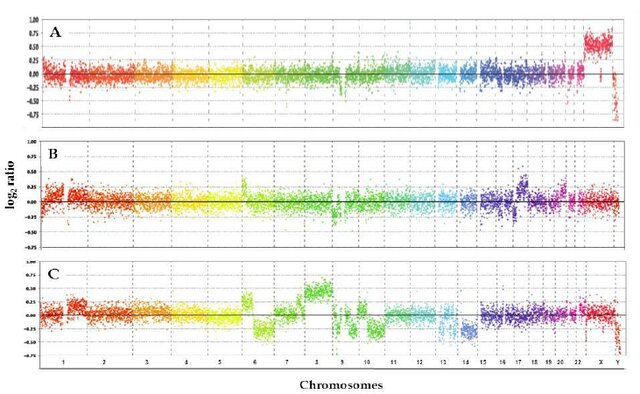
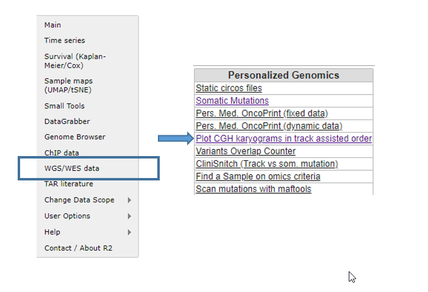
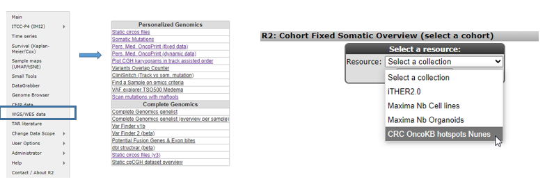
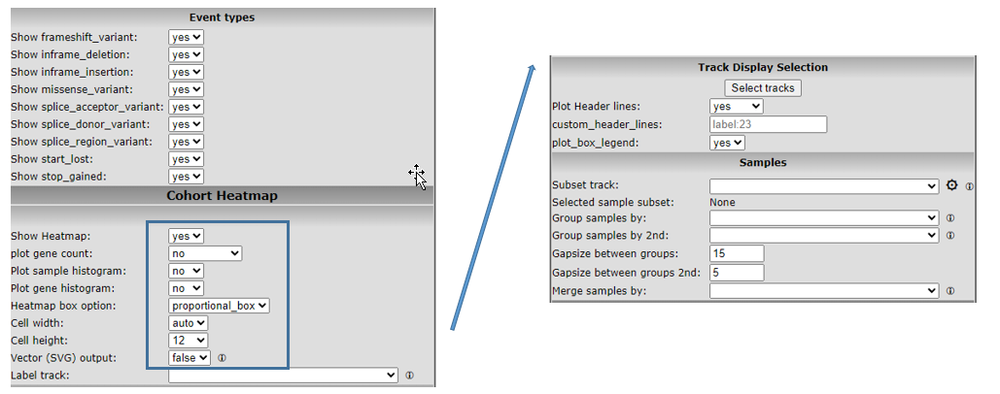
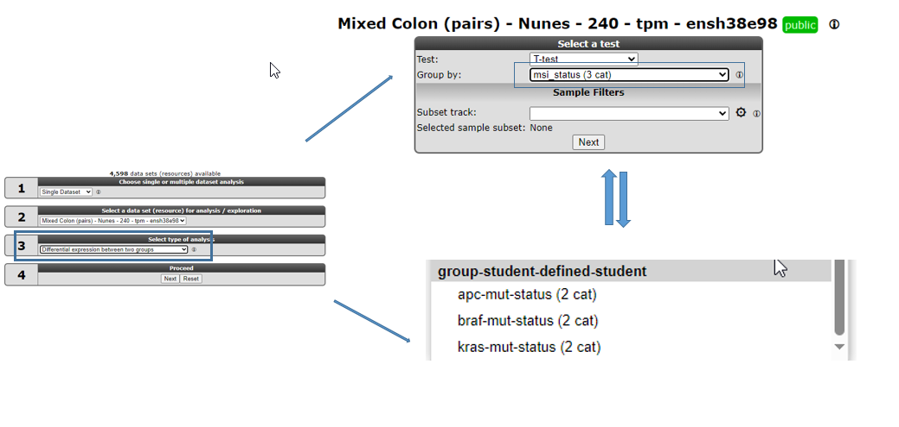

Molecular Oncology Course - Colorectal Cancer
=================================

*Analyse Colorectal Cancer using the R2 data analysis platform*

This resource is located online at http://r2platform.com/studentcourse  
 
  
Introduction
------------

In the late 1980s the Vogelstein model was proposed. It introduced the concept of a stepwise accumulation of genetic
mutations leading to the development of colorectal cancer (CRC).  

[**Accumulation of mutations advancing colorectal cancer development**](_static/images/MolOncCRC/CRCprogression_combined.jpg)

(Figure sources: https://doi.org/10.3390/ijms241311023, https://doi.org/10.1016/j.
tranon.2021.101131)

Similar to the picture above, the model highlights the importance of key genetic mutations during CRC progression, 
including mutations in APC, KRAS, and TP53. While the Vogelstein model has provided a valuable foundation for 
understanding colorectal cancer, subsequent research has revealed that the disease is more complex and heterogeneous 
than initially described. Colorectal cancer can involve various genetic and epigenetic changes. Additional 
factors, such as the tumor microenvironment, inflammation, and the immune system, also play significant roles in the 
progression of the disease.  
Colorectal cancer is the third most common cancer worldwide, according to the World Health Organization, accounting 
for approximately 10% of all cancer cases, and it is the second leading cause of cancer-related deaths worldwide. 

Research is needed to understand the mechanisms underlying treatment resistance and to develop strategies to
overcome it. Better identification and characterization of multiple CRC subtypes could guide treatment decisions and
improve the outcomes for individuals with colorectal cancer. Furthermore, markers for early detection and prevention
might allow for interventions before advanced mutations occur. Clearly it is crucial to understand the diversity and
complexity of colorectal cancer in order to develop new and effective targeted treatment strategies.   
Bioinformatics tools enable the analysis of vast amounts of omic and clinical data, helping researchers identify 
genetic mutations, epigenetic aberrations, biomarkers, and potential therapeutic targets in order to better understand 
and combat cancer. 

[**Web-based genomics analysis and
visualization platform R2**](_static/images/MolOncCRC/R2webplatform.png)

(Figure source: https://r2.amc.nl)

Today you will use advanced bioinformatics tools to explore, analyze and visualize colorectal cancer data in
search for a deeper understanding. You will use the freely available and web-based genomics analysis and 
visualization platform R2, a Core Facility of the Amsterdam UMC. R2 provides the user with many experimental and 
clinical data sets coupled to a wide variety of clickable bioinformatics tools. Without any coding you will gain
hands-on research experience with colorectal cancer omics data and bioinformatics tools.

The <button class="course_permalink">grey buttons</button> in this course will bring you to the R2 platform, often with
pre-set settings such that you can pick up an analysis easily. The <button class="course googleform">green
buttons</button> in this document will open up a Google form, one per section, with which you can submit your answers.

We would like to ask you to fill in the evaluation form about this R2 course during or at the end of the course. To open
the form, click the button below:

<button class="course googleform" onclick="window.open('https://forms.gle/kfiE5vQiDmhJVS1f8','_blank');" type="button">Open the Evaluation form</button>
 
 

## Normal colonic epithelium vs adenomatous tissue: a first impression of genomic data

Colorectal cancers are believed to arise predominantly from adenomas. A fundamental query in cancer research 
consistently revolves around understanding the distinctions between the transcriptomic profiles of normal tissue and 
tumor tissues. Let's get acquainted with R2 and its large collection of omic datasets while immediately exploring 
differences in gene expressions between normal colonic mucosa and colorectal adenomatous tissue.  

  [**Normal tissue, precancerous adenomas and cancer growth**](_static/images/MolOncCRC/genetic_alterations_and_the_progression_of_colorectal_cancer_fig2_e_cook.jpeg) 

(Figure source: https://doi.org/10.1126/science.1235122)

*Datasets used:*
* Mixed Colon - Marra - 64 - MAS5.0 - u133p2

### Filtering and exploring

* Open a Chrome browser and find your name behind your assigned number for the student account at <a 
  href="https://docs.google.com/spreadsheets/d/1VsANludkc3_ZgeF5bopq3ldzCv3BV1D7Mh_JWKfGHiQ/edit#gid=0" 
  target="blank">the student accounts check in form</a>
* Go to the R2 platform
  address: <a href="https://hgserver2.amc.nl/" target="_blank">https://hgserver2.amc.nl</a>  

Generally speaking, the R2 platform is easily accessible by the link <a href="http://r2.amc.nl" 
target="_blank">http://r2.amc.nl</a>, but today we work from out developer server hgserver2. 

* Sign in with your assigned account that you found in the student account Googledoc. 

You're now on the R2 main page. This genomics analysis and visualization platform contains a wealth of data and
bioinformatics tools to analyze the datasets. Step by step, researchers are guided through a web of options 
for data analysis with mostly clickable items. R2's main page shows this principle: follow the numbered 
boxes to develop your analysis of 
choice.  

Let's follow these steps to get a first look at gene expressions in one of the colon cancer datasets that is hosted in R2, a
dataset that is called "Mixed Colon - Marra - 64 - MAS5.0 - u133p2". 
Datasets have a structured naming in R2, using the following rules: 
Category - Tissue/ Tumor -  author - number of samples (N) - normalization - chiptype. 
In our case the dataset name tells us that the dataset contains 
normal and tumor samples (*mixed*) of *colon* tissue; *Marra* is the author and there are *64* samples.

* We leave Box 1 as is, because we will look only in a single dataset. 
* In order to find the above-mentioned dataset in R2, click on the text of the currently selected dataset in box 2. 

A grid pops up that shows all the datasets that are currently available to you. Each row is a dataset and
  each column contains a different searchable characteristic of the datasets. 
 In the bottom right corner of the grid, you can find the number of rows, i.e. available datasets.
*  Under the header *Tissue/Tumor* type the keyword **colon** in the white text-field filter, and check the adapted 
   number of rows in the bottom right corner to find out how many data sets R2 is hosting with the keyword colon in its name.
* Find the RNA expression dataset from *Author* **Marra** and click on the row of the dataset that 
  contains **64** samples (*N*). 
* In the information panel below the grid, you find more information about this 
  dataset. Quickly glance over the summary of the study. 
* Select the dataset with a click on the blue button **Confirm selection**. Check on the main page in box 2 that the 
  correct set has been selected.

Of course, it is nice to have a lot of RNA expression datasets to analyse and explore, but without proper sample 
annotation your have very limited analysis options. Let's explore the annotation for the Marra dataset.

* In box 3, select the analysis type **Cohort Overview** and click **Next**.
* In the grid, you can see all the samples in rows, with the available annotation in the columns. Scroll quickly down the 
grid to take a glance at the possible values for each annotation.

In R2, samples of a dataset can be annotated with e.g. clinical data or biological information. Each group of annotated
 data is called a **Track** in R2. These tracks can be used to filter, color or split data in all types of R2 analyses.

Above the grid you can find an interactive pie chart for each track. The pie charts present an overview of the track values in the dataset, detailing the percentage of samples in each category. You can hover over the tracks and click on a section to filter the grid underneath for samples with that track value. 
* Check the different group values in the pie chart of the tissue track and the proportion of samples for each group. 

[comment]: # (The tissue annotation of the Marra set can thus be used, for instance,  to find the differences between the gene
expression profiles of the adenoma samples and normal samples.)

 

The button below brings you to the form in which you can submit your answers for the first section.

<button class="course googleform" onclick="window.open('https://forms.gle/bezyoxAawZ6WU8cT9','_blank');"
type="button">Open the first answering form</button>
 
 

-----------------
***Group question***

>In the dataset information panel you could read in the summary of the Marra dataset: 
> 
>"Colorectal cancers are believed to arise predominantly from adenomas. Although these precancerous lesions have been 
> subjected to extensive clinical, pathological, and molecular analyses, little is currently known about the global gene expression changes accompanying their formation. 
> To characterize the molecular processes underlying the transformation of normal colonic epithelium, we compared the transcriptomes of 32 prospectively collected adenomas with those of normal mucosa from the same individuals." 
> 
> We had a look at the track tissue above. This track annotates which samples originate from **normal** mucosa and which were obtained from **adenomas**.
>* **Can you think of specific genes or pathways that you expect to show a difference in expression between the groups?**

------------------

### Find different expression profiles between normal and adenoma tissue

As you have seen above, R2 provides access to thousands of datasets. All these datasets can be readily analyzed with a comprehensive range of bioinformatics tools without coding. 
One of these tools is the "Find differential expression between groups". The differential expression analysis aims to identify genes which are 
significantly different between two groups of a dataset.    

* Click on **Main** in the upper left corner.
* Check if you have selected the **Marra** dataset with 64 samples in box 2 and in box 3 *select type of analysis*, **Differential expression 
  between two groups**. CLick **Next**.
* R2 offers a couple of statistical *Test* options, in this case we use the **T-test** which is selected by default.
* Now we have to select which grouping variable to use. Select *Group by* **Tissue (2cat)** to use the previously 
  seen tissue annotation. And click **Submit**.
* An extra field of settings is shown. Select *Group 1* **normal** and *Group 2* **adenoma**. Check that the default 
  _Transformation_ **Log2**  is selected, and _P-value cutoff_ **0.01**. Click **Submit**.

R2 has generated a large list of differentially expressed genes. On the right hand side of the page you find buttons to follow-up analyses,
and underneath the buttons are informative tables about the genes list. One table shows how many genes have higher 
expression in adenomas compared to healthy tissue and the other way around. 

------

**How many genes were significantly upregulated in adenomas and how many were 
downregulated?**

______

Next to the many publicly available datasets, R2 also hosts many curated lists of genes which we call 
**gene sets**. These gene sets can be used to restrict or filter an analysis as well. 
We can adapt our current search by scrolling down to the end of page, where you find the Adjustable Settings menu. You can now use a Gene set to 
restrict your list of differentially expressed genes between normal tissue and adenomas that is specifically associated with colorectal cancer.  

* Click on **Select gene set** and a grid box will pop-up.
* Use the search field on the top of the table and fill in **colorectal**, hit **enter**.
* [The KEGG (Kyoto Encyclopedia of Genes and Genomes) database]( https://www.genome.jp/kegg/pathway.html) is a comprehensive bioinformatics resource that 
  integrates information about genes, proteins, pathways, and diseases. Click on the triangles in front of KEGG 
  pathways and its subcollections, till you find the **Colorectal_cancer (62)** gene set. Check the checkbox in front of the gene set and hit the green **Confirm selection** button.
* Always click **Submit** afer you have changed something in the Adjustable settings menu in order for the changes to take effect.
* Check out the list and see if you recognize multiple genes. You can hover over the magnifying glasses in front of each row to learn more about the genes.
* Now click on the magnifying glass in front of **AXIN2** to obtain a violin plot with the scatter points of the expression value of this gene 
  for each sample in the dataset. 
  The plot shows the two groups of the tissue track in violin plots  with the individual sample values showing as scatter on top. If you hover your mouse over 
  any of the violins, you can see the group statistics. Also note you can hoover over the dots in the graph and the tracks to get more information of the individual samples.
* The green bar in the top allows you to easily go to next or previous gene of your list. Click on the **arrow with 
  MYC** on the right side of the green bar to view this gene's expression in the samples. 

------

**What did you observe about the gene expression of AXIN2 and MYC? When you think 
about biological processes, why would this be?**

______

The WNT pathway is an important signal transduction cascade which plays an important role in diverse biological 
processes. The dysregulation of the Wnt pathway has been observed in several cancers including colon cancer. 

### The WNT pathway

In the next sections we will regularly be using heatmaps to find subgroups of samples or genes that show 
similar expression profiles. Heatmaps perform unsupervised hierarchical clustering of samples. The algorithm uses the 
distribution of the (expression) data to find clusters that have similar (expression) profiles and shows the 
clusters of samples in the plot based on their (dis)similarity.
This is combined with the clustering of the genes based on their expression throughout the samples. The heatmap is 
colored by the z-scores of the samples' gene expression values. Often annotation tracks are shown above a heatmap. 
Remember that _we can_ see this annotation but that the _heatmap algorithm did not use_ this information to look for 
subgroups in the data. 

[**Example heatmap: finding subgroups in your data**](_static/images/TumorHeterogeneity_HeatmapClustering.png)

* Go back to the gene list result page of the previous Differential Expression between two groups analysis, the tab 
  should still be open. 
* Generate a list of genes which are differentially expressed comparing normal and adenoma tissue within the KEGG WNT 
  pathway by adjusting the settings if needed:
  - Use the False Discovery Rate for multiple testing correction, 
  - log 2 values 
  - and P <0.01. 
  - Click on the currently selected gene set, **Clear selection** with the red button and find the KEGG **Wnt** 
    pathway geneset (hint: use keyword **Wnt**). 
  Don't forget to hit **Submit** in order to redo the analysis with the new settings.

* Use the **Heatmap(zscore)** button on the right.   

------

**Inspect the heatmap did you expect this pronounced clustering?**

______

Now let's generate a Wnt pathway heatmap from a different route:
* Go to the main page
* Select the analysis **View Geneset (Heatmap)**
* On the next page, click on *Select gene set* to find the **KEGG** **Wnt_signaling_pathway**. Click **Submit**.

------

**What does the annotation above the heatmap tell you?**

**How and why does this heatmap differ from the previous Wnt pathway heatmap? 
(Hint: Which genes are you looking at exactly in each heatmap?)**

______

## Identifying groups and their characteristics: CMS

Let us now move past the precancerous stage of adenomas and look at colorectal cancer. Colorectal cancer is a complex 
and heterogeneous disease, characterized by a multitude of variations in its genetic, molecular, and clinical 
attributes. This heterogeneity manifests in diverse ways, influencing the tumor's behavior, response to treatments, and patient outcomes. Understanding this heterogeneity is critical for tailoring effective therapies and improving patient care. In this context, we will explore the various dimensions of heterogeneity in colorectal cancer and its implications for diagnosis, treatment, and research.  
  
In 2015, Guinney et al. (Nat Med. 2015 Nov; 21(11):1350–1356) published a bioinformatics study on a vast collection 
of colorectal cancer cohorts with detailed molecular annotation. The consortium developed a now widely accepted 
molecular classification system that allows researchers to categorize most colorectal tumors into one of four 
distinct and robust subtypes, each characterized by its unique biological features. These subtypes are: CMS1 (MSI 
Immune), CMS2 (Canonical), CMS3 (Metabolic), and CMS4 (Mesenchymal), see the figure below. 

[**Subtypes in colorectal cancer: CMS classification**](_static/images/MolOncCRC/CMS_classification_characterization_pmc7511559.png)

(source: http://dx.doi.org/10.1002/ags3.12362)

The button below brings you to the form in which you can submit your answers for the second section.

<button class="course googleform" onclick="window.open('https://forms.gle/SnVY3NPnjEeHCFhM9','_blank');"
type="button">Open the answering form for this section</button>
 
 

### Clustering with t-SNE maps

An unbiased unsupervised type of clustering analysis is a good starting point to familiarize yourself with a new
dataset. The t-SNE algorithm is an algorithm that was developed in recent years. It finds similarity in expression profiles of
samples and will place cells with similar expression profiles together on a map. 
In R2, these maps can be generated by users with an account. Once a dataset t-SNE has run, it is available to other users as well. This saves 
processing time and costs.   

We will use a dataset that was adapted from one of the resources of
 [The Cancer Genome Atlas (TCGA)](https://www.cancer.gov/ccg/research/genome-sequencing/tcga). They provide a wealth 
of omics data: "TCGA generated over 2.5 
petabytes of genomic, epigenomic, transcriptomic, and proteomic data. The data, which has already led to improvements in our ability to diagnose, treat, and prevent cancer, will remain publicly available for anyone in the research community to use."
* In the left side menu on the main page, click on **Sample maps (UMAP/tSNE)**
* In the grid, filter for the dataset **Tumor Colon Adenocarcinoma (students) - tcga - 204 - tpm - gencode36** and 
  click its **Select** button.

Under the graph, a menu allows the user to adapt settings.
Colors of the graph points are not set by default.

* Find the _Color mode_ dropdown and select **Color by Track**. Now set the 
  _Color track_ dropdown to use the
  **cms_predicted (4 cat)** track, and click **Set colors** to show the changes.

The most important parameter for the t-SNE algorithm is the perplexity value. The perplexity parameter controls 
the balance between a focus on preserving local details or global structures of the data. When R2 receives the 
  request to calculate the t-SNE map for a dataset, it immediately calculates and stores the t-SNE maps with 
different perplexity values. The resulting maps can be found under de setting 
  _Version_. It is also possible to show all the available perplexity maps for the dataset at the same time. 

* Set *Version* to the value **all**.  

------  

**What insight did you obtain when you colored the plot with annotation?**

**You looked at several embeddings of the t-SNE plot that were created with different perplexity values.
roughly what is your impression of the clustering of the samples. Why do you think it is good practice to check different values for a parameter?**

 
 

------  

Let's see if these cms subtypes that cluster separately on the t-SNE map hold any prognostic survival value. 

### Different survival chances for different CMS CRC subtypes? 
  
*Dataset used*
* Tumor Colon (CMS) - Guinney - 3232 - custom - ccrcst1

* In the left side menu on the main page, click on Survival (Kaplan-Meier / Cox)
* In the menu at the center of the page, click at the Data set setting on **Select a data set**, and find the dataset with *Author* **Guinney** and the amount of samples *N* is **3232**
* Click on the row to read its description in the information box underneath the dataset selection grid

* Leave *Separate by* at **categorical track (Kaplan-Meier)** and click **Next**
* Choose *Type of Survival* **overall** and *Track* **cms_final** and click **Next**
* Now perform the same analysis, but choose **relapse-free** instead of overall for the setting *type of Survival*  

------  

**What does the first Kaplan Meier plot tell you?**

**And what is your conclusion from the second Kaplan Meier graph?**
 
 

------

### Mutations
Now we would like to look into colorectal cancer associated mutations and see is they are specific for one of the CMS groups
* On the main page, select the Guinney dataset if it is not selected in box 2 yet
* Choose the **relate 2 tracks** analysis to show the different ratios of 
  mutations per CMS subtype.
* For the *X track* choose **cms_final (5 cat)** and for the *Y track* choose **mutant_braf (3 cat)** mutations.
* Select the *Graph type* **stacked barplot (%)**  
*The Guinney dataset contains several datasets put together. To only look at the samples from studies that looked at the 
mutational aberrations, use the Sample Filter with the setting *Subset track*, select **mutant_braf (3 cat)** and in the 
pop-up check the boxes of **0 (776) and 1(87)**. We thus eliminate the samples from this analysis for which it is not known whether they have a BRAF mutations (value nd gets omitted). Click 
  **Ok** and then **Submit**.

------  

**Which CMS group shows the highest amount of BRAF mutations?**
 
 

------

Now we will look at the KRAS mutations
* Underneath your stacked bar plot, scroll down to the **Adjustable settings** menu, change the *y-axis* to **mutant_kras**. 
* Use the red cross behind the setting *Subset track* to eliminate the braf mutation subset and click on the 
  dropdown to now select **mutant_kras**. In the pop-up check the boxes of **0 (560) and 1(336)** (thus omit the nd value samples), click **Ok**
* Click **Submit** to see the result

------  

**Which CMS group shows the highest amount of KRAS mutations?**
 
 

------

### A dive into CMS1: MSI / MSS in CRC

One of the characteristics of CMS I is MSI instability. Genomic instability in colon cancer can be divided 
into at least two major types: microsatellite instability (MSI) or chromosomal instability (CIN). Microsatellite 
instability (MSI) is caused by mutations in DNA mismatch repair genes such as MLH1, MSH2, MSH6, and PMS2, and it is found in 10% to 15% of sporadic colorectal cancers (CRCs). The presence of MSI predicts a good outcome in colorectal cancer.

In MSI colon cancer, genes of the DNA mismatch repair system play an important role. Germline mutations in these genes are a major cause of the inherited form of colon cancer, namely HNPCC (hereditary nonpolyposis colon cancer).  In sporadic forms of colon cancer however, these genes are frequently inactivated. Inactivation is often achieved via hypermethylation, switching the gene off. Hypermethylation of genes in colon cancer is most common in colon tumors with a proximal location in the colon and much less in colon tumors with a distal location.

The next section we will use another dataset. *"Tumor Colon- Watanabe - 84 - MAS5.0 - u133p2"*

This dataset consists of Microsatellite stable (MSS) tumors and microsatellite instable (MSI) tumors.

#### MSS vs MSI

* Find the dataset **Tumor Colon - Watanabe - 84 - MAS5.0 - u133p2** and read the **Summary** in the information panel underneath the dataset selection grid. 
* Then **Confirm selection** of the dataset.
* Use the **Differential expression between two groups** module to generate a list of differentially 
  expressed genes between **MSI** and **MSS** characterized tumors (*MS_status*). 

Because we know that DNA repair genes play an important role in microsatellite (in) stability, we can use a set of DNA repair genes to examine 
whether these genes indeed are differentially expressed between MSI and MSS tumors and which genes exactly make the difference. 
* With the **Select gene set** button, filter for **DNA repair** genes, and find them in **Categories**. There are 247 
  genes annotated as DNA repair genes. Perform the analysis by clicking on **Submit**.

------  

**Which gene is on top of the list?**

 

------

One of the genes that is differentially expressed, is MLH1. 
* Click on its magnifying glass to look at the expression of MLH1 in the MSI vs. MSS samples. 

------  

**In the list of differentially expressed genes, MLH1 is significantly lower 
expressed in the msi group vs the mss group: msi < mss.  
When you look at the expression plot of MLH1, what do you notice about the expression of the samples in this group? Do you see a clear-cut trend of lower MLH1 expression in the 
MSI group?**
 
 

------

MSI tumors give a very heterogeneous picture. This could be an indication that within the MSI tumor group 
also a subgroup could be identified. 

* Hover with your mouse over data points to see if you can identify a subgroup of an annotation track in which low MLH1 expression occurs more often.
* Scroll down to the Adjustable settings menu and change grouping setting _Track_ into **MS_orientation**. Click **Submit**

Let's visualize the relation between these dataset annotations inan other way. 
* Go back to the main menu and select **relate two tracks** and click **Next**. 
* Select for the _X track_ the **MS_status** and for the _Y track_ **Orientation** and click **Submit**. 

In the MLH1 expression graph we saw that low gene expression was not equally distributed within the MSI group. 
* Let's add this layer of information in this plot as well: select *Color mode* **Color by a Gene** and enter **MLH1** 
  as gene to color the plot. Click **Submit**.  

------  

**Concluding, with which two characteristics can you describe the subgroup that 
more often has a low MLH1 expression?**
 
 

------

In many cases of proximal colon cancer with MSI, the high level of microsatellite instability is caused by the loss 
of MLH1 expression. MLH1 inactivation can occur due to mutations in the MLH1 gene or through epigenetic changes, 
such as promoter methylation.  

In summary, the loss of MLH1 expression is a common mechanism leading to MSI in 
proximal colon cancer. Understanding the relationship between MLH1 expression and MSI is crucial for diagnosing MMR 
(mutation mismatch repair) deficiency, predicting prognosis, and guiding targeted therapies for patients with 
colorectal cancer.

Colorectal tumors with MSI do not have the same response to chemotherapeutics and are an important subgroup to look at for specialized treatments. 
In the Watanabe data set we found MLH1 as a possibly important player. We will now corroborate our findings in another dataset. Not only because this is an old set (look up  
the background information in the information panel of the dataset selection grid), but it is  common practice to 
validate your results with other sources. We will use a dataset that we already looked at with the t-SNE clustering 
algorithm.

#### MSI in tcga set

* Select **Tumor Colon Adenocarcinoma (students) - tcga - 204 - tpm - gencode36**

* Perform the **Differential Expression between two groups** analysis for **microsatellite_instability** (no vs 
  yes), and perform the analysis on the gene set **Broad 2020 09 c6 oncogenic**. **Submit**
* Click again on the MHL1 gene magnifying glass.

In this set too MLH1 seems to play a key role for MSI related CRCs. It would be interesting to find out which genes are possibly regulated by the MLH1 gene.
One way to find genes that are possibly affected by MLH1 is to look at (inversely) correlated genes.

#### Find genes correlating with a single gene

* From the main page, run the **Find Correlated Genes with a single Gene** module for the MLH1 gene. Use again
  the filter option for the **Broad 2020 09 c6 oncogenic** gene set. 

* On the result page, click on the best correlating gene to plot both genes together, in a two gene view. Inspect the correlation. Can you think of reasons why the gene expression is highly correlated?

* Click on **view additional details**, look at the Probeset Genome Location table.

On which chromosomes are both genes located?

* Click T-view and zoom out 2 times

You arrived at the Genome browser. The Genome Browser allows you to "walk over the genome".

Underneath the genome locations are annotated with the genes that are located at the specific location. Genes colored in red are read in reverse direction. 

------  

**What can you say about their location of the two genes?**
 
 

------

The correlating genes result page shows two columns: the positively correlating genes on the left, the negatively 
correlated genes on the right. Let's have a closer look at this last group.  

* Go back to your genelist of correlating genes (this should still be open in the previous tab) and scroll down to the Adjustable Settings menu at the bottom of the 
  page. Adapt here the setting *Corr. r cutoff sign* to only look at the **negatively** correlated genes. 
* Click on the currently selected gene set such that you can **Clear selection**
* Click **Submit** to update the result page. This might take a while. 

* Click the button on the right side of the page **Chromosome map**.

The over-representation is calculated of genes that negatively correlate with MLH1 expression with respect to all genes 
present on (an arm of) a chromosome.

* A lot of genes are clearly over-represented on a number of chromosomes, especially chrom 18 with a high p-value.

------  

**Which chromosomes show extreme significance in gene overrepresentation?**
 
 

------

Now let's see how strong MLH1 expression is associated with CMS subtypes.

* From the main page select the **Correlate Gene with a track** analysis to confirm the strong association of MLH1 
  expression with the CMS1 subtype (track **cms_predicted (4 cat)**).

#### DNA methylation

The R2 platform hosts a variety of dataset types. Not only gene expression datasets but also methylation arrays can 
be found.

* Go to the main menu and select the dataset **Tumor Colon adenocarcinoma - tcga - 296 - custom - ilmnhm450**

* Create the **View a gene** plot for **MLH1**
* Under the triangle of *View additional details* click on the **view all** link.
* Scroll down to the bottom of the page to make a *Subset track* selection with **microsatellite_instability** to 
  only select the samples that have been annotated for this characteristic (yes and no). Click **Next**.

A heatmap is generated of methylation levels. Each column corresponds to a sample, and each row corresponds to a 
feature (a single CpG site or a larger target region including multiple CpG sites, e.g. promoter regions). A 
hierarchical clustering of the samples is performed. The MLH1 reporters themselves seem faulty (complete blue colored rows), but you find CpG 
sites above that are located at the promotor sites of MLH1 and the gene that we have seen before as strongly 
correlating in expression. 

* Hover with your mouse over the _r2_at_cms_ track to see to which CMS subtype the cluster of hypermethylated samples 
  belong.  

------  

**Which cms group did you find?**

**Why are we looking at methylation levels around the promotor of MLH1?**
 
 

------

### What pathways drive subtype CMS4?

Previously we looked into CMS subtype 1. Let's now have a look at the other subtypes. We would like to understand what 
sets CMS 4 apart from the subtypes 2 and 3.

* On the main page, select **Tumor Colon Adenocarcinoma (students) - tcga - 204 - tpm - gencode36**
* Choose the *analysis* **Differential Expression Between Two Groups**.
* Choose the track **cms_predicted** and look at groups **cms2** and **cms4**
* The analysis can take a while. 

Gene set analysis helps researchers interpret the biological relevance of a group of genes. Instead of looking at 
individual genes, it allows you to understand the collective functions or pathway involvements of genes in your list. 
This can provide more meaningful insights into the underlying biology of a particular condition or experiment.

* Click on the top most button on the right that is labeled **Gene set analysis**.
* Select the *Gene set Collection* **Custom collection** and select *Gene set* **Broad 2020 09 h hallmark**
* Switch the *Representation* setting to **all** to look at both over- and under-representation
* Click **Next**

------

**Which gene sets do you recognize from the first column of the table? Name a few that are overexpressed in CMS 2 and name a few that are overexpressed in CMS 4.**

**Explain the biological relevance for the CMS4 subtype for these over- or/and underexpression of these gene sets for CMS4 subtype CRC tumors**

 
 

------

##  A song of Genomic Alterations en Oncogenes

Thus far we looked at colon cancer characteristics mainly based on gene expression. Recently,  there is a paper published were a large cohort of CRC patients described and analysed. The data used in this article comprehend  genome and transciptome data and on top of that this set is surprisingly well annotated with a lot of clinical information which is not often in de case.  [Nature 2024: CRC : Nunes et al](https://doi.org/10.1038/s41586-024-07769-3).

It is good common scientific practice to validate and check your analysis in other resources. We already have seen that the Molecular signature classification (CMS) are nicely clustered in the previous datasets.  Let's start to check whether this is also the case for the Nunes RNA seq dataset.

### Nunes data 

* Select on the mainpage Sample Maps (UMAP/tSNE) and select **Tumor Colon - Nunes - 1063 - tpm - ensh38e98**.
* Click on Select.
* In the plotted tSNE map you can take a look several versions (e.g:nn=5_mindist=0.3) and  select in "Color settings" , Color by track and select cms_tumour.
* Take a quick look at the graph may be check some  versions

It is nice to see that again the CMS clusters clearly separates this set into 4 clusters.

* Going back to the main of R2 the  **Nunes set**  should still be selected.
* Also check in the **Cohort Overview** the annotation to investigate  what kind is annotation is provided which could be handy to query this dataset.

Q: Do you see any interesting parameter(s) which have already been discussed during in the lectures (ignore all the metastasis tracks).

#### Genomic data.

Up to now, we have mainly looked at gene expression profiles,the Nunes data provides us with the means also to examine genomic data in more detail. 

In the context of colorectal cancer,  **Comparative Genomic Hybridization (CGH)** profiles are used to detect **copy number variation (CNV)** across the genome. Those CNV's include amplifications (gains) and deletions (losses). This type of genomic events can lead to overexpression of oncogenes and or loss of tumor suppression genes.

[**Example of CGH profiles:CGH profile of malignant melonama:  A is a Control sample**](_static/images/MolOncCRC/CGH_examples.jpg)

CGH profiling plays an important role in understanding CRC by revealing genomic instability which is a Hallmark of cancer. Since we could als obtain the genomic data, he CGH profiles could be generated and added to R2. Let's take a look at the CGH profiles to investigate if  we can say something about CGH properties when plotting the profiles per characteristic.

[**Selecting CGH profiles**](_static/images/MolOncCRC/WES-menu_nunes.png)

* On the main page select in left menu **WGS/WES data** and click on plot CGH karyograms intrack. Select CRC Nunes 2024 (copy number) and click next. A general CGH plot combining all the 1063 profiles  with Gains (in red) and Losses ( in Blue) is summarized in one plot.

Now let see how the CGH profiles look for the CMS sub-category.

* In second pull down men, select CMS_tumour and click redraw.

Q: looking CGH profiles, do you see a difference between the several CMS classifications for the CGH profiles, what do you observe.?

In cance, a high rate of mutations occur in the genome and could sometimes even reach hundreds and thousand of genes per megabase.  In general, tumors are classified as hypermutated when they exibit more than 10-12 mutation per megabase.  Also, this dataset is annotated for each patient with the hypermutation status.

* Again generate CHG profile for the hypermutation status.

Q: What do you observe??.

It has been shown that genome aberrations gains and losses do not completely overlap wit  hypermutation.

Q: Can you think of a reason why this does not correspond ?

This clearly shows that hypermutations do correlate negatively with the CGH profiles, unfortunately you can not identify which CMS class has a higher incidence.

* Analyse the cohort to see how the hypermutations are divided  for each sub-type.
  (relate two tracks)
* Go to **Relate 2 tracks**  in te main menu and select the hypermutation status and the CMS profiles.

Q: what do observe and was this expected when keeping the CGH profiles in mind
A: As expected and for CMS1 specific much less pronounced genomic aberrations are obeserved.

The CMS subclasses each have their own characteristics we have seen that the CMS2 class has a significant lower amount of mutations and we have already learned that the other CMS classes have a high incidence  of mutations including many oncodriver genes. But we cannot see in the hypermution group which genes are actually hypermutated.

Go the main menu , go to  WGS/WES and select Pers. Med. Oncoprint (fixed data) and as resource the CRC OncoKB hotspots Nunes.

[**Select oncoprint**](_static/images/MolOncCRC/select_oncoprint_nunes.png)

In this so called oncoprint Here we have an overview of most occurring mutations in our complete cohort since many CRC oncodriving genes haven been reported we can use R2 to investigate which mutations occur and also information about the mutations type like missence, nonsense, frameshifs, etc which are reported in detail.

Scrolling down, you will find in Settings menu all sort of interesting options you can toggle on/off wich revealing more insights of this cohort and CRC in general also adding extra tracks to plot on top of the oncoprint picture could be of interest.

[**Oncoprint Settings**](_static/images/MolOncCRC/Select_oncoprint_nunes.png)

Q: Name some genes which have been listed in the top.

### Somatic variants

To investigate mutations in each individual sample for this cohort. Select in the main menu the WES/WES module and select somatic mutations. 

* Select as variant hg38 - CRC nunes (Nature 2024) OncoKB only. If you choose as list mode summary you see immediately a list of genes which look familiar do you see genes which play in pivotal role in (CRC) cancers.

* Now switch to de detailed list mode and click 'next'. Here you see all the reported mutation with  their specifics at you disposal. In which patient is which  mutation reported. If you click on details view  of a patient at the  top this will guide you to the genomic location of e.g APC mutations if you zoom out 2 x  20 times. You see all the different reported mutations for the APC gene. Hoovering over the small coloured blocks you can also investigate the details for the different mutation categories.

KRAS and BRAF mutations are oncogenetic driver genes in cancer. Do the same for  KRAS and  BRAF, it is more convenient to enter the gene symbols in the box and click next.

Q: After some zooming what do you notice  when comparing  by eye balling the mutation of APC vs BRAF / KRAS.

Hoovering over de coloured blocks below the genomic location of BRAF reveals the mutation types.

Q: Which mutation type in BRAF is the most prominent. 

Up to now we have investigated the transcriptome and the genomics data separately except for  some annotation of hypermutations which was the result of the genomics analysis.

Q: If you want to find out what patient with or without a certain mutation have an effect on  pathway (in)activation of other means of gene regulation.  What do you need for further analysis in the R2 platform??. Suppose we want to find differential expressed genes with or without a mutated BRAF gene.

A: Annotate this cohort with the mutations for each patient.

In r2 you can easily use the somatic variation module annotate each sample with the mutation status in a cohort. So you can use all te mutations reported seen and take this to the geneexpression dataset(s). Below is pictured, as you have already used in the previous excercises how you can use these tracks (annotations) to find differentially expressed genes. Imagine the endless hours you can spend to find DEG genes you can find with performing these tests when you combine information of the genomic data together with the gene expression data. 

[**Using tracks in R2**](_static/images/MolOncCRC/BRAF_select_som.png)

### Signature scores

What are signature scores? A gene signature score is een predfined set of genes which are involved in a particular biological process, pathway of a set of genes as result of an analysis. 

To calculate a signature score, the expression levels of all genes in the signature are analyzed within a givensample. The calculation methods vary but often include:

* Average expression of the signature genes.
* Weighted sums where each gene’s contribution is weighted by its known importance.

A differential Expression gene analysys  has already been performed for APC mutants in the cohort versus non-APC mutants  in the Nunes set. We have already stored a list genes which are upregulated and will be used to find correlations for the sigature scores of other pathways.   Go the main screen and select the geneset correlation modules select the list activated genes in in Geneset(source) and for geneset (target) select the collection of broad 2023 Hallmark genesets. 

Q: Which pathway do you expect to pop-up as a result of this test. 

Click next. R2 is now performing  a correlation test on the signature score of the activated genelist in APC mutants against  the signature scores of all the genesets in the broad hallark collecting.

Q: Name other pathways in the list which you recognize and can be associated witg e.g CMS classes.

  

#### to use and remarks:

Q: Can you think of a reason why hypermutations occur less in tumor with genomic gains and losses and the otherway arround. 

Q:
- Can you think of  possible reason why in after a BRAF mut analysis the MAP/ERK which is activated pathy in the most of the tumors where you can find a BRAF mutation. (not detect with expression, phosphorylation)

opm: Plaatjes naar answers doc

- why are tumors with MSI hypermutated -> MSI broken DNA repair system -> lot of mutations -> Hypermutated

------

## Therapeutic: Effects of imatinib: shifts of signature profiles and molecular subtypes

Mesenchymal Consensus Molecular Subtype 4 (CMS4) colon cancer is associated with poor prognosis and therapy resistance.
In this proof-of-concept study, Kranenburg et al. assessed whether imatinib could shift cms4 subtype specific 
characteritics.  

The button below brings you to the form in which you can submit your answers for the third section.

<button class="course googleform" onclick="window.open('https://forms.gle/F3NgZSunnbJ8815k8','_blank');"
type="button">Open the answering form for this section</button>
 
 

We want to see how the expression changes between the pre- and post-treatment samples' expression of specific 
mesenchymal genes such as ZEB1, PDGFRA, PDGFRB, and CD36 :

* On the main page in the center menu, select the dataset **Tumor ImPACCT - Kranenburg - 30 - custom - ensh37e75**  
* Choose the analysis **View Multiple Genes** and click Next
* In the *Genes/Reporters to include* textbox, type **Zeb1,PDGFRA,PDGFRB,CD36**
* Set Track to **pre-post-imatinib** to divide the samples in the pretreatment and the posttreatment group and *Handle 
  groups 
  by* **lump by gene plot group** to show this per gene. 
* Set *color by* to **Track** in order to make the box plots visually more distinct.  
* Click next

------

  **What can you say about the level of expression of these genes post treatment?**

  **What is the role of ZEB1 in EMT? (Use Google or another informative source) 
  What is the biological implication of this experiment?**
  

------

### Proliferation vs metastases 

Mesenchymal tumor phenotypes are generally accompanied by reduced proliferation. Indeed, high expression of
proliferation signatures and Wnt target genes are associated with good prognosis and reduced metastatic capacity in CRC

* On the main page, make sure that the selected dataset is **Tumor ImPACCT - Kranenburg - 30 - custom - ensh37e75**
* Select the analysis **View Geneset (Heatmap)**
* In the *Gene set* selection grid, look in the sub gene set collections of **Broad 2023 10 h hallmark** for **HALLMARK_MYC_TARGETS_V1 (200)** and **Confirm selection**
* **Submit**

The heatmap for the z-scores of the expression values of the MYC targets geneset is shown. Underneath the heatmap 
you find the geneset average z-value per sample, also known as the signature score. With an account you can save 
such scores as a Track to use further analyses in R2. 

* Click on the **store** link in the small table, a bit underneath the heatmap.
* In the page that pop-ups, you can adjust settings 
* Check the name that is provided for this signature score: _hallmark_myc_targets_v1 and read the description
* We leave everything as is and click on **Build set**
  
Now that we have an average expression value for the MYC target genes per sample, we would like to assess how the treatment influenced these values.
* Go back to the main page
* Click **Relate 2 tracks**, click **Next**
* Select *X track* **pre-post-imatinib** and for the Y axis we choose the signature score that we just generated: *Y track* **hallmark_myc_targets_v1**
* Select *Graph type* **Dot**
* Change *Color mode (groups)* to **Color by Track** and click **Submit**
  
We also would like to know the influence of the treatment on WNT target gene expressions. 
* Do the same route, starting with View Geneset (heatmap), for the WNT target gene set: find **WNT_ImPACCT** that 
  you can find in the gene set collection **Community gene sets** (use the search field of the grid) and store the signature score as a track as well.
* Again perform the **Relate 2 tracks** just as in the previous exercise, this time with your WNT target gene signature on the Y axis.
* Optionally change the *Graph type* to another type that you want to try out

------

**What happened with the expression of WNT- and MYC-target genes post treatment?**

**Even though it is counterintuitive, can you think of a reason why this actually 
could be a better outcome than before treatment?**
 
 

------

### Assess the prognostic value of imatinib treatment
To assess the potential prognostic value of the treatment, we will make a signature of the genes that were changed 
after treatment. 

* On the main page, make sure that the selected dataset is **Tumor ImPACCT - Kranenburg - 30 - custom - ensh37e75**
* Select the analysis **Differential expression between two groups**
* Switch the *Group by* setting to **pre-post-imatinib** and click **Next**
* Choose *Group 1* **pre-imatinib (15)** and *Group 2* **post-imatinib (15)**
* Set the *P-value cutoff* to a stricter value: **0.001** and click **Submit**

A table shows the differentially expressed genes. On the right underneath buttons with followup analyses, you can 
find a small table that shows how many genes were downregulated by the imatinib treatment (imatinib: pre-imatinib >= 
post-imatinib) and how many genes were upregulated (imatinib: pre-imatinib < post-imatinib). 

------

**How many upregulated genes were found?** 

______

* To use this gene list in other analyses within R2, click on the lowest button on the right side that is labeled 
  **Store result as custom gene set**
* As a name, type **impacct_imatinib_treatment_up**
* In the *Included groups* check only the upregulated genes
* Click on **Save gene set**
  
The treatment resulted in a shift in gene expressions. To find out what the effect is of this shift, we will make 
use of the geneset of upregulated genes that we just saved, now in combination with the Guinney dataset, the 
cohort dataset with annotated CMS status and survival data. We use the unsupervised k-means algoritm to find groups 
in our cohort that show similar expression patterns for our geneset. 

* On the main page, select the Guinney dataset again
* Select the **K-means analysis** in *box 3* and click Next
* In the *Subset track* dropdown, select **stage**, and in the pop-up window check the boxes **2** and **3** , 
  click **Ok**
* Behind the setting *Gene set*, click **Select gene set** to find your previously 
  stored gene set under **Personal gene sets > _TEMPORARY > impacct_imatinib_treatment_up**. Check the box in front of your gene set and **Confirm selection**.
* We leave the number of groups at 2 
* Set the *Cell width* to **1** and *Cell height* to **8** and click on **next**

The Kmeans algorithm looks at the expression of the samples for the selected genes and makes two groups of samples 
that show most similar expression patterns. Then for each gene it shows the expression by a color code

------

  **Which color group would you say shows high expression and which color group shows 
  low expression of the geneset? 
  (Thus, high: yellow or purple and low: yellow or purple)**

______

Again this group division can be stored in R2 to use in a next analysis. 
* To do so, hit the button **Store as track** that you can find on the left above the k-means heatmap  
* On the following page, just click the button **Next**
* To save the results in a way in which we will easily remember what the track was for and which group showed which
  expression, change the name of *Group 'cluster 1'* into **high** and of *Group 'cluster 2'* into **low**. Also 
  change *Track name* into **kmeans_imatinib_induced**
* Click on **Build set** and go back to the main page

Let's see which CMS subtypes are represented in the two k-means sample clusters
* On the main page, select the analysis **Relate 2 tracks**
* For the *X track* scroll all the way down and select **kmeans_imatinib_induced (3 cat)**
* For the *Y track* choose **cms_final (5 cat)**
* In the *Subset track* dropdown, select **stage**, and in the pop-up window check the boxes **2** and **3** ,
  click **Ok**
* Change the *Graph type* into **Stacked bar (%)** and use *Color mode (groups) **Color by Track**
* *Order Groups by* **group size** and hit **Submit**

------

**If the impact of imatinib shows a shift of the geneset from low expression to 
high expression values, what shift in CMS subtypes do we expect to see?**

**What is known about the treatability of subtype 4 and cms 2 respectively?**

______
  
 
* From the main page in the left menu click the **Survival (Kaplan Meier/Cox)** analysis
* Check that the Guinney set is selected and that the separation is made by **a categorical track**. Click **Next**
* Choose *overall* survival type and *Track* **kmeans_stage23_imatinib_induced** (scroll all the way down). Click **Next**
  
* In the left menu click again the **Survival (Kaplan Meier/Cox)** analysis
* Repeat the process but select the **relapse free** instead of *overall* survival type. 

------

**What is your conclusion?**

______

## Identifying key drivers of CRC: superenhancers controlling gene expression

An enhancer is a 50-1500 bp region of DNA where activator proteins, such as transcription factors, bind and that 
increase the likelihood transcription will occur at a gene. They can be located up to 1 Mbp away from the gene, 
either upstream or downstream from the start site, and either in the forward or backward direction. A super-enhancer 
consists of multiple enhancer regions. This larger region is bound by more transcription factor proteins to drive 
transcription of genes. They can be up to 20 times the size of an enhancer.  
In chapter [Integrative analysis: ChIP-seq data](https://r2-tutorials.readthedocs.io/en/latest/Integrative_analysis_ChIP-Seq_data.html) of the R2 Tutorial, you can find a more detailed description of Chipseq data analysis. 
  

enhancers of a gene")

[**The histone modifications of active promoter sites and
(super-)enhancers of a gene**](_static/images/MolOncCRC/enhancer_histonemods.png)

Enhanced enhancer activity can lead to the overexpression of oncogenes, which promotes cancer growth. Super-enhancers 
often play a central role in determining cell identity and tumor initiation and progression. Identifying these active enhancers can help pinpoint key drivers of colorectal cancer, potentially revealing new therapeutic targets.  
Different patients may have colorectal tumors with distinct enhancer landscapes. By characterizing enhancer activity, researchers can potentially classify patients into subgroups with different treatment responses or prognosis, enabling personalized medicine approaches.

With Chromatine Immuno Precipitation binding of elements to the genome can be studied. Transcription of DNA to RNA
is regulated by the binding of these elements. These can be Transcription Factors, that bind temporarily to start
transcription, but also chemical modification of the histones (molecular structures that coil the DNA) by methylation, acetylation, etc. These modifications change the accessibility of the DNA for transcription.
  
When a specific antibody is used in ChIP-seq that recognizes these chemically modified regions, these specific 
regions can be studied. Regions with H3K27Ac acetylation mark active enhancers and active promotors (i.e. active
transcription), H3K4Me3 methylation marks active promotors. Studying the relative contributions of both types of 
modifications allows a researcher to discern enhancer regions from active transcription sites.

* From the main page left side menu, select the module **ChIP data** and click on **ChIP Genome Browser** 
<br.
You are now at the Genome Browser at the genomic location of the gene MYCN.
Regions encoding genes are drawn at the bottom of the graph. When in red they are encoded in the reverse direction, 
  coding exons are darker. 

Li et al. (2021) sequenced 73 pairs of colorectal cancer tissues and generated 147 H3K27ac ChIP-Seq, 144 RNA-Seq, 147 
whole genome sequencing and 86 H3K4me3 ChIP-Seq samples. The patients were classified into the 4 CMS subtypes. 
Therefore, we now have gene expression and chipseq data of this CMS classified patient cohort. Because it is 
difficult to look at many profiles at the same time, we averaged the data per CMS group. This way we created so 
called _ChIP seq meta profiles_. Let's load them into your Genome Browser
* In the right upper corner, click the button **Load / Store Profile**
* In the Profile dropdown, select **student - Li_CRC_normal_tumor_cms1234** and click **Execute**. 
* Click on the button **Goto the GenomeBrowser** at the top.

You now see the meta profiles of normal colon tissue, and CMS 1 to 4 meta profiles. For each group you see both 
H3K27ac and H3K4me3. If you scroll down, you can see that you are at the location of the MYC gene. At an active 
promotor site, you will find H3K4me3 peaks. You will also find peaks in the H3K27ac profiles at that location. _But_ 
at an active enhancer site, you will _only_ find H3K27ac, **no H3K4me3**. Thus left from the myc gene location, you see
H3K27ac peaks without H3K4me3, and that is a known superenhancer location of MYC. 
Let's look for more superenhancers:

* In the left upper corner, you can write the name of a gene, and you will be taken to its location on the genome. 
  Type **ascl2** in the textfield and click **Go**
* Click the **View** button (if there are more View buttons, just take the top one) and scroll down to check that 
  you have arrived at ASCL2.
* Now we need to zoom out to find possible superenhancers. Zoom out 10x with the button on top of the page. Then 
  zoom out 5x. Do you see an area with high peaks of H3K27ac where no H3K4me3 can be found? There is a superenhancer.

The difficulty is that you never know how far away from the gene the superenhancer is located. Also, it can be 
upstream or downstream from the transcription start site of the gene. And... you might even find enhancer regions in 
the introns of some oncogenes. 

Lastly, above the ChIP-seq profiles, you can also find the averaged z-score of the gene expression of the subgroups 
of patients. Hover your mouse over the colored dots to see to which group they belong and of which gene it shows the 
average expression. This way you can see whether the expression itself differs between the CMS groups, and between 
normal colon tissue and tumor tissue. 
 
Ideally you should find oncogenes or transcription factors that are differently expressed in tumor tissue and normal 
tissue, and also show different enhancer profiles between normal and tumor tissue.

 
---

**Play around with the GenomeBrowser. Look for genes that you might remember from 
the lectures and see if you can find superenhancer areas. Also check if you can see differences between the CMS
groups, and try to explain the differences. Did you find an interesting gene and how much did you need to zoom out?**

______

* If you need some inspiration, you could check out genes from this list: IL20RA, LIF, IER3, PLAGL2, FAM3D, TNS1... 
* Search the internet as to why these could be interesting genes to look up. 

## Optional exercise: Experiments TP53 - Molecule of the year 1994

Nearly half of human malignancies harbor mutations in tumor suppressor gene p53, mutations that facilitate and promote
metastasis, tumorigenesis, and resistance to apoptosis.

These mutations generally lead to loss of DNA binding and an inability to transactivate
canonical anti-proliferative p53 target genes.
Genotoxic chemotherapeutics, like doxorubicin and etoposide, are clinically relevant activators of wild-type p53,
but the potential risk of resistance and secondary malignancies due to increased mutational burden
remains a significant concern. Given the powerful tumor suppression abilities of p53, restoration of the
p53-regulated transcriptome without inducing additional DNA damage represents an intriguing approach for development
of anticancer strategies and therapeutics.
Nongenotoxic, small molecule activation of the p53 pathway has been proposed as
a potential solution.

TP53 mutations were found in 60% of the CRCs. However, gene set enrichment analyses indicated that their transcriptional consequences varied among the CMSs and were most pronounced in CMS1-immune and CMS4-mesenchymal.

### TP53 activation

In the coming analyses we will use the dataset: 
**Exp Colon Cell Lines (TP53 +/-) Nutlin-3A-etoposide - Sammons - 30 - DESeq2_rlog - tpm109geo**.

In this expriment, 4 drugs were tested that can be diveded in two types.  
Etoposide:  Clinically relevant activators of wild-type p53. Activates p53 via induction of  DNA double strand
breaks. Initiation double strand breaks but leads of course to resitance and secondary malignancies.
Nutlin-3A:  MDM2 inhibitor nutlin-3A to activate wild-type p53 in a non-genotoxic, considered a proto-oncogene.

**Integrated stress response pathway:**

Effector of anti-proliferative and cell death expression programs

Tunicamycin: Activates the ISR (integrated stress response pathway), via ER stress of accumulating
Histidinol: Activates the ISR (integrated stress response pathway), via histinide depletion.

* ATF3 mRNA and protein levels increased under both p53 and ISR stimulating treatments
  in HCT116 WT cells
* A second approach uses compounds like the MDM2 inhibitor nutlin-3A to activate wild-type p53 in a nongenotoxic
* TP53 is mayor player of one of the tumor supressor mechanisms.
* Both the p53-dependent and the ATF4-driven ISR gene networks are antiproliferative,
  either through induction of apoptosis or cell cycle control

* Check the TP53 level in this dataset. Is the dataset grouped by a different p53 expression.

* Analyse which genes are affected by the compounds

Let's start with drugs known to interact with tp53. In college also MDM2 has been mentioned as negative P53 regulator.
If you want to find differentially expressed genes in Tp53 dependent background which subgroups do you have to select. Once again use the Differential expression between two groups. For now we only focus on a small part of this experiment using Nultin-3a, a therapeutic agent which is a known P53 regulator via MDM2 inhibition. For this analysis we only want to use the TP53 wt genotype, since we want to inspect the effect of Nutlin-3a in a TP53 background.

* Group by treatment and filter for TP53 wild-type. Click submit and select the two groups in the DESeq2 test (default) use the DMSO vs Nutlin-3A group.**

* Do you see the MDM2 gene ?.

* Inspect the MDM2 level in a one gene view are you surprised ?

* In the left menu you can store your found list of 162 genes with the "store result as custom geneset" button and save it with a proper name in temporary collection (default) for later usage.

* Also check the relation with TP53 by using the gene vs gene option in the pull down menu.

*  A very significant correlation. Can you think of a reason? Hint:you are looking at RNA expression levels, how does nutlin 3a inhibits MDM2 ???

Optional:  You can also perform the same test for Etoposide as you did for Nutlin-3A and store this list as well. So it is obvious that the innersection of genes for both drug treatments are of potential interest. With the VENN-diagram of gene categories option in box 3 of the main menu  you can check for overlapping genes. After selecting the VENN diagram try to find your stored genelistswith GS button, User genesets > Temporary etc.

* Check of there is an overlap between affected genes

Exp Colon Cell Lines (TP53 +/-) Nutlin-3A-etoposide - Sammons - 30 - DESeq2_rlog - tpm109geo

## Evaluation

Please don't forget to fill in the evaluation form, which is the first form that you found in this document, about 
this R2 course.

---------

## Final remarks / future directions

This ends the course. Feel free to further explore the course materials or our tutorials.
  
We hope that this course has been helpful. If you want to have your genomics data visualized and analyzed using the R2
platform you can always consult r2-support@amc.nl
  
The R2 support team.

