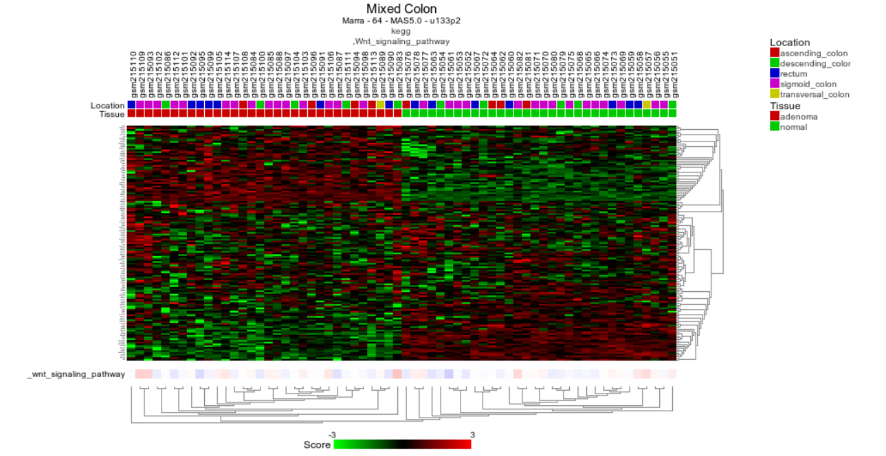
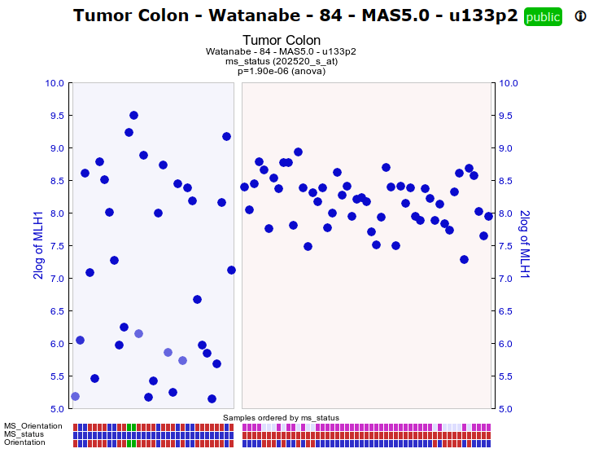
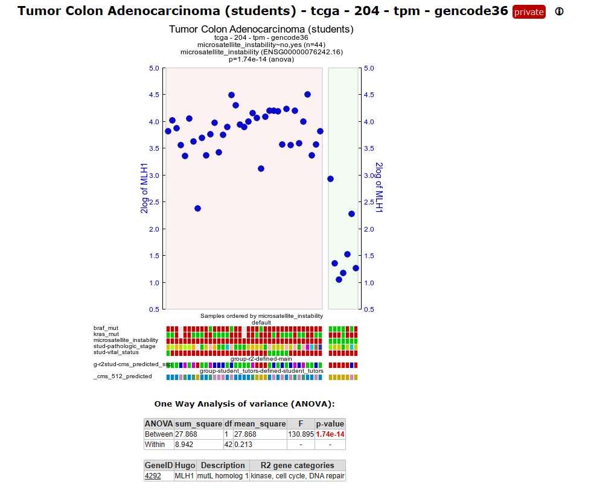
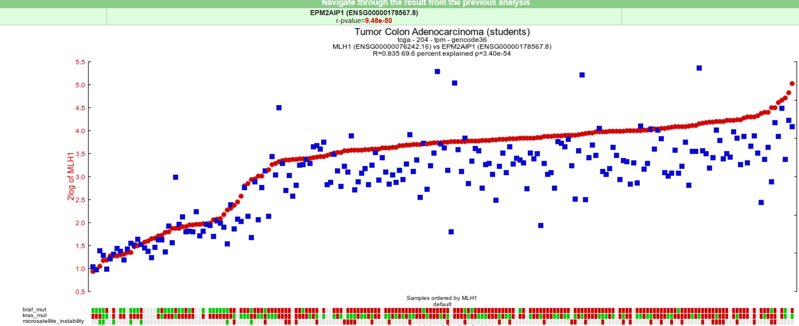
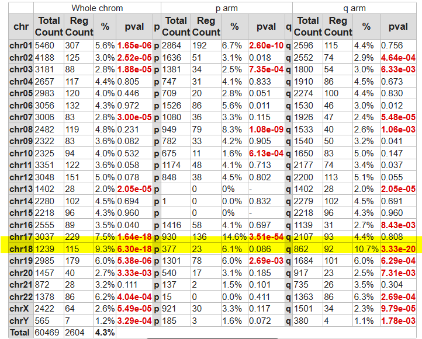

Molecular Genetics Course - Colorectal Cancer
=================================

*Analyse Colorectal Cancer using the R2 data analysis platform*

This resource is located online at http://r2platform.com/mgcourse  
 
  
Introduction
------------

I
## Normal vs Colorectal Tumor Tissue: a first impression of genomic data

A fundamental query in cancer research consistently revolves around understanding the distinctions between normal 
and tumor tissues. Let's get acquainted with R2 and its large collection of omic datasets while imimediately exploring 
differences in gene expressions between normal tissue and adenoma tumor tissue.

**Datasets used:**
  
* Mixed Colon - Marra - 64 - MAS5.0 - u133p2
* Tumor Colon Adenocarcinoma (students) - tcga - 204 - tpm - gencode36

### Filtering and exploring

*Number of  Colon sets 

**A:225**

* How many sets has R2 when you only look for colon methylation sets.

**A:7**

* Using Cohort Overview module

**practice**

*How many genes have been found in total? How many were upregulated in adenomas and how many were downregulated?*

**A: A list of 8000 regulated genens has been found.** 
  
**A small tabel shows the numbers of up and down regulated genes. ~4058 vs 3939**. 

*What did you observe about the gene expression of AXIN2 and MYC?*

**Both are upregulated in the Adenoma group**

A:

### The WNT pathway

Generate a list of genes which are differentially expressed comparing normal and adenoma within the WNT pathway KEGG, use the False Discovery Rate for multiple testing correction, log 2 values and P <0.01. Find the **Wnt pathway** by clicking again the GS (Gene set button) and search by key word for Wnt or go through the KEGG pathways. 

* How many genes are up / down regulated.

A:
33
32

* Inspect the heatmap did you expect this pronounced clustering?*

A:

[**Biased heatmap**](_static/images/MolGenCRCmarra_biased_wnt.png )

**Yep, the genelist was biased  als result of the Student T-test.**

In this test the WNT pathway was not really significant but still in the list at the bottom. One of the reasons why this is the case, is that in this case not all the genes  are assigned to the KEGG WNT pathway. Or that the pathway genes are in this case not sufficient to access pathway activity. However, visualizing the gene expression still hints you towards WNT pathway involvment. 

* Go to the main screen select generate a heatmap and select the wnt path way from the text database.

A:
.
[**Un-biased heatmap**](_static/images/marra_unbiased_wnt.png )

The samples are clearly seperated in Normal vs Adenoma. It's different and less pronounced compared to the previous heatmap you generated.  Do you think this is special? , Why or Why not.

* In what way is the heatmap your generated different compared to the previous one.  

## Identifying groups and their characteristics: CMS

### Clustering with t-SNE maps

An unbiased unsupervised type of clustering analysis is a good starting point to familiarize yourself with a new
dataset. The t-SNE algorithm is an algorithm that was developed in recent years. It finds similarity in expression profiles of
samples and will clump cells with similar expression profiles together on a map.

* Click the button below to show the t-SNE map in R2:

[**TSNE CMS :CMS clusters**](_static/images/MolGenCRC/temp/tSNE204_create_permalink_later.png)

**What insight did you obtain when you colored the plot with annotation?**

* The Colon tcga set can be sub divided by CMS clustering

**Why do you think it is good practice to check different values for a parameter?**

* Perplexity settings change the local and global shape of the clusters. It is good practice to investigate more perplexity settings to see how this affects the visualisation. Trying more perplexity settings can be usefull to find a more meaningfull representation fo your data. Keep in mind that the distance between the clusters are NOT informative in contradiction to U-map clusters. 

### Different survival chances for different CMS CRC subtypes? 

*What does the first Kaplan Meier plot tell you?*

[**Kaplan Meier
result, different survival chances for different cms groups. r**](_static/images/MolGenCRC/temp/KaplanMeier_guinney_cmssurvivalchances_delete_later.png)

There are significant survival differences for the different CMS clusters

* Now perform the same analysis, but choose **relapse-free** in stead of overall for the setting *type of Survival*  

[**Figure 2: Kaplan Meier
result, different relapse free Kaplan Meier curves for different cms groups. ToDo: delete later**](_static/images/MolGenCRC/temp/KaplanMeier_Guinney_cms_relapsefree_delete_later.png)

This also holds for relapse free survival with clearly separated apart the CMS4 group. OS curves focus on overall mortality from any cause, while RFS curves specifically track the time until a particular
event (e.g., disease relapse) occurs. In this casse you can see that CMS 4 has the worst prognosis, both for overall
survival probability and for relapse free survival.

------  

------

### Mutations

* Which CMS group shows the highest amount of Braf mutations?
CMS 1 has the highest amount of K-ras mutations

[**Braf and Kras mutation ratios per CMS**](_static/images/MolGenCRC/temp/braf_and_kras_mutation_percms_guinney_stackedbars_delete_later.png)

ToDo: what more can I do with mutational analyses? https://r2-tutorials.readthedocs.io/en/latest/Pathway_Finder.html?highlight=mutation#step-3-finding-pathways-relevant-to-subgroups
Pahwayfinder by group leads here too to Axin

[**Figure 2: temp image,  followup analysis Braf mutation -> WNT pathway, Axin2**](_static/images/MolGenCRC/temp/brafmutation_followup_analysis_pathwayfinder_wnt_AXIN2_delete_later.png)

* Which CMS group shows the highest amount of KRAS mutations?

*KRAS mutations accous most often in the  CMS 3 subgroup.*

### A dive into CMS1: MSI / MSS in CRC

Dataset used: The next section we will use another dataset. * "Colon Tumor - Watanabe - 84 - MAS5.0 - u133p2"*

This dataset consists of Microsatellite stable (MSS) tumors and microsatellite instable (MSI) tumors.

#### Watanabe dataset

* **Select "Colon Tumor - Watanabe - 84 - MAS5.0 - u133p2"**

* Which one is in top list.

A: TYMS

**A:**

MSI tumors give a very heterogeneous picture. This could be an indication that within the MSI tumor group also a subgroup could be identified. Which one do you think ??. (note: Inspect the tracks or hoover)

**A:**
The proximal annotated group within the MSI 

Taking a close look at te other tracks below the graph you already get an idea what might be the case. R2 has an analysis tool called *relate two tracks* where you investigate the relation between dataset annotations. Go back to the main menu and select **relate two tracks** and click next.  Select for the X-track the MS_status  and for the Y_track MS_Orientation and click next. 

Here the relation between Orientation and MSI is plotted and for the statistics a Fisher Exact test has been performed.

* In the previous question we saw the MLH1 expression was not equally distributed within the MSI group, select in Color mode,  Color by Gene and enter MLH1 and click submit.  What do you see?.

A:

This clearly illustrates the relation between MSI/MSS subgroups and MLH1 expression. Also here you can see that the distal group has a higher MLH1 expression

[**relate two tracks : MLH1 expression**](_static/images/MolGenCRC/relatedtwotracks_msi.png)

In many cases of proximal colon cancer with MSI, the high level of microsatellite instability is caused by the loss of MLH1 expression. MLH1 inactivation can occur due to mutations in the MLH1 gene or through epigenetic changes, such as promoter methylation. In summary, the loss of MLH1 expression is a common mechanism leading to MSI in proximal colon cancer. Understanding the relationship between MLH1 expression and MSI is crucial for diagnosing MMR deficiency, predicting prognosis, and guiding targeted therapies for patients with colorectal cancer.

So we have identified an important player as discussed in college. You have just selected the Watanabe set. Inspect the background information and look at the data this dataset has been generated. This is very old set, of course this set still of biological relevance we will also try to find we can find out we can validate this other sets. Not only because this is an old set, but it is always common practice in Research practice to validate your results with other sources

#### MSI in tcga set

Select **Tumor Colon Adenocarcinoma (students) - tcga - 204 - tpm - gencode36**

* Perform the **Find Differential Expression** for **Microsatellite_instability**, select in the GS button filter > Broad 2020, oncogenic and click again the MHL1 gene.

A:

[**204 set: MSI status only**](_static/images/MolGenCRC/chrommap.png)

So clearly it seems that MLH1 plays is a key role and is possible affecting other genes also in other independent generated datasets, 

* One way to find out which genes are possibly regulated by the MLH1 gene is to find genes which are (inverse) correlated with this gene.

#### Find genes correlating with a single gene

* Run the Find correlated genes with a single gene module for the MLH1 gene do not forget to use the filter option for Broad 2020: Oncogenics further use.  the default settings. 

A:

[**List of genes correlating with MLH1**](_static/images/MolGenCRC/chrommap.png)

* Then click on the best correlating gene to plot both genes together, in a two gene view. Inspect the correlation. Can you think of reasons why the gene expression is highly correlated/

**A:**

* Click on **view additional details**, on which chromosomes are both genes located

**A:**
Chrom 3.

* Click T-view and zoom out 2 or 5 times, what can you say about their location of the two genes. 

[comment]: <> (hier een klein text bruggetje waarom we de volgende stap doen?).

The MLH1 gene expression affects clearly some important pathways. In case you want to find genes which 

* Go back to your genelist of correlating genes and select only **neg corr** genes and click chrom map, do not use a filter this take some seconds.

**A:**

* A lot of genes are clearly over-represented on a number of chromosome, especially chrom 18 with a high p-value.

**A:**

[**Chromosome 18 instability**](_static/images/MolGenCRC/chrommap.png)

chrom 18 loss is linked to msi/mss instability

#### DNA repair system

Because we know that DNA repair genes play an important role in microsatellite (in) stability, we can use a set of DNA repair genes to examine whether these genes are differentially expressed between MSI and MSS tumors. Go back to the previous settings for "Finding differentially expressed genes" and then select from 'GeneCategory' the ‘DNA repair’ genes. There are 247 genes annotated as DNA repair genes.

* Go back to the MLH1 correlating genelist make sure you have preselected the DNA-repair genes. CLick submit. Click on generated a heatmap. And do you see a clear associated with a CMS subgroup ?, and which one.

A:

[**DNArepair**](_static/images/MolGenCRC/dnarepair.png)

* and take look at the CMS classification !!! what do you see ?? are you surprised
CMS4, MSI had been associated with CM1 and CMS4

In one of the first questions in this course we have seen there is an association with the genomic location. We have seen that a low MLH1 expression is associated with CRC subtypes. As briefly touched, the R2 platform has many types not only gene expression but also methylation arrays. Go to the main menu and select

*Tumor Colon adenocarcinoma - tcga - 296 - custom - ilmnhm450*

* Plot the one gene view for MLH1, do you see something special ?

* In the Alternative box, unfold additional details,  click on the view all link below MLH, here a nice heatmap is plotted of the methylation ratios's what do you see.

* A lot of samples are unfortunately not all the samples are annotated for Microsatelite instability, filter for those samples only and click submit. The MLH1 reporters for this gene (only 4), seem all methylated however, most likely these are not well designed and can maybe not distinguish for the proper MLH1 reporters. However look at the other reporters on the same location, we also see a gene name we encountered before. Do you see an association with MSI/MSS.

A:

May be a little , maybe you expected CMS1 classification but also CMS4 has been associated with MSI. 

  

### What pathways drive subtype CMS4?

Which gene sets do you see pop up and are they over or under expressed in CMS 4

[**Figure 3: temp image of result Gene set analysis, todo remove**](_static/images/MolGenCRC/temp/GeneSetAnalysis_create_permalink_later.png)

------

**Which gene sets do you see pop up and are they over or under expressed in CMS 4?**

**Explain the biological relevance for the CMS4 subtype for these over- or/and underexpression of these gene sets for CMS4 subtype CRC tumors**

 
 

------

## Experiments TP53; Molecule of the year 1994

T

Dataset being used: 
**Exp Colon Cell Lines (TP53 +/-) Nutlin-3A-etoposide - Sammons - 30 - DESeq2_rlog - tpm109geo**.

4 drugs are used:

The four drugs can be diveded in two types.

### TP53 activation

* Check the TP53 level in this dataset. Is the dataset grouped by a different p53 expression
A:

  [**TP53 gene**](_static/images/MolGenCRC/relatedtwotracks_msi.png)

* Analyse which genes are affected by the compounds

Let's start with drugs known to interact with tp53. In college also MDM2 has been mentioned as negative P53 regulator. 
If you want to  find diffentially expressed genes in Tp53 dependent background which subgroups do you have to select.

A: Select Nutlin-3a for the comparison and the P53 WT

[**List**](_static/images/MolGenCRC/relatedtwotracks_msi.png)

* Do you see the MDM2 gene ?.

* Inspect the MDM2 level in a one gene view  are your surprised ?

[**MDM2 gene**](_static/images/MolGenCRC/relatedtwotracks_msi.png)

* Also check the relation with TP53
  
[**MDM2/TP53 gene**](_static/images/MolGenCRC/relatedtwotracks_msi.png)

*  A very significant correlation. Can you think of a reason? Hint:you are looking at RNA expression levels, how does nutlin3a inhibits MDM2 ???

A: protein interaction

* And why is also TP53 increased ? TP53 is not effected so you get a positive feedback loop on RNA expression level/

A: ubiquitination

* 

* down regulated TP53 pathways and apoptosis pathway

* Check of there is a overlap between genes affected

Exp Colon Cell Lines (TP53 +/-) Nutlin-3A-etoposide - Sammons - 30 - DESeq2_rlog - tpm109geo

  

## Effects of imatinib: shifts of signature profiles and molecular subtypes

ToDo: Remove picture

[**View multiple genes 4 gene signature**](_static/images/MolGenCRC/temp/impacct_Viewmultiplegenes_4genesign_result_delete_later.png)

------

  **What can you say about the level of expression of these genes post treatment?**

  **What is the role of ZEB1 in EMT?**
  

1)expression of specific mesenchymal genes such as ZEB1, PDGFRA, PDGFRB, and CD36 was strongly and significantly 
reduced after imatinib treatment (here you cant read teh significance - we could choose a different visualization  
2)- Zinc finger E-box binding homeobox 1 (ZEB1) is a transcription factor that promotes tumor 
invasion and metastasis by inducing epithelial-mesenchymal transition (EMT) in carcinoma cells. EMT not only plays 
an important role in embryonic development and malignant progression, but is also implicated in cancer therapy 
resistance.  
PDGFRA, PDGFRB, PDGFC, and KIT, identifies CMS4 CRC with very high sensitivity and specificity

------

### Proliferation vs metastases 

[**relate two tracks**](_static/images/MolGenCRC/temp/wnt_up_post_imatinib_relate2tracks_optionalanalysis_impacct.png)

[**optional relate two tracks**](_static/images/MolGenCRC/temp/myc_up_post_imatinib_relate2tracks_optionalanalysis_impacct.png)

### Assess the prognostic value of imatinib treatment

------

**How many upregulated and how many downregulated genes were found?** 

**A**
442 and 222
______

* To use this genelist in other analyses within R2, click on the lowest button on the right side that is labeled 
  *Store result as custom gene set*
* As a name, type **impacct_imatinib_treatment_up**
* In the *Included groups* check only the upregulated genes
* Click on **Save gene set**
  
The treatment resulted in a shift in gene expressions. To find out what the effect is of this shift, we will make 
use of geneset of upregulated genes that we just saved, now in combination with the Guinney dataset, the 
cohort dataset with annotated CMS status and survival data. We use the unsupervised k-means algoritm to find groups 
in our cohort that sow similar expression patterns for our geneset. 

* On the main page, select the Guinney dataset again
* Select the **K-means analysis** in *box 3* and click Next
* In the *Subset track* dropdown, select **lv_stage**, and in the pop up window check the boxes **2** and **3** , 
  click **Ok**
* Behind the setting *Gene set*, you find the button **Search GS**. Click on the button and find your previously 
  stored gene set under **User gene sets > - > impacct_imatinib_treatment_up** and hit the green button on the left 
  to use the selected gene set
* We leave the number of groups at 2 
* Set the *Cell* width to **1** and click on next

The Kmeans algorithm looks at the expression of the samples for the selected genes and makes two groups of samples 
that show most similar expression patterns. Then for each gene it shows the expression by a color code

  

  [**Figure 4: kmeans result, todo remove**](_static/images/MolGenCRC/temp/impacct_kMeans_result_delete_later.png)

------

  **Which group would you say shows high expression and which group shows low 
expression of the geneset?**

**ToDo: remove answers**  
The yellow group is high (red) and the purple group shows low expression on average (blue)
The genes seem to be quite well coregulated in the two groups, one groups seems to have upregulation and one group 
shows downregulation. 
______

ToDo: Remove picture

[**Relate 2 tracks shows a shift
from CMS 4 to cms 2, todo remove**](_static/images/MolGenCRC/temp/impacct_relate2tracks_stackedbars_delete_later_stage23.png)  

------

**If the impact of imatinib shows a shift of the geneset from low expression to 
high expression values, what shift in CMS subtypes do we expect to see?**

**What is known about the treatability of subtype 4 and cms 2 respectively?**

**ToDo: remove answers**  
A shift from mostly CMS 4 to to mostly CMS 2  
CMS 4 is more  CMS4 tumors have the highest propensity for developing distant metastases, and CMS2 has better prognosis
______
  
ToDo: not sure we want to include this analysis
  
* From the main page in the left menu click the **Survival (Kaplan Meier/Cox)** analysis
* Check that the Guinney set is selected and that the separation is made by **a categorical track**. Click **Next**
* Choose *overall* survival type and *Track* **kmeans_stage23_imatinib_induced**. Click Next

[**Survival
chances that are linked to the gene shift, todo remove**](_static/images/MolGenCRC/temp/KaplanMeier_stage23_overall_impacct_kMeans_result_delete_later.png)

* In the left menu click again the **Survival (Kaplan Meier/Cox)** analysis
* Repeat the process but select the **relapse free** in stead of *overall* survival type. 

[**Survival
chances that are linked to the gene shift, todo remove**](_static/images/MolGenCRC/temp/KaplanMeier_stage23_relapsefree_impacct_kMeans_result_delete_later.png)

------

**What is your conclusion?**

**ToDo: remove answers**  

**Better survival chances** 
______

## Identifying key drivers of CRC: superenhancers controlling gene expression

An enhancer is a short (50-1500 bp) region of DNA that can be bound by proteins (activators) to increase the 
likelihood transcription will occur at a gene. They can be located up to 1 Mbp (1,000,000 bp) away from the gene, 
either upstream or downstream from the start site, and either in the forward or backward direction. A super-enhancer 
is a region of the mammalian genome comprising multiple of these enhancers, collectively bound by an array of 
transcription factor proteins to drive transcription of genes, often involved in regulation of cell identity. They 
can be up to 20 times the size of an enhancer.  
In chapter [Integrative analysis: ChIP-seq data](https://r2-tutorials.readthedocs.io/en/latest/Integrative_analysis_ChIP-Seq_data.html) of the R2 Tutorial, you can find a more detailed description 
of Chipseq data analysis. 
  

[**Survival chances that are linked to the gene shift, todo remove**](_static/images/MolGenCRC/temp/IntAnalysis_ChIPSeq_ModificationTypes.png)

(Fig source: https://www.nature.com/articles/s12276-020-0428-7)

Enhanced enhancer activity can lead to the overexpression of oncogenes, which promote cancer growth. Super-enhancers 
often play a central role in determining cell identity and tumor initiation and progression. Identifying these active enhancers can help pinpoint key drivers of colorectal cancer, potentially revealing new therapeutic targets.  
Different patients may have colorectal tumors with distinct enhancer landscapes. By characterizing enhancer activity, researchers can potentially classify patients into subgroups with different treatment responses or prognosis, enabling personalized medicine approaches.

With Chromatine Immuno Precipitation binding of elements to the genome can be studied. Transcription of DNA to RNA
is regulated by the binding of these elements. These can be Transcription Factors, that bind temporarily to start
transcription, but also chemical modification of the histones (molecular structures that coil the DNA) by methylation, acetylation, etc. These modifications change the accessibility of the DNA for transcription.
  
When a specific antibody is used in the pulldown that recognizes these chemically modified regions, these specific regions can be studied. Regions with H3K27Ac acetylation mark active enhancers and active transcription, H3K4Me3 methylation marks active and poised transcription (Figure 2). Studying the relative contributions of both types of modifications allows a researcher to discern enhancer regions from active transcription sites.

* Click on the button below to show the ChIP-Seq data for VEGFA in the four mesenchymal and five adrenergic neuroblastoma cell lines. For your convenience the signals are colored according to the type (MES or ADRN) of cell line.

ToDo: create new button to go to VEGFA

<a class="course_permalink" href="https://hgserver2.amc.nl/cgi-bin/r2/main.cgi?permalink=course_molgen_chipseq_gb_hand1_9_mes_adrn" target="_blank">Go to R2 GenomeBrowser for HAND1</a>
 
 

Regions encoding genes are drawn at the bottom of the graph. When in red they're encoded in the reverse direction, coding exons are darker.

## Single cell?
Maybe? Mixed Colon Adenoma-carcinoma - Shi - 43981 - cp10k - 10x300hg38
"Adenoma-carcinoma sequence is a well-accepted roadmap for the development of sporadic colorectal carcinoma. However, cellular heterogeneity in aberrant epithelia and the complexity of tumor microenvironment limited the understanding of carcinogenesis. Here we performed a scRNA-seq survey from patient-matched samples, including blood, normal, para-cancer, polyp, and cancer tissues."

[**cell populations were visualized using t-SNE plots based on the cluster, tissue origin, and patient origin, todo remove**](_static/images/MolGenCRC/temp/Shi_-Singlecell.png)

## Evaluation

Please don't forget to fill in the evaluation form about this R2 course, if you haven't done so yet:

<button class="course googleform" onclick="window.open('https://docs.google.com/forms/d/e/1FAIpQLSflNJpsTcLIhwEC0ZlHksfnE0VwBay1I2KOGPArYu4Q_QhtrA/viewform?usp=sf_link','_blank');" type="button">
Open the Evaluation form</button>

---------

# Final remarks / future directions

In the March 1st 2018 issue of Nature a paper was published describing a landscape of genomic alterations across
childhood cancers. The data is accessible in R2 also as a Datascope. This is another example of how R2 can visualize
your genomics data.
  
This ends the course. Feel free to further explore the course materials or our tutorials.
  
We hope that this course has been helpful. If you want to have your genomics data visualized and analyzed using the R2
platform you can always consult r2-support@amc.nl
  
The R2 support team.

