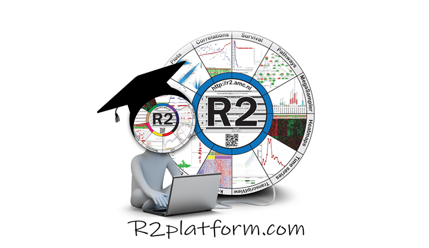

From presentation to your own analysis
=======

Overview
---
The presentations provide a quick glance over most functionalities of R2. Many of these functionalities are described in the [Online Tutorial](https://r2-training-courses.readthedocs.io/en/latest/) as well.  

You might wonder how to do the shown analyses yourself. The links below connect the topics of the presentation directly to the respective chapters in the tutorial where step by step instructions guide you through an analysis, which you can perform online within R2 yourself. 

During these steps features related to the respective topic will be introduced, such as additional analyses or visualizations, thereby conveying the ease of using the interconnected R2 interface.   

You choose which modules you find interesting and try them out following the step by step guides on the R2 platform. Above all, we encourage you to tweak the guides to your interest: find datasets that are closely related to your research topic and play around with the modules; fill in settings (genes, gene sets, chromosome locations etc) that are aligned with your research questions. 
  
Please find an overview of the chapters per presentation topic below:  
  
* [First presentation](https://r2-training-courses.readthedocs.io/en/latest/R2IntroductionWorkshop.html#first-presentation)  
* [Second presentation](https://r2-training-courses.readthedocs.io/en/latest/R2IntroductionWorkshop.html#second-presentation)
* [More advanced topics](https://r2-training-courses.readthedocs.io/en/latest/R2IntroductionWorkshop.html#third-presentation)  
  

First presentation
--- 
  
**Basics of R2:**  

[Dataset Selection](https://r2-tutorials.readthedocs.io/en/latest/Using_Datasets.html)   

[View a Gene](https://r2-tutorials.readthedocs.io/en/latest/One_Gene_View.html)  

[Sample Filter](https://r2-tutorials.readthedocs.io/en/latest/One_Gene_View.html)  

[Clinisnitch](https://r2-tutorials.readthedocs.io/en/latest/One_Gene_View.html)  

[Sample Extremes](https://r2-tutorials.readthedocs.io/en/latest/Handyparts.html)  

[View all reporters](https://r2-tutorials.readthedocs.io/en/latest/One_Gene_View.html)  

[Graphics settings/ Track visibility](https://r2-tutorials.readthedocs.io/en/latest/One_Gene_View.html)  
  
**Differential Expression:**  

[Differential Expression](https://r2-tutorials.readthedocs.io/en/latest/Differential_Expression.html)  

[View a gene in groups](https://r2-tutorials.readthedocs.io/en/latest/One_Gene_View.html)  
  
[Differential expression between two / multiple groups](https://r2-tutorials.readthedocs.io/en/latest/Differential_Expression.html)  

[KaplanScanner](https://r2-tutorials.readthedocs.io/en/latest/Kaplan_Meier.html)  

[Genes correlating with your gene of interest](https://r2-tutorials.readthedocs.io/en/latest/Correlating_Genes.html)  /  
[Gene Ontology analysis](https://r2-tutorials.readthedocs.io/en/latest/Correlating_Genes.html) / 
[Gene set analysis](https://r2-tutorials.readthedocs.io/en/latest/Correlating_Genes.html?)  

[Chromosome map](https://r2-tutorials.readthedocs.io/en/latest/Correlating_Genes.html)  

[Storing of the result as personal gene set](https://r2-tutorials.readthedocs.io/en/latest/Correlating_Genes.html) / [Finding your custom and saved genesets](https://r2-tutorials.readthedocs.io/en/latest/Adapting_R2.html#step-3-create-your-custom-genesets)  

[Heatmap](https://r2-tutorials.readthedocs.io/en/latest/Using_And_Creating_Genesets.htmlp)  
  
  
**Correlations with a gene:**  

[Correlate with a gene](https://r2-tutorials.readthedocs.io/en/latest/Correlating_Genes.html)  

[PubSniffer](https://r2-tutorials.readthedocs.io/en/latest/Correlating_Genes.html)

[Timeseries](https://r2-tutorials.readthedocs.io/en/latest/Analysing_Time_Series.html)  

[2d distribution](https://r2-tutorials.readthedocs.io/en/latest/Multiple_Datasets.html)  

[Correlating two genes](https://r2-tutorials.readthedocs.io/en/latest/Correlating_Genes.html)  
  
[View multiple genes](https://r2-tutorials.readthedocs.io/en/latest/Multiple_Genes_View.html#multiple-genes-view)  

[Annotation analysis and views](https://r2-tutorials.readthedocs.io/en/latest/Annotation_Analyses.html)  

[Survival analysis: Kaplan Meier / KaplanScan](https://r2-tutorials.readthedocs.io/en/latest/Kaplan_Meier.html)  

[PathwayFinder](https://r2-tutorials.readthedocs.io/en/latest/Pathway_Finder.html)  

[View a geneset/ cluster multiple genesets](https://r2-tutorials.readthedocs.io/en/latest/Using_And_Creating_Genesets.html)

Second presentation
---
**Cohort subgroups:**  

[Toplister](https://r2-tutorials.readthedocs.io/en/latest/Using_And_Creating_Genesets.html)

[K-means clustering](https://r2-tutorials.readthedocs.io/en/latest/K_Means_Clustering.html#k-means-clustering-in-r2)

[Principle Component Analysis](https://r2-tutorials.readthedocs.io/en/latest/Principle_Components_Analysis.html)  

[Sample Maps: t-SNE and UMAP](https://r2-tutorials.readthedocs.io/en/latest/tSNE_dimensionality_reduction.html)

[Timeseries](https://r2-tutorials.readthedocs.io/en/latest/Analysing_Time_Series.html)  

[Signature Scores](https://r2-tutorials.readthedocs.io/en/latest/Using_Signatures.html) /  
[Geneset vs Geneset correlation](https://r2-tutorials.readthedocs.io/en/latest/Using_Signatures.html)  
  
  
**More than 1 dataset:**  

[MegaSampler / MegaSearch](https://r2-tutorials.readthedocs.io/en/latest/Multiple_Datasets.html)  
  
  
**Genome Browser:**  

[Genome Broswer](https://r2-tutorials.readthedocs.io/en/latest/Using_The_Genome_Browser.html)  
  
  
**Datascopes**  

[Datascopes](https://r2-tutorials.readthedocs.io/en/latest/DataScopes.html)  
  
  
**Adapting R2**  

[Custom Genesets](https://r2-tutorials.readthedocs.io/en/latest/Adapting_R2.html#step-3-create-your-custom-genesets)  
  
[Custom Tracks](https://r2-tutorials.readthedocs.io/en/latest/Adapting_R2.html#step-5-upload-your-own-tracks)  
  
[R2 Communities](https://r2-tutorials.readthedocs.io/en/latest/Adapting_R2.html#step-6-cooperate-through-r2-sharing-tracks-creating-communities)  

[Export Data with the Datagrabber](https://r2-tutorials.readthedocs.io/en/latest/Exporting_Data.html)  
  
  

More advanced topics 
---
The following are not part of the Basics workshops, but they could be interesting topics for some researchers

**Integrative Analysis**  

[ChIP-seq data](https://r2-tutorials.readthedocs.io/en/latest/Integrative_analysis_ChIP-Seq_data.html)

[Across Platforms](https://r2-tutorials.readthedocs.io/en/latest/Integrative_analysis_expression_methylation.html)  

[Somatic mutation data: WGS/NGS](https://r2-tutorials.readthedocs.io/en/latest/Integrative_analysis_WGS_data.html)  
  
[Dataset Extender](https://r2-tutorials.readthedocs.io/en/latest/Integrative_analysis_expression_methylation.html#step-2-correlate-two-datatypes)

[WGS: circos files](https://r2-tutorials.readthedocs.io/en/latest/Integrative_analysis_WGS_data.htm)  

[Histone modification patterns: TSS graphs](https://r2-tutorials.readthedocs.io/en/latest/Integrative_analysis_ChIP-Seq_data.html#step-3-exploring-histone-modification-patterns)  

[Super-enhancers](https://r2-tutorials.readthedocs.io/en/latest/Integrative_analysis_ChIP-Seq_data.html#super-enhancers)  

