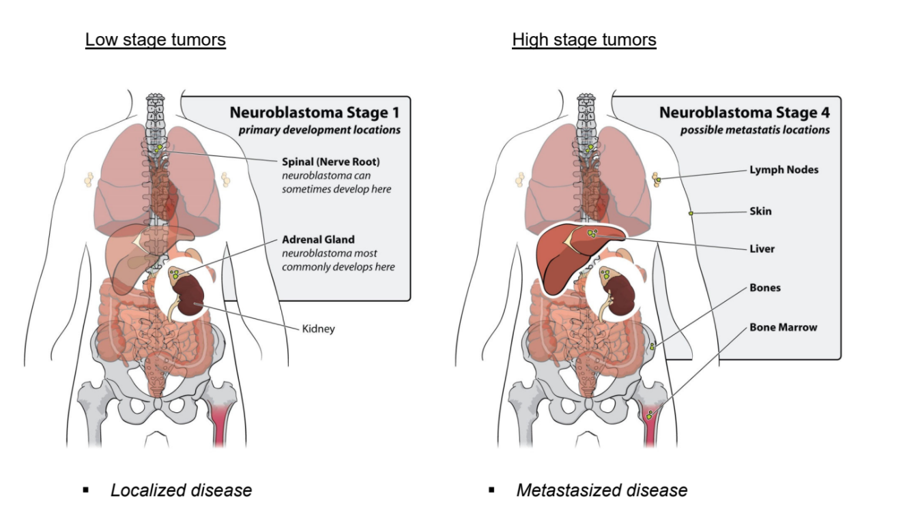
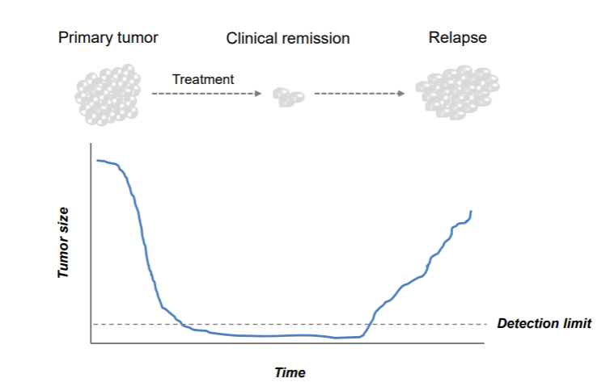
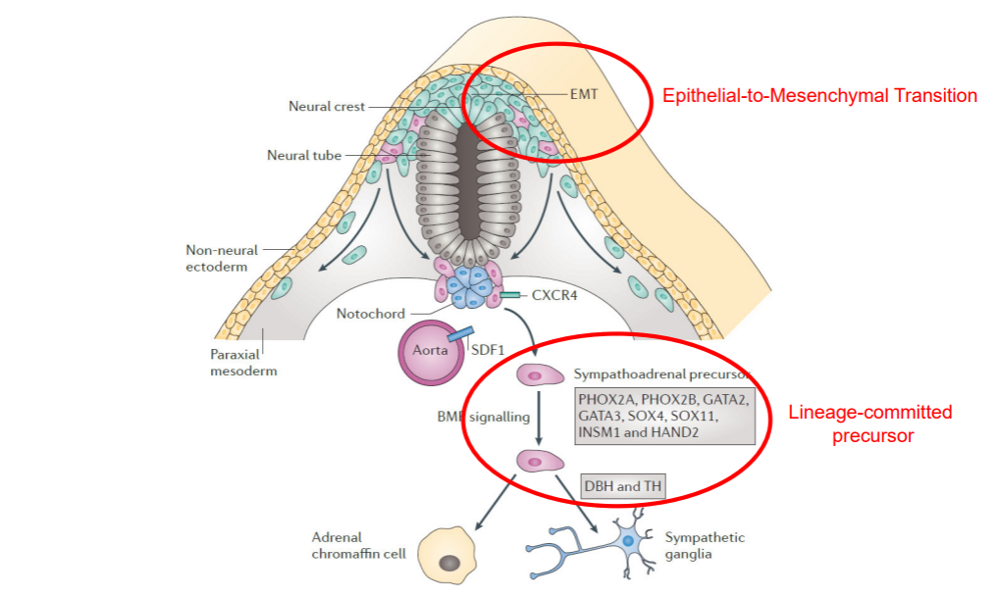

<a id="R2IntroductionWorkshop_day1"> </a>

Finding causes in Neuroblastoma genomics data
=================================

*Introduction to bioinformatics tools using the web-based genomics analysis and visualization platform R2 and neuroblastoma data*

This resource is located online at <a href="http://r2-training-courses.readthedocs.io" target="_blank">http://r2-training-courses.readthedocs.io</a>. 
<br><br>If you encounter discrepancies between the instructions in this course and the R2 platform options, please <a href="https://hgserver1.amc.nl/cgi-bin/r2/main.cgi?option=about_contact" target="_blank">let our R2 Support Team know</a>. We continuously enhance the platform by adding new functionalities and refining existing features. As a result, our documentation and course instructions may occasionally fall behind.  
<br>We very much appreciate your feedback. 

Introduction
------------


##### Neuroblastoma 

Neuroblastoma is a childhood tumor of the peripheral sympathetic system. Primary tumors typically occur in 
 the adrenal glands, which are located on top of the kidneys, but they can also manifest in other areas of the body. Most patients are diagnosed between the age of 0 to 4 years.<br>
Neuroblastoma patients are classified by The International Neuroblastoma Staging System, the INSS. The increment in stages does not reflect progression of disease, as is the case for colon cancer, but represents different characteristics of the disease. Stage 1, 2 and 3 neuroblastomas have a very good prognosis. Stage 4 neuroblastomas usually go into complete remission upon therapy but often relapse as therapy-resistant disease. About 40% of stage 4 neuroblastoma have an amplification of the MYCN oncogene. This implies that instead of two DNA copies, each neuroblastoma cell has 30 to 100 copies of the MYCN gene. In addition to stage 1, 2, 3, and 4 neuroblastomas, there is the unusual stage 4S neuroblastoma, which is metastasized but goes into spontaneous regression. Over the last twenty years, the outcome for stage 4 neuroblastoma patients has not substantially improved.<br>
<br>
  	

  [**Figure 1: Low stage versus high stage neuroblastoma**](_static/images/Vagabond/Vagabond_lowvshighstages_neuroblastoma.png)


Several cancer types, such as pancreatic cancer and colon cancer, follow a multi-step process involving a series of genetic alterations, similar to Vogelstein’s multi-step genetic mutation framework as shown below. 
These mutations accumulate over time and lead to the transformation of normal cells into cancerous cells. 


[**Figure 2: Mutation paths during cancer progression**](_static/images/TumorHeterogeneity_CancerProgression.jpg)

Extensive research into possible mutation mechanisms in neuroblastoma has been conducted, including by the AMC Oncogenomics group. Unfortunately, no such mechanism has been identified for this often deadly childhood tumor.

##### Finding differences and biological processes

One of the technologies that can be used to study a disease or biological process is gene expression profiling. With this high-throughput method, we can measure the mRNA expression of nearly all known genes in a single experiment. We aim to identify distinct subgroups within our data, discover genes that drive differences between them, and uncover cellular pathways that are activated in neuroblastoma patients with an unfavorable prognosis.<br>


##### Research questions

During this practical course, we will use the R2 platform to investigate two research questions:
1. Which genes distinguish the different neuroblastoma subgroups? 
2. Which molecular pathways are activated in neuroblastoma patients with an unfavorable prognosis?

##### Go to the R2 platform

* Go to <a href="http://r2.amc.nl" target="_blank">http://r2.amc.nl</a>
* Optionally login with your R2 credentials. 

You're now on the R2 main page. This web-based molecular biology data analysis platform contains a wealth of data and methods to analyze these datasets. Step by step, researchers are guided through a web of options for data analysis. R2's main page shows this principle: step through each of the numbered boxes to develop your analysis of choice.  
<br><br>
The <button class="course googleform">green buttons</button> in this document will open up a Google form, one per section, with which you can submit your answers. 
<br><br>

## Finding prognostic factors in your data
### Overview

*Data used:*  
* 88 Human Neuroblastoma samples (Tumor Neuroblastoma public - Versteeg - 88 - MAS5.0 - u133p2)

*Techniques used:*   
* mRNA Microarray expression

*Analysis used:* 
* Finding correlating genes with a single gene
* Finding differentially expressed genes
* Kaplan Meier curve by annotated parameter

<br>

### Selecting datasets

Let's first make sure that the correct dataset is selected.
1. On the main page, you find a menu in the middle of the page that consists of several boxes.  
2. Verify that in **Select a data set (resource) for analysis / exploration** (Box 2) the following dataset is selected: *Tumor Neuroblastoma public - Versteeg - 88 - MAS5.0 - u133p2*. If not, follow the steps below. 

<br> 

If you see a different dataset selected, you can change the dataset as follows:  

1. Click on the selected dataset to open a grid displaying all the datasets that are available to you within the platform. Each row represents one dataset and each column shows particular characteristics of that dataset. You can filter datasets by using the column headers. <br>
2. In the 'Author' column search box, type *Versteeg* and in the 'N' column (number of samples), type 88.
3. Click on the row of corresponding dataset, then click the blue **Confirm Selection** button.

---------

### Investigating single genes / Expression of key genes
The button below brings you to the form in which you can submit your answers for Section 1.2. 

<button class="course googleform" onclick="window.open('https://docs.google.com/forms/d/e/1FAIpQLSe0J5IjCWcYPo3pzqevTrtkvZtQQd-Ls4VVJJR8yMhtYjxWog/viewform?usp=header','_blank');" type="button">Open the form for Section 1.2</button> 
<br>
<br>
It is known that amplification of the *MYCN* gene is associated with a poor prognosis. We will now  
analyze the mRNA expression of *MYCN* in the selected dataset. We will use the R2 analysis module 'One Gene View'.
1. On the main page in **Select type of analysis** (Box 3) select *View a gene*, which is also the selected analysis by default. Then click **Next**.
2. For this analysis, R2 needs to know which gene and reporter to use. Fill in the text field **Gene / Reporter** the gene name of our interest: *MYCN*. Click on the corresponding gene and reporter combination from the dropdown menu.
3. Leave the remaining settings unchanged. Click **Submit**.  

The resulting scatter plot shows the mRNA expression values of *MYCN* for all tumors of the 88 patients, ordered by increasing expression.  

- The expression is given on a log scale by default. To switch to a linear scale, scroll down to the "Adjustable Settings" under the plot. In the field **Transformation**, select *None* and click **Submit**. 

#### Tracks

Dataset samples can be annotated with meta-information, such as clinical data or molecular biology
  parameters. Each group of annotated data is referred to as a *track* in R2. These tracks can be informative and useful for a wide range of additional analysis and visualization functions. To name a few, tracks can be used to filter datasets, compare groups of samples, color scatter plots of samples with meta information, or correlate genomics patterns in your data with various phenotypes or demographic characteristics.
  
- Directly underneath the plot, the dataset tracks are shown with their color-coded values. You can see the tracks such as agegroup, INSS stage and MYCN amplification. Hover your mouse over the different blocks to view additional information.

The track **mycn_amp** shows which samples have _MYCN_ amplification.

---------

  **What is the relation between the MYCN amplification track and MYCN expression?**
<br><br>

**What do you notice about INSS staging versus MYCN amplification when you look at
the annotations underneath the graph?**
<br><br>

---------

We can display subgroup patterns more clearly by grouping the tumors according to a property in a track. Go to "Adjustable Settings" below the plot. At the top of that panel, you can adjust the **Analysis type** using a dropdown menu. 
1. Change this setting from *single gene* to *gene vs track*. 
2. In the "Adjustable Settings", you now have to choose a **Track** (not **Subset Track**) for separating the samples. In 
  the dropdown menu, select *mycn_amp (2cat)*. Click **Submit**. Check the plot.
3. In this view, the samples are not ordered by their *MYCN* expression value by default. To adjust this, hover over to the gear icon ("plot options") at the top-left corner of the graph. Under the 'General' section, find **Extra Graph Option** and select *Track and Gene sort*.
<br>

Additional options to get familiar with the settings in R2:

1. Try it out with a different track: select *inss(5 cat)* for **Track** and click **Submit**. 
2. Also try out the *Graphics* options. For instance, try *Box* for **Graph type** and  *True* for **Add Scatter** for a box plot visualization.
3. You can use *Color by Track* for **Color mode (groups)** to add the color of the track categories to your boxes. Don't forget to **Submit**.
4. Lastly, when you click on the gear icon in the top-left corner of the graph, you can save your plot, copy it to clipboard. You can also use the 'General' section to adjust graphic parameters such as font size and axis-width. Most of these options are applied immediately, so you don't need to click the **Submit** button. If you don't see changes or 
the plot requires some space reorganisation, you can click the **redraw plot** button. Feel free to try these options.  
<br>

---------

**What is MYCN?**
<br><br>

---------
#### Additional information and external resources

Now we will use links on this page that lead to additional information.<br>

1. To learn basic properties of the gene, look at the one-line table above the "Adjustable Settings". 
2. Click on the link in the ‘Gene ID’ column. This will take you to the National Center for Bioinformatics (NCBI) database.
<br>

In the top-right corner of R2 *MYCN* expression plot page, you can find links to other external resources. 
1. Click on the hyperlinked *MYCN* below **Pubsniffer**. 
2. In a new tab, Pubsniffer shows the number of papers in PubMed mentioning *MYCN* in their abstracts or including words ‘MYCN’ and ‘neuroblastoma’. Click on the number to view these papers.
<br>

All the tumor samples in our dataset were selected by preparing sections of frozen tumor tissue and choosing those with more than 80% tumor cells under the microscope. These sections can be seen in the **Sample overview**.  

1. Under the header *Data set* in the top-right corner, click on **Sample overview**. The available samples can be selected from the dropdown menu. 
2. Select *ITCC0001* and click on **View Sample**. Play with the magnifications in the top-left corner of the sample image (x2, x10, x40).
3. Go back to the tab with the grouped plot of the *MYCN* expression (Note: You may close the other tabs.)
4. Below the graph, you can click on the toggle section called **View additional details**. For the *MYCN* gene, the table 
  "Alternative Reporters" shows that this gene is represented by five sets of reporters (probe sets) on the Affymetrix 
  U133 Plus 2.0 Microarray. Take a look at the signal intensities for the different reporters, with average values shown in the parentheses. It is important to realize that genes can have more than one reporter for a given platform — in this case, the 
  Affymetrix platform. This is also relevant for RNAseq datasets, where annotated transcripts (isoforms) may exist. 
  By default, R2 chooses the reporter with the highest signal which is the most representative measurement for in nearly all cases.
5. For many platforms that use reporters, the genome location is also added. Click on *MYCN* in the 
   *ProbesetVerification* table (under View additional details) leads you to the genome browser where you can explore the exact genomic locations of these reporters.
<br>

---------

 **Do you think it is wise to average the signal for MYCN over all the reporters and why?**
<br><br>

---------

### Finding Correlating genes

Many approaches have been conducted to target *MYCN* gene. Historically, as a transcription factor, *MYCN* has been 
regarded as "undruggable". Downstream targets of MYCN, that might be an indirect way to drugging MYCN functionality, can be identified by their resembling expression patterns. 
In R2, these can be identified by using the **'Find Correlated Genes with a single Gene'** analysis module.

1. Return to the main page by using the **R2 Main** link in the upper-left corner of the page.
2. In the main menu, select **Find Correlated Genes with a single Gene** in **Select type of analysis** (Box 3) and click **Next**.  
3. Provide *MYCN* gene in the **Gene / Reporter** field and make sure to click on the reporter in the dropdown. 
4. In the 'Corr. p <= cut-off' field , change <span style="color: red">**0.05 to 0.01**</span> (0,01 if your 
  Windows system is set the Dutch) and click **Submit**.
5. On the next screen, a set of tables is generated: one for negatively correlating and one for positively correlating genes. 

---------

 **Approximately, how many genes were identified by the test?**
<br><br>

---------

6. All identified genes in the table have a detailed view. Choose a gene and click on the
  *magnify glass icon* in the 'View' column. Do this for one gene in each table to get an impression of the graphs showing (inverse) correlation with *MYCN*.

    While leaving the tab open with the tables of (inverse) correlating genes, you can close the detailed plot tab(s) again after you have looked at the graph(s).
<br>

Inspecting genes one by one quickly becomes a tedious task. Instead, we can analyze the complete results using several of the 
available analysis options on the right. Let's have a look at the chromosomal locations of the identified genes. For this type of analysis, R2 has the **Chromosome Map**. 

1. Click on the **Chromosome Map** in the right menu and investigate the result table. If you realize that *MYCN* is 
  located on chromosome 2, did you expect to see the result you obtained (which chromosome has the most significant p-value)?

2. One of the nice features in R2 is that you can easily explore results further. Go back to the correlation analysis page and scroll down to the "Adjustable Settings" where you can make adaptations to the analysis. 
3. In the "Adjustable Settings", change the correlation direction to *only negative* and click **Submit**. Repeat the **Chromosome Map** analysis. 


In neuroblastoma, there is a well-established connection between *MYCN* amplification and loss of one copy of the short arm of chromosome 1 (1p). It is described in the 
literature that chromosome 1p harbors several tumor suppressor genes and loss of heterozygosity (LOH) at this locus is frequently observed in tumors with *MYCN* amplification.
Interestingly, this loss is also reflected in the mRNA profiles: a subset of the genes show reduced expression in patients with elevated *MYCN* expression. 

---------

 **Where are overrepresented genes primarily located with respect to their chromosome location?**
<br><br>

---------

### Finding differentially expressed genes

We have seen that *MYCN* expression is (inversely) correlated with for some chromosomal regions in the previous analysis. In addition to looking for patterns that resemble the expression of a gene, you can also investigate the expression patterns between patient groups using differential expression analysis.  

Can we find biological processes by looking at differentially expressed genes between groups? Which genes are differentially expressed between the 'alive' or 'dead' group? Let's have a look:

1. In the main page menu, select ***Differential Expression between two 
  groups*** in Box 3 and click Next. In the next screen, use the **T-test** which is selected by default and click **alive (2 
  cat)** in the pulldown for **Group by** and click **Submit**. 
2. The following page contains a "Adjustable Settings" panel in which various settings can be adjusted. Select *no* and *yes* 
  for subsequently **Group 1** and **Group 2** and click **Submit**. 

---------

 **How many genes are differentially expressed between the dead ("no") and alive ("yes") groups?**
<br><br>

---------

The resulting gene list includes genes that possibly play a key role in neuroblastoma. However, it would be of interest to determine whether certain genes are overrepresented in, for example, biological processes.  
3. In the right menu next to the gene list, click on the **Gene set analysis** button. 
4. In the next screen, select *KEGG pathways* in the **Gene set collection** pulldown and click **Next**.
5. The resulting page displays a collection of annotated KEGG gene sets containing overrepresented genes.

---------

 **Which KEGG pathway is the most significant?**
<br><br>

---------

6. Click on the <span style="color: deepskyblue">**blue A**</span> which leads to an annotated KEGG map where 
upregulated genes are shown in  <span style="color: green">**green**</span> and downregulated genes are shown in  <span style="color: red">**red**</span>. <br>
Unlimited DNA replication is one of the characteristics of malignant cells. Therefore, some DNA replication proteins 
are considered as promising cancer biomarkers.

---------

 **Can you identify the function of the MCM complex (MCM2, MCM3, ..., MCM7) in the results? In which group are these genes upregulated? (Look at the color coding at top of the table.)**
<br><br>

---------

7. Also try clicking on the  <span style="color: deepskyblue">**blue H**</span>. <br>
The heatmap visualization displays a grid where the samples are placed horizontally, and the genes from the KEGG gene set are placed vertically.
Each colored square represents the expression value of a specific gene in a specific sample, transformed into a z-score. A high z-score (indicating higher expression relative to the mean) is colored in <span style="color: red">**red**</span>, while a low z-score is colored in <span style="color: blue">**blue**</span>, as indicated by the color bar below the heatmap.
This allows us to easily see which samples show relative low expression of the gene and which ones a relative high expression of the gene.<br><br>
Samples that are grouped together show similar expression patterns for certain genes.
A hierarchical clustering algorithm is used to group samples with similar z-score profiles close to each other.
The heatmap is reordered so that the samples that show similar expression profiles cluster together and the ones that show different expression are positioned farther apart. 
The same principle applies to the genes: genes having similar expression profiles are placed near each other.<br><br>

8. Look at the high vs low expression groups and their values of the _inss_ and _mycn_amp_ annotation tracks above the graph.
Check whether the clusters that you observe in the heatmap align to these tracks.

### Using annotation and the Kaplan Meier curve
We have seen that annotation tracks in R2 can be used to group samples for comparative analysis of 
gene expression between specific subgroups. In addition, these tracks can be utilized to evaluate their prognostic value using a **Kaplan Meier survival curve**.

We will now examine the same dataset, consisting of 88 human neuroblastoma samples with a Kaplan Meier curve. This dataset is annotated for a number of clinical and molecular parameters. We will analyze the prognostic value of 
stage, age at diagnosis and *MYCN* oncogene amplification.

1. On the main page, use the dropdown in Box 3 to select the correct Kaplan Meier analysis: *Kaplan Meier by annotated 
  parameter*. Click **Next**.
2. We will separate the patients based on the *INSS staging* system which was explained in the introduction of neuroblastoma in the beginning. Choose *overall-c1103* for **Type of Survival**. Select the *inss (cat 5)* for the **Track**. Click **Next**.
<br>

---------

**What does a drop in the curves mean? And the little verticle tick-mark on the horizontal parts of the curves?**<br>
**Scroll over the drops and the tick-marks of the curves to see clinical details of patients.**
<br><br>

---------

Below the graph, you can modify several options in the "Adjustable Settings". After making any changes, be sure to click the **Redraw Graph** button.

3. Now select *agegroup* as prognostic value under the **Track** setting, click **Redraw Graph**.
4. Repeat the previous step for *MYCN* amplification with the track *mycn_amp (cat2)*.

---------

**Do you observe a significant difference between the groups?**
<br><br>

---------

### Kaplan Meier: Validating prognostic factors such as gene expression

Go back to the main page. We will now investigate whether *MYCN* expression can be used to divide our patient cohort into two groups showing a difference in survival rates.  

1. In Box 3, select **Kaplan Meier by Gene Expression** and click **Next**. 
2. Type *MYCN* and select corresponding line in the dropdown of **Gene / Reporter** field.
3. For **Type of Survival**, choose *overall-c1103* and click **Next**.
4. Read above the graph where a cut-off value is used to obtain two groups of high and low *MYCN* expression.

The **Kaplan Meier by Gene Expression** is a powerful tool in R2. This tool analyzes the prognostic value of the expression level of individual genes. Unlike discrete variables such as staging or *MYCN* amplification, expression data represent a continuous range of values.  

The question then becomes: which expression value should be used as the cut-off to separate groups with ‘high’ and ‘low’ expression? <br> In many publications, the median value is taken as a separation between high and low expression. However, this does not take into account that a potential subgroup of the patients driving the separation. Within R2, we can address this using the **KaplanScanner**. Within this analysis, every expression value in a series is used as cut-off point, therefore scanned all potential cut-off values, after which the value, that provides the most significant distinction between good and bad prognosis group, is chosen.
<br>

---------

 **What is the survival chance for high and low *MYCN* expression, as assessed by Kaplan Meier? (Use the extreme right values.)**
<br><br>

---------

Now let's compare this survival analysis (with cut-off value scanning) to two different cut-off value options: *median* and *average*. Underneath the graph, you will find the "Adjustable Settings" where you can adjust the corresponding parameter.  

1. Switch to *median* in the **Cutoff mode** dropdown menu. Click **Redraw Graph**.
2. Now analyze the survival when we use *average* *MYCN* expression as the **Cutoff mode**. Keep in mind to redraw the graph. 


---------

 **Which method produces the clearest separation between prognostic groups? Are there any statistical implications or effects on the p-value when using the scanning method with different cut-offs?** 
<br><br>

---------

### Using tracks as an analysis result
Logging into R2 with an account allows you to create personal grouping variables that can be used later. This way, you can extend R2 with information tailored to your research questions.

1. Switch back to the *scan* mode and **Redraw**, for the following analysis.
2. Sample groups determined by using the Kaplan Meier, which is based on the *MYCN* expression cut-off value, can be utilized for further analysis to find possible regulating genes.
Below the Kaplan Meier graph, click on the **store as track** button.<br>

    In the next screen, each sample is assigned to either the "low" or "high" group. At the bottom, you can store the two groups based on the Kaplan Meier.
In this example, we will store this track as temporary (24hrs) but you can also store this track permanently.<br>
3. Click on the **Build set** button. 
   
    Now the track is stored for further usage.

Let's find genes that differ between the two groups we defined found with the Kaplan Scan:<br>

1. Go back to the main page. Select the *Differential Expression between two groups* in Box 3.   
2. On the next page, select the grouping variable you just saved from the Kaplan Meier analysis. If you don't 
  remember the name but haven't changed it, look for the track below the header *temp_24hrs* and the track
  will be called **kaplanscan-mycn (2cat)** and click **Submit**.  
3. On the following screen, select the **low** and **high** grouping variables for **Group 1** and **Group 2** and click **Submit**.<br>
Now, a list of differentially expressed genes has been found based on the Kaplan Meier most prognostic *MYCN* values cut-off.<br>

Again, this result can be taken for further analysis:<br>

1. In the "Adjustable Settings", change **Display** option from *List* to *Volcano plot* and click **Submit**.
3. Hover over a few of the dots with the highest -log10 pvalue and the highest and lowest logfold.
4. Notice how, if you click on the dots with the left mouse button, they get marked, and a menu on the left appears with which you can change their colors.  
5. Notice how, if you click on the dots with the right mouse button, you get the detailed gene expression values plot, grouped by the chosen track.  
6. Go back to *List* view (by switching back the **Display** option) and click Submit.
7. In the "Adjustable Settings", set **Max number of results** to 100 to get the top 100 differing genes.
7. After the new result list has come in, click the **Store result as custom gene set** button in the right panel.
8. Type in a name, for example, *kaplanscan_mycn_deg* and click **Save gene set**.<br>

Tracks and gene sets that are generated as a result of an analysis can be stored and used throughout the many analysis modules in R2.
You can see them in overview and edit them in "User Options":
1. On the main page, go to **User Options** from the menu on the left, and choose **Custom gene sets**. The gene set that you just made, should be visible under *_TEMPORARY*. 
2. Go to **User Options** again and choose **Tracks** and then **Manage Temp Tracks**. Since tracks are dataset dependent, you choose te dataset that we have been working with, and click **Next**. You should find the kaplanscan_mycn track listed. 

Different expression patterns between subgroups and the underlying biology
-------------------------------------------------

We have seen several characteristics of neuroblastoma patients act as prognostic factors for survival, including *MYCN* amplification, age and INSS staging. Patients with the aggressive subtype of neuroblastoma, INSS stage 4, have a high rate of relapse after treatment.
Although these tumors often initially respond well to therapy, there is an apparent complete remission of the tumor. Unfortunately, relapsed tumors tend to be resistant to treatment and children who experience relapse, almost always have a poor prognosis. 



 	
[**Figure 3: Neuroblastoma tumor prognosis resulting in a relapse after treatment.**](_static/images/Vagabond/Vagabond_Neuroblastoma_Relapse.png)


The big question now is: why are a few neuroblastoma cells able to escape treatment?
  
New patient-derived neuroblastoma samples showed interesting morphological features in the tumor tissue. From several patients, multiple cell lines were established from the same biopsy. 
These cell lines share genetic defects and are, therefore, called *isogenic* cell line pairs.  
  
Remarkably, two *morphologically distinct cell types* were observed in each patient. For three patients (identified as 619, 717 and 700), microscopy images of each cell line pair are provided below. 

   
 	
   [**Figure 4: Bright field image of isogenic cell line pairs.**](_static/images/TumorHeterogeneity_IsoGenicPairsBF.png)

The button below brings you to the form in which you can submit your answers for Section 1.3.

<button class="course googleform" onclick="window.open('https://docs.google.com/forms/d/e/1FAIpQLSfCbn8om6AO7p-_nPYHUQnunaPufj3wMF2QcXXeVcGB9zwOOw/viewform?usp=header','_blank');" type="button">Open the form for Section 1.3</button>
<br>

Two images on a row belong to one patient (e.g. 619-MES and 619-ADRN). As you can see, the first image of the first patient shows a strong resemblance to the first image of the other two patients. This is also the case for the second image.   

---------

   **What do you notice about the morphology of these cell lines?**
 <br><br>

---------

 Most neuroblastomas are located in the abdomen and are associated with adrenal glands or sympathetic ganglia. Cells of the sympatho-adrenal lineage develops from the neural crest by undergoing an **Epithelial-to-Mesenchymal Transition** as shown below.

 
  	
 [**Figure 5: Development of the sympatho-adrenal lineage from the neural crest**](_static/images/Vagabond/Vagabond_Development_of_the_sympatho-adrenal_lineage_from_neural_crest.png)


 We profiled the mRNA expression of genes using Affymetrix mRNA chips of these pairs and of a previously established neuroblastoma cell line that after culturing gave rise to two very divergent phenotypes. We are now going to take a look at the differentially expressed genes between the morphologically differing cell types. 

### Finding and visualizing genes that behave differently within a dataset

 *Data used:*  
   * Cell lines recently derived from three different patients. Two morphologically different looking cells were taken per patient. This dataset is combined with two classical Neuroblastoma cell lines that showed this different morphology as well. 

 *Techniques used:*  
 * mRNA Microarray expression

 *Analysis used*  
 * Toplister: unsupervised gene selection
 * Unsupervised hierarchical clustering
 * Heatmap visualization
 
 <br>


For this analysis, we will use one of the analysis tools of R2: **Toplister**. It is a handy tool for starting to analyze a given dataset, especially when you have poor dataset clinical annotation. Toplister can assess which genes show the most different expression values throughout a dataset by selecting the genes whose expression values have the largest standard deviation within a given set of samples. This provides an unbiased view of the differences in gene expression.

1. On the main page, click in Box 2 on the selected dataset. The dataset grid pops up, showing all the datasets that are available to you within the platform. Let's use the headers of the columns to filter for the dataset that we need in the next section. <br>
2. In the textfield of 'Author' column, type *Versteeg* and type 8 in the column 'N' (number of samples) .
3. Click on the correct dataset. The dataset details can be found in the information box below the grid.
4. Select the dataset by clicking on the blue **Confirm selection** button. 
5. Confirm that in Box 2 the dataset *'_**Mixed** Neuroblastoma **(MES-ADRN)** - Versteeg - 8 - MAS5.0 - u133p2_'* is selected, containing six recently patient-derived cell lines (two per patient) plus the two classical Neuroblastoma cell lines.
 <br>


 Genes that show large variation in expression within one dataset may be particularly interesting, as they could help explain different phenotypes observed in the data.

6. Select **Toplister (Gene filter stdev)** as the type of analysis in Box 3 from the dropdown menu. (Scroll 
   almost all the way down. You can find it listed under the header *Meta analyses*). Click **Next**.
7. Using the default settings, **Toplister** identifies the 100 genes that have the largest variation in gene expression among these 8 cell 
   lines. Leave the settings unchanged and click **Next**. A list of genes will then appear.  

---------

   **Do you recognize any genes from Figure 5 when you scroll down through the list? In other words, genes involved in the development of the sympatho-adrenal lineage from the neural crest?**
 <br><br>

---------

8. On the right side of the page, you can find several buttons that allow you to perform further analyses with the gene list you obtained using Toplister.
   Click on **Heatmap(zscore)**.

The 100 genes of the Toplister result list are shown on the vertical axis and the samples on the horizontal axis.
The unsupervised clustering algorithm reordered the samples and the genes according to their z-score values. 

---------

   **Roughly how many groups of samples do you see in the heatmap, showing similar expression profiles within that group? Is this what you expected?**
 <br><br>

---------
Above the heatmap, you can see two tracks of this dataset: *cell_type* and *pairs*. The *cell_type* track shows for each sample to which of the two morphological subtypes the sample belongs. The *pairs* track shows to which patient the sample belongs.

---------

   **When you hover your mouse over the squares of the tracks, you can see the detailed information of the sample. Which feature determines the clustering of the samples? (Note: The color choices of the tracks are independent of the color scheme that is used for the heatmap grid. Check what the blue color and the orange color indicate in the cell_type track.)**  

 <br>

---------


### Creating signatures: Which genes make a difference?


We have identified two different types of cells that occur within the same patient. Neuroblastoma apparently has a heterogenous nature. Which genes determine the difference between these two types? We will use RNA expression data again but, now, we will use a predefined, supervised classification in groups to search for genes that characterize this classification best, in other words, genes that are differentially expressed between these two groups.

*Data used:*  
* Mixed Neuroblastoma (MES-ADRN) - Versteeg - 8 - MAS5.0 - u133p2 (same as above)
* Gene Ontology
* Broad curated hallmark datasets

*Techniques used:*   
* mRNA arrays

*Analysis used*  
* Differential Expression: supervised gene selection
* Gene Ontology Analysis: overrepresentation calculation

<br>


1. Go to the main page and confirm that in Box 2 the selected dataset is still '_Mixed Neuroblastoma (MES-ADRN) - Versteeg - 8 - MAS5.0 - u133p2_'.

2. In Box 3, choose *Differential expression between two groups* and click **Next**.
<br>

This dataset has been annotated with 'cell type' information. Each sample was assigned to either the **MESenchymal** or the **ADReNergic** cell type. The information is stored in R2 in a track.
<br>
3. Choose the proper track in the **Group by** dropdown and click **Next**. An additional "Adjustable Settings" menu pops up.  
4. Choose one of the types for **Group 1** and the other for **Group 2**.  
5. Since we have only 8 samples make sure that the **Corr. multiple testing** is set to *No correction*. (More information on *Correction for Multiple Testing* can be found <a href="https://r2-tutorials.readthedocs.io/en/latest/Did_You_Know.html#multipletesting" target="_blank">here</a>) and click **Submit**.  
6. A list of differentially expressed genes appears with correlation p-value < 0.01 in this dataset. Click on the *magnifying glass icon* in 'View' column of a gene of your choice to see its expression in the sample set.  
7. Go back to the tab with result page of the differentially expressed genes. This is still open in one of your browser tabs. Try an oppositely correlating gene as well.  
8. Again go back to the result page.
9. Click on the **Heatmap(zscore)** button in the right menu; a heatmap shows the expression of the differentially expressed genes for each sample.    
<br>

---------

  **How is this figure different from the former?**
<br><br>

---------

For future use, this list of genes has been stored for you in R2 as saved genesets. 
The list has been split into two genesets: one set of genes that is highly expressed in the MES type of samples (*r2_mesadrn_mes*) and one set of genes highly expressed in the ADRN type of samples (*r2_mesadrn_adrn*).  
<br>
On the result page of the differential expression analysis, in the right panel, R2 provides several additional analyses for the list of genes that we just generated.<br>
As a next analysis step, we can check a data resource called the **Gene Ontology** that provides a tree of systematically ordered biological terms that is used to formally describe the biological role of each gene.<br>
The Gene Ontology Analysis tool in R2 calculates for each of the thousands of groups of genes that are annotated with a specific biological term whether your set of choice is over-represented in them. 
<br>  

1. On the page with the differentially expressed genes, select the **Gene Ontology Analysis** button in the menu on the right.


---------

  **What can you say about the function of the differentially expressed genes?**
<br><br>

---------


2. Now scroll down to the end of the page (or click the filter button in the left upper corner of the page) and adapt the settings such that only the genes that are higher expressed in the MES type of cells are selected (check the adrn < mes). Click **Redo analysis**.
<br><br>

---------

  **What can you say about the function of the group of genes that are upregulated in the MES type of cells?**
<br><br>

---------

In R2, there are many more sets of genes that have been found to be implemented in specific processes. The Broad Institute has compiled quite some of these sets of genes that characterize hallmark biological processes.  

1. Go back to the result page with the differentially expressed genes. 
2. Select the **Gene set analysis** option from the right panel.
3. Select the *Custom collection* for **Gene set collection** and then for **Gene set** *Broad 2020 09 h hallmark*, **Confirm selection** and click **Next**.
<br>

---------

  **Which hallmark category of genes pops up as most important? Can you explain this?**
<br><br>

---------


As mentioned above, the lists of differentially expressed genes between the **MES** and **ADRN** groups are also stored in the gene sets databases of R2. 
We can use these genes as a proxy for mesenchymal- or adrenergic-ness. 
Let's first look at these two groups of genes in a heatmap, when these are applied to a dataset where a number of neuroblastoma cell lines are represented next to the 8 samples that we have looked at above.

1. Go to the main page and click on the dataset that is currently selected. 
2. A dataset selection grid pops up in which you can use the filters on top of the columns to find datasets of 
  interest. Select '**Mixed Neuroblastoma (MES-ADRN-CREST) - Versteeg/Etchevers - 34 - MAS5.0 - u133p2**' as a 
  dataset to explore. (Fill in **CREST** in the *Tissue/Tumor* column and click on the 
  corresponding row and apply your selection with the **Confirm selection** button.) 
3. Now select **View Geneset (Heatmap)** from Box 3 and click **Next**.
4. We click on the field *Select Gene set*, such that a grid opens where we can select a gene set.
5. Click on the toggle in front of **r2 provided gene lists**, then click on the toggle of 
  **oncogenomics_groningen_NatGen_2017**, and then click on the toggle of **functional_genesignature** and finally check **r2_mesadrn_adrn** as 
  well as **r2_mesadrn_mes**. Press **Comfirm selection** and **Submit**.

A heatmap is now shown on your screen. You should see a clear separation in the genes, that correspond to the two 
different gene sets.<br>
The vertically aligned grey/red stripes on the side correspond to the gene set a gene was coming from. In addition, you see a clear separation in the samples, too.

---------

  **Which cell type of the samples are associated with the two groups?**
<br><br>

---------

The current dataset also contains neural crest cells, which are naive (and still undifferentiated) cells from which neuroblasts develop. 

---------

  **In which cluster are the neural crest cells positioned and does that make sense?**
<br><br>

---------

Using a heatmap as we have just generated can be very helpful in determining how a list of genes is behaving within a dataset. However, it is not very scalable and requires detailed manual inspection to interpret. Condensing the information from all genes in a single value, opens some new possibilities. Within R2, we define a gene signature as the average value of what you see in the columns for every sample (effectively the average of all zscores, within every single gene set). These are automatically calculated during heatmap analyses, and are represented in the bottom of the pictures. We can store these signature scores as tracks in R2, and subsequently use them in R2 as if they are a gene (a meta-gene). Within the current dataset, the scores for MES and ADRN are already provided as separate tracks. Under normal conditions, you would store the signatures as tracks in your personal account.

1. Go back to the main page. We will now look at the samples in this dataset as signature scores. To do this, we 
   select **Relate 2 tracks** and click **Next**.
2. Select *s_mesadr_adrn* for **X track**, and *s_mesardn_mes* for **Y track**. Click **Submit**.

You should now see an XY plot where the signature values are used to position the samples. 

---------

  **What is the relationship between MES and ADRN scores?**
<br><br>

---------

3. The samples can also be colored by a track or the expression of a gene. Set the **Color mode** dropdown to *'Color by 
 a Track'* and then select *cell type (4 cat)* as track. Click the **Submit** button.

The resulting graph is a very insightful representation that summarizes the 800 genes that we were looking at in the previous heatmap.

Within this dataset, the four pairs from the earlier analyses are also represented. We can highlight these by drawing lines between the samples from every pair.
For this, R2 has **sample_paths** which are comma-separated samples that will be connected by a line. These can have a thickness and an associated-color,
separated by a colon (_:_). A new line can be started by using a semicolon (*;*).

4. Click on the gear icon in the top-left corner of the graph. Under the 'Extra' section, find **Sample paths**.
5. Paste the following into the text field and press **redraw plot**.
```
gsm2413241,gsm2413246:#eeeeee;gsm2413239,gsm2413243:#eeeeee;gsm2413242,gsm2413245:#eeeeee;gsm2413240,gsm2413244:#eeeeee;
```


6. Alternatively, lines can be drawn by simply clicking on two data points while pressing **Control** key. 


We have now seen the very basic usage of signature scores. 

In the signature plot, we can again see that the MES cell lines are mingled with the neural crest cells which are the cells from which neuroblasts can develop.

In the next analysis, we will make use of a single cell dataset that describes the human adrenal medulla, a 
tissue that can generate neuroblasts. Single cell data is frequently depicted in two-dimensional representations 
such as UMAP or tSNE. Both are dimensionality reduction algorithms that try to group cells together based on 
resemblance of their expression profiles. Within R2, such representations are available in the **'Sample Maps'** which can be accessed from the main page in the left set of menu items. 

1. On the main page, click on the **Sample maps (UMAP/tSNE)** and subsequently select the following resource: '**Normal 
  Adrenal 
  Medulla - 
  Westermann - 
  10739 - cp10k - 10x300hg19**' and make sure to select the **Manuscript** version.
2. The cells are not yet colored. Let's color them with the setting *Color by a Track* and **Color track** 
  *cell_type (11 cat)*.

---------

  **Can you see the route(s) of development in the representation?**
<br><br>

---------

3. There are also tracks defined for the MES and ADRN signatures in this dataset. Try both.

---------

  **Do the signatures 'light up' the expected regions in the UMAP results?**
<br><br>

---------

[//]: # (Resources:<br>)

[//]: # (- Presentation R2 Introduction Workshop Part 1: <a href="https://hgserver2.amc.nl/r2/help/workshop/pressure_bijlsma/Bijlsma_R2IntroductionWorkshop_1_20240521.pdf" target="_blank">Bijlsma_R2IntroductionWorkshop_1_20240521.pdf</a>)

[//]: # (- Presentation R2 Introduction Workshop Part 2: <a href="https://hgserver2.amc.nl/r2/help/workshop/pressure_bijlsma/Bijlsma_R2IntroductionWorkshop_2_20240521.pdf" target="_blank">Bijlsma_R2IntroductionWorkshop_2_20240521.pdf</a>)

[//]: # ()
[//]: # ()
[//]: # ()
[//]: # ()


## Answers

You can find detailed answers and extra tips per question of this course in the following link:
<a href="https://hgserver2.amc.nl/r2/help/workshop/online_r2introductionworkshop/Answers_R2IntroductionWorkshop.pdf" target="_blank">Document with answers to the questions</a>

## Other options to explore R2
R2 has many more options, that you can explore by yourself if you want. You can try to find a publicly available dataset that corresponds to your line of research. Try and see if some of the analysis pipelines from this practical could be applied to that dataset.<br>
<br>Also, other courses from the left side bar might provide further inspiration for the type of analyse sequences that can be performed in R2 to gain more insight in your own or publicly available data.
<br>You can check out the <a href="https://r2-tutorials.readthedocs.io/en/latest/" target="_blank">Online R2 Tutorial</a> that provides many smaller step-by-step guides of R2 analyses. 
<br>Check out the <a href="https://hgserver1.amc.nl/cgi-bin/r2/main.cgi?option=dscope_index" target="_blank">Datascope page</a>, where clickable tiles allow you to navigate interesting resources and enter R2 result pages with preset analysis settings. Note that these result pages are interactive, such that you can simply continue your research from any of these pages. 
<br><br>If you would like to use R2 for your research in the future, then just visit <a href="http://r2.amc.nl" target="_blank">http://r2.amc.nl</a> and get started. You can <a href="https://hgserver1.amc.nl/cgi-bin/r2/main.cgi?option=about_contact" target="_blank">contact the R2 Support Team </a> with questions about your own research and public or private data set uploads (with public or restricted access).


