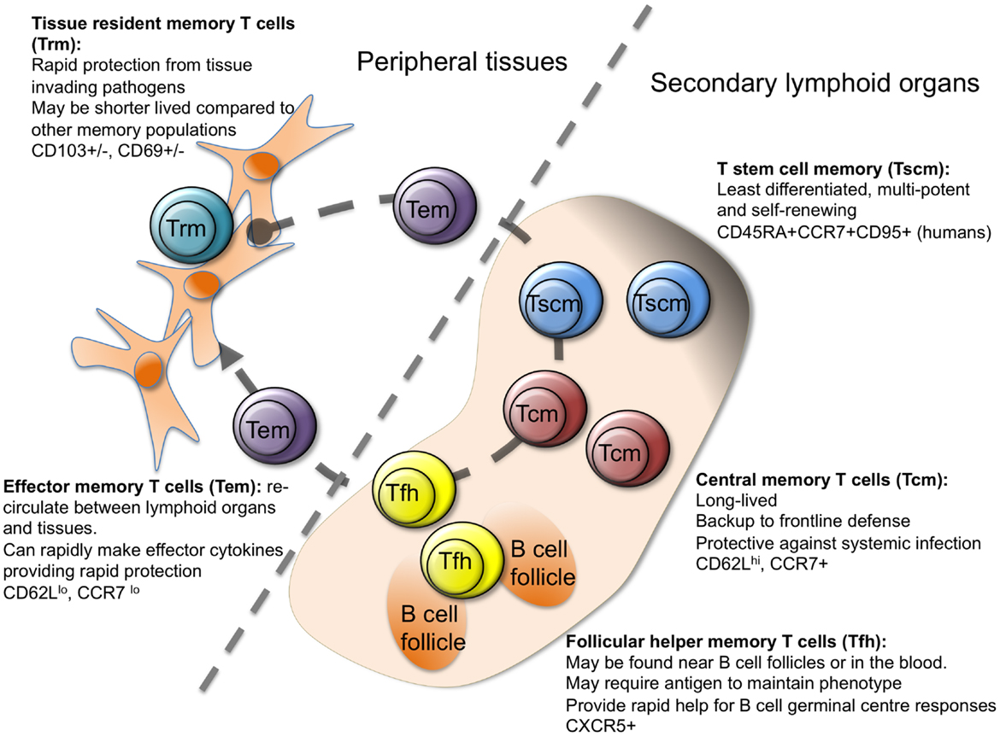

Gene expression in Rheumatoid Arthritis
=======

Introduction
---
Rheumatoid arthritis (RA) is a common autoimmune disorder characterised by inflammatory cell infiltration, such as T cells, B cells, macrophages and plasma cells. Production of cytokines and proteases lead to chronic inflammation of the synovial tissues and progressive joint disability. RA affects as much as 1% of the worldwide population. Although the exact causes are unknown, decades of research has led to increasingly detailed understanding of multiple disease mechanisms. Different treatments for RA have been proposed, e.g. infliximab (IFX), methotrexate (MTX), tocilizumab (TCZ). However, a significant proportion of patients do not respond to initial treatment or reach remission. Others experience recurrence or deterioration of their disease.    
This has led to extensive efforts to find more specific diagnostic markers. The complexity of RA have spurred research to dive deeper into the disease mechanisms using genetics, transcriptomics or proteomics.  
  
  Because of difficulties in measuring markers in the inflamed joints, efforts have, to a large extent focused on analyses of peripheral blood. However, as Lee et al. point out (<a href="https://doi.org/10.1016/j.cyto.2019.154960" target="_blank">Cytokine, March 2020</a>), clinical translation has proven difficult. Lee et al. hypothesize that inflammatory responses in peripheral blood are different from those in the arthritic joint.   
 
 ")
   
   [**Figure 1:  Cell types, cytokines, and chemokine receptors as rheumatoid arthritis drug targets (Source DOI: 10.1211/PJ.2016.20201090)**](_static/images/KIT_rheumatoid-arthritis-drug-targets.jpg)

 Immune response in blood and synovial fluid  
---
 Today you will use the web-based genomics analysis and visualization platform R2. R2 provides you with a set of bioinformatics tools to investigate patient and experimental data.  
   
 Takeshita and Okuzono et al. (2019) and Lauwerys et al. (2014) have collected a large number of samples from clinically well-defined cohorts of patients with RA and age-matched healthy controls (HCs). This data and other similar studies have been uploaded into our platform R2. We will make use of these datasets to explore the  differences and similarities between peripheral blood and synovial fluid, to study the characteristics of T cells, and to look for possible effects of treatments. 
  
##### A first look at T cell gene expression with the R2 platform

 *Data used:*  
 * R2 dataset: Disease Rheumatoid arthritis subset (drugs) - Okuzono - 75 - deseq2 - gpl17303
 * Description: 75 blood and synovial T cell samples of RA patients with rheumatoid arthritis 
 
 *Techniques used:*   
 * RNA Seq
 
 *References*
 * Paper: <a href="https://ard.bmj.com/content/78/10/1346.long" target="_blank">Multi-dimensional analysis identified rheumatoid arthritis-driving pathway in human T cell</a>
  
 *Analysis used*
 * One Gene View 
 
  

This green button will open up the Google form with which you can submit your answers for the first section. Only the questions with a R2D2 icon in front of them will have to be submitted.

 <button class="course googleform" onclick="window.open('https://docs.google.com/forms/d/e/1FAIpQLSeffVprea-4JXE2wdqF6aVoCw-yDHodGzTKjIiHMUVKIkcQtw/viewform?usp=sf_link','_blank');" type="button">Open the form for section 1.2.1</button> 
 
 Let's take a first glance at the platform. Click on the following button to go to R2:  
  
<form name="accessing_r2" action="https://hgserver1.amc.nl/cgi-bin/r2/main.cgi" enctype="multipart/form-data" target="R2" method="post">
  <input type="hidden" name="table" value="ps_avgpres_gse118829subsgeo75_gpl17303">
  <button type="submit" >Go to R2</button>
</form>  
 
 

* You don't need to login for this course. However, when you register to the platform (withh the red link in the left side menu) and log in with your credentials, more datasets and analyses will become available to you. 

The five numbered boxes or steps in the middle of the R2 main page allow you to choose a dataset and a type of analysis. In box 2 you can see that the dataset of Okuzono has already been selected. In box 3 you can select an analysis to perform on this dataset. 

* The default analysis is **View a gene** (box 3). Type in the textbox of step 4 *Gene / Probeset:* **CD4**.   
* Click the **Next** button. To read a description of your provided gene, hover your mouse over the bold **CD4** letters next to the radiobutton. Leave all settings as is and click **Next** again to obtain the result.   

 The dots in the graph show the expression value of each sample of the dataset for the gene CD4. Under the graph you can see different types of *annotation*. 
 In R2 the samples of a dataset can be annotated with extra information, such as clinical data of the patients the sample were taken from, or biological characteristics of the cells that were observed in the lab.  
   
 Each group of annotated data is called a *Track* in R2. You will see the annotation often displayed underneath a plot, and even more tracks if you hover your mouse over the dots in a plot. 
 * Try it out with your mouse in the graph that you have generated to view the expression of the gene CD4.  
 
 Furthermore, these tracks can be used in most of the analyses in R2 to add a layer of complexity. Tracks will allow you for instance to filter datasets, to compare groups of samples, to color scatter plots of samples with meta information, or to correlate genomics patterns in your data to, lets say, different phenotypes or demographic characteristics.
 
---------

   **Look at the *t-cell* track underneath the graph. The two colors represent two different cell types. Hover with your mouse over the two different colors of this cell type annotation row. Which cell types are present in the dataset?**
       
   
   **Do you notice anything different about the expression levels between the two cell types?**
  
 
 ---------   
Tumor necrosis factor‐alpha (TNF‐α) is a proinflammatory cytokine that plays a pivotal role in regulating the inflammatory response in rheumatoid arthritis (RA). 

* In the upper left corner, click the link *Go to:*  **Main**  to go back to the main page.
 
To understand better how this cytokine relates to different tissue and cell types, we do the same process but now we take a look at the gene TNF

* Type in the textbox **Gene / Probeset: TNF**.   
* Click the **Next** button and click **Next** again in the following page.   

We can make use of the annotations to view the results of our samples in groups.

* Scroll down in the page to make some adjustments in the *Adjustable settings* menu under the graph. Under *Group Separations* change *use track:* **tissue (2cat)** to separate the samples of the tissue blood from those of synovial fluid.
* Under *Graphics* adjust *Graphtype:* **Boxplot with circles** and *ColorMode:* **Color by Track**.
* After you made adjustments to the menu, always click **Adjust Settings** for the adjustments to take effect.  

The expression values are currently log2 transformed. Check out the difference when you display the expression values without a transformation: 
* In the menu under the graph, change **Transform** into *none* and click **Adjust Settings**  

 Often you use a boxplot to assess whether the expression values between groups of samples differ for a particular gene and to quickly identify average values, outliers, the dispersion of the data set, and signs of skewness.  
 
 Next to the visual representation, R2 also provides the five number summary in textual format.  
 * Hover your mouse over each box to compare the summarizing values of the two groups.  
   
  The circles on top of the boxplot show the individual value of each sample, which is a good way to stay aware of the raw data and the distribution behind the summary.
 We can see that the two groups show different values for the boxplots. But how certain are we that the group means vary by more than that random chance allows? To answer that question R2 shows you the results of an analysis of variance (ANOVA): you can find the F-value, the test statistic of the ANOVA test, and the p-value of the ANOVA test in the table above the plot.  
 
---------  
  
  **What can you conclude about the expression of the gene TNF in blood tissue versus synovial fluid?**   
   
    
 
---------  

The immune system is a complex system of different cell types that interact with each other with chemokines and other cytokines. T cells are one of two primary types of white blood cells — B cells being the second type — that determine the specificity of immune response to antigens (foreign substances) in the body. T cells originate in the bone marrow and mature in the thymus.  
  
  
  
  
  [**Figure 2: Differentiation of T-cells, each subtype having its specific role in the immune system.**](_static/images/KIT_Tcelldifferentiation.png)
  
  By *developmental stage*, peripheral blood (PB) CD4+ T cells are classified into four stages: naïve (Tn), stem cell memory (Tscm), central memory (Tcm) and effector memory (Tem), whereas CD8+ T cells are classified into five stages: Tn, Tscm, Tcm, Tem and CD45RA-positive effector memory (Temra).  
    
 This heterogeneity among Tcells has made it challenging to identify the specific cell subsets and states that drive RA pathogenesis.

* Under your latest graph, change "use track" to "t-cell-stage-type". Click **Adjust Settings**.
* Now change the transformation back to **log2**. Click **Adjust Settings** again.  
  
---------
   
 **Which T-cell subtype has the lowest expression?**  
 
 **Which T-cell subtype has the highest expression of TNF?**
 
 ---------
 * Submit your Google form with answers of the above section
 
##### Exploring relevant annotation of a dataset

*Analysis used*
* Cohort Overview

   
This button will open up a Google form for section 1.2.2 and 1.2.3.   
 
 
  
 <button class="course googleform" onclick="window.open('https://docs.google.com/forms/d/e/1FAIpQLSezdWy9nyvckg3y0BNMKjbQLiYilykJreThl9_VCUyiYI9lmA/viewform?usp=sf_link','_blank');" type="button">Open the form for section 1.2.2 and 1.2.3</button> 
 
 
 
We have seen before that the samples of a dataset can be annotated with extra annotation, or tracks. 
To get a better overview of the available annotation of a dataset, we can use the tool **Cohort Overview** in R2. 

* Go back to the main page and select **Cohort Overview** as type of analysis in box 3.

R2 presents the Okuzono dataset samples with its available annotation in a table at the bottom of the page. Each pie chart above the table shows a different available track. 
* Hover your mouse over the different slices of the **tissue** annotation pie chart.  What percentage is synovial fluid and what percentage is blood tissue?
* Explore the other pie charts as well: hover with your mouse over the slices and double click on a slice to select that group of the samples (you can click on the button **Clear Filters** to undo your selection). Above the main pie chart you can read the number of samples in your current selection (the "n= " number). Also note how the table at the bottom adapts the overview based on your selection.  
  
   
---------

**How many (n=..) synovial fluid samples are present in this dataset?**   
**And how many samples are CD4 Effector Memory T cells (Tem) in the blood tissue? (Hint: you will have to apply 3 different filters)**  
  
---------
 
 * Please, submit your form. Thanks!
   
 Effects of treatment
---
    
 Now that we have a better understanding of the biology involved in rheumatoid arthritis, let's have a look if we can find any effect of rheumatoid arthritis treatments. 
 
*Data used:*  
* R2 dataset: Disease Rheumatoid arthritis (drugs) - Lauwerys - 40 - MAS5.0 - u133p2
* Description: Paired synovial biopsy samples were obtained from the affected knee of early RA patients before and 12 weeks after initiation of Tocilizumab (n=12) or Methotrexate (n=8) therapy 

*Techniques used:*   
* Affymetrix DNA Microarray 

*References*
* Paper: [Global Molecular Effects of Tocilizumab Therapy in Rheumatoid Arthritis Synovium](https://onlinelibrary.wiley.com/doi/full/10.1002/art.38202)
     
*Analyses used*
* Cohort Overview
* One Gene View

##### Explore the provided information

 This button will open up a Google form for section 1.2.2 and 1.2.3.
 
  <button class="course googleform" onclick="window.open('https://docs.google.com/forms/d/e/1FAIpQLSdV8jh8L6Pkadh7xVffbyoMiUpdEYk9PwUesO3NWKjLRCu4FA/viewform?usp=sf_link','_blank');" type="button">Open the form for section 1.3</button> 
  
How does treatment effect gene expression? Let's have a look at a dataset of Lauwerys et al. In the dataset we can find samples taken from the synovial fluid in the knee of 20 early RA patients, both before and after treatment.  
  
* Go to the Main page of R2 and click on **Change Dataset** in box 2  

A popup window appears that shows all the available datasets in a grid: each row represents one dataset, its
main descriptive details split up in the columns. To use a dataset for further analysis, you click on the Select
button in the first column.If you prefer to first read extra information about the dataset of your interest, click
on any other part of the specific row. The headers of the columns each enable the user to search through datasets using keywords and other filter options.
* Type in the text field under **Author** the name of the author of the data set *Lauwerys*
* Click **Select** in front of the dataset that has 40 samples (N is 40).  

First, we take a look at the information that was provided. Let's start with the dataset Cohort Overview.  

* In box 3, select the **Cohort Overview**, click **next** and explore the available annotation.
* To understand what the study is about, click on the **i information balloon** behind the dataset title. Take a note of the *cytokines & chemokines* that are mentioned in the description box.     

Since this set is treatment related, let's plot the data to see if treatment has any result according to this study.

* Go back to the main page. Choose the analysis **Correlate Gene with track** and type in box 4 one of the genes that were  mentioned to be down regulated by treatment, IL6. The "-" can be left out of the gene name in R2, e.g. "IL-6" becomes "IL6". Click **Next**.
* Choose *Select a track:* **therapy (2cat)** and click **Next**.
* Every patient had a sample taken before the start (no) and after 12 weeks (yes) of therapy, it is a paired test. It would be nice to see which dots belong to the same patient. With Sample Paths we can connect the two samples of each patient with the format Samplename1,Samplename2; etc. Because it is rather labour intensive to get the correct syntax, we did this for you. 

Make sure to select all text: click in the textfield and hold Ctrl+A and copy-paste it in the field **Sample Paths**.

  <input type="text" name="chainedsams" value="GSM1116933,GSM1116934;GSM1116935,GSM1116936;GSM1116937,GSM1116938;GSM1116939,GSM1116940;GSM1116941,GSM1116942; GSM1116943,GSM1116944;GSM1116945,GSM1116946;GSM1116947,GSM1116948;GSM1116949,GSM1116950;GSM1116951,GSM1116952; GSM1116953,GSM1116954;GSM1116955,GSM1116956;GSM1116957,GSM1116958;GSM1116959,GSM1116960;GSM1116961,GSM1116962; GSM1116963,GSM1116964;GSM1116965,GSM1116966;GSM1116967,GSM1116968;GSM1116969,GSM1116970;GSM1116971,GSM1116972" size="75"> 

 
 

* Change **Colormode:  Color by Track** and **Track for Color: therapy (2 cat)**. Click on **Adjust Settings**   
  
  
---

**What can you tell about the effect of treatment on the expression of this gene?**  
 
---

* In the upper right corner is a text box **Change gene**. Change the gene to a different gene that you can find in the description of the study, or that you yourself wonder about. Click the **Change Gene** button under the textbox. 
      
  
  
---

**Which gene did you choose and what can you tell about the effect of treatment on the expression of this gene?**  
 
---  

##### Showing pathways in heatmaps

We now want to know which pathways are affected by treatment with tocilizumab.
* From the main page, select the analysis **Differential Expression between groups**, click **Next** 
* Choose *Select a track:* **drug (3 cat)**
* Because we won't have many samples, we will not correct for multiple testing. Change *Corr. multiple testing:* **No correction** 
* Make sure there is only a check mark in front of *tocilizumab* and in front of *untreated* (i.e. uncheck the other treatment).

The list shows the genes that are differentially expressed between the tocilizumab treatment and untreated. 
* To see in which processes these genes are involved in, this time we click on **Gene Ontology Analysis** button.    
  
  
---

 **What kind of processes seem to be affected by treatment?**  
 
 **Are the genes involved in these processes mostly higher or lower expressed before or after treatment? (Hint: Look at the color scheme above the table)** 
 
---

The page with the list of differentiating genes is still open in a tab. On this page many buttons and links allow you to visualize and analyze the result further. Try these options, or try to interpret the results that you obtain with one of the buttons on the right:
* From the list of differentiating genes, choose one of the top genes and hover your mouse over the gene to read information about the gene. Now click on its name to be taken to the One Gene View for this gene. Of course you can adapt the graph again with the menu underneath the graph. 
* From the page with the list of differentiating genes, click on the button **Plot all genes (xy, vulcano etc)**
* Underneath th eplot, change **Plot type** to *Vulcano plot*. In the textfield **Mark genes**, write the name of a gene that you are interested in. Click on **Redraw  Image**.
* Hover with your mouse over some dots furthest to the left in the plot to read their names. Compare those names with the list of differentiating genes. 
* From the page with the list of differentiating genes, now click the button **Heatmap(zscore)** to get an overview of all the genes and the group separations in a Heatmap.

* Redo the Differential Expression between groups analysis and Gene Ontology analysis, except this time select the other treatment versus the untreated. Don't forget to switch off the *Corr. multiple testing:*.    
  
  
---

 **What results do you get with this treatment? Read the dataset description again. Do your results correspond with the study findings?**  
  
---

* Please, submit your form. Thanks!

Final remarks / future directions
---------------------------------
In the March 1st 2018 issue of Nature a paper was published describing a landscape of genomic alterations across childhood cancers. The data is accessible in R2 also as a Datascope. This is another example of how R2 can visualize your genomics data. 

You have reached the end of this course. Feel free to try one of the (Graduate) Student Courses that you can find in the sidebar of this page <a href="https://r2-training-courses.readthedocs.io/en/latest/" target="_blank">https://r2-training-courses.readthedocs.io/en/latest/</a>. 

We hope that this course has been helpful. If you want to have your genomics data visualized and analyzed using the R2 platform you can always consult r2-support@amc.nl

The R2 support team.
