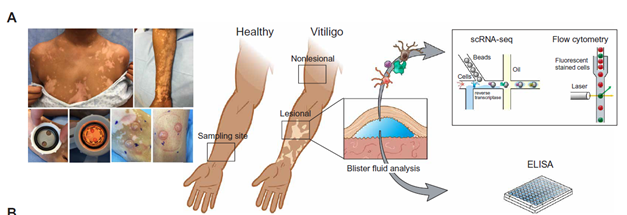

Clinical Cell biology – Vitiligo training course
====

*Created by Walbert Bakker & R2-team:2025*

Introduction
-------------

In this training course, designed as part of the UvA master course Clinical Cell Biology, you will use advanced bioinformatics tools to explore, analyze and visualize mRNA expression datasets centered around the pigment producing cells (melanocytes). Both datasets from vitiligo and melanoma are part of this R2 introduction course.

You will use the freely available and web-based genomics analysis and visualization platform R2, a Core Facility of the Amsterdam UMC. R2 provides the user with many experimental and clinical data sets coupled to a wide variety of clickable bioinformatics tools. Without any coding you will gain hands-on research experience with vitiligo and melanoma omics data and bioinformatics tools.

The green button in this document will open up a Microsoft form, on which you have to submit your answers. Information from these forms will be used in the Q&A lecture (Responsie College) to discuss questions that you encounter during this online training course.

The <button class="course googleform">green button(s)</button> in this document will open up a MS-office form. Make sure to type your name at the start of each answer as your name will not automatically be stored when you submit your answers!

<button class="course googleform" onclick="window.open('https://forms.office.com/pages/responsepage.aspx?id=GqvfaLsRxky-tSjXVphPtvNdTYy3kUdLmfhJOoP29pdUMjhLRjFUMzVGS0hWTTcyRDRMQjZXQURCTC4u&route=shorturl','_blank');"
type="button">Open the answering form</button>

## Selecting a dataset

Open a Chrome / Edge  browser and use your R2 account to sign in in the collaborator’s server of the R2 platform: https://hgserver1.amc.nl (also accessible via https://r2platform.com/hg2)
Generally speaking, the R2 platform is easily accessible by the links https://r2.amc.nl | r2platform.com, but today we work from our collaborator’s server hgserver2.

You are now on the R2 main page. Step by step, users are guided through a web of options for data analysis. R2’s main page shows this principle: follow the 4 boxes to develop your analysis of choice. Let’s follow these steps to get a first look at gene expressions in one of the vitiligo datasets.

- Box 1: we leave box 1 as it is, because we will look only at a single datasets in this training course.

Currently the R2 platform houses a vast number of multi-omic datasets. Let’s find out which vitiligo datasets are present.

- 	Box 2: click on the text. A grid pops up that shows all the datasets that are currently available to you. Each row is a dataset and each column contains a different searchable characteristic of the datasets. In the bottom right corner of the grid, you can find the exact number of rows, i.e. available datasets.

- 	Under the header **Tissue/Tumor** on top of the grid type in the keyword ‘vitiligo’.

**Question 1**: How many, and what kind of vitiligo datasets are currently in R2?

Datasets have a structured naming in R2, using the following rules: Category - Tissue/ Tumor - author - number of samples (N) - normalization - chiptype. When you click on a specific dataset, in the box below you will find a description of that dataset, including a link to Pubmed (if available). 

We will start analyzing the Natarajan dataset.
The grid tells us that this dataset (of which Natarajan is author) contains 30 samples (per patient 1 Lesional (vitiligo spot) and 1 non-lesional (normal skin vitiligo patient) sample), and was analyzed by bulk RNA sequencing. 

- Select the *updated* **Natarajan (update)** dataset and click on **Confirm selection**. In Box 2 you will now see this dataset. We can now use this dataset for further analysis.  

## Pathogenesis of vitiligo

As you know from the lectures, vitiligo is an cutaneous autoimmune disease in which the pigment-producing melanocytes are eliminated, resulting in patches of depigmented white spots. The pathogenesis of vitiligo is multifactorial in which genetic factors, environmental triggers (i.e. chemical compounds), oxidative stress, and autoimmune mechanisms play a part on the disease development. Figure 1 shows a schematic picture of lesional (left side) and non-lesional (right side) vitiligo skin.!

 and non-lesional (right side) vitiligo skin")

[**lesional (left side) and non-lesional (right side) vitiligo skin**](_static/images/vitiligo/vitiligo_lesion.png)
(Figure source:https://doi.org/10.1146/annurev-immunol-100919-023531)

## Finding differentially expressed genes.

The Natarajan dataset contains samples from lesional and non-lesional vitiligo skin. Let’s look at the differential expression between these two different samples types.

- From the main R2 page, select in box 3: ‘Differential expression between two groups’.

- Click ‘next’.

- 	In the next window you can select a statistical **test**. Select the ‘T-test’. 

- 	At group by select **Tissue (2 cat(egories)**) and click **Next**.

- In the adjustable settings window we use a **log2 transformation** as this is common practice in bioinformatics to make the dataset resemble a normal distribution, and the log2 aids in the calculating fold-changes between samples/groups. The p-value can be adjusted as well (but for now we leaf it at 0.01), and we use ‘All’ **Gene ontology** processes.

- Click **Submit**.

**Question 2**: How many genes are significantly differentially regulated between the two groups?

**Question 3**: Which gene is het most *significantly* differentially expressed?

**Question 4**: And which gene is most *strongly upregulated, or downregulated* in lesional tissue (play around with the log2FC (fold change) in the top menu to sort genes based on the fold change). You can click on the lens-icon besides each gene to make a graph. In the geneview window it is possible to change the graph type.  

- Generate a graph of the most up- or downregulated gene.

You can also quickly look into other genes. For example DCT (Tyrosine-related protein 2) which expression is melanocyte specific and performs a key role in the melanin synthesis. 

- Go to any of the graphs you just generated. Type in “DCT” in the Gene/reporter box in the adjustable settings window, and select DCT from the dropdown list.

- Click Submit in order to make the new graph (the violin graph is shown below, Figure 2).    

[**Figure 2: violin plot of DCT (TRP2) expression in L and NL tissue.**](_static/images/vitiligo/vitiligo_DCT_r2.png )

If you go back to the tab containing the gene-list generated for Question 2, you can see on the right side of the screen several options to further explore the differentially expressed genes between lesional and non-lesional vitiligo tissue. For example there is already a mini-ontology analysis, but you can also perform GO-analysis  or Gene set analysis yourself, or make a heatmap of the differentially expressed genes.   

Heatmaps (hot(up)/cold(down)) are commonly used to visualize RNA-Seq results. In RNA-seq analysis, heatmaps visualize large, complex datasets of gene expression levels, showing patterns of high and low expression across samples using a color gradient. They typically feature samples (columns) and genes (rows) and often incorporate hierarchical clustering, which groups together genes or samples with similar expression patterns, making it easier to identify biological similarities and differences.  

 - To generate a heatmap of all 1390 genes, click **Heatmap(zscore)** from the list options presented on the right on your screen.  

It is also possible to generate a heatmap of a smaller group of differentially expressed genes. For example by changing (in the Adjustable settings window) the **P-value cutoff**, or by limiting the **Max number of results**.  

 - In the adjustable settings screen set **Max number of results** to 100 and click **submit**. And click gain on the **Heatmap(zscore)**. This generates the following heatmap (Figure 3).  

[**Figure 3: Figure 3: heatmap of the 100 most differentially expressed genes between lesional and non-lesional tissue**](_static/images/vitiligo/vitiligo_heatmap.png )

The tissue samples lesional (red) and non-lesional (green) nicely cluster together. This shows that L and NL vitiligo RNAseq samples can be identified based on gene expression.  

 • Hovering over the heatmap reveals gene-names.

 • You can also look at the entire gene list shown in the heatmap by clicking on the **Sort order Listing** below the heatmap (click black triangle).  

### Analyzing differential pathway expression between groups using the KEGG pathway finder  

 - Another way to look at differential expression is looking at pathways of biological processes other than looking for individual genes.
 
Let’s look which biological processes are differentially regulated between lesional and non-lesional samples.  

 - Go to the **main menu** again (click **Go to: R2 Main** in the left corner) and **From box 3** select **KEGG PathwayFinder by Groups**. Click **Next**.
 - In the adjustable setting window at **Track** select **tissue(2cat)**. Click **submit**. Which will generate this table:  

[**table 1: Differentially regulated pathways between lesional and non-lesional vitiligo tissue, identified by KEGG PathwayFinder!**](_static/images/vitiligo/KEGG_list.png )

By clicking on the **red R** from a biological process you can find the genes from this pathway that were differentially regulated between L and NL tissue. If you subsequently click on Heatmap(zscore) a heatmap for these genes will be generated. E.g. the heatmap for Nucleotide_excision_repair is shown in figure 4 below.  

[**Figure 5: Performing KEGG pathway analysis between lesional and non-lesional tissue reveals significant differential regulation of Nucleotide_excision_repair in lesional tissue, illustrated in this heatmap.**](_static/images/vitiligo/bioproces_heatmap.png)

**Question 5**: Does the differential regulation of processes like *Nucleotide_excision_repair* and *Homologous recombination* (Table 1) make sense in the context of vitiligo? Explain your answer. 

### Finding genes that correlate with your gene of interest.  

If you are interest in a specific gene (Gene of interest, GOI), and you want to know what the potential biological function of this gene is, you can use the option **KEGG pathwayFinder by gene correlation**.  

- select this option from box 3 and click **Next**  
- Let’s look for functions for **MLANA** (type and select this gene from the **Gene / reporter window**.  
- Select genes that correlate (abbreviated by **r/R**) positively with this gene (in Corr R cutoff sign” select **positive**). Click **submit**.  

From the table below you can see that genes correlating with MLANA expression do play a role in melanogenesis (among others). If you click on the red R you can see the correlating genes and then click on individual genes to see the correlation with MLANA. This *KEGG pathwayFinder by gene correlation* can thus help you better understand the biological function of your GOI.  

[**Table 2:  biological pathways analysis of genes that positively correlate with MLANA**](_static/images/vitiligo/KEGG_list2.png)

## Analyze differential expression using *Gene sets*

Other than looking at the most differentially regulated top genes in a specific tissue, it is also possible to specifically search for a biological process or pathway you are interested in. This can be done by looking at **genesets**.   

- From the main menu select again **differential expression between groups** (**tissue (2 cat)**). And click **Next**.
- In the adjustable settings window click on **select gene set** and type melanogenesis in the search field and click on the **magnifying glass** icon.
- From the **KEGG pathway** select after a few clicks the biological process **Melanogenesis**. The 100 in the count column indicates the number of genes in this specific genelist.
- Click **Confirm selection** and then **submit**.  
You can see that 16 of the 100 genes are significantly differentially expressed between the two groups. Again you can look at individual genes (via the **view** column). But you can also visualize all 16 genes in a single graph:  
- click on the **heatmap(zscore)** button on the right of your screen to generate a heatmap  
- or generate a volcano plot from the **adjustable settings** window select at **display** **Volcano plot** from the drop downlist. And click **submit**. This generates a volcano plot in which genes are displayed based on their upregulation in lesional (L) or non-lesional (NL) tissue, as well as their p-value. Hoover over the dots to identify the genes. With respect to the volcano plot:  

**Question 6**: Which gene from the melanogenesis pathway is most significantly down in Lesional tissue?  

**Question 7**: And which gene from the melanogenesis pathway is most strongly expressed in NL tissue?  

As expected, pathway related to melanocytes are downregulated (or absent) in lesional vitiligo.  

### Analyzing T-cell presence in vitiligo using a Gene set

From the lectures you have learned that vitiligo is an auto-immune disease. 

**Question 8**: Do you expect to detect immune cells in vitiligo tissue using RNAseq? And if so, what kind of cells would you look for and in which tissue type (L / NL)?

Although the Natarajan dataset is a bulk RNAseq dataset we can use a gene set to get an idea whether e.g. T-cells are present in these vitiligo samples.

- From the R2 main page again select **Differential expression between two groups** in box 3, group by **tissue (2 cat)**, and click **Next**.  
- In the adjustable settings window new select at **display** select **Volcano plot** from the drop downlist. And click **submit**. This generates a volcano plot in which genes are displayed based on their upregulation in lesional (L) or non-lesional (NL) tissue, as well as their p-value.  

We are now going to use this Volcano plot to see if we can detect T-cell.

- Click on the little **wheel icon**, left on top of the volcano plot. 
- In the pop-up window click on **select gene set** and type **T cell** in the search field and click on the **magnifying glass** icon.  
- From the **Bindea immune signatures** select **T-cell**, and **Confirm selection**.  
 Choose a color (e.g. red) for this geneset at the **Emphasize color** option, and click **Redraw plot** (see Figure 5 for the result).  

[**Figure 5: Volcano plot of genes differentially expressed between lesional and non-lesional vitiligo skin. Genes of the T cell geneset (that can be detected on this set) are indicated in red**](_static/images/vitiligo/volcano_plot.png)

**Question 9**: Based on the generated plot, can you draw a conclusion about the presence of T-cells in this dataset?

## Analyzing differential expression using *Gene signatures*

Let’s try to analyze the presence of T-cells in a more quantitative manner.
For this were are going to analyze a **gene signature** (e.g. T-cells signature), and then explore if this gene-signature is induced in vitiligo samples.

A signature (*see chapter 12 from the R2 Tutorial handbook*) can be defined as a collection of genes that are defined on a particular basis. This can e.g. be the presence within a gene-ontology class (e.g. melanogenesis), or a functional pathway signature (e.g. Jak-Stat signaling). Such a collection of genes may have predictive power for the activity of a process. By generating a gene-signature the behavior of all the signature genes are expressed in a single value, a so-called signature score, defined as the average zscore of a zscore transformed dataset (the standard way of visualizing a heatmap). In R2, such scores are automatically generated when one generates heatmaps via the “view a geneset” function or in case the dataset is very large a gene signature can be created directly using “Create Gene set signature”.

We are going to create a Geneset signature for T-cells to analyze there presence in the vitiligo samples.

- In Box 3 select **View geneset (heatmap)** and click **Next**.  
- In the Adjustable settings window search at **Gene set** for the **T_cell** and select from the KEGG pathways the geneset **T_cell_receptor_signalling_pathway**, consisting of 104 genes. Click **confirm selection**.  
- Click **submit** (Adjustable settings window).  
- Below the heatmap you will find the *zscore* of all T-cell genes for each sample.  
- Store the generated gene signature (click **store** under **Store(R2)**. In the next window click **create track** (storing as a temporary track (24hrs) is fine).   
Next we can further analyze this T-cell signature. From immunohistochemical (IHC) analysis we know that active vitiligo lesion have the most infiltration of T-cells at the perilesional area, where melanocytes are still present. Let’s check if we can find a difference between 
- From box 3 select **Relate 2 tracks** and click **Next**.  
- Select in the next window for the *X track* the **t_cell_receptor_signaling_pathway (#) track**, and as a *Y-track*: **tissue (2cat)**.  A **#** track indicates a numerical track, a **cat** indicates a categorial track.  
- For Graph type click e.g. **Violin**, and **Submit** (you can also color by track and add scatter if wanted). This will generate a violin graph in which the signature is statistically compared (ANOVA) between Lesional and NL tissue.  
- 
**Question 10**: We have now in a quantitative manner analyzed the presence of T-cell in this bulk RNAseq dataset using a representative gene-signature. What is you conclusion about the results. Can you think of reason that explains this result?

In a similar way as we did above (creating and using a gene signature) you can e.g. analyze the  presence of melanocytes (using the e.g. **Melanogenesis** geneset) in lesional and nonlesional samples from this dataset using.  

## Looking for T-cells in the vitiligo dataset from Passeron

In this study (PMID: 26322948) 10 active (progression of disease within last 3 months), non-segmental vitiligo patients were included, from which a non-lesional (NL), peri-lesional (PL) and a Lesional (L) biopsy were taken for RNAseq analysis. Also, 10 biopsies were taken from 10 healthy volunteers.

- From **Box 2** from the main R2 page select the **Passeron** vitiligo dataset.  
If you are interested to explore the potential biological role for a particular gene of interest (**GOI**), rather than the top most differentially genes, this can be done in many ways.   
Let’s choose as our GOI *Protein Tyrosine Phosphatase Receptor Type C (PTPRC)*, also known as Leukocyte-common antigen (LCA) or CD45, a protein present on nearly all hematopoietic cells. The presence of CD45 will tell us if immune cells are present in the vitiligo samples. First check the expression of PTPRC in the different samples groups:
- Select **View a gene in groups** in Box 3, click **Next**.  
- In the next window at **Gene / reporter** type and select PTPRC.  
- Select the **track** samples_source_name_ch1(4cat). As a graph type choose e.g. a violin plot, and add the datapoints: **scatter**: **true*, **Color by track** and click **submit**. The resulting graph is shown in figure 6.

[**Figure 6: Violin plot from the expression of the immune cell marker CD45 in the four indicated sample types from the Passeron vitiligo bulk RNAseq dataset**](_static/images/vitiligo/Violin_CD45.png)

From the graph (Figure 6) we can conclude that there is a significant different expression of our gene of interest PTPRC (CD45) among the different samples types. For a detailed statistical analysis between the groups click on **View additional analysis** under the graph/ANOVA to see the table. 

**Question 11**: given the data in the table, between which sample groups is there a significant different (indicated in red) expression of PTPRC (CD45)?

As PTPRC (CD45) is a marker for immune cell in general, it would be interesting to _look in which hematopoietic cell type_ it is enriched in this dataset. One way to do this is to look for genes that correlate with our GOI.

- Go to back to the **R2 main** page.
- Select in box 3: **Find correlated genes with a single Gene**, click **Next**.  
- Type / select at **Gene / reporter** *PTPRC*.  
- Choose only positive correlating (r) genes at Corr. r cutoff sign, as we want to find genes co-expressed with CD45, and click **Submit**.  

Now we have a genelist (695 genes) of genes that correlate with our GOI. We can now further analyze this list of genes by clicking on **Gene set analysis** (the grey bar in the right of your screen).

- clicking on **Gene set analysis**  
- In the next window choose **KEGG pathways** and click **Next**.  

**Question 12**: which immune cell types do you find in this list?  
(You can visualize a KEGG gene set by clicking on the blue **H** next to a specific geneset).
Now generate a gene signature (as you did in 1.6) for one of the KEGG gene sets identified in question 11 (click **store** under **Store(R2)**. 
Use **relate 2 tracks**  in box 3, to find out if you can confirm increased expression of your immune geneset in vitiligo tissue:

- use your gene signature as a **X-track**, and as **Y track** sample_source_name_ch1. Choose for example a Violin graph type and click **submit**.  

**Question 13**: Click the **View additional details** under the graph. Do you find a significant increased expression of the gene signature in vitiligo?  

## Studying vitiligo on a cellular level using single-cell RNAseq

Above we used gene signatures to verify whether there could be **T-cells** present in the bulk RNAseq samples. A more specific way to do this is to analyze a vitiligo tissue samples using single-cell RNAseq.

Single-cell transcriptomics examines the gene expression level of individual cells in a given population by measuring the RNA levels in individual cells isolated from a tumor or tissue. Single-cell transcriptomics therefore not only makes it possible analyze the presence of different cell types, but also to unravel heterogeneous cell populations, reconstruct cellular developmental pathways, and model transcriptional dynamics — all previously masked in bulk RNA sequencing.

There are two vitiligo single-cell R2 RNAseq (scRNAseq) datasets present in R2 (the **Chen, and the Gellatly** dataset). For this training exercise we will only use the scRNAseq dataset from Gellatly et al. This datasets has analyzed gene expression in cells isolated by suction blister biopsies from healthy controls, and from non-lesional and lesional locations from vitiligo patients. Form these samples, 32405 individually cells were sequenced.

[**Figure 7: Sample preparation of the Gellatly scRNAseq dataset which analyses gene expression in cells isolated by suction blister biopsies from healthy controls, and from non-lesional and lesional locations from vitiligo patients**](_static/images/vitiligo/sample_preparation.png)

R2 offers several machine learning dimensionality reduction algorithms that are well suited for the reduction of high dimensional datasets, such as generated by scRNAseq,  into just 2 or 3 dimensions. Samples or cells that have similar expression profiles in a dataset are located closely together on the 2D or 3D map, which enables the user to find clusters of similar cells/samples. One such clustering method that is popular in biomedical research is the so called t-SNE algorithm. t-SNE stands for t-Distributed Stochastic Neighbor Embedding. Another algorithm with similar properties that is UMAP (Uniform Manifold Approximation and Projection). (See chapter 16 in the R2 tutorial book for more info).

Let’s see what celltypes can be identified in suction blister biopsies from vitiligo patients.

- Click on Sample maps (UMAP/tSNE) in the left menu on the main page.  
- seach for vitiligo (in **dataset class window**). Select the **Gellatly** dataset.  
You can now see the clustering of all 32405 individual cells based on expression. Now visualize the different celltypes:  
- go to **color settings** and select **color by track**. And next select the track **celltype (5 cat)**. Click **set colors**. This will generate the following tSNE plot:  

[**Figure 8: tSNE map of all the 32405 cells analyzed colored by the track celltypes. dc: dendritic cells, Krt: keratinocytes, Mac: macrophages, Mel: melanocytes, Tc: T-cells**](_static/images/vitiligo/single_cell_tsne.png)

From this figure we can clearly see that immune cells are present in this dataset. In a similar way you can also color the cells using the tracks of **disease (2cat)**, or cluster (10 cat) which are the 10 cell clusters identified in the original article. It is also possible to look at individual genes. If you select **color by gene** and choose for **Gene / reporter** PTPRC (CD45) you can see the expression in the tSNE plot.

- Let’s check if there are more immune cells present in vitiligo as you would expect.**- 
- Go to **Box 2** and select the **Gellatly** vitiligo dataset (**confirm selection**).  
- In box 3 select **View a gene in groups**, click **Next**.  
- In the adjustable settings window select the **Gene/reporter** field the general immune cell marker PTPRC (CD45), and by **track**: disease (2cat) or alternatively use skin (3 cat). Choose a bar graph, and Click **submit**.  

**Question 14**: What do you conclude from the resulting bargraph?  

Once T-cells have infiltrated the skin, and bind to an HLA molecule presenting a specific peptide (antigen), they get activated and secrete cytolytic enzymes like perforin (PRF1), granzyme b (GZMB ) and interferin gamma (IFNG). Visualize these genes in the tSNE plot to locate activated lymphocytes (T-cells) and get an idea of the proportion activated T-cells in this dataset.
* Select the Gellatly tSNE plot again as you did above.
*  At the **color settings** menu choose **color by a gene** and analyze the expression of IFNG, PRF1 and GZMB (Gene / reporter window). Change the **dotsize** (left menu) to 1,25 to better visualize the positive cells.  

**Question 15**: What do you conclude from the result?  

**Question 16**: And how would you explore (using this dataset) if there are more of these activated T-cell in vitiligo?  

## Melanoma

In the last part of this training course we switch to a melanoma dataset. If you look for melanoma datasets in R2 (box 2, from R2 main page) there are both high quality scRNAseq (author Regev) and bulk RNAseq datasets (TCGA). In this section we will use the bulk RNAseq dataset from The Cancer Genome Atlas Network (TCGA). This is a large integrative analysis of cutaneous melanomas (331 patients). This genome-wide analysis classified (Figure 9) the patients both at the genomic level (4 categories: mutant BRAF, RAS, NF1, or wt), as well as at RNA expression (3 clusters: Immune, Keratin, and MITF-low), and also contains a high level of additional information (annotations, that are available as tracks).

[**Figure 9:  Graphical abstract from The Cancer Genome Atlas Network (TCGA) analysis of cutaneous melanomas 331 patients.**](_static/images/vitiligo/Graph_abstract.png)
(Figure source:https://doi.org/10.1016/j.cell.2015.05.044 )

Let’s explore the possible annotation linked to the samples of this dataset. 
- Select the TCGA dataset with 375 samples (N) in box 2 from the R2 main page.  
As an example we’re going to **look at the checkpoint protein PD-L1** (officially knowns as CD274) as our GOI. 
- In box 3 select: **view a gene in groups** Click **Next**.   
- In the next window (adj. settings) type and select CD274 (PD-L1) in the **Gene / Reporter** field.   
- Now look at all the annotation present via the field **Track** from which you can see a large dropdown list. Among the many options it is possible to look at primary versus metastatic melanoma samples, test if your GOI is associated with the mutational subtypes, or look at the association of your GOI with the lymphocyte score (the amount and density of infiltrated immune cells in a tumor). For now we will select the Track **f1_rnaseq-cluster_consenhier (4 cat)**. This track indicates the identified RNA clusters. Click **submit**.   
- 
**Question 17**: Can you think of an explanation (mechanism) why PD-L1 is most highly expression in tumors of the immune cell cluster?  

[**Figure 10:  PD-L1 expression in the different RNA clusters identified among the 375 tumor samples: immune, keratin and MITF-low. ND, not-determined**](_static/images/vitiligo/violin_skin.png)

At section 1.8 we analyzed activated T-cells in vitiligo. Now we are going to do this in melanoma. Activated T-cells (upon antigen binding) secrete among other proteins, Interferon-gamma (IFNG). Now let’s analyze this the entire IFNg signalling pathway and test if this can be a predictor of survival.

- So let’s look at this gene set, go to the main R2 page, and select **view geneset (Heatmap)** in **box 3**. Click **Next**.  

- In the next window click on **select gene set**, and type **interferon** in the search field. Click the **magnifying glass**.  
- Select Hallmark_Interferon_gamma_response (200 genes) from the Broad 2023 collection and **confirm selection**. Click **Submit**.  

In the Track Display Selection menu underneath the heatmap select the track **f1_rnaseq-cluster_consenhier**, and click **Submit**. This will show the selected track on top of the heatmap. Below the heatmap the signature score is displayed.  

[**Figure 11: , Heatmap of the Hallmark_Interferon_gamma_response (200 genes) from the Broad 2023 collection. On top the heatmap the RNA cluster are shown. Below, the signature score!**](_static/images/vitiligo/signscore_heatmap.png)

**Question 18**: In which RNA cluster do you see the highest expression of the Hallmark_Interferon_gamma_response genesignature? (see the legends of the RNA clusters on the right of your screen.

- Store the generated genesignature: click on **store** under Store(R2) in the table underneath the heatmap. And click **create track**.  
Now we can look of this IFNG signature is predictive of survival.  

- Go to the **R2 main page** again and select **Survival (Kaplan-Meier/Cox)** from the left menu.   

- Select at **Separate by** **a numerical track** (your saved track is a numerical track. Numerical tracks are indicated in R2 by a ‘X’), and click **next**.   
- In the next window  settings) select the signature track that you just generated (Hallmark_Interferon_gamma_response) from the dropdown list, and select at Type of survival **overall**. Click **Next**.  
- 
**Question 19**: What is you conclusion from this survival graph?  

You have now reached the end of this training course, learning some basic skills what kind of analysis you can do with R2. We have only covered a fraction of what is possible with R2. If you want to learn more about this platform the tutorial book on the main page, of any of the other training courses would be a great next step.  

**Final Question 20**: Is there an R2 topic or issue that you encountered during this course that should be discussed on the Q&A lecture on Wednesday November 5th?

### Note!!!

Keep in mind that almost 85% of the data hosted by R2, including the data you are working with in this course, are obtained from public scientific resources. One of the major repositories from which we source omics data is the NCBI GEO public database.

As a consequence of the ongoing situation in the United States, access to U.S.-hosted data repositories has become increasingly difficult. We have encountered persistent issues when attempting to download, query, or analyze datasets stored on these servers. Since the onset of the government shutdown, error messages such as those illustrated below have become frequent. It is evident that such interruptions hinder the continuity of scientific research and collaboration on a global scale.

